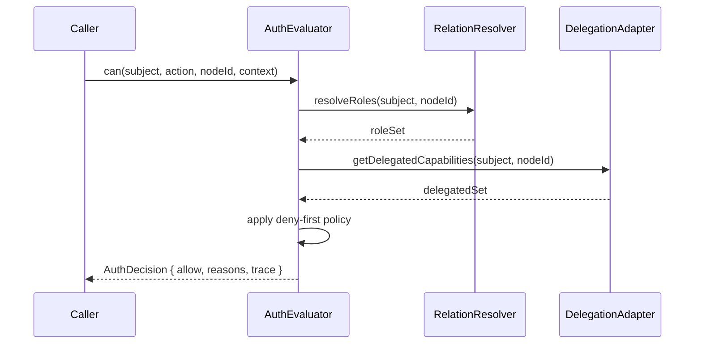

# 04: Auth Evaluator Engine

> Build deterministic authorization evaluator with role resolution, relation traversal, UCAN bridge inputs, and explanation output.

**Duration:** 5 days  
**Dependencies:** [03-expression-dsl-and-compiler.md](./03-expression-dsl-and-compiler.md)  
**Packages:** `packages/data` (new `auth/` module), `packages/core` types

## Responsibilities

- Resolve effective roles from node properties and relation graph.
- Evaluate action expression using compiled AST.
- Merge in UCAN-derived capabilities.
- Apply node-level deny and field/condition constraints.
- Return allow/deny plus structured trace.

## Evaluation Pipeline

## Implementation

### 1. Define Evaluator Interfaces

- `AuthEvaluator.can(input): Promise<AuthDecision>`
- `AuthEvaluator.explain(input): Promise<AuthTrace>`

### 2. Implement Relation Traversal

- Read from node properties and relation fields.
- Traverse with max depth (default 3).
- Use visited-set cycle detection.

### 3. Add Node Policy Constraints

- Explicit deny rule matching.
- Field-level write restrictions for partial updates.
- Optional condition subset (time/context) from ADR scope.

### 4. Determinism and Replay

Evaluator output must be deterministic for same inputs and model snapshot to support sync conflict analysis.

## Tests

- Role resolution tests for direct and transitive relations.
- Deny precedence tests over all allow paths.
- Field-level constraints tests for patch updates.
- Determinism tests across repeated runs.

## Checklist

- [ ] Evaluator interfaces and decision types implemented.
- [ ] Relation traversal and cycle protection working.
- [ ] Deny-first merge logic in place.
- [ ] Structured explain traces emitted.
- [ ] Determinism tests passing.

---

[Back to README](./README.md) | [Previous: Expression DSL and Compiler](./03-expression-dsl-and-compiler.md) | [Next: NodeStore Enforcement ->](./05-nodestore-enforcement.md)
