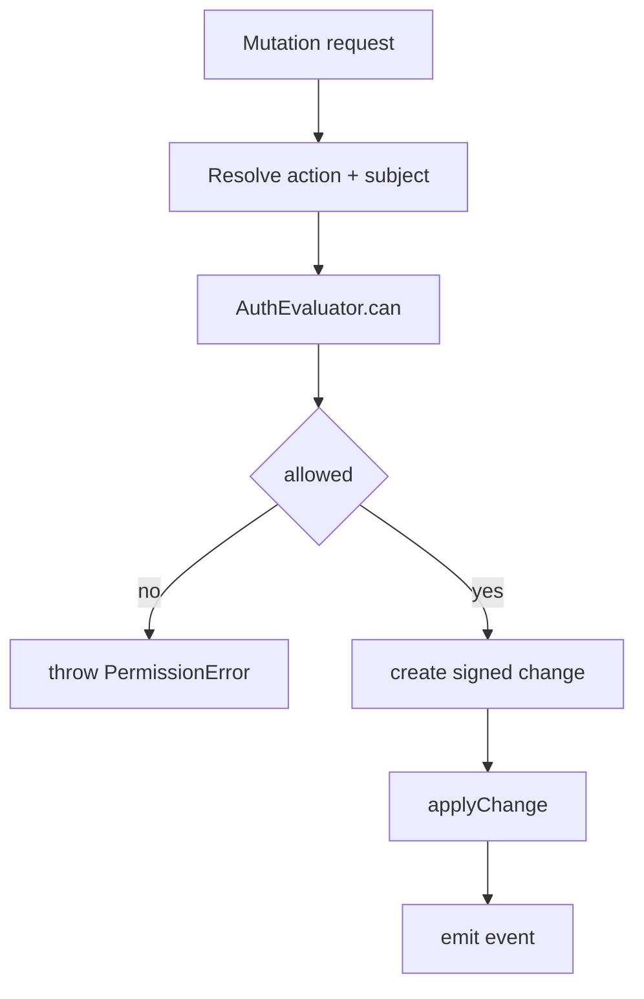

# 05: NodeStore Enforcement

> Wire authorization checks into all mutating NodeStore paths, including remote sync apply.

**Duration:** 4 days  
**Dependencies:** [04-auth-evaluator-engine.md](./04-auth-evaluator-engine.md)  
**Packages:** `packages/data/src/store`

## Current Baseline

`NodeStore` currently performs signature/hash validation for remote changes in `applyRemoteChange`, but no authorization gate for `create`, `update`, `delete`, `restore`, or remote apply.

## Implementation

### 1. Add Auth Adapter to NodeStore Options

Add optional/required auth dependency:

```ts
type NodeStoreOptions = {
  // existing fields
  authEvaluator: AuthEvaluator
  authContextProvider?: () => { subject: DID }
}
```

### 2. Enforce Local Mutation Paths

Before creating signed change:

- `create` checks action `write` on target schema context.
- `update` checks action `write` and field-level constraints.
- `delete` checks action `delete`.
- `restore` checks action `write` or dedicated `restore` action if enabled.

### 3. Enforce Remote Apply Path

In `applyRemoteChange` after cryptographic verification but before apply:

- infer subject from `change.authorDID`
- evaluate capability for intended mutation
- reject unauthorized changes deterministically

### 4. Add Consistent Error Surface

Introduce `PermissionError` with standardized shape:

- `code`
- `action`
- `nodeId`
- `subject`
- `reasons`

## Mutation Flow Diagram



## Tests

- Unit tests per mutation path for allow/deny.
- Remote unauthorized replay tests.
- Regression tests ensuring cryptographic checks still run first.
- Transaction operation tests for mixed authorized/unauthorized batches.

## Transaction Batch Authorization

Transactions use **all-or-nothing** semantics for simplicity and predictability:

```ts
// Before executing batch, check auth for ALL operations
const checks = await Promise.all(batch.ops.map((op) => auth.can(subject, op.action, op.nodeId)))

if (checks.some((c) => !c.allow)) {
  throw new PermissionError({
    code: 'BATCH_PARTIAL_DENY',
    failedOps: checks.filter((c) => !c.allow).map((c, i) => batch.ops[i])
    // entire batch rejected, no partial application
  })
}

// All checks passed, apply batch atomically
```

**Rationale:**

- Partial batch failure creates complex rollback scenarios
- All-or-nothing matches database transaction semantics developers expect
- Simpler debugging - either all ops authorized or clear failure list

## Checklist

- [ ] NodeStore receives auth evaluator dependency.
- [ ] Local CRUD guarded by `can()`.
- [ ] Remote apply guarded by `can()`.
- [ ] Transaction batch authorization uses all-or-nothing semantics.
- [ ] Permission errors standardized.
- [ ] Tests cover local, remote, and transaction paths.

---

[Back to README](./README.md) | [Previous: Auth Evaluator Engine](./04-auth-evaluator-engine.md) | [Next: UCAN Delegation and Revocation ->](./06-ucan-delegation-and-revocation.md)
