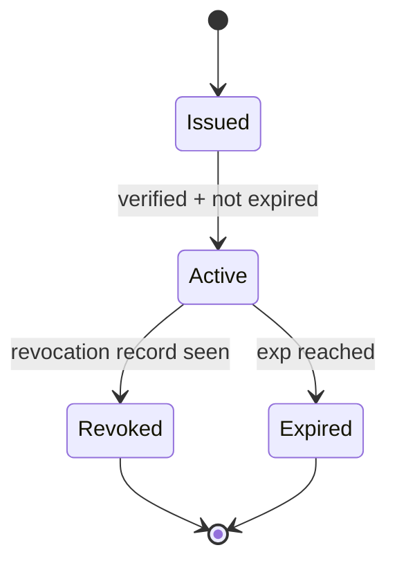

# 06: UCAN Delegation and Revocation

> Implement store-level grant/revoke/list APIs using existing UCAN primitives and revocation records. **Critical prerequisite: [Step 00: Encryption Architecture](./00-encryption-architecture.md).**

**Duration:** 5 days  
**Dependencies:** [05-nodestore-enforcement.md](./05-nodestore-enforcement.md), [00-encryption-architecture.md](./00-encryption-architecture.md)  
**Packages:** `packages/data`, `packages/identity`

## Current Baseline

- UCAN creation and verification exist in `packages/identity/src/ucan.ts`.
- Share revocation primitives and hash-based revocation store exist in `packages/identity/src/sharing/revocation.ts`.
- **Encryption architecture from Step 00 provides the foundation: grants distribute encrypted content keys.**

## Implementation

### 1. Add Store Auth API

Expose:

- `store.auth.can(input)`
- `store.auth.grant(input)`
- `store.auth.revoke(input)`
- `store.auth.listGrants(input)`

### 2. Define Grant Record Model (Grants as Nodes)

Grants are implemented as regular nodes using the existing NodeStore infrastructure. This provides CRDT merge, sync, signing, hashing, and history for free.

```ts
const GrantSchema = defineSchema({
  name: 'Grant',
  properties: {
    issuerDid: stringProperty(),
    audienceDid: stringProperty(),
    resource: stringProperty(), // node ID or pattern
    actions: arrayProperty(stringProperty()), // ['read', 'write']
    constraints: objectProperty(), // optional conditions
    exp: numberProperty(), // expiration timestamp
    revokedAt: optional(numberProperty()),
    revokedBy: optional(stringProperty()) // DID that revoked
  },
  authorization: {
    actions: {
      revoke: 'issuer | resource.owner'
    },
    roles: {
      issuer: (grant) => grant.issuerDid
    }
  }
})
```

**Benefits of grants-as-nodes:**

- Automatic sync across replicas via existing CRDT infrastructure
- Signed and hashed like any other change
- Audit trail through node history
- Revocation is just a node update (setting `revokedAt`)
- GC policy can reuse node retention rules

**Grant record fields:**

- `grantId`
- `issuerDid`
- `audienceDid`
- `resource`
- `actions`
- `constraints`
- `exp`
- `proofs`

### 3. Integrate Attenuation Rules

During `grant`:

- verify grantor currently has requested authority.
- enforce no privilege escalation beyond grantor capabilities.
- enforce expiration upper bound relative to parent proof chain.

### 4. Integrate Revocation Checks

During `can`:

- check revocation set before accepting cached proof validation.
- invalidate affected cache lines by token hash and derivation chain.

### 5. Replay and Uniqueness

Track token identifiers (`jti`/hash) to prevent replay in invocation-style flows.

### 6. Define Revocation Consistency Contract

Document runtime guarantees by mode so app teams can choose policy intentionally:

| Mode       | Offline Behavior                                | Online Behavior                                   | Expected Lag             |
| ---------- | ----------------------------------------------- | ------------------------------------------------- | ------------------------ |
| `eventual` | last-known revocation set                       | refresh on reconnect/poll                         | bounded by sync interval |
| `strict`   | deny when revocation freshness cannot be proven | requires revocation watermark >= required version | near-zero once connected |

Rules:

- `eventual` is default for local-first availability.
- `strict` is opt-in for high-risk schemas/actions.
- Evaluator output must include freshness metadata for audit (`revocationWatermark`, `evaluatedAt`).

## Delegation Lifecycle



## Tests

- Grant issuance and verification tests.
- Attenuation failure tests (action/resource overreach).
- Revocation propagation tests across sync replicas.
- Replay detection tests with duplicate tokens.
- Partition/reconnect tests validating `eventual` vs `strict` mode semantics.
- Freshness-metadata tests ensuring decision traces expose revocation state.

## Checklist

- [ ] `store.auth` API shipped.
- [ ] Grant schema defined (grants as nodes).
- [ ] Grant records persisted and syncable via NodeStore.
- [ ] Attenuation enforcement complete.
- [ ] Revocation-aware evaluator path complete.
- [ ] Replay protection tests passing.
- [ ] Revocation consistency modes validated with partition tests.
- [ ] Grant GC/retention policy documented.

---

[Back to README](./README.md) | [Previous: NodeStore Enforcement](./05-nodestore-enforcement.md) | [Next: Hub Capability Bridge ->](./07-hub-capability-bridge.md)
