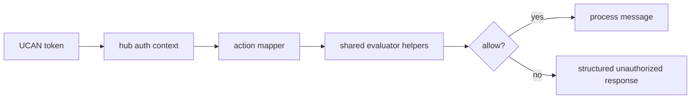
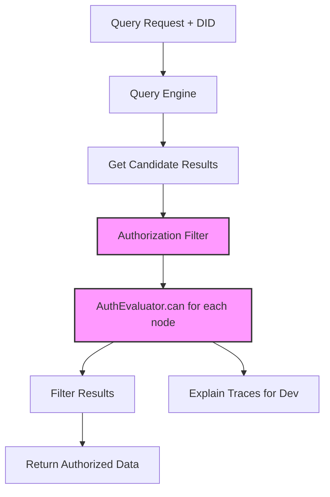

# 07: Hub Capability Bridge

> Align hub UCAN authorization checks with the unified store action model, with special focus on query result filtering.

**Duration:** 3 days  
**Dependencies:** [06-ucan-delegation-and-revocation.md](./06-ucan-delegation-and-revocation.md)  
**Packages:** `packages/hub`, `packages/core`

## Current Baseline

- Hub authenticates UCANs and builds auth context in `packages/hub/src/auth/ucan.ts`.
- Capability matching exists in `packages/hub/src/auth/capabilities.ts`.
- Query infrastructure exists but does not perform authorization filtering on results.

## Implementation

### 1. Add Shared Action Bridge

Create mapping between hub verbs and unified authorization actions/resources:

| Hub Action  | Unified Action | Resource Shape    |
| ----------- | -------------- | ----------------- |
| `hub/relay` | `write`        | node/room scope   |
| `hub/query` | `read`         | index/query scope |
| `hub/admin` | `admin`        | hub scope         |

Add mapping entries for handshake/subscription lifecycle actions (`hub/connect`, `hub/subscribe`) and define whether they evaluate as `read` or dedicated internal actions.

### 2. Implement Query Authorization Filter (Critical)

**Core Requirement:** The hub must filter query results based on schema authorization before returning data to the client.

```ts
// Query processing pipeline
async function executeAuthorizedQuery(did: DID, query: Query) {
  // 1. Execute query to get candidate results
  const candidates = await queryEngine.execute(query)

  // 2. Filter each candidate through authorization evaluator
  const allowed = await Promise.all(
    candidates.map((node) =>
      authEvaluator.can({
        subject: did,
        action: 'read',
        nodeId: node.id,
        schema: node.schema
      })
    )
  )

  // 3. Return only authorized nodes
  return candidates.filter((_, i) => allowed[i].allow)
}
```

**Key Design Decisions:**

- **Authorization is the source of truth**: The hub uses the same `AuthEvaluator` as local stores, ensuring consistency
- **Post-query filtering**: Execute query first, then filter results (simpler than auth-aware query planning)
- **Batch evaluation**: Evaluate authorization for result sets in parallel for performance
- **Explainable filtering**: Return debug info showing why nodes were excluded (for devtools)

### 3. Add Query Planner Optimization (Future)

For performance at scale, the query planner should eventually push down authorization constraints:

```ts
// Optimized: Use index intersection when possible
if (query.filter.owner === did) {
  // Fast path: owner can always read their own nodes
  return query.execute()
}

// Full auth evaluation for complex cases
return executeAuthorizedQuery(did, query)
```

### 4. Normalize Capability Evaluation

Replace ad hoc string checks with shared evaluator/namespace helpers so behavior is consistent with store policy semantics.

### 5. Propagate Explainable Denials

Return structured auth failure payloads for websocket and HTTP paths, not only generic `Unauthorized`.

For queries, include filtering metadata:

```json
{
  "results": [...],
  "meta": {
    "totalMatched": 150,
    "authorizedCount": 42,
    "filteredCount": 108
  }
}
```

### 6. Add Drift Detection Tests

Contract tests should fail if hub action constants diverge from store action constants.

Add a generated test fixture from the canonical matrix in Step 01 so updates fail fast if one side adds/removes an action without updating the other.

## Integration Diagram



## Query Authorization Flow



## Checklist

- [ ] Hub/store action mapping finalized.
- [ ] Query authorization filter implemented (post-query filtering with AuthEvaluator).
- [ ] Batch authorization evaluation for result sets.
- [ ] Shared constants used in hub auth path.
- [ ] Structured denial payloads emitted.
- [ ] Query result filtering metadata exposed.
- [ ] Contract tests guard against namespace drift.

---

[Back to README](./README.md) | [Previous: UCAN Delegation and Revocation](./06-ucan-delegation-and-revocation.md) | [Next: React Devtools and DX ->](./08-react-devtools-and-dx.md)
