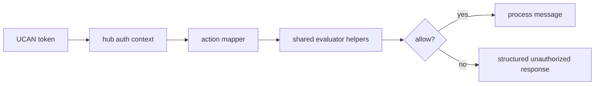

# 07: Hub Capability Bridge

> Align hub UCAN authorization checks with the unified store action model.

**Duration:** 3 days  
**Dependencies:** [06-ucan-delegation-and-revocation.md](./06-ucan-delegation-and-revocation.md)  
**Packages:** `packages/hub`, `packages/core`

## Current Baseline

- Hub authenticates UCANs and builds auth context in `packages/hub/src/auth/ucan.ts`.
- Capability matching exists in `packages/hub/src/auth/capabilities.ts`.

## Implementation

### 1. Add Shared Action Bridge

Create mapping between hub verbs and unified authorization actions/resources:

| Hub Action  | Unified Action | Resource Shape    |
| ----------- | -------------- | ----------------- |
| `hub/relay` | `write`        | node/room scope   |
| `hub/query` | `read`         | index/query scope |
| `hub/admin` | `admin`        | hub scope         |

### 2. Normalize Capability Evaluation

Replace ad hoc string checks with shared evaluator/namespace helpers so behavior is consistent with store policy semantics.

### 3. Propagate Explainable Denials

Return structured auth failure payloads for websocket and HTTP paths, not only generic `Unauthorized`.

### 4. Add Drift Detection Tests

Contract tests should fail if hub action constants diverge from store action constants.

## Integration Diagram

## Checklist

- [ ] Hub/store action mapping finalized.
- [ ] Shared constants used in hub auth path.
- [ ] Structured denial payloads emitted.
- [ ] Contract tests guard against namespace drift.

---

[Back to README](./README.md) | [Previous: UCAN Delegation and Revocation](./06-ucan-delegation-and-revocation.md) | [Next: React Devtools and DX ->](./08-react-devtools-and-dx.md)
