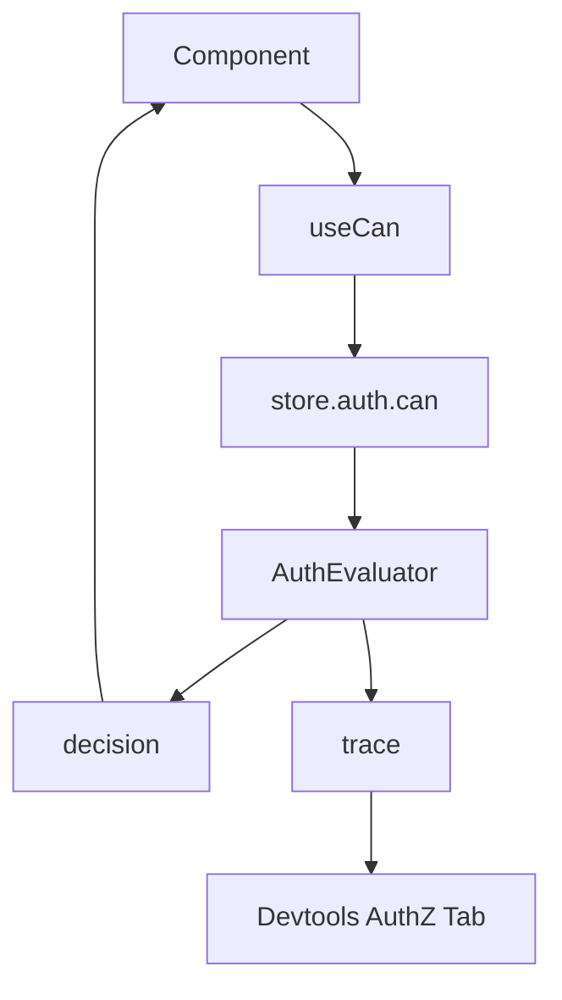

# 08: React, Devtools, and DX

> Provide ergonomic hooks and diagnostics so application teams can adopt authorization without hand-rolling wrappers.

**Duration:** 3 days  
**Dependencies:** [07-hub-capability-bridge.md](./07-hub-capability-bridge.md)  
**Packages:** `packages/react`, `packages/devtools`

## Implementation

### 1. Add React Hooks

- `useCan(nodeId, actions?)`
- `usePermission(nodeId, action)` (optional alias)
- `useGrants(nodeId)`

Hooks should provide loading/error state and memoized permission booleans.

Hook typing requirements:

- `useCan<TAction extends AuthAction>(nodeId, actions)` returns typed booleans keyed by requested `TAction`.
- When used with schema-bound helpers, action arguments narrow to that schema's action union.

Consistency semantics:

- `eventual` mode: hooks may temporarily show last-known decision until fresh revocation watermark arrives.
- `strict` mode: hooks must surface `unknown`/`pending` when freshness cannot be established.
- Expose freshness metadata (`isFresh`, `evaluatedAt`, `revocationWatermark`) for sensitive UI controls.

### 2. Add Explain API for Debugging

Expose evaluator traces through store API:

```ts
const trace = await store.auth.explain({ subject, action, nodeId })
```

### 3. Add Devtools Panel

Panel should show:

- evaluated action
- matched roles
- delegation chain summary
- deny reason code
- cache hit or miss metadata

### 3a. Add Dedicated Devtools `AuthZ` Tab

Implement a first-class top-level tab named `AuthZ` in Devtools shell navigation.

Requirements:

- Add `authz` to panel ID/type definitions and tab list.
- Route `authz` tab to an authorization-focused panel component.
- Keep existing non-auth tabs free of auth-specific test controls to avoid duplication.

### 3b. Centralize Auth Dev and Testing UI in `AuthZ`

Move or co-locate authorization development/testing tools into this tab:

- permission check playground (`subject`, `action`, `nodeId`, optional patch fields)
- `store.auth.explain()` trace viewer
- grant/revoke/list grant test controls
- revocation freshness/consistency mode inspector (`eventual` vs `strict`)
- recent auth decision/event timeline (allow/deny, reason codes, cache state)

This tab becomes the single source of truth for auth diagnostics during implementation.

### 4. Author DX Recipes

Provide cookbook examples:

- gated buttons/forms
- optimistic update with preflight `can()`
- grant/revoke UI flows

## UX Diagram



## Devtools Integration Checklist

- [ ] `AuthZ` tab added to shell/tab registry.
- [ ] `authz` panel type added to context/provider typing.
- [ ] Permission playground implemented in `AuthZ` tab.
- [ ] Explain-trace viewer implemented in `AuthZ` tab.
- [ ] Grant/revoke/revocation test controls implemented in `AuthZ` tab.
- [ ] Auth diagnostics removed or redirected from non-AuthZ tabs.

## Checklist

- [ ] Hooks implemented and typed.
- [ ] `explain()` surface available.
- [ ] Devtools auth panel implemented.
- [ ] Developer recipes documented.
- [ ] Hook tests and story examples added.
- [ ] Hook freshness semantics documented for `eventual` and `strict` modes.
- [ ] All auth dev/testing UI consolidated into Devtools `AuthZ` tab.

---

[Back to README](./README.md) | [Previous: Hub Capability Bridge](./07-hub-capability-bridge.md) | [Next: Performance, Caching, and Benchmarks ->](./09-performance-caching-and-benchmarks.md)
