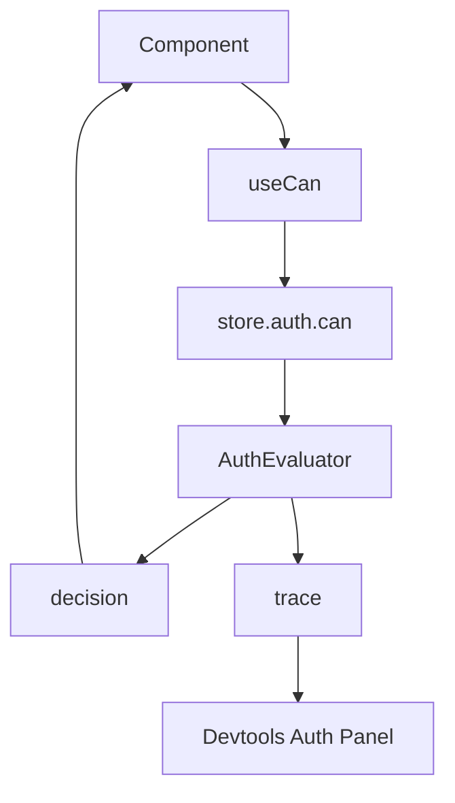

# 08: React, Devtools, and DX

> Provide ergonomic hooks and diagnostics so application teams can adopt authorization without hand-rolling wrappers.

**Duration:** 3 days  
**Dependencies:** [07-hub-capability-bridge.md](./07-hub-capability-bridge.md)  
**Packages:** `packages/react`, `packages/devtools`

## Implementation

### 1. Add React Hooks

- `useCan(nodeId, actions?)`
- `usePermission(nodeId, action)` (optional alias)
- `useGrants(nodeId)`

Hooks should provide loading/error state and memoized permission booleans.

### 2. Add Explain API for Debugging

Expose evaluator traces through store API:

```ts
const trace = await store.auth.explain({ subject, action, nodeId })
```

### 3. Add Devtools Panel

Panel should show:

- evaluated action
- matched roles
- delegation chain summary
- deny reason code
- cache hit or miss metadata

### 4. Author DX Recipes

Provide cookbook examples:

- gated buttons/forms
- optimistic update with preflight `can()`
- grant/revoke UI flows

## UX Diagram



## Checklist

- [ ] Hooks implemented and typed.
- [ ] `explain()` surface available.
- [ ] Devtools auth panel implemented.
- [ ] Developer recipes documented.
- [ ] Hook tests and story examples added.

---

[Back to README](./README.md) | [Previous: Hub Capability Bridge](./07-hub-capability-bridge.md) | [Next: Performance, Caching, and Benchmarks ->](./09-performance-caching-and-benchmarks.md)
