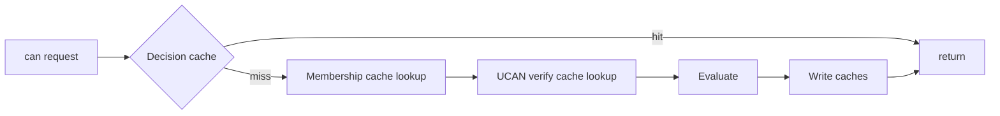

# 09: Performance, Caching, and Benchmarks

> Meet latency targets with layered caches, safe invalidation, and benchmark gates.

**Duration:** 4 days  
**Dependencies:** [08-react-devtools-and-dx.md](./08-react-devtools-and-dx.md)  
**Packages:** `packages/data`, `packages/identity`, `packages/hub` (bench harnesses)

## Targets

- Warm `can()` path: p50 < 1ms, p99 < 5ms.
- Cold `can()` path: p50 < 10ms, p99 < 50ms.
- Local `grant()`: p50 < 20ms.

## Implementation

### 1. Decision Cache

Key dimensions:

- subject DID
- action
- node/resource id
- policy version watermark
- revocation watermark

### 2. Membership Cache

Cache relation traversal outputs with invalidation on:

- node property mutation
- relation edge mutation
- relevant schema auth update

### 3. UCAN Verification Cache

Memoize proof-chain validation by token hash and revocation watermark.

### 4. Event-Driven Invalidation

Use mutation events from store and grant/revoke operations to evict only impacted cache entries.

### 5. Benchmark Harness

Add repeatable benchmark suites for:

- role resolution depth 1-5
- cold vs warm can checks
- revocation-heavy workloads
- mixed local/remote mutation throughput

Define fixed benchmark fixtures (checked into repo) so runs are comparable over time:

- `small`: 1k nodes, relation depth <= 2, proof depth <= 2.
- `medium`: 10k nodes, relation depth <= 3, proof depth <= 4.
- `large`: 100k nodes, relation depth <= 5, proof depth <= 6.

For each fixture, pin:

- cache warmup protocol (`0`, `10`, `100` priming checks)
- mutation mix (`read:write:delete` ratio)
- revocation churn rate (events/minute equivalent)
- token chain fanout distribution

CI should compare current against baseline and fail when regression exceeds agreed threshold.

## Cache Topology

## Checklist

- [ ] Decision cache implemented.
- [ ] Membership cache implemented.
- [ ] UCAN verification cache implemented.
- [ ] Invalidation hooks wired.
- [ ] Benchmarks added with target assertions.
- [ ] Fixed benchmark fixtures and regression thresholds committed.

---

[Back to README](./README.md) | [Previous: React, Devtools, and DX](./08-react-devtools-and-dx.md) | [Next: Security, Rollout, and Release ->](./10-security-rollout-and-release.md)
