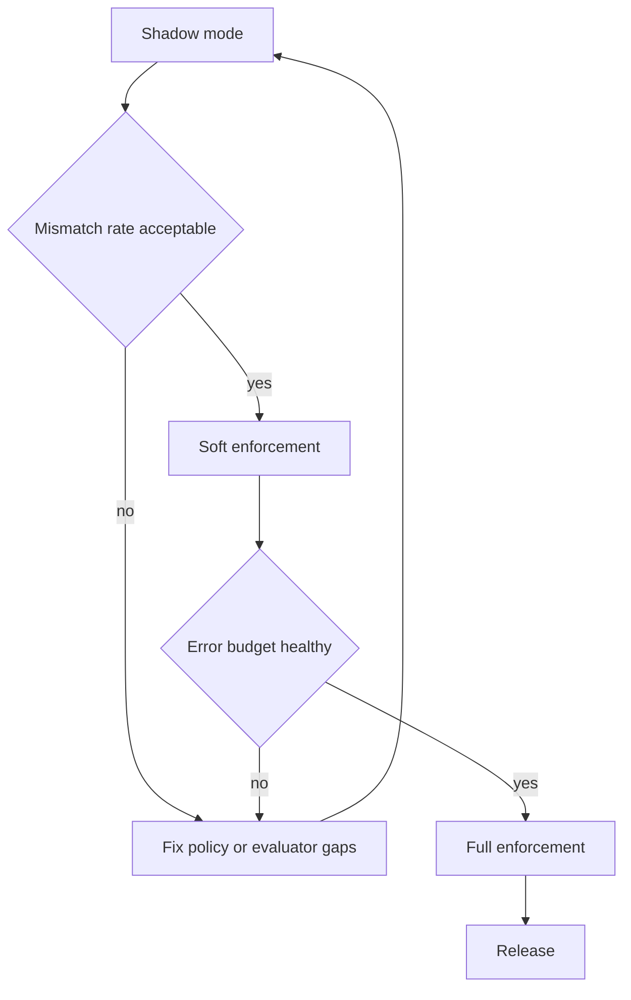

# 10: Security, Rollout, and Release

> Harden correctness/security, run staged rollout, and define release gates.

**Duration:** 4 days  
**Dependencies:** [09-performance-caching-and-benchmarks.md](./09-performance-caching-and-benchmarks.md)  
**Packages:** cross-cutting (`data`, `identity`, `hub`, `react`, `devtools`)

## Security Hardening

### 1. Conformance Test Matrix

Must-cover scenarios:

- deny beats allow in all combinations
- delegation attenuation cannot escalate
- revocation invalidates descendant delegations
- relation traversal cycles terminate safely
- remote unauthorized change rejection is deterministic

### 2. Adversarial and Fuzz Testing

- DSL parser fuzzing
- malformed UCAN proof chains
- replay token attempts
- deep relation graph exhaustion attempts

Add explicit abuse and DoS scenarios with fail-fast limits:

- expression tree explosion attempts (node count cap)
- relation-path explosion/cycle storms (depth + visited-node caps)
- token flood with unique hashes (verification rate limiting)
- oversized grant constraint payloads (input size limits)

Every limit must have:

- deterministic error code
- metrics counter
- alertable threshold in ops dashboard

### 3. Auditability Guarantees

Verify grants, revokes, and policy edits are represented as signed, replayable change history with stable event schema.

## Rollout Strategy

### Stage A: Shadow Evaluation

Run evaluator in observe-only mode, compare predicted decisions against current behavior, collect mismatches.

### Stage B: Soft Enforcement

Enforce in non-destructive paths first (e.g. share actions), with detailed telemetry.

### Stage C: Full Enforcement

Enable in all local and remote mutation paths plus hub relay/query gates.

## Rollout Diagram

## Release Gates

- [ ] All auth conformance suites pass.
- [ ] Performance targets met in CI benchmarks.
- [ ] No critical findings from fuzz/adversarial runs.
- [ ] Hub/store action mapping tests green.
- [ ] Developer docs and migration examples published.

## Operational Playbook

- Define fast rollback flag for strict enforcement.
- Publish troubleshooting guide for common deny reasons.
- Add dashboard for deny rate, revocation propagation lag, and cache effectiveness.

---

[Back to README](./README.md) | [Previous: Performance, Caching, and Benchmarks](./09-performance-caching-and-benchmarks.md) | [Next: Types and Validation Contract ->](./11-types-and-validation-contract.md)
