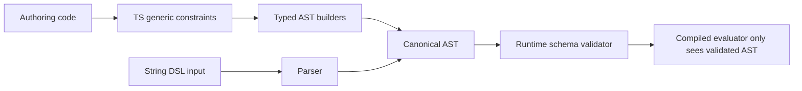

# 11: Types and Validation Contract

> Define the exact TypeScript contracts, inferred unions, and runtime validation boundaries for schema authorization.

**Duration:** 2 days  
**Dependencies:** [02-schema-authorization-model.md](./02-schema-authorization-model.md), [03-expression-dsl-and-compiler.md](./03-expression-dsl-and-compiler.md)  
**Packages:** `packages/data`, `packages/core`, `packages/react`

## Objective

Guarantee that schema-auth mistakes are caught as early as possible:

- At compile-time when the app author writes typed schema/auth code.
- At schema-load time when payloads come from storage/sync/network.
- Never during evaluator execution if invalid input can be rejected earlier.

## Type Contract Layers



## Core Types

### 1. Schema and Authorization Primitives

```ts
export type AuthorizationDefinition<
  TActions extends Record<string, AuthExpression> = Record<string, AuthExpression>,
  TRoles extends Record<string, RoleResolverExpression> = Record<string, RoleResolverExpression>
> = {
  actions: TActions
  roles: TRoles
  nodePolicy?: {
    mode: 'extend'
    allow: Array<'deny' | 'fieldRules' | 'conditions'>
  }
}

export type ActionKey<TAuth extends AuthorizationDefinition> = keyof TAuth['actions'] & string
export type RoleKey<TAuth extends AuthorizationDefinition> = keyof TAuth['roles'] & string
```

### 2. Schema-Bound Action Inference

```ts
export type SchemaAction<TSchema extends { authorization: AuthorizationDefinition }> = ActionKey<
  TSchema['authorization']
>
```

Use in store API:

```ts
declare function can<TSchema extends { authorization: AuthorizationDefinition }>(input: {
  schema: TSchema
  action: SchemaAction<TSchema>
  nodeId: string
  subject: string
}): Promise<AuthDecision>
```

### 3. Role/Path-Constrained Builder Types

```ts
declare function role<TAuth extends AuthorizationDefinition>(name: RoleKey<TAuth>): RoleAstNode

declare function relation<TSchema, TPath extends ValidRelationPath<TSchema>>(
  path: TPath,
  expr: AuthAstNode
): RelationAstNode<TPath>
```

## Runtime Validation Contract

Even with strong typing, persisted schemas and string DSL require runtime checks.

Validator must enforce:

- unknown role references are rejected
- unknown action references are rejected
- invalid relation path segments are rejected
- cycle detection for role indirection and relation recursion
- expression node-count and max-depth limits
- `public` on mutating actions blocked unless explicit opt-in

### Deterministic Error Codes

Use stable error codes across parser/validator/evaluator surfaces:

- `AUTH_SCHEMA_INVALID_ROLE_REF`
- `AUTH_SCHEMA_INVALID_ACTION_REF`
- `AUTH_SCHEMA_INVALID_RELATION_PATH`
- `AUTH_SCHEMA_ROLE_CYCLE`
- `AUTH_SCHEMA_EXPR_LIMIT_EXCEEDED`
- `AUTH_SCHEMA_UNSAFE_PUBLIC_MUTATION`

## React and Hook Typing

Schema-bound helper version should narrow action keys:

```ts
declare function useCanForSchema<
  TSchema extends { authorization: AuthorizationDefinition },
  TAction extends SchemaAction<TSchema>
>(
  schema: TSchema,
  nodeId: string,
  actions: readonly TAction[]
): {
  can: Record<TAction, boolean>
  isFresh: boolean
  evaluatedAt: number
}
```

## Type-Level Test Plan

Use `vitest` + `expectTypeOf` and/or `tsd`:

- positive inference tests for action/role unions
- negative tests for invalid role/action/path via `@ts-expect-error`
- no-widening tests to ensure `as const` literals remain narrow
- API surface tests for `store.auth.can()` and hook signatures

## Example Type Tests

```ts
// @ts-expect-error unknown role should fail
role<typeof TaskAuth>('notARole')

expectTypeOf(canInput.action).toEqualTypeOf<'read' | 'write' | 'delete' | 'share'>()
```

## Checklist

- [ ] Core auth type utilities (`ActionKey`, `RoleKey`, `SchemaAction`) added.
- [ ] Builder APIs constrained by role/path generics.
- [ ] Store and hook APIs expose schema-bound action unions.
- [ ] Runtime validator enforces deterministic error codes.
- [ ] Type-level tests added and required in CI.

---

[Back to README](./README.md) | [Previous: Security, Rollout, and Release](./10-security-rollout-and-release.md)
