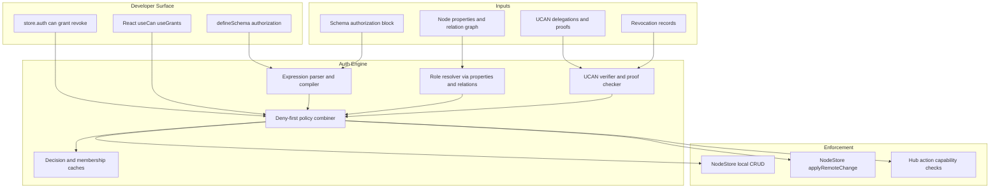
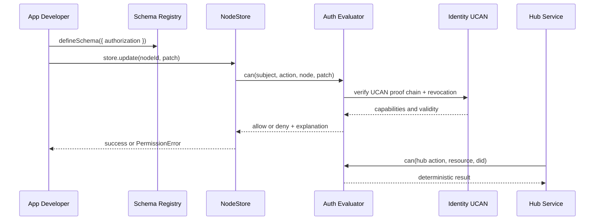

# xNet Implementation Plan - Step 03.97: Unified Authorization API V3

> Consolidate explorations 0077-0085 into one implementation-ready authorization plan for `@xnet/data`, `@xnet/identity`, `@xnet/hub`, and React DX.

## Executive Summary

This plan turns the authorization explorations into a single build sequence that ships a schema-first, relation-based, UCAN-delegable authorization system with deterministic enforcement in local and synced mutation paths.

The plan is intentionally grounded in current repository reality:

- `defineSchema` has no first-class authorization block today in `packages/data/src/schema/define.ts`.
- `NodeStore` CRUD and remote apply paths do not currently run authorization checks in `packages/data/src/store/store.ts`.
- UCAN creation/verification, proof validation, and capability extraction already exist in `packages/identity/src/ucan.ts`.
- Hub-level UCAN auth and capability checking already exist in `packages/hub/src/auth/ucan.ts` and `packages/hub/src/auth/capabilities.ts`.
- Core permission types exist but are not wired into runtime enforcement in `packages/core/src/permissions.ts`.

## Scope and Goals

- Ship one coherent auth API: `store.auth.can()`, `store.auth.grant()`, `store.auth.revoke()`, `store.auth.listGrants()`, plus `useCan()` and `useGrants()`.
- Enforce authorization consistently for local writes, remote sync apply, and hub request paths.
- Keep authorization model local-first and partition-tolerant while preserving least-privilege and deny-first semantics.
- Reuse existing UCAN cryptographic infrastructure instead of replacing it.

## Compatibility and Rollout Defaults

To avoid breaking existing apps as authorization is introduced, this plan uses a staged compatibility contract:

- Schemas without `authorization` are treated as `legacy` during migration and evaluated under a feature flag.
- Default rollout mode is `compat` (warn + trace) before `enforce` (hard deny).
- New schemas created after cutover must include explicit `authorization`.
- Final state for production is deny-by-default when no action rule is defined for a mutation.

Out of scope for this plan:

- Full policy migration tooling for legacy schemas (pre-release assumption).
- Multi-tenant cloud policy control plane.
- New cryptographic primitives beyond current Ed25519/UCAN stack.

## Architecture Overview

## Decision Baseline

The plan locks these exploration outcomes:

- One evaluator combining schema policy, relation-derived roles, and UCAN delegation.
- Groups modeled as regular nodes plus `relation()` traversal, not a platform primitive.
- Schema policy as default authority; node policy can constrain and deny (no silent full override).
- Hybrid auth DSL: string literals for common cases plus typed builders for complex expressions.
- Explicit deny precedence over all allows.

## Type Safety Strategy

TypeScript typing is a first-class requirement, not a post-implementation improvement. The plan enforces strong typing at two layers:

- Type-level safety for schema authors (compile-time): action names, role references, and relation paths.
- Runtime safety for untrusted input (schema-time validation): AST checks, cycle detection, and strict parser constraints.

Required outcomes:

- Typed builders infer valid role/action unions from schema definitions.
- String DSL remains supported but is validated and normalized before execution.
- `store.auth.can()` and hooks expose typed action arguments tied to schema action keys.
- CI includes type-level tests (`tsd` or equivalent) for auth DSL contracts.

## Canonical Action Matrix

This matrix is the single source of truth for action naming across store, sync, and hub. Step 01 defines constants; Step 07 wires hub mapping tests.

| Domain | Operation                     | Canonical Action   | Notes                              |
| ------ | ----------------------------- | ------------------ | ---------------------------------- |
| Store  | `get`, `query`                | `read`             | Includes list/index read checks    |
| Store  | `create`, `update`, `restore` | `write`            | `update` may add field constraints |
| Store  | `delete`                      | `delete`           | Hard or soft delete path           |
| Store  | `grant`                       | `share`            | Delegation issuance                |
| Store  | `revoke`                      | `share`            | Delegation revocation              |
| Store  | transaction batch             | `write` + per-op   | Must evaluate per operation        |
| Sync   | `applyRemoteChange`           | derived per change | Deterministic by change type       |
| Hub    | `hub/query`                   | `read`             | Query and subscription setup       |
| Hub    | `hub/relay`                   | `write`            | Message/update relay paths         |
| Hub    | `hub/admin`                   | `admin`            | Operational/admin controls         |

## External Research Inputs Used

- UCAN spec guidance on attenuation, time bounds, replay resistance, and memoized validation.
- Zanzibar/SpiceDB lessons on relation graph modeling, bounded recursion, and consistency semantics.
- Local-first auth work on signature-chain auditability and delegation graph clarity.
- Keyhive local-first constraints around revocation, offline behavior, and causal safety.

## Phases

| Phase | Focus                                     | Step Docs                                                                                                                         |
| ----- | ----------------------------------------- | --------------------------------------------------------------------------------------------------------------------------------- |
| 1     | Contract and schema model                 | [01](./01-alignment-and-adrs.md), [02](./02-schema-authorization-model.md)                                                        |
| 2     | Type contracts and expression foundations | [11](./11-types-and-validation-contract.md), [03](./03-expression-dsl-and-compiler.md)                                            |
| 3     | Evaluation and enforcement core           | [04](./04-auth-evaluator-engine.md), [05](./05-nodestore-enforcement.md)                                                          |
| 4     | Delegation and transport integration      | [06](./06-ucan-delegation-and-revocation.md), [07](./07-hub-capability-bridge.md)                                                 |
| 5     | DX, observability, and hardening          | [08](./08-react-devtools-and-dx.md), [09](./09-performance-caching-and-benchmarks.md), [10](./10-security-rollout-and-release.md) |

## End-to-End Delivery Flow

## Global Validation Gates

- [ ] All mutating paths (`create`, `update`, `delete`, `restore`, `applyRemoteChange`) enforce authorization deterministically.
- [ ] Delegation chains enforce attenuation and expiration with revocation awareness.
- [ ] Decision traces are explainable for debugging and audit.
- [ ] Benchmarks hit target budgets for warm and cold `can()` checks.
- [ ] Conformance tests cover deny precedence, traversal limits, and conflict edge cases.
- [ ] Compatibility mode and enforce mode both validated on schemas with and without `authorization`.
- [ ] Canonical action matrix has 100% contract-test coverage across store/sync/hub call sites.
- [ ] Devtools includes a dedicated `AuthZ` tab, and all authorization dev/testing surfaces are centralized there.

## Risks and Mitigations

| Risk                                                | Impact                           | Mitigation                                                        |
| --------------------------------------------------- | -------------------------------- | ----------------------------------------------------------------- |
| Expression complexity grows too quickly             | Parser ambiguity and slow checks | Hybrid DSL, AST precompile, strict schema-time validation         |
| Relation traversal cycles                           | Non-termination or high latency  | Visited-set cycle detection and max-depth defaults                |
| Revocation lag in offline mode                      | Temporary over-permission        | Explicit consistency mode (`eventual` default, `strict` optional) |
| Mismatch between store actions and hub capabilities | Policy drift                     | Shared action namespace constants and compatibility map           |
| Performance regressions under sync load             | Poor UX and battery cost         | Layered caches, event invalidation, benchmark gates               |

## Success Criteria

- One documented, typed API surface for authorization across schema, store, hub, and React.
- Enforcement parity between local changes and replicated changes.
- No high-severity authorization bypasses in fuzz and adversarial tests.
- Migration guide and examples enable app teams to adopt without custom forks.

---

[Back to Plans](../) | [Start with Step 01 ->](./01-alignment-and-adrs.md)
