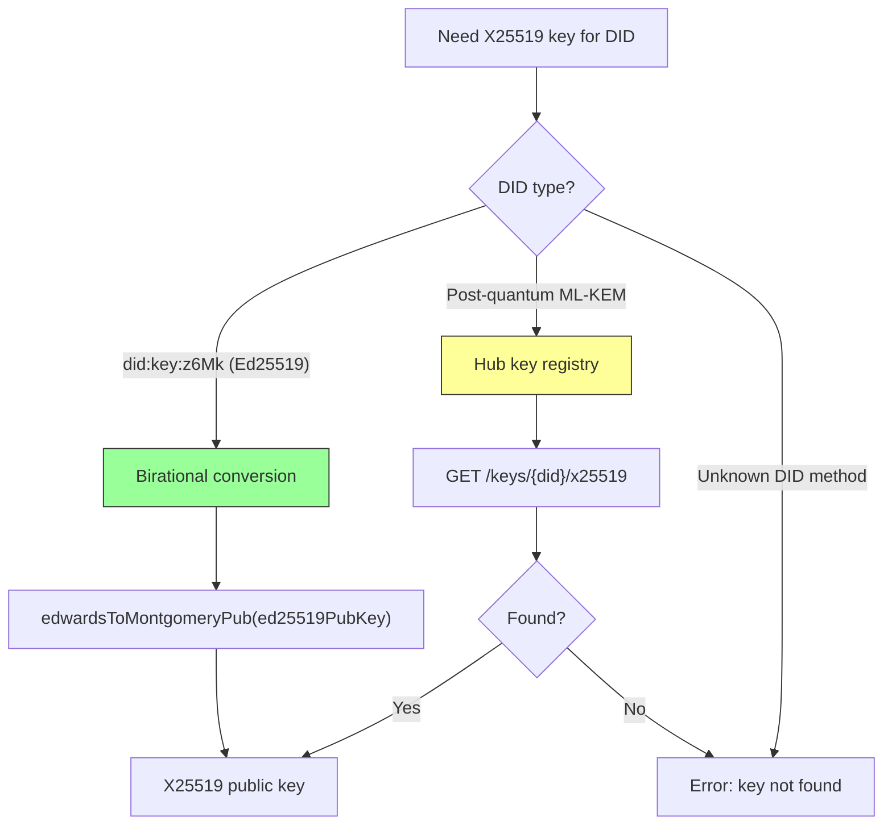
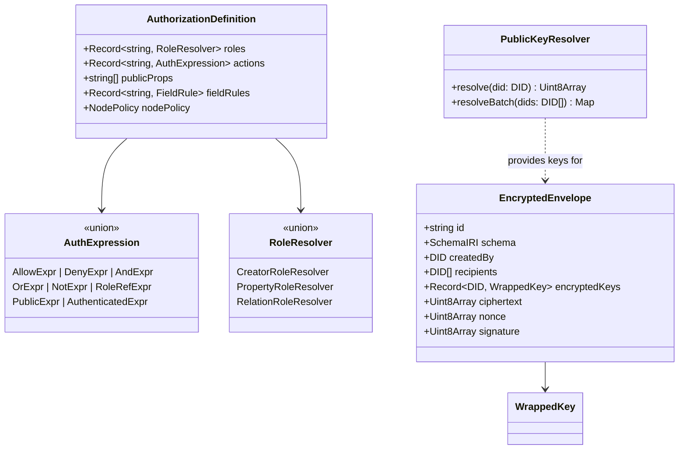

# 01: Types, Encryption & Key Resolution

> Define all authorization types, the encrypted envelope format, content key management, and — critically — the X25519 key resolution strategy that V1 left under-designed.

**Duration:** 5 days
**Dependencies:** None (foundational)
**Packages:** `packages/core`, `packages/crypto`, `packages/data`, `packages/identity`
**Review issues addressed:** A1 (key resolution), C1 (API mismatches), C2 (existing code reconciliation)

## Why This Step Exists

Authorization without encryption is theater. Before building evaluators, hooks, or hub filters, we need the cryptographic foundation: encrypted envelopes, content key management, and the type contracts that every other step depends on.

**New in V2:** This step also solves the key resolution problem. `did:key:z6Mk...` encodes an **Ed25519** public key, not X25519. The `wrapKeyForRecipient()` function needs X25519 keys. V1 left this as a `PublicKeyResolver.resolve(did)` interface without specifying how resolution actually works.

## Key Resolution Strategy



**Primary path (zero network):** For Ed25519-based DIDs (the common case in xNet), use `edwardsToMontgomeryPub()` from `@noble/curves/ed25519` to deterministically convert Ed25519 public keys to X25519. This is a well-established birational map between the Edwards and Montgomery forms of Curve25519.

**Fallback path (network required):** For post-quantum ML-KEM keys that can't be derived from Ed25519, peers publish their X25519 public keys to the hub's key registry. This is also used when a peer wants to advertise multiple device keys.

## Implementation

### 1. Core Authorization Types (`packages/core`)

Add canonical types that all packages import. These **supersede** the existing `Capability` type in `@xnet/core/permissions.ts`:

```typescript
// packages/core/src/auth-types.ts

// ─── Actions ──────────────────────────────────────────────
export const AUTH_ACTIONS = ['read', 'write', 'delete', 'share', 'admin'] as const
export type AuthAction = (typeof AUTH_ACTIONS)[number]

// Re-export for backward compat with existing Capability type
export type Capability = AuthAction

// ─── Decision ─────────────────────────────────────────────
export interface AuthDecision {
  allowed: boolean
  action: AuthAction
  subject: DID
  resource: string
  roles: string[]
  grants: string[] // Grant IDs that contributed
  reasons: AuthDenyReason[]
  cached: boolean
  evaluatedAt: number
  duration: number // ms
}

export type AuthDenyReason =
  | 'DENY_NODE_POLICY'
  | 'DENY_NO_ROLE_MATCH'
  | 'DENY_NO_GRANT'
  | 'DENY_UCAN_INVALID'
  | 'DENY_UCAN_REVOKED'
  | 'DENY_UCAN_EXPIRED'
  | 'DENY_DEPTH_EXCEEDED'
  | 'DENY_NOT_AUTHENTICATED'
  | 'DENY_FIELD_RESTRICTED'
  | 'DENY_GRANT_EXPIRED'
  | 'DENY_STALE_OFFLINE' // NEW: offline cache too stale

// ─── Trace (for explain API) ──────────────────────────────
export interface AuthTrace extends AuthDecision {
  steps: AuthTraceStep[]
}

export interface AuthTraceStep {
  phase: 'node-deny' | 'role-resolve' | 'schema-eval' | 'grant-check' | 'public-check'
  input: Record<string, unknown>
  output: Record<string, unknown>
  duration: number
}

// ─── Schema Authorization Definition ──────────────────────
export interface AuthorizationDefinition<
  TActions extends Record<string, AuthExpression> = Record<string, AuthExpression>,
  TRoles extends Record<string, RoleResolver> = Record<string, RoleResolver>
> {
  roles: TRoles
  actions: TActions
  publicProps?: string[]
  fieldRules?: Record<string, { allow: AuthExpression; deny?: AuthExpression }>
  nodePolicy?: { mode: 'extend'; allow: ('deny' | 'fieldRules' | 'conditions')[] }
}

// ─── Type Utilities ───────────────────────────────────────
export type ActionKey<TAuth extends AuthorizationDefinition> = keyof TAuth['actions'] & string
export type RoleKey<TAuth extends AuthorizationDefinition> = keyof TAuth['roles'] & string
export type SchemaAction<S extends { authorization: AuthorizationDefinition }> = ActionKey<
  S['authorization']
>
```

### 2. Auth Expression AST Types

```typescript
// packages/core/src/auth-expression.ts

export type AuthExpression =
  | AllowExpr
  | DenyExpr
  | AndExpr
  | OrExpr
  | NotExpr
  | RoleRefExpr
  | PublicExpr
  | AuthenticatedExpr

export interface AllowExpr {
  readonly _tag: 'allow'
  readonly roles: readonly string[]
}

export interface DenyExpr {
  readonly _tag: 'deny'
  readonly roles: readonly string[]
}

export interface AndExpr {
  readonly _tag: 'and'
  readonly exprs: readonly AuthExpression[]
}

export interface OrExpr {
  readonly _tag: 'or'
  readonly exprs: readonly AuthExpression[]
}

export interface NotExpr {
  readonly _tag: 'not'
  readonly expr: AuthExpression
}

export interface RoleRefExpr {
  readonly _tag: 'roleRef'
  readonly role: string
}

export interface PublicExpr {
  readonly _tag: 'public'
}

export interface AuthenticatedExpr {
  readonly _tag: 'authenticated'
}

// ─── Role Resolvers ───────────────────────────────────────
export type RoleResolver = CreatorRoleResolver | PropertyRoleResolver | RelationRoleResolver

export interface CreatorRoleResolver {
  readonly _tag: 'creator'
}

export interface PropertyRoleResolver {
  readonly _tag: 'property'
  readonly propertyName: string
}

export interface RelationRoleResolver {
  readonly _tag: 'relation'
  readonly relationName: string
  readonly targetRole: string
}
```

### 3. Typed Builder Functions (`packages/data/src/auth/builders.ts`)

```typescript
export function allow(...roles: string[]): AllowExpr {
  return { _tag: 'allow', roles }
}

export function deny(...roles: string[]): DenyExpr {
  return { _tag: 'deny', roles }
}

export function and(...exprs: AuthExpression[]): AndExpr {
  return { _tag: 'and', exprs }
}

export function or(...exprs: AuthExpression[]): OrExpr {
  return { _tag: 'or', exprs }
}

export function not(expr: AuthExpression): NotExpr {
  return { _tag: 'not', expr }
}

export const PUBLIC: PublicExpr = { _tag: 'public' }
export const AUTHENTICATED: AuthenticatedExpr = { _tag: 'authenticated' }

export const role = {
  creator(): CreatorRoleResolver {
    return { _tag: 'creator' }
  },
  property(name: string): PropertyRoleResolver {
    return { _tag: 'property', propertyName: name }
  },
  relation(relationName: string, targetRole: string): RelationRoleResolver {
    return { _tag: 'relation', relationName, targetRole }
  }
}
```

### 4. Schema Validation (`packages/data/src/auth/validate.ts`)

```typescript
export interface AuthValidationResult {
  valid: boolean
  errors: AuthValidationError[]
}

export interface AuthValidationError {
  code: AuthSchemaErrorCode
  message: string
  path: string
}

export type AuthSchemaErrorCode =
  | 'AUTH_SCHEMA_INVALID_ROLE_REF'
  | 'AUTH_SCHEMA_INVALID_ACTION_REF'
  | 'AUTH_SCHEMA_INVALID_RELATION_PATH'
  | 'AUTH_SCHEMA_ROLE_CYCLE'
  | 'AUTH_SCHEMA_EXPR_LIMIT_EXCEEDED'
  | 'AUTH_SCHEMA_UNSAFE_PUBLIC_MUTATION'
  | 'AUTH_SCHEMA_INVALID_FIELD_REF'
  | 'AUTH_SCHEMA_INVALID_PUBLIC_PROP'

export function validateAuthorization(
  auth: AuthorizationDefinition,
  properties: Record<string, PropertyDefinition>
): AuthValidationResult {
  const errors: AuthValidationError[] = []

  // 1. Validate all role references in action expressions exist in roles
  for (const [actionName, expr] of Object.entries(auth.actions)) {
    const referencedRoles = extractRoleRefs(expr)
    for (const ref of referencedRoles) {
      if (!(ref in auth.roles) && !BUILTIN_ROLES.includes(ref)) {
        errors.push({
          code: 'AUTH_SCHEMA_INVALID_ROLE_REF',
          message: `Action '${actionName}' references unknown role '${ref}'`,
          path: `authorization.actions.${actionName}`
        })
      }
    }
  }

  // 2. Validate property-based roles reference existing person properties
  for (const [roleName, resolver] of Object.entries(auth.roles)) {
    if (resolver._tag === 'property') {
      if (!(resolver.propertyName in properties)) {
        errors.push({
          code: 'AUTH_SCHEMA_INVALID_RELATION_PATH',
          message: `Role '${roleName}' references non-existent property '${resolver.propertyName}'`,
          path: `authorization.roles.${roleName}`
        })
      }
    }
  }

  // 3. Validate publicProps reference existing properties
  if (auth.publicProps) {
    for (const prop of auth.publicProps) {
      if (!(prop in properties)) {
        errors.push({
          code: 'AUTH_SCHEMA_INVALID_PUBLIC_PROP',
          message: `publicProps references non-existent property '${prop}'`,
          path: `authorization.publicProps`
        })
      }
    }
  }

  // 4. Validate expression depth (max 50 nodes)
  for (const [actionName, expr] of Object.entries(auth.actions)) {
    const depth = countExpressionNodes(expr)
    if (depth > 50) {
      errors.push({
        code: 'AUTH_SCHEMA_EXPR_LIMIT_EXCEEDED',
        message: `Action '${actionName}' expression has ${depth} nodes (max 50)`,
        path: `authorization.actions.${actionName}`
      })
    }
  }

  return { valid: errors.length === 0, errors }
}
```

### 5. Encrypted Envelope Types (`packages/crypto`)

```typescript
export interface EncryptedEnvelope {
  version: 1
  id: string
  schema: SchemaIRI
  createdBy: DID
  createdAt: number
  updatedAt: number
  lamport: number
  recipients: DID[]
  publicProps?: Record<string, unknown>
  encryptedKeys: Record<string, WrappedKey>
  ciphertext: Uint8Array
  nonce: Uint8Array
  signature: Uint8Array
}

export interface WrappedKey {
  algorithm: 'X25519-XChaCha20'
  ephemeralPublicKey: Uint8Array
  wrappedKey: Uint8Array
  nonce: Uint8Array
}
```

### 6. X25519 Key Resolution (`packages/crypto/src/key-resolution.ts`)

This is the **critical new piece** that V1 was missing:

```typescript
import { edwardsToMontgomeryPub } from '@noble/curves/ed25519'
import type { DID } from '@xnet/core'

/**
 * Resolve a DID to its X25519 public key for key wrapping.
 *
 * PRIMARY PATH: Ed25519 -> X25519 birational conversion (zero network).
 * Uses edwardsToMontgomeryPub() from @noble/curves which implements the
 * well-known birational map between Edwards25519 and Curve25519.
 *
 * FALLBACK PATH: Hub key registry lookup (for PQ keys).
 */
export interface PublicKeyResolver {
  /** Resolve a DID to its X25519 public key for key wrapping */
  resolve(did: DID): Promise<Uint8Array | null>

  /** Resolve multiple DIDs in batch (parallelized) */
  resolveBatch(dids: DID[]): Promise<Map<DID, Uint8Array>>
}

/**
 * Extract Ed25519 public key bytes from a did:key DID.
 * did:key:z6Mk... encodes a multicodec-prefixed Ed25519 public key.
 */
export function extractEd25519PubKey(did: DID): Uint8Array | null {
  if (!did.startsWith('did:key:z6Mk')) return null
  // Decode multibase (base58btc 'z' prefix) -> strip multicodec prefix (0xed01)
  const decoded = decodeMultibase(did.slice(8)) // strip 'did:key:'
  if (decoded[0] !== 0xed || decoded[1] !== 0x01) return null
  return decoded.slice(2) // 32-byte Ed25519 public key
}

/**
 * Convert an Ed25519 public key to X25519 using the birational map.
 *
 * This is a well-established cryptographic operation:
 * - Used by libsodium's crypto_sign_ed25519_pk_to_curve25519()
 * - Documented in RFC 7748 and the Ed25519/Curve25519 papers
 * - Implemented in @noble/curves as edwardsToMontgomeryPub()
 *
 * Security note: This conversion is safe for key agreement but the
 * resulting X25519 key MUST only be used for ECDH, never for signing.
 */
export function ed25519ToX25519(ed25519PubKey: Uint8Array): Uint8Array {
  return edwardsToMontgomeryPub(ed25519PubKey)
}

/**
 * Default PublicKeyResolver implementation.
 *
 * 1. Try birational conversion (instant, no network)
 * 2. Fall back to hub key registry (network required)
 * 3. Cache results for performance
 */
export class DefaultPublicKeyResolver implements PublicKeyResolver {
  private cache = new Map<DID, Uint8Array>()

  constructor(
    private hubKeyRegistryUrl?: string,
    private maxCacheSize = 10_000
  ) {}

  async resolve(did: DID): Promise<Uint8Array | null> {
    // Check cache
    const cached = this.cache.get(did)
    if (cached) return cached

    // Path 1: Birational conversion (Ed25519 -> X25519)
    const ed25519Key = extractEd25519PubKey(did)
    if (ed25519Key) {
      const x25519Key = ed25519ToX25519(ed25519Key)
      this.cacheKey(did, x25519Key)
      return x25519Key
    }

    // Path 2: Hub key registry fallback
    if (this.hubKeyRegistryUrl) {
      try {
        const response = await fetch(
          `${this.hubKeyRegistryUrl}/keys/${encodeURIComponent(did)}/x25519`
        )
        if (response.ok) {
          const keyBytes = new Uint8Array(await response.arrayBuffer())
          this.cacheKey(did, keyBytes)
          return keyBytes
        }
      } catch {
        // Network error — key not available
      }
    }

    return null
  }

  async resolveBatch(dids: DID[]): Promise<Map<DID, Uint8Array>> {
    const results = new Map<DID, Uint8Array>()
    const needsNetwork: DID[] = []

    // Fast path: resolve all Ed25519 DIDs locally
    for (const did of dids) {
      const cached = this.cache.get(did)
      if (cached) {
        results.set(did, cached)
        continue
      }

      const ed25519Key = extractEd25519PubKey(did)
      if (ed25519Key) {
        const x25519Key = ed25519ToX25519(ed25519Key)
        this.cacheKey(did, x25519Key)
        results.set(did, x25519Key)
      } else {
        needsNetwork.push(did)
      }
    }

    // Slow path: batch resolve from hub registry
    if (needsNetwork.length > 0 && this.hubKeyRegistryUrl) {
      const batchResults = await this.fetchBatchKeys(needsNetwork)
      for (const [did, key] of batchResults) {
        this.cacheKey(did, key)
        results.set(did, key)
      }
    }

    return results
  }

  private cacheKey(did: DID, key: Uint8Array): void {
    if (this.cache.size >= this.maxCacheSize) {
      const oldest = this.cache.keys().next().value
      if (oldest) this.cache.delete(oldest)
    }
    this.cache.set(did, key)
  }

  private async fetchBatchKeys(dids: DID[]): Promise<Map<DID, Uint8Array>> {
    // POST /keys/batch with DID list, returns map of DID -> X25519 key
    try {
      const response = await fetch(`${this.hubKeyRegistryUrl}/keys/batch`, {
        method: 'POST',
        headers: { 'Content-Type': 'application/json' },
        body: JSON.stringify({ dids })
      })
      if (!response.ok) return new Map()
      const data = await response.json()
      const results = new Map<DID, Uint8Array>()
      for (const [did, keyHex] of Object.entries(data.keys)) {
        results.set(did as DID, hexToBytes(keyHex as string))
      }
      return results
    } catch {
      return new Map()
    }
  }
}
```

### 7. Content Key Management (`packages/crypto/src/envelope.ts`)

```typescript
import { generateKey, encryptWithNonce, decryptWithNonce } from './symmetric'

/** Generate a random 256-bit content key for a node */
export function generateContentKey(): Uint8Array {
  return generateKey()
}

/** Wrap a content key for a specific recipient using X25519 ECDH */
export function wrapKeyForRecipient(
  contentKey: Uint8Array,
  recipientX25519PublicKey: Uint8Array
): WrappedKey {
  const ephemeral = generateX25519KeyPair()
  const shared = x25519(ephemeral.privateKey, recipientX25519PublicKey)
  const { ciphertext, nonce } = encryptWithNonce(contentKey, shared)

  return {
    algorithm: 'X25519-XChaCha20',
    ephemeralPublicKey: ephemeral.publicKey,
    wrappedKey: ciphertext,
    nonce
  }
}

/** Unwrap a content key using the recipient's X25519 private key */
export function unwrapKey(wrapped: WrappedKey, recipientX25519PrivateKey: Uint8Array): Uint8Array {
  const shared = x25519(recipientX25519PrivateKey, wrapped.ephemeralPublicKey)
  return decryptWithNonce(wrapped.wrappedKey, wrapped.nonce, shared)
}

/** Encrypt node content and produce an envelope */
export function createEncryptedEnvelope(
  content: Uint8Array,
  metadata: EnvelopeMetadata,
  recipientPublicKeys: Map<DID, Uint8Array>,
  signingKey: Uint8Array
): EncryptedEnvelope {
  const contentKey = generateContentKey()
  const { ciphertext, nonce } = encryptWithNonce(content, contentKey)

  const encryptedKeys: Record<string, WrappedKey> = {}
  for (const [did, pubKey] of recipientPublicKeys) {
    encryptedKeys[did] = wrapKeyForRecipient(contentKey, pubKey)
  }

  const envelope: EncryptedEnvelope = {
    version: 1,
    ...metadata,
    recipients: [...recipientPublicKeys.keys()],
    encryptedKeys,
    ciphertext,
    nonce,
    signature: new Uint8Array(0)
  }

  envelope.signature = signEnvelope(envelope, signingKey)
  return envelope
}
```

### 8. Hub Key Registry Endpoints (`packages/hub`)

For the fallback path, the hub exposes a simple key registry:

```typescript
// Hub routes for X25519 key registry
// POST /keys/register — Publish an X25519 public key for a DID
// GET  /keys/:did/x25519 — Fetch X25519 public key for a DID
// POST /keys/batch — Batch fetch X25519 public keys

interface KeyRegistration {
  did: DID
  x25519PublicKey: Uint8Array
  /** Ed25519 signature over (did + x25519PublicKey) to prove ownership */
  proof: Uint8Array
}
```

This is used for:

1. Post-quantum ML-KEM keys (can't derive from Ed25519)
2. Multi-device scenarios where a DID has multiple encryption keys (see [Step 10](./10-key-recovery-and-multi-device.md))

## Data Model



## Tests

- Type-level tests (`expectTypeOf`) for `ActionKey`, `RoleKey`, `SchemaAction` inference.
- Unit tests for all builder functions producing correct AST nodes.
- Schema validation tests: valid configs pass, invalid role refs / property refs / cycles rejected.
- **Ed25519 -> X25519 conversion**: known test vector round-trip.
- **Key resolution**: birational path returns correct X25519 key for `did:key:z6Mk...`.
- **Key resolution**: hub registry fallback works when birational path fails.
- **Key resolution**: batch resolution parallelizes network calls.
- Encrypted envelope round-trip: encrypt -> wrap keys -> unwrap -> decrypt.
- Key wrapping: wrap for N recipients, each can unwrap independently.
- Envelope signing and verification.
- `AuthSchemaErrorCode` coverage for every validation path.
- Expression depth limit (>50 nodes) rejected at validation time.

## Checklist

- [x] `AuthAction`, `AuthDecision`, `AuthDenyReason`, `AuthTrace` types defined in `@xnet/core`.
- [x] `Capability` type re-exported as alias for `AuthAction` (backward compat).
- [x] `AuthExpression` AST union type and all node types defined.
- [x] `RoleResolver` union type defined.
- [x] `AuthorizationDefinition` generic type with `ActionKey`/`RoleKey` utilities.
- [x] Builder functions (`allow`, `deny`, `and`, `or`, `not`, `role.*`) implemented.
- [x] Schema validation function with deterministic error codes.
- [x] `EncryptedEnvelope` and `WrappedKey` types defined.
- [x] `ed25519ToX25519()` birational conversion implemented and tested.
- [x] `extractEd25519PubKey()` multibase decoder implemented.
- [x] `DefaultPublicKeyResolver` with birational + hub registry fallback.
- [x] `generateContentKey`, `wrapKeyForRecipient`, `unwrapKey` implemented.
- [x] `createEncryptedEnvelope` implemented with signing.
- [x] Hub key registry endpoints specified.
- [x] Type-level tests passing in CI.
- [x] Round-trip encryption tests passing.
- [x] Birational conversion test vectors passing.

---

[Back to README](./README.md) | [Next: Schema Authorization Model ->](./02-schema-authorization-model.md)
