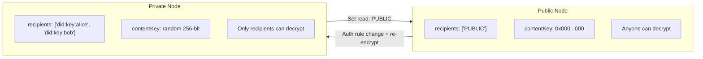
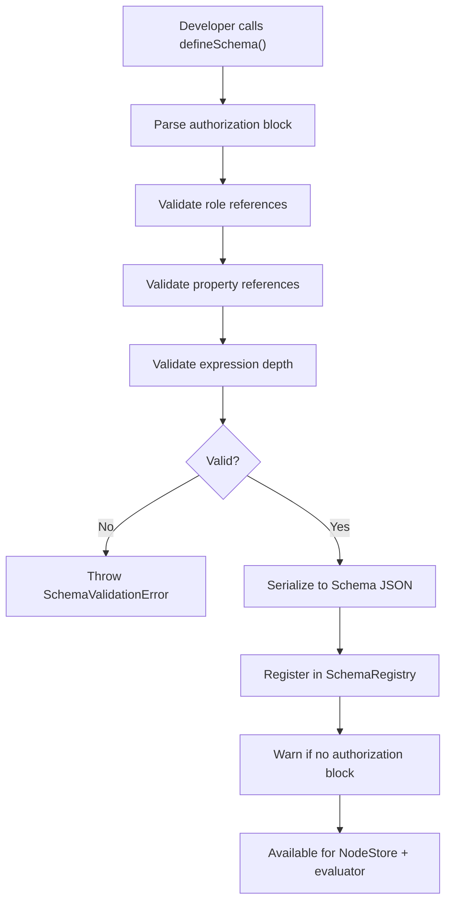

# 02: Schema Authorization Model

> Extend `defineSchema()` with a typed authorization block, define public node semantics, add schema version migration support for auth rules, and build the recipient computation pipeline.

**Duration:** 3 days
**Dependencies:** [01-types-encryption-and-key-resolution.md](./01-types-encryption-and-key-resolution.md)
**Packages:** `packages/data/src/schema`
**Review issues addressed:** B4 (public nodes), B5 (schema version migration), E2 (legacy schema warning)

## Why This Step Exists

The schema is the single source of truth for authorization policy. This step wires the types from Step 01 into `defineSchema()` so developers get compile-time validation, IDE autocomplete, and runtime schema-time checks.

**New in V2:** Concrete public node semantics, schema version migration for auth rules, and legacy schema warnings.

## Implementation

### 1. Extend `DefineSchemaOptions`

```typescript
export interface DefineSchemaOptions<
  P extends Record<string, PropertyBuilder>,
  A extends AuthorizationDefinition = AuthorizationDefinition
> {
  name: string
  namespace: `xnet://${string}/`
  version?: string
  migrateFrom?: SchemaIRI
  properties: P
  extends?: DefinedSchema
  document?: DocumentType
  authorization?: A
}
```

### 2. Extend Serialized `Schema` Type

```typescript
export interface Schema {
  '@id': SchemaIRI
  '@type': 'xnet://xnet.fyi/Schema'
  name: string
  namespace: string
  version: string
  properties: PropertyDefinition[]
  extends?: SchemaIRI
  document?: DocumentType
  authorization?: SerializedAuthorization
}

export interface SerializedAuthorization {
  roles: Record<string, SerializedRoleResolver>
  actions: Record<string, SerializedAuthExpression>
  publicProps?: string[]
  fieldRules?: Record<string, { allow: SerializedAuthExpression; deny?: SerializedAuthExpression }>
  nodePolicy?: { mode: 'extend'; allow: string[] }
}
```

### 3. Update `defineSchema()` Implementation

```typescript
export function defineSchema<P extends Record<string, PropertyBuilder>>(
  options: DefineSchemaOptions<P>
): DefinedSchema<P> {
  // ... existing property processing ...

  // Validate authorization if present
  if (options.authorization) {
    const authResult = validateAuthorization(options.authorization, propertyMap)
    if (!authResult.valid) {
      throw new SchemaValidationError(
        `Invalid authorization in schema '${options.name}': ` +
          authResult.errors.map((e) => e.message).join(', '),
        authResult.errors
      )
    }
  }

  const schema: Schema = {
    '@id': schemaId,
    '@type': 'xnet://xnet.fyi/Schema',
    name: options.name,
    namespace: options.namespace,
    version: options.version ?? DEFAULT_SCHEMA_VERSION,
    properties: propertyDefs,
    extends: options.extends?.schema['@id'],
    document: options.document,
    authorization: options.authorization ? serializeAuthorization(options.authorization) : undefined
  }

  // ... rest of defineSchema ...
}
```

### 4. Public Node Semantics

**Problem from review (B4):** V1 said "special handling: don't encrypt, or use a well-known key" but didn't specify which.

**Decision:** Public nodes use a **well-known null content key** (32 zero bytes) and a `PUBLIC` sentinel in the recipients list.

```typescript
/**
 * Well-known content key for public nodes.
 * All zeros — anyone can "decrypt" because the key is public knowledge.
 *
 * This preserves the same code path (encrypt/decrypt) for all nodes,
 * simplifying the implementation. The security boundary is enforced by
 * the recipients list, not the key secrecy.
 */
export const PUBLIC_CONTENT_KEY = new Uint8Array(32) // all zeros

/**
 * Sentinel DID in recipients list indicating public access.
 * Hub recognizes this and serves the node to any authenticated user.
 */
export const PUBLIC_RECIPIENT = 'PUBLIC' as DID

/**
 * Check if a node's read action allows public access.
 */
export function hasPublicAccess(readExpr: AuthExpression): boolean {
  if (readExpr._tag === 'public') return true
  if (readExpr._tag === 'or') return readExpr.exprs.some(hasPublicAccess)
  return false
}
```

**Public -> Private transition:** When a schema's authorization changes from `PUBLIC` read to restricted read:

1. Generate a real content key (replace the null key)
2. Compute recipients from the new roles
3. Wrap the real key for each recipient
4. Re-encrypt all content with the real key
5. Update the recipients list (remove `PUBLIC` sentinel)

> **Failure mode (V2 review A6):** If key rotation fails midway during a public→private transition (e.g., crash after generating new key but before re-encrypting), the node is left "encrypted" with the all-zeros `PUBLIC_CONTENT_KEY` — effectively still public. The `AuthMigrator` (Step 08) handles this by checking for the null key and retrying the transition. Implementations should treat `PUBLIC_CONTENT_KEY` as a signal that encryption is incomplete, not that the node is intentionally public (check the schema's authorization block for the source of truth).



### 5. Recipient Computation Pipeline

```typescript
/**
 * Compute the set of DIDs that should be able to decrypt a node.
 * Called on create, update (if auth-relevant), grant, and revoke.
 */
export async function computeRecipients(
  schema: Schema,
  node: Node,
  store: NodeStoreReader,
  grantIndex: GrantIndex
): Promise<DID[]> {
  const recipients = new Set<DID>()

  // 1. Owner always has access
  recipients.add(node.createdBy)

  if (!schema.authorization) {
    // Legacy schema: only owner
    return [...recipients]
  }

  const auth = deserializeAuthorization(schema.authorization)

  // 2. Check for public access
  const readExpr = auth.actions['read']
  if (readExpr && hasPublicAccess(readExpr)) {
    return [PUBLIC_RECIPIENT]
  }

  // 3. For each role that has 'read' access, resolve members
  if (readExpr) {
    const readRoles = extractRoleRefs(readExpr)
    for (const roleName of readRoles) {
      const resolver = auth.roles[roleName]
      if (!resolver) continue
      const members = await resolveRoleMembers(resolver, node, store)
      for (const did of members) {
        recipients.add(did)
      }
    }
  }

  // 4. Add grantees from active grants via GrantIndex
  // FIXED (V2 review A1): NodeStore has no query() method.
  // GrantIndex provides O(1) lookup maintained via store.subscribe().
  const grants = grantIndex.findGrantsForResource(node.id)
  for (const grant of grants) {
    const actions = JSON.parse(grant.properties.actions as string) as string[]
    if (actions.includes('read') || actions.includes('write')) {
      recipients.add(grant.properties.grantee as DID)
    }
  }

  return [...recipients]
}
```

### 6. Authorization Mode for Legacy Schemas

```typescript
export type AuthMode = 'legacy' | 'compat' | 'enforce'

/**
 * Determine the authorization mode for a schema.
 * - legacy: no authorization block, owner-only access
 * - compat: authorization block present, warn on would-deny
 * - enforce: authorization block required, deny by default
 */
export function getAuthMode(schema: Schema): AuthMode {
  if (!schema.authorization) return 'legacy'
  return 'enforce'
}

/**
 * Emit warning for schemas without authorization block.
 * Called during NodeStore initialization for each registered schema.
 *
 * NEW in V2 (addresses review E2):
 * Developers who forget the authorization block get a visible warning
 * rather than silent unencrypted data flow.
 */
export function warnLegacySchema(schema: Schema): void {
  if (!schema.authorization) {
    console.warn(
      `[xnet:auth] Schema '${schema.name}' has no authorization block — ` +
        `data will be unencrypted and accessible to all peers. ` +
        `Add an 'authorization' block to enable encryption and access control.`
    )
  }
}
```

### 7. Schema Version Migration for Auth Rules

**Problem from review (B5):** What happens when `TaskSchema@1.0.0` allows editors to delete, but `TaskSchema@2.0.0` revokes that? The plan now explicitly addresses this.

```typescript
/**
 * When a schema's authorization block changes across versions,
 * the lens migration system should trigger recipient recomputation.
 *
 * Called by the schema migration pipeline when migrating a node
 * from an old schema version to a new one.
 */
export async function handleAuthMigration(
  oldSchema: Schema,
  newSchema: Schema,
  node: Node,
  store: NodeStoreWriter
): Promise<void> {
  const oldAuth = oldSchema.authorization
  const newAuth = newSchema.authorization

  // Case 1: No auth -> auth (encrypting previously unencrypted data)
  if (!oldAuth && newAuth) {
    await encryptExistingNode(node, newSchema, store)
    return
  }

  // Case 2: Auth -> no auth (should not happen in practice, warn)
  if (oldAuth && !newAuth) {
    console.warn(
      `[xnet:auth] Schema '${newSchema.name}' removed authorization block. ` +
        `Existing nodes remain encrypted until manually decrypted.`
    )
    return
  }

  // Case 3: Auth changed -> recompute recipients
  if (oldAuth && newAuth) {
    const oldRecipients = await computeRecipients(oldSchema, node, store)
    const newRecipients = await computeRecipients(newSchema, node, store)

    const recipientsChanged =
      oldRecipients.length !== newRecipients.length ||
      !oldRecipients.every((r) => newRecipients.includes(r))

    if (recipientsChanged) {
      // Recipients changed -> rotate content key + re-encrypt
      await rotateContentKeyForNode(node, newRecipients, store)
    }
  }
}
```

### 8. Permission Presets

Common authorization patterns as reusable factories:

```typescript
export const presets = {
  /** Only the creator can access */
  private: () => ({
    roles: { owner: role.creator() },
    actions: {
      read: allow('owner'),
      write: allow('owner'),
      delete: allow('owner'),
      share: allow('owner')
    }
  }),

  /** Anyone can read, only creator can write */
  publicRead: () => ({
    roles: { owner: role.creator() },
    actions: {
      read: PUBLIC,
      write: allow('owner'),
      delete: allow('owner'),
      share: allow('owner')
    }
  }),

  /** Collaborative with relation-based inheritance */
  collaborative: (parentRelation: string) => ({
    roles: {
      owner: role.creator(),
      admin: role.relation(parentRelation, 'admin'),
      editor: role.relation(parentRelation, 'editor'),
      viewer: role.relation(parentRelation, 'viewer')
    },
    actions: {
      read: allow('viewer', 'editor', 'admin', 'owner'),
      write: allow('editor', 'admin', 'owner'),
      delete: allow('admin', 'owner'),
      share: allow('admin', 'owner')
    }
  }),

  /** Anyone authenticated can read/write */
  open: () => ({
    roles: { owner: role.creator() },
    actions: {
      read: AUTHENTICATED,
      write: AUTHENTICATED,
      delete: allow('owner'),
      share: allow('owner')
    }
  })
}
```

## Schema Authorization Flow



## Tests

- `defineSchema` with valid authorization block produces correct serialized output.
- `defineSchema` with invalid role reference throws `SchemaValidationError`.
- `defineSchema` with invalid property reference in role throws error.
- `defineSchema` without authorization block works (legacy mode).
- `computeRecipients` returns owner for legacy schemas.
- `computeRecipients` returns `[PUBLIC_RECIPIENT]` for public read schemas.
- `computeRecipients` returns all role members for schemas with authorization.
- `computeRecipients` includes grantees from active grants.
- `hasPublicAccess` detects `PUBLIC` in nested `or()` expressions.
- `handleAuthMigration` triggers re-encryption when auth rules change across versions.
- `handleAuthMigration` encrypts previously unencrypted nodes when auth block is added.
- `warnLegacySchema` emits console warning for schemas without auth block.
- Preset factories produce valid authorization blocks.
- Serialization round-trip: `serialize -> deserialize` produces equivalent AST.

## Checklist

- [ ] `DefineSchemaOptions` extended with `authorization` field.
- [ ] `Schema` type extended with serialized authorization.
- [ ] `defineSchema()` validates authorization at schema creation time.
- [ ] `serializeAuthorization` / `deserializeAuthorization` implemented.
- [ ] `PUBLIC_CONTENT_KEY` and `PUBLIC_RECIPIENT` constants defined.
- [ ] `hasPublicAccess()` detects public read expressions.
- [ ] `computeRecipients` pipeline implemented with public node support.
- [ ] `getAuthMode` for legacy/compat/enforce behavior.
- [ ] `warnLegacySchema` emits console warning for schemas without auth block.
- [ ] `handleAuthMigration` handles auth rule changes across schema versions.
- [ ] Permission presets (`private`, `publicRead`, `collaborative`, `open`) implemented.
- [ ] Schema validation produces deterministic error codes.
- [ ] Tests cover valid, invalid, legacy, public, and migration paths.

---

[Back to README](./README.md) | [Previous: Types & Encryption](./01-types-encryption-and-key-resolution.md) | [Next: Authorization Engine ->](./03-authorization-engine.md)
