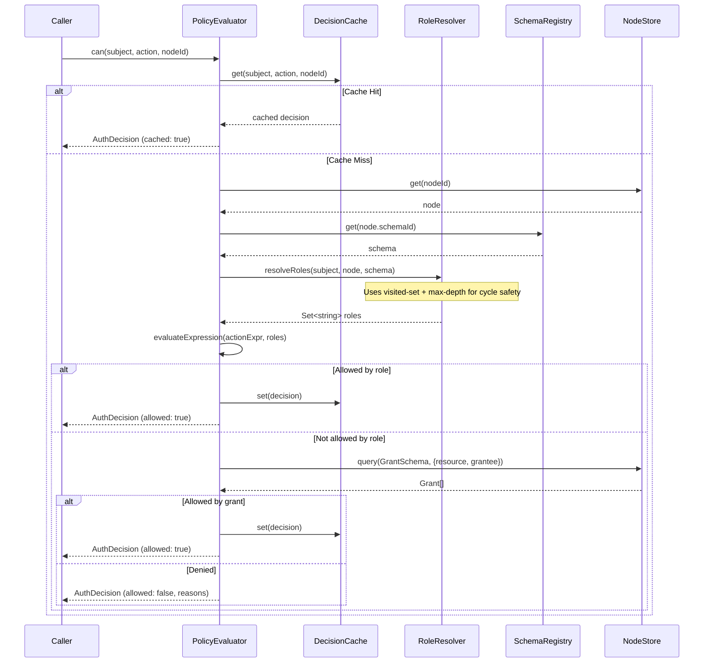

# 03: Authorization Engine

> Build the `PolicyEvaluator` that resolves roles, evaluates expressions, checks grants, and produces deterministic `AuthDecision` results with structured traces — now with visited-set cycle detection and correct API references.

**Duration:** 5 days
**Dependencies:** [02-schema-authorization-model.md](./02-schema-authorization-model.md)
**Packages:** `packages/data/src/auth`
**Review issues addressed:** B9 (last admin protection, circular groups), C1 (API mismatches), C2 (existing code)
**V2 review fixes:** A1 (GrantIndex replaces store.query()), A4 (async schemaRegistry.get())

## Why This Step Exists

The evaluator is the heart of the authorization system. It takes a subject (DID), action, and resource (node), resolves the subject's roles from schema policy and node data, evaluates the action expression, checks grants, and returns a deterministic decision with an explainable trace.

**New in V2:** Visited-set cycle detection (supplementing max-depth), correct API references to `schemaRegistry.get()` instead of `store.get(schemaId)`, and explicit supersession of `@xnet/core/permissions.ts`'s `PermissionEvaluator` interface.

## Responsibilities

1. **Role Resolution** — Determine what roles a DID holds for a given node, with cycle detection.
2. **Expression Evaluation** — Evaluate the action's `AuthExpression` against resolved roles.
3. **Grant Checking** — Check if any active Grant node authorizes the action.
4. **Node Policy** — Apply node-level deny rules if present.
5. **Decision Caching** — Cache decisions with event-driven invalidation.
6. **Trace Generation** — Produce structured traces for the `explain()` API.
7. **Grant Indexing** — Maintain an in-memory index of active grants for O(1) lookup.

## Grant Index

**Why this exists (V2 review fix A1):** `NodeStore` does not have a `query()` method. Queries with filters live in the separate `@xnet/query` package, which operates at a higher level. The `PolicyEvaluator` needs fast grant lookups in its hot path, so we maintain a dedicated in-memory index built from `store.subscribe()` events.

```typescript
/**
 * In-memory index of active grants, maintained via store.subscribe().
 *
 * Provides O(1) lookup by (resource, grantee) — critical for the
 * PolicyEvaluator.can() hot path. NodeStore.list() would be O(n) on all
 * grants; the separate @xnet/query package is too high-level for use
 * inside the data layer.
 *
 * The index is populated on construction by listing all Grant nodes,
 * then kept in sync via store.subscribe() events.
 */
export class GrantIndex {
  /** resource -> grantee -> Grant[] */
  private byResourceAndGrantee = new Map<string, Map<DID, GrantNode[]>>()
  /** resource -> Grant[] (all grants for a resource) */
  private byResource = new Map<string, GrantNode[]>()
  private unsubscribe: (() => void) | null = null

  constructor(private store: NodeStoreReader) {}

  /**
   * Initialize the index by listing all existing Grant nodes.
   * Must be called once before use.
   */
  async initialize(): Promise<void> {
    const allGrants = await this.store.list({ schema: 'xnet://xnet.fyi/Grant' })
    for (const grant of allGrants) {
      this.indexGrant(grant as GrantNode)
    }

    // Stay in sync via store.subscribe()
    this.unsubscribe = this.store.subscribe((event) => {
      if (event.node?.schemaId !== 'xnet://xnet.fyi/Grant') return

      if (event.node.deleted) {
        this.removeGrant(event.node.id)
      } else {
        this.removeGrant(event.node.id) // Remove old entry
        this.indexGrant(event.node as GrantNode) // Re-index
      }
    })
  }

  /** Find active grants for a resource + grantee */
  findGrants(resource: string, grantee: DID): GrantNode[] {
    const byGrantee = this.byResourceAndGrantee.get(resource)
    if (!byGrantee) return []
    return (byGrantee.get(grantee) ?? []).filter(isGrantActive)
  }

  /** Find all active grants for a resource */
  findGrantsForResource(resource: string): GrantNode[] {
    return (this.byResource.get(resource) ?? []).filter(isGrantActive)
  }

  /** Find all active grants where grantee matches */
  findGrantsForGrantee(grantee: DID): GrantNode[] {
    const results: GrantNode[] = []
    for (const byGrantee of this.byResourceAndGrantee.values()) {
      const grants = byGrantee.get(grantee)
      if (grants) results.push(...grants.filter(isGrantActive))
    }
    return results
  }

  /** Find all grants (active or not) for a resource — used by revocation checks */
  findAllGrantsForResource(resource: string): GrantNode[] {
    return this.byResource.get(resource) ?? []
  }

  dispose(): void {
    this.unsubscribe?.()
    this.byResourceAndGrantee.clear()
    this.byResource.clear()
  }

  private indexGrant(grant: GrantNode): void {
    const resource = grant.properties.resource as string
    const grantee = grant.properties.grantee as DID

    // Index by resource + grantee
    if (!this.byResourceAndGrantee.has(resource)) {
      this.byResourceAndGrantee.set(resource, new Map())
    }
    const byGrantee = this.byResourceAndGrantee.get(resource)!
    if (!byGrantee.has(grantee)) byGrantee.set(grantee, [])
    byGrantee.get(grantee)!.push(grant)

    // Index by resource
    if (!this.byResource.has(resource)) this.byResource.set(resource, [])
    this.byResource.get(resource)!.push(grant)
  }

  private removeGrant(grantId: string): void {
    for (const [resource, byGrantee] of this.byResourceAndGrantee) {
      for (const [grantee, grants] of byGrantee) {
        const idx = grants.findIndex((g) => g.id === grantId)
        if (idx !== -1) {
          grants.splice(idx, 1)
          if (grants.length === 0) byGrantee.delete(grantee)
          break
        }
      }
      if (byGrantee.size === 0) this.byResourceAndGrantee.delete(resource)
    }

    for (const [resource, grants] of this.byResource) {
      const idx = grants.findIndex((g) => g.id === grantId)
      if (idx !== -1) {
        grants.splice(idx, 1)
        if (grants.length === 0) this.byResource.delete(resource)
        break
      }
    }
  }
}
```

## Implementation

### 1. PolicyEvaluator Interface

This **supersedes** the `PermissionEvaluator` interface in `@xnet/core/permissions.ts` which was defined but never implemented:

```typescript
export interface PolicyEvaluator {
  /** Check if subject can perform action on resource */
  can(input: AuthCheckInput): Promise<AuthDecision>

  /** Check with full trace for debugging */
  explain(input: AuthCheckInput): Promise<AuthTrace>

  /** Invalidate cached decisions for a resource */
  invalidate(nodeId: string): void

  /** Invalidate all cached decisions for a subject */
  invalidateSubject(did: DID): void
}

export interface AuthCheckInput {
  subject: DID
  action: AuthAction
  nodeId: string
  /** Optional: pre-loaded node to avoid re-fetching */
  node?: Node
  /** Optional: patch for field-level checks on update */
  patch?: Record<string, unknown>
}
```

### 2. Role Resolution with Visited-Set Cycle Detection

**Improvement over V1 (addresses B9):** The role resolver now uses both max-depth AND a visited-set to handle circular group membership (Group A contains Group B, Group B contains Group A).

```typescript
export class DefaultRoleResolver {
  constructor(
    private store: NodeStoreReader,
    private schemaRegistry: SchemaRegistry,
    private maxDepth: number = 3,
    private maxNodes: number = 100
  ) {}

  async resolveRoles(did: DID, node: Node, schema: Schema): Promise<Set<string>> {
    const roles = new Set<string>()
    const auth = deserializeAuthorization(schema.authorization!)

    for (const [roleName, resolver] of Object.entries(auth.roles)) {
      // Each role check gets its own visited set
      const visited = new Set<string>()
      const hasRole = await this.checkRole(did, resolver, node, 0, visited)
      if (hasRole) roles.add(roleName)
    }

    return roles
  }

  /**
   * Resolve all DIDs that hold a specific role for a node.
   * Used by computeRecipients() to find who should get the content key.
   */
  async resolveRoleMembers(resolver: RoleResolverDef, node: Node, schema: Schema): Promise<DID[]> {
    switch (resolver._tag) {
      case 'creator':
        return [node.createdBy]

      case 'property': {
        const value = node.properties[resolver.propertyName]
        if (!value) return []
        if (Array.isArray(value)) return value.filter((v): v is DID => typeof v === 'string')
        return typeof value === 'string' ? [value as DID] : []
      }

      case 'relation': {
        const targetId = node.properties[resolver.relationName]
        if (!targetId || typeof targetId !== 'string') return []

        const targetNode = await this.store.get(targetId)
        if (!targetNode) return []

        // FIXED (V2 review A4): schemaRegistry.get() is async
        const targetSchema = await this.schemaRegistry.get(targetNode.schemaId)
        if (!targetSchema?.authorization) return []

        const targetAuth = deserializeAuthorization(targetSchema.authorization)
        const targetResolver = targetAuth.roles[resolver.targetRole]
        if (!targetResolver) return []

        return this.resolveRoleMembers(targetResolver, targetNode, targetSchema)
      }
    }
  }

  private async checkRole(
    did: DID,
    resolver: RoleResolverDef,
    node: Node,
    depth: number,
    visited: Set<string>
  ): Promise<boolean> {
    // Safety: depth limit
    if (depth > this.maxDepth) return false
    // Safety: total nodes visited limit
    if (visited.size >= this.maxNodes) return false
    // Safety: cycle detection via visited-set
    if (visited.has(node.id)) return false
    visited.add(node.id)

    switch (resolver._tag) {
      case 'creator':
        return did === node.createdBy

      case 'property': {
        const value = node.properties[resolver.propertyName]
        if (Array.isArray(value)) return value.includes(did)
        return value === did
      }

      case 'relation': {
        const targetId = node.properties[resolver.relationName]
        if (!targetId || typeof targetId !== 'string') return false

        const targetNode = await this.store.get(targetId)
        if (!targetNode) return false

        // FIXED (V2 review A4): schemaRegistry.get() is async
        const targetSchema = await this.schemaRegistry.get(targetNode.schemaId)
        if (!targetSchema?.authorization) return false

        const targetAuth = deserializeAuthorization(targetSchema.authorization)
        const targetResolver = targetAuth.roles[resolver.targetRole]
        if (!targetResolver) return false

        return this.checkRole(did, targetResolver, targetNode, depth + 1, visited)
      }
    }
  }
}
```

### 3. Expression Evaluation

Pure function — no side effects, deterministic:

```typescript
export function evaluateExpression(
  expr: AuthExpression,
  roles: Set<string>,
  isAuthenticated: boolean
): boolean {
  switch (expr._tag) {
    case 'allow':
      return expr.roles.some((r) => roles.has(r))

    case 'deny':
      // Deny returns true if the user HAS the denied role
      return expr.roles.some((r) => roles.has(r))

    case 'and':
      return expr.exprs.every((e) => evaluateExpression(e, roles, isAuthenticated))

    case 'or':
      return expr.exprs.some((e) => evaluateExpression(e, roles, isAuthenticated))

    case 'not':
      return !evaluateExpression(expr.expr, roles, isAuthenticated)

    case 'roleRef':
      return roles.has(expr.role)

    case 'public':
      return true

    case 'authenticated':
      return isAuthenticated
  }
}
```

### 4. Full Evaluation Pipeline

```typescript
export class DefaultPolicyEvaluator implements PolicyEvaluator {
  private cache: DecisionCache
  private roleResolver: DefaultRoleResolver
  private store: NodeStoreReader
  private schemaRegistry: SchemaRegistry

  private grantIndex: GrantIndex

  constructor(options: {
    store: NodeStoreReader
    schemaRegistry: SchemaRegistry
    grantIndex: GrantIndex
    maxDepth?: number
    maxNodes?: number
    cacheTTL?: number
    cacheMaxSize?: number
  }) {
    this.store = options.store
    this.schemaRegistry = options.schemaRegistry
    this.grantIndex = options.grantIndex
    this.roleResolver = new DefaultRoleResolver(
      options.store,
      options.schemaRegistry,
      options.maxDepth ?? 3,
      options.maxNodes ?? 100
    )
    this.cache = new DecisionCache(options.cacheTTL ?? 30_000, options.cacheMaxSize ?? 10_000)
  }

  async can(input: AuthCheckInput): Promise<AuthDecision> {
    const start = performance.now()

    // 1. Check cache
    const cached = this.cache.get(input.subject, input.action, input.nodeId)
    if (cached) return { ...cached, cached: true, duration: performance.now() - start }

    // 2. Load node and schema
    const node = input.node ?? (await this.store.get(input.nodeId))
    if (!node) return this.deny(input, ['DENY_NOT_AUTHENTICATED'], start)

    // FIXED (V2 review A4): schemaRegistry.get() is async
    const schema = await this.schemaRegistry.get(node.schemaId)
    if (!schema) return this.deny(input, ['DENY_NOT_AUTHENTICATED'], start)

    const authMode = getAuthMode(schema)

    // 3. Legacy mode: owner-only
    if (authMode === 'legacy') {
      const allowed = node.createdBy === input.subject
      return this.decision(input, allowed, allowed ? ['owner'] : [], start)
    }

    const auth = deserializeAuthorization(schema.authorization!)

    // 4. Check node-level explicit deny (if node has deny metadata)

    // 5. Resolve roles
    const roles = await this.roleResolver.resolveRoles(input.subject, node, schema)

    // 6. Evaluate action expression
    const actionExpr = auth.actions[input.action]
    if (!actionExpr) {
      return this.deny(input, ['DENY_NO_ROLE_MATCH'], start)
    }

    // Check deny expressions first (deny always wins)
    if (auth.actions[`deny_${input.action}`]) {
      const denyExpr = auth.actions[`deny_${input.action}`]
      if (evaluateExpression(denyExpr, roles, !!input.subject)) {
        return this.deny(input, ['DENY_NODE_POLICY'], start)
      }
    }

    const allowedByRole = evaluateExpression(actionExpr, roles, !!input.subject)
    if (allowedByRole) {
      const decision = this.decision(input, true, [...roles], start)
      this.cache.set(input.subject, input.action, input.nodeId, decision)
      return decision
    }

    // 7. Check Grant nodes via GrantIndex (FIXED: V2 review A1)
    // GrantIndex provides O(1) lookup maintained via store.subscribe().
    // NodeStore does not have a query() method — queries live in @xnet/query.
    const grants = this.grantIndex.findGrants(input.nodeId, input.subject)

    for (const grant of grants) {
      // isGrantActive() already checks revokedAt and expiresAt
      const actions = JSON.parse(grant.properties.actions as string) as string[]
      if (actions.includes(input.action)) {
        const decision = this.decision(input, true, [...roles], start, [grant.id])
        this.cache.set(input.subject, input.action, input.nodeId, decision)
        return decision
      }
    }

    // 8. Deny with helpful reason
    const reason: AuthDenyReason[] =
      roles.size > 0
        ? ['DENY_NO_ROLE_MATCH'] // Has roles but not the right ones
        : ['DENY_NO_ROLE_MATCH', 'DENY_NO_GRANT'] // No roles at all
    return this.deny(input, reason, start)
  }

  async explain(input: AuthCheckInput): Promise<AuthTrace> {
    const steps: AuthTraceStep[] = []
    const start = performance.now()

    // Re-implement can() but record each step
    const node = input.node ?? (await this.store.get(input.nodeId))
    // FIXED (V2 review A4): schemaRegistry.get() is async
    const schema = node ? await this.schemaRegistry.get(node.schemaId) : null

    // Step 1: Node deny check
    const denyStart = performance.now()
    steps.push({
      phase: 'node-deny',
      input: { nodeId: input.nodeId },
      output: { denied: false },
      duration: performance.now() - denyStart
    })

    // Step 2: Role resolution
    if (node && schema?.authorization) {
      const roleStart = performance.now()
      const roles = await this.roleResolver.resolveRoles(input.subject, node, schema)
      steps.push({
        phase: 'role-resolve',
        input: { did: input.subject, nodeId: input.nodeId },
        output: { roles: [...roles] },
        duration: performance.now() - roleStart
      })

      // Step 3: Schema eval
      const auth = deserializeAuthorization(schema.authorization)
      const evalStart = performance.now()
      const expr = auth.actions[input.action]
      const allowed = expr ? evaluateExpression(expr, roles, !!input.subject) : false
      steps.push({
        phase: 'schema-eval',
        input: { action: input.action, expression: JSON.stringify(expr) },
        output: {
          allowed,
          matchedRoles: [...roles].filter((r) => (expr ? extractRoleRefs(expr).includes(r) : false))
        },
        duration: performance.now() - evalStart
      })

      // Step 4: Grant check (if not allowed by role)
      if (!allowed) {
        const grantStart = performance.now()
        // FIXED (V2 review A1): Use GrantIndex instead of store.query()
        const grants = this.grantIndex.findGrants(input.nodeId, input.subject)
        steps.push({
          phase: 'grant-check',
          input: { grantee: input.subject, resource: input.nodeId },
          output: { grantsFound: grants.length, activeGrants: grants.map((g) => g.id) },
          duration: performance.now() - grantStart
        })
      }
    }

    const decision = await this.can(input)
    return { ...decision, steps, duration: performance.now() - start }
  }

  invalidate(nodeId: string): void {
    this.cache.invalidateNode(nodeId)
  }

  invalidateSubject(did: DID): void {
    this.cache.invalidateSubject(did)
  }

  private deny(input: AuthCheckInput, reasons: AuthDenyReason[], start: number): AuthDecision {
    return {
      allowed: false,
      action: input.action,
      subject: input.subject,
      resource: input.nodeId,
      roles: [],
      grants: [],
      reasons,
      cached: false,
      evaluatedAt: Date.now(),
      duration: performance.now() - start
    }
  }

  private decision(
    input: AuthCheckInput,
    allowed: boolean,
    roles: string[],
    start: number,
    grants: string[] = []
  ): AuthDecision {
    return {
      allowed,
      action: input.action,
      subject: input.subject,
      resource: input.nodeId,
      roles,
      grants,
      reasons: [],
      cached: false,
      evaluatedAt: Date.now(),
      duration: performance.now() - start
    }
  }
}
```

### 5. Decision Cache

```typescript
export class DecisionCache {
  private cache = new Map<string, AuthDecision>()

  constructor(
    private defaultTTL: number = 30_000,
    private maxSize: number = 10_000
  ) {}

  private key(subject: DID, action: string, nodeId: string): string {
    return `${subject}:${action}:${nodeId}`
  }

  get(subject: DID, action: string, nodeId: string): AuthDecision | null {
    const entry = this.cache.get(this.key(subject, action, nodeId))
    if (!entry) return null
    if (Date.now() - entry.evaluatedAt > this.defaultTTL) {
      this.cache.delete(this.key(subject, action, nodeId))
      return null
    }
    return entry
  }

  set(subject: DID, action: string, nodeId: string, decision: AuthDecision): void {
    if (this.cache.size >= this.maxSize) {
      const oldest = this.cache.keys().next().value
      if (oldest) this.cache.delete(oldest)
    }
    this.cache.set(this.key(subject, action, nodeId), decision)
  }

  invalidateNode(nodeId: string): void {
    for (const [key] of this.cache) {
      if (key.endsWith(`:${nodeId}`)) this.cache.delete(key)
    }
  }

  invalidateSubject(did: DID): void {
    for (const [key] of this.cache) {
      if (key.startsWith(`${did}:`)) this.cache.delete(key)
    }
  }

  clear(): void {
    this.cache.clear()
  }
}
```

## Evaluation Pipeline Diagram



## Tests

- Role resolution: creator role matches `createdBy`.
- Role resolution: property role matches DID in person property.
- Role resolution: relation role traverses to target node and checks role there.
- Role resolution: **cycle detection** terminates safely (A -> B -> A).
- Role resolution: depth limit (3) terminates safely.
- Role resolution: max-nodes limit (100) terminates safely.
- Role resolution: visited-set prevents re-visiting same node in different branches.
- Expression evaluation: `allow('a', 'b')` with roles `{a}` -> true.
- Expression evaluation: `and(allow('a'), allow('b'))` with roles `{a}` -> false.
- Expression evaluation: `not(allow('banned'))` with roles `{}` -> true.
- Expression evaluation: `PUBLIC` -> always true.
- Full pipeline: owner can always write their own node.
- Full pipeline: non-owner without role -> denied.
- Full pipeline: grantee with active grant -> allowed.
- Full pipeline: grantee with expired grant -> denied.
- Full pipeline: uses `await schemaRegistry.get()` (async, not `store.get(schemaId)`).
- GrantIndex: initializes from existing Grant nodes.
- GrantIndex: stays in sync via store.subscribe() events.
- GrantIndex: findGrants() returns only active grants.
- GrantIndex: findGrantsForResource() returns all active grants for a node.
- Cache: second call returns cached result.
- Cache: invalidation clears relevant entries.
- Explain: returns structured trace with all steps and correct phases.
- Explain: JSON-serializable output for AI agent consumption.
- Determinism: same inputs produce same output across runs.
- Deny reason message includes user's actual roles vs required roles.

## Checklist

- [x] `GrantIndex` implemented with O(1) lookup by (resource, grantee).
- [x] `GrantIndex` initialized from `store.list({ schema: GrantSchema.iri })`.
- [x] `GrantIndex` maintained via `store.subscribe()` event listener.
- [x] `PolicyEvaluator` interface defined (supersedes `@xnet/core` `PermissionEvaluator`).
- [x] `DefaultRoleResolver` with property, creator, and relation resolution.
- [x] **Visited-set** cycle detection in relation traversal (not just max-depth).
- [x] Depth limit (default 3) and node count limit (default 100).
- [x] `evaluateExpression` pure function for all AST node types.
- [x] `DefaultPolicyEvaluator` full pipeline implemented.
- [x] Uses `schemaRegistry.get(iri)` for schema lookup (correct API).
- [x] `explain()` returns structured `AuthTrace` with per-phase timing.
- [x] `DecisionCache` with TTL, LRU eviction, and event invalidation.
- [x] Field-level constraint checking for update patches.
- [x] Deny reasons include helpful context (user roles vs required roles).
- [x] All tests passing.

---

[Back to README](./README.md) | [Previous: Schema Authorization Model](./02-schema-authorization-model.md) | [Next: NodeStore Enforcement ->](./04-nodestore-enforcement.md)
