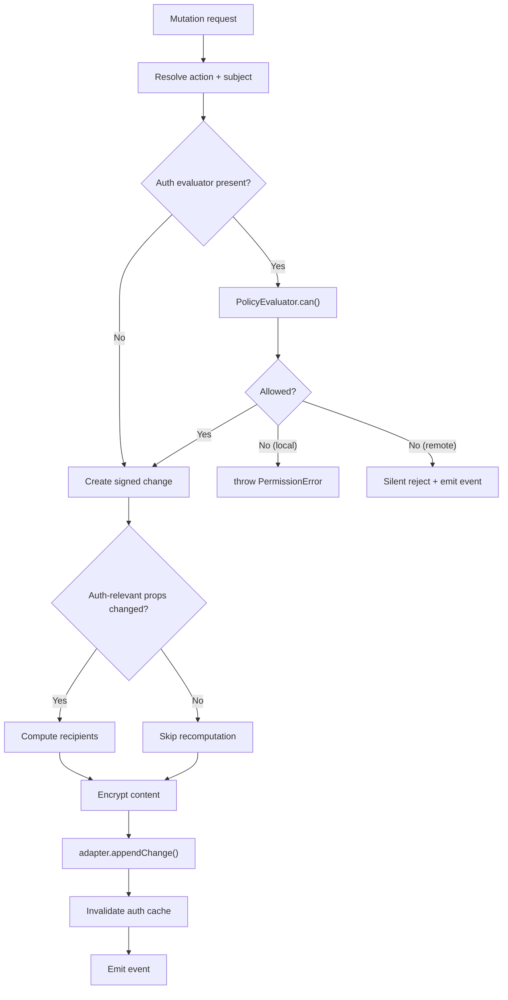

# 04: NodeStore Enforcement

> Wire authorization checks and transparent encryption into all NodeStore mutation paths — with correct API names, recipient recompute optimization, and documented failure modes.

**Duration:** 3 days
**Dependencies:** [03-authorization-engine.md](./03-authorization-engine.md)
**Packages:** `packages/data/src/store`
**Review issues addressed:** C1 (API mismatches: `appendChange` not `saveChange`), D2 (recipient recompute optimization), E1 (failure mode documentation), A3 (write-side trust model)

## Why This Step Exists

The NodeStore is the single gateway for all data mutations. Every `create`, `update`, `delete`, `restore`, and `applyRemoteChange` must pass through the authorization evaluator and produce encrypted envelopes. This step makes authorization and encryption invisible to application code.

**New in V2:** Corrected API names (`adapter.appendChange` not `saveChange`), smart recipient recomputation (skip when non-auth properties change), and documented failure modes.

## Implementation

### 1. Add Auth Dependencies to NodeStore

```typescript
export interface NodeStoreOptions {
  // ... existing fields ...

  /** Authorization evaluator (required for enforce mode) */
  authEvaluator?: PolicyEvaluator

  /** Public key resolver for encryption */
  publicKeyResolver?: PublicKeyResolver

  /** Content key cache for decryption */
  contentKeyCache?: ContentKeyCache

  /** Authorization mode override */
  authMode?: AuthMode
}
```

### 2. Enforce Local Mutation Paths

```typescript
class NodeStore {
  async create<S extends DefinedSchema>(
    schema: S,
    properties: InferCreateProps<S['_properties']>
  ): Promise<InferNode<S['_properties']>> {
    // 1. Auth check: can subject create nodes of this schema?
    if (this.authEvaluator) {
      const decision = await this.authEvaluator.can({
        subject: this.authorDID,
        action: 'write',
        nodeId: '', // New node, check schema-level
        node: { schemaId: schema.schema['@id'], createdBy: this.authorDID } as Node
      })
      if (!decision.allowed) {
        throw new PermissionError(decision)
      }
    }

    // 2. Create node (existing logic)
    const node = schema.create(properties, {
      id: createNodeId(),
      createdBy: this.authorDID
    })

    // 3. Compute recipients and encrypt
    if (this.publicKeyResolver && schema.schema.authorization) {
      const recipients = await computeRecipients(schema.schema, node, this)
      const envelope = await this.encryptNode(node, recipients)
      await this.storeEnvelope(envelope)
    }

    // 4. Create signed change and persist
    // CORRECTED: uses appendChange, not saveChange
    const change = await this.createSignedChange('create', node)
    await this.adapter.appendChange(change)

    return node
  }

  async update<S extends DefinedSchema>(
    schema: S,
    nodeId: string,
    patch: Partial<InferCreateProps<S['_properties']>>
  ): Promise<InferNode<S['_properties']>> {
    // 1. Auth check: can subject write this node?
    if (this.authEvaluator) {
      const decision = await this.authEvaluator.can({
        subject: this.authorDID,
        action: 'write',
        nodeId,
        patch
      })
      if (!decision.allowed) {
        throw new PermissionError(decision)
      }
    }

    // 2. Apply update (existing logic)
    const updated = await this.applyUpdate(schema, nodeId, patch)

    // 3. Recompute recipients ONLY if auth-relevant properties changed
    // OPTIMIZATION (addresses review D2): skip recomputation for non-auth changes
    if (this.shouldRecomputeRecipients(schema, patch)) {
      await this.recomputeAndUpdateRecipients(schema.schema, updated)
    }

    return updated
  }

  async remove(nodeId: string): Promise<void> {
    // 1. Auth check: can subject delete this node?
    if (this.authEvaluator) {
      const decision = await this.authEvaluator.can({
        subject: this.authorDID,
        action: 'delete',
        nodeId
      })
      if (!decision.allowed) {
        throw new PermissionError(decision)
      }
    }

    // 2. Soft delete (existing logic)
    await this.softDelete(nodeId)
  }
}
```

### 3. Smart Recipient Recomputation

**Optimization from review (D2):** Only recompute recipients when auth-relevant properties change. For most updates (title, status, description), the recipients set doesn't change.

```typescript
class NodeStore {
  /**
   * Determine if a property patch could change the recipients list.
   *
   * Auth-relevant properties are those referenced by role resolvers:
   * - creator role: never changes (createdBy is immutable)
   * - property role: the named person/person[] property
   * - relation role: the named relation property
   *
   * If the patch doesn't touch any of these, skip recomputation.
   */
  private shouldRecomputeRecipients(
    schema: DefinedSchema,
    patch: Record<string, unknown>
  ): boolean {
    if (!schema.schema.authorization) return false

    const auth = deserializeAuthorization(schema.schema.authorization)
    const authRelevantProps = new Set<string>()

    for (const resolver of Object.values(auth.roles)) {
      if (resolver._tag === 'property') {
        authRelevantProps.add(resolver.propertyName)
      } else if (resolver._tag === 'relation') {
        authRelevantProps.add(resolver.relationName)
      }
    }

    // Check if any patched property is auth-relevant
    return Object.keys(patch).some((key) => authRelevantProps.has(key))
  }
}
```

### 4. Enforce Remote Apply Path

```typescript
class NodeStore {
  async applyRemoteChange(change: SignedChange): Promise<void> {
    // 1. Cryptographic verification (existing)
    const verified = await this.verifyChange(change)
    if (!verified) {
      this.emit('change:rejected', { change, reason: 'invalid-signature' })
      return
    }

    // 2. Authorization check (SILENT rejection for remote — addresses E1)
    if (this.authEvaluator) {
      const action = this.inferActionFromChange(change)
      const decision = await this.authEvaluator.can({
        subject: change.authorDID,
        action,
        nodeId: change.payload.nodeId
      })

      if (!decision.allowed) {
        // SILENT: Don't throw, emit event for observability
        this.emit('change:rejected', {
          change,
          reason: 'unauthorized',
          decision
        })
        return
      }
    }

    // 3. Apply change (existing logic)
    await this.applyVerifiedChange(change)

    // 4. Invalidate auth cache for this node
    this.authEvaluator?.invalidate(change.payload.nodeId)
  }

  private inferActionFromChange(change: SignedChange): AuthAction {
    switch (change.payload.type) {
      case 'create':
        return 'write'
      case 'update':
        return 'write'
      case 'delete':
        return 'delete'
      case 'restore':
        return 'write'
      default:
        return 'write'
    }
  }
}
```

### 5. Transparent Encryption/Decryption

```typescript
class NodeStore {
  /** Encrypt a node for storage/sync */
  private async encryptNode(node: Node, recipients: DID[]): Promise<EncryptedEnvelope> {
    const publicKeys = await this.publicKeyResolver!.resolveBatch(recipients)
    const content = this.serializeNodeContent(node)

    return createEncryptedEnvelope(content, this.extractMetadata(node), publicKeys, this.signingKey)
  }

  /** Decrypt a node from an encrypted envelope */
  private async decryptNode(envelope: EncryptedEnvelope): Promise<Node> {
    let contentKey = this.contentKeyCache?.get(envelope.id)

    if (!contentKey) {
      const wrappedKey = envelope.encryptedKeys[this.authorDID]
      if (!wrappedKey) {
        throw new PermissionError({
          allowed: false,
          action: 'read',
          subject: this.authorDID,
          resource: envelope.id,
          roles: [],
          grants: [],
          reasons: ['DENY_NO_ROLE_MATCH'],
          cached: false,
          evaluatedAt: Date.now(),
          duration: 0
        })
      }

      contentKey = unwrapKey(wrappedKey, this.encryptionPrivateKey)
      this.contentKeyCache?.set(envelope.id, contentKey)
    }

    const plaintext = decryptWithNonce(envelope.ciphertext, envelope.nonce, contentKey)
    return this.deserializeNodeContent(plaintext, envelope)
  }
}
```

### 6. Transaction Batch Authorization

All-or-nothing semantics:

```typescript
class NodeStore {
  async transaction(ops: BatchOperation[]): Promise<void> {
    if (this.authEvaluator) {
      const checks = await Promise.all(
        ops.map((op) =>
          this.authEvaluator!.can({
            subject: this.authorDID,
            action: op.type === 'delete' ? 'delete' : 'write',
            nodeId: op.nodeId,
            patch: op.patch
          })
        )
      )

      const denied = checks.filter((c) => !c.allowed)
      if (denied.length > 0) {
        throw new PermissionError({
          allowed: false,
          action: 'write',
          subject: this.authorDID,
          resource: 'batch',
          roles: [],
          grants: [],
          reasons: ['DENY_NO_ROLE_MATCH'],
          cached: false,
          evaluatedAt: Date.now(),
          duration: 0
        })
      }
    }

    await this.applyBatch(ops)
  }
}
```

### 7. PermissionError

```typescript
export class PermissionError extends Error {
  readonly code = 'PERMISSION_DENIED'
  readonly action: AuthAction
  readonly nodeId: string
  readonly subject: DID
  readonly reasons: AuthDenyReason[]
  readonly roles: string[]
  readonly decision: AuthDecision

  constructor(decision: AuthDecision) {
    // Human-readable message with context
    const roleInfo =
      decision.roles.length > 0
        ? `You have roles [${decision.roles.join(', ')}]`
        : 'You have no roles'
    const actionInfo = `action '${decision.action}'`

    super(
      `Permission denied: ${roleInfo} but ${actionInfo} is not permitted. Reasons: ${decision.reasons.join(', ')}`
    )

    this.name = 'PermissionError'
    this.action = decision.action
    this.nodeId = decision.resource
    this.subject = decision.subject
    this.reasons = decision.reasons
    this.roles = decision.roles
    this.decision = decision
  }
}
```

## Mutation Flow



## Tests

- Local create: authorized user succeeds.
- Local create: unauthorized user throws `PermissionError`.
- Local update: editor can update.
- Local update: viewer cannot update.
- Local delete: admin can delete.
- Local delete: editor cannot delete.
- Remote apply: authorized change applied.
- Remote apply: unauthorized change **silently rejected** + event emitted.
- Transaction: all authorized -> all applied.
- Transaction: one denied -> none applied + `PermissionError`.
- Encryption: created node produces valid `EncryptedEnvelope`.
- Decryption: authorized recipient can decrypt.
- Decryption: unauthorized DID cannot decrypt (no wrapped key).
- Content key caching: second read uses cached key.
- **Recipient recomputation: title change does NOT trigger recomputation.**
- Recipient recomputation: editors change DOES trigger recomputation.
- Legacy mode: no auth evaluator -> no checks (backward compatible).
- PermissionError message includes user's roles and required action.
- Uses `adapter.appendChange()` (not `saveChange`).

## Checklist

- [x] `NodeStoreOptions` extended with auth dependencies.
- [x] `create` path guarded by `can()`.
- [x] `update` path guarded by `can()` with field-level patch.
- [x] `delete` path guarded by `can()`.
- [x] `applyRemoteChange` guarded after cryptographic verification — **silent rejection**.
- [x] Transparent encryption on write path.
- [x] Transparent decryption on read path.
- [x] Content key caching for repeated reads.
- [x] **Smart recipient recomputation** — skips when non-auth properties change.
- [x] Transaction batch uses all-or-nothing semantics.
- [x] `PermissionError` with human-readable message including roles context.
- [x] Auth cache invalidation on mutations.
- [x] Uses `adapter.appendChange()` (correct API).
- [x] All tests passing.

---

[Back to README](./README.md) | [Previous: Authorization Engine](./03-authorization-engine.md) | [Next: Grants, Delegation & Offline Policy ->](./05-grants-delegation-and-offline-policy.md)
