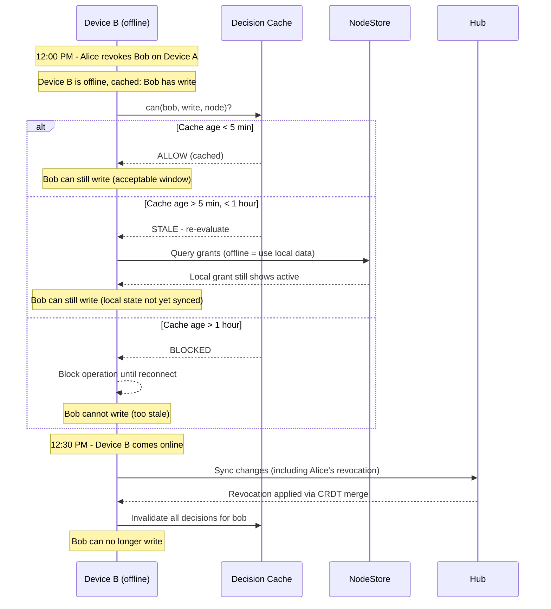
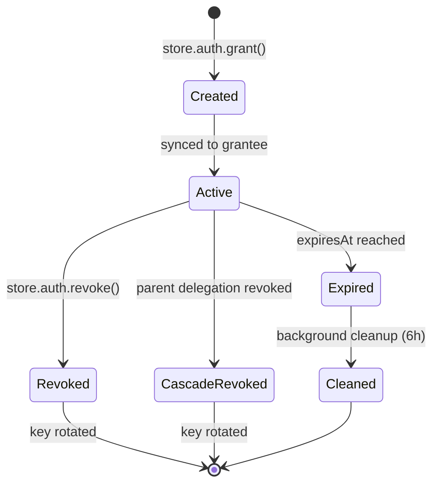
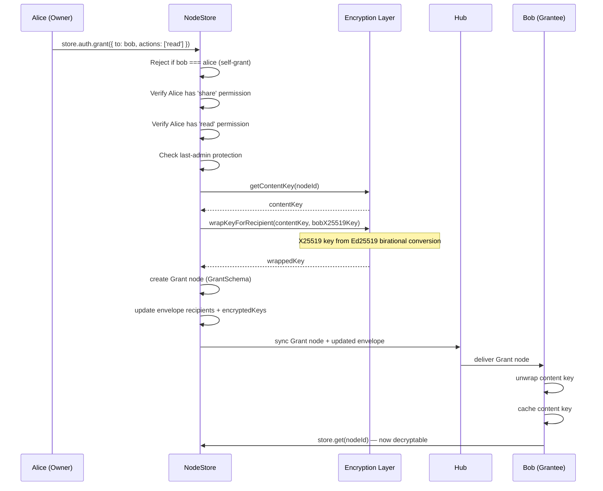

# 05: Grants, Delegation & Offline Policy

> Grants-as-nodes with UCAN delegation, explicit offline authorization policy, delegation chain limits, grant conflict semantics, last-admin protection, and grant expiration cleanup.

**Duration:** 6 days
**Dependencies:** [04-nodestore-enforcement.md](./04-nodestore-enforcement.md)
**Packages:** `packages/data`, `packages/identity`
**Review issues addressed:** A4 (offline policy), B7 (grant conflicts), B8 (delegation limits), B9 (last admin), C3 (sync integration), E5 (expiration cleanup)

## Why This Step Exists

Grants are how users share access. This is the most complex step because it bridges authorization policy, cryptographic key distribution, CRDT sync, and offline-first design.

**What V2 adds over V1:**

- Explicit offline authorization policy (cache TTL, revalidation strategy, max staleness)
- Delegation chain depth limits (max 4) and cascade revocation
- Grant conflict resolution semantics (revokedAt > 0 dominates)
- Last-admin protection (prevent unrecoverable permission loss)
- Grant expiration cleanup (background pruning)
- Explicit documentation that grants inherit ALL NodeStore sync properties
- Grant-specific rate limits and peer scoring

## Integration with Sync Infrastructure

Grants are regular nodes. This means they **automatically inherit** NodeStore's battle-tested sync stack:

| Capability          | Implementation                   | Inherited From |
| ------------------- | -------------------------------- | -------------- |
| Conflict resolution | Lamport LWW per field            | NodeStore      |
| Offline support     | Persistent queue, ordered replay | Offline queue  |
| Integrity           | Ed25519 signature, hash chain    | Sync layer     |
| Sync protocol       | CRDT merge, vector clocks        | NodeStore      |
| Peer validation     | Signature + schema verification  | Sync layer     |

**Grant operations ARE NodeStore operations:**

```typescript
// These are equivalent:
store.auth.grant({ to: bob, ... })
  → store.create(GrantSchema, { grantee: bob, ... })

store.auth.revoke({ grantId })
  → store.update(grantId, { revokedAt: Date.now() })
```

**New grant-specific considerations:**

- Grant rate limit: 10 grants/min per peer (prevent grant-flooding DOS)
- Grant peer penalty: unauthorized grant attempt = -20 peer score
- Self-grant prevention: reject grantee === grantor at creation time

## Implementation

### 1. Grant Schema

```typescript
export const GrantSchema = defineSchema({
  name: 'Grant',
  namespace: 'xnet://xnet.fyi/',
  properties: {
    issuer: person({ required: true }),
    grantee: person({ required: true }),
    resource: text({ required: true }),
    resourceSchema: text({ required: true }),
    actions: text({ required: true }), // JSON array: '["read","write"]'
    expiresAt: number(),
    revokedAt: number(),
    revokedBy: person(),
    ucanToken: text(),
    /** UCAN proof chain depth (0 = direct grant) */
    proofDepth: number()
  },
  authorization: {
    roles: {
      owner: role.creator(),
      issuer: role.property('issuer'),
      grantee: role.property('grantee')
    },
    actions: {
      read: allow('issuer', 'grantee', 'owner'),
      write: allow('issuer', 'owner'),
      delete: allow('issuer', 'owner'),
      share: allow('issuer', 'owner')
    }
  }
})
```

### 2. Offline Authorization Policy

**This is the critical new section that V1 was missing (addresses A4).**

```typescript
/**
 * Offline authorization policy.
 *
 * Controls how `can()` decisions behave when the device is offline
 * or the grant/revocation state may be stale.
 */
export interface OfflineAuthPolicy {
  /**
   * Cache TTL for can() decisions in eventual mode.
   * After this time, cached decisions are discarded and re-evaluated.
   * Default: 300_000 (5 minutes)
   */
  decisionCacheTTL: number

  /**
   * Max staleness before blocking operations.
   * If the last sync was more than this long ago AND we're online,
   * operations are blocked until we can re-validate.
   * Default: 3_600_000 (1 hour)
   */
  maxStaleness: number

  /**
   * Re-validation strategy on reconnect.
   *
   * - 'eager': Re-validate ALL cached decisions immediately on reconnect.
   *   Best security, worst performance. Use for high-security schemas.
   *
   * - 'lazy': Re-validate on next can() call per resource.
   *   Best performance, longest trust window. Use for low-risk schemas.
   *
   * - 'hybrid' (default): Background re-validate, emit events for changes.
   *   Good balance. Actively used resources re-validated first.
   */
  revalidation: 'eager' | 'lazy' | 'hybrid'

  /**
   * Allow grant/revoke operations while offline?
   * Default: true (they're node creates/updates, queued automatically)
   *
   * Note: Offline revocations may conflict with online grants.
   * NodeStore LWW resolves, but key rotation happens on reconnect.
   */
  allowOfflineGrants: boolean
}

export const DEFAULT_OFFLINE_POLICY: OfflineAuthPolicy = {
  decisionCacheTTL: 300_000, // 5 minutes
  maxStaleness: 3_600_000, // 1 hour
  revalidation: 'hybrid',
  allowOfflineGrants: true
}
```

**Offline scenario walkthrough:**



### 3. Recipients List Merge Conflict

**Known limitation (V2 review C1):** When two devices independently grant access to the same resource, each device computes a new recipients list. Since `recipients` is a scalar field in the `EncryptedEnvelope`, LWW applies — the device with the higher Lamport timestamp wins, and the other device's grant recipient may be temporarily missing from the list.

**Example:**

- Device A grants Bob → recipients: `[alice, bob]`, lamport: 100
- Device B grants Carol → recipients: `[alice, carol]`, lamport: 101
- LWW result: `[alice, carol]` — Bob's DID is missing until reconciliation

**Mitigation:** `computeRecipients()` is the source of truth. It recomputes recipients from roles + grants (via GrantIndex). The inconsistency self-heals when:

1. Any auth-relevant mutation triggers `computeRecipients()` (Step 04)
2. The periodic `RecipientReconciler` runs (see below)
3. A new grant/revoke triggers recipient recomputation

**During the window**, the hub may filter out a node for a user whose DID is missing from the recipients list, but the user's grant is still valid. The user will regain access once reconciliation runs.

```typescript
/**
 * Periodic reconciliation task that re-runs computeRecipients() for nodes
 * with recent grant changes, fixing any LWW-induced recipient list drift.
 *
 * Runs every 5 minutes (configurable). Lightweight: only checks nodes
 * that had grant changes since the last reconciliation.
 */
export class RecipientReconciler {
  private lastRunAt = 0

  constructor(
    private store: NodeStore,
    private grantIndex: GrantIndex,
    private schemaRegistry: SchemaRegistry,
    private interval: number = 5 * 60 * 1000
  ) {}

  start(): ReturnType<typeof setInterval> {
    return setInterval(() => this.reconcile(), this.interval)
  }

  async reconcile(): Promise<{ reconciled: number }> {
    // Find resources with grant changes since last run
    const changedResources = this.grantIndex.getResourcesChangedSince(this.lastRunAt)
    this.lastRunAt = Date.now()

    let reconciled = 0
    for (const resourceId of changedResources) {
      const node = await this.store.get(resourceId)
      if (!node) continue

      const schema = await this.schemaRegistry.get(node.schemaId)
      if (!schema?.schema?.authorization) continue

      // Recompute and update recipients
      const correctRecipients = await computeRecipients(
        schema.schema,
        node,
        this.store,
        this.grantIndex
      )
      await this.store.updateEnvelopeRecipients(resourceId, correctRecipients)
      reconciled++
    }

    return { reconciled }
  }
}
```

### 3. Grant Conflict Resolution Semantics

**Explicit documentation of how LWW applies to grants (addresses B7).**

```typescript
/**
 * Grant Conflict Resolution Semantics
 *
 * Grants use NodeStore's field-level LWW (Last-Write-Wins by Lamport timestamp).
 *
 * KEY RULE: revokedAt > 0 DOMINATES.
 * The evaluator checks revokedAt first, regardless of other field values.
 * A revoked grant with an extended expiry is still revoked.
 *
 * RATIONALE: Security via key rotation, not state locking.
 * - Revocation triggers key rotation (removes access at crypto level)
 * - Field-level LWW keeps grant state eventually consistent
 * - Even if conflicting updates arrive, revokedAt > 0 means no access
 *
 * EXAMPLE:
 *   Device A: revoke(grant) → sets revokedAt: 1707500000, lamport: 100
 *   Device B: extend(grant) → sets expiresAt: 1707600000, lamport: 105
 *   Result: Both changes apply. Grant has revokedAt: 1707500000 AND expiresAt: 1707600000
 *   Evaluator: revokedAt > 0 → DENIED (expiresAt is ignored for revoked grants)
 */
function isGrantActive(grant: GrantNode): boolean {
  // Revocation dominates ALL other state
  if (grant.revokedAt && grant.revokedAt > 0) return false

  // Check expiration
  if (grant.expiresAt && grant.expiresAt > 0 && grant.expiresAt < Date.now()) return false

  return true
}
```

### 4. Store Auth API

```typescript
export interface StoreAuthAPI {
  can(input: {
    action: AuthAction
    nodeId: string
    patch?: Record<string, unknown>
  }): Promise<AuthDecision>
  explain(input: { action: AuthAction; nodeId: string }): Promise<AuthTrace>
  grant(input: GrantInput): Promise<Grant>
  revoke(input: { grantId: string }): Promise<void>
  listGrants(input: { nodeId: string }): Promise<Grant[]>
  listIssuedGrants(): Promise<Grant[]>
  listReceivedGrants(): Promise<Grant[]>

  /** Get the current offline authorization policy */
  getOfflinePolicy(): OfflineAuthPolicy

  /** Update the offline authorization policy */
  setOfflinePolicy(policy: Partial<OfflineAuthPolicy>): void
}

export interface GrantInput {
  to: DID
  actions: AuthAction[]
  resource: string
  expiresIn?: string | number
}
```

### 5. Grant Creation with Validation

```typescript
class StoreAuth implements StoreAuthAPI {
  async grant(input: GrantInput): Promise<Grant> {
    // 0. Self-grant prevention (addresses review B8)
    if (input.to === this.store.authorDID) {
      throw new Error('Cannot grant access to yourself')
    }

    // 1. Verify grantor has 'share' permission
    const canShare = await this.evaluator.can({
      subject: this.store.authorDID,
      action: 'share',
      nodeId: input.resource
    })
    if (!canShare.allowed) throw new PermissionError(canShare)

    // 2. Verify grantor has every action they're granting (no escalation)
    for (const action of input.actions) {
      const canAction = await this.evaluator.can({
        subject: this.store.authorDID,
        action,
        nodeId: input.resource
      })
      if (!canAction.allowed) {
        throw new PermissionError({
          ...canAction,
          reasons: ['DENY_NO_ROLE_MATCH']
        })
      }
    }

    // 3. Create UCAN token for portable delegation
    const ucanToken = await this.createDelegationUCAN(input)

    // 4. Get resource node's content key
    const contentKey = await this.store.getContentKey(input.resource)

    // 5. Wrap content key for grantee
    const granteePublicKey = await this.publicKeyResolver.resolve(input.to)
    if (!granteePublicKey) {
      throw new Error(`Cannot resolve public key for ${input.to}`)
    }

    // 6. Create Grant node (this is a regular NodeStore.create)
    const grantNode = await this.store.create(GrantSchema, {
      issuer: this.store.authorDID,
      grantee: input.to,
      resource: input.resource,
      resourceSchema: (await this.store.get(input.resource)).schemaId,
      actions: JSON.stringify(input.actions),
      expiresAt: this.computeExpiration(input.expiresIn),
      revokedAt: 0,
      ucanToken,
      proofDepth: 0
    })

    // 7. Update resource node's recipients list + encrypted keys
    await this.addRecipient(input.resource, input.to, contentKey, granteePublicKey)

    // 8. Invalidate auth cache
    this.evaluator.invalidateSubject(input.to)

    return this.toGrant(grantNode)
  }
}
```

### 6. Revocation with Last-Admin Protection

```typescript
class StoreAuth implements StoreAuthAPI {
  async revoke(input: { grantId: string }): Promise<void> {
    const grant = await this.store.get(input.grantId)
    if (!grant) throw new Error('Grant not found')

    // 1. Verify revoker has authority
    const canRevoke =
      grant.issuer === this.store.authorDID ||
      (
        await this.evaluator.can({
          subject: this.store.authorDID,
          action: 'share',
          nodeId: grant.resource as string
        })
      ).allowed

    if (!canRevoke) throw new PermissionError(/* ... */)

    // 2. Last-admin protection (addresses review B9)
    await this.validateRevocation(grant)

    // 3. Mark grant as revoked (NodeStore.update)
    await this.store.update(input.grantId, {
      revokedAt: Date.now(),
      revokedBy: this.store.authorDID
    })

    // 4. Key rotation: generate new content key and re-encrypt
    await this.rotateContentKey(grant.resource as string, grant.grantee as DID)

    // 5. Invalidate caches
    this.evaluator.invalidateSubject(grant.grantee as DID)
    this.evaluator.invalidate(grant.resource as string)
  }

  /**
   * Prevent revoking the last person with 'share' capability.
   *
   * If this revocation would leave zero grantees with 'share' access
   * (and the owner is being revoked or there's no owner), reject it.
   *
   * Addresses review B9: unrecoverable permission loss prevention.
   */
  private async validateRevocation(grant: GrantNode): Promise<void> {
    const resource = grant.resource as string
    const grantee = grant.grantee as DID

    // Get all grants for this resource via GrantIndex
    // FIXED (V2 review A1): NodeStore has no query() method.
    const shareGrants = this.grantIndex.findAllGrantsForResource(resource)

    const activeShareHolders = new Set<DID>()
    const node = await this.store.get(resource)

    // Owner always has share (if they exist)
    if (node) activeShareHolders.add(node.createdBy)

    for (const g of shareGrants) {
      if (g.id === grant.id) continue // Skip the one being revoked
      const actions = JSON.parse(g.actions as string) as string[]
      if (actions.includes('share') && isGrantActive(g)) {
        activeShareHolders.add(g.grantee as DID)
      }
    }

    // Remove the grantee being revoked
    activeShareHolders.delete(grantee)

    if (activeShareHolders.size === 0) {
      throw new Error(
        `Cannot revoke: this would leave zero users with 'share' access on ${resource}. ` +
          `At least one user must retain 'share' capability to prevent unrecoverable permission loss.`
      )
    }
  }
}
```

### 7. Delegation Chain Limits

**Addresses review B8: maxProofDepth and cascade revocation.**

```typescript
/**
 * UCAN delegation chain limits.
 */
export const DELEGATION_LIMITS = {
  /** Maximum proof chain depth (default 4) */
  maxProofDepth: 4,

  /** Maximum fan-out (delegations from a single grant) */
  maxDelegations: 100
}

class StoreAuth {
  private async createDelegationUCAN(input: GrantInput): Promise<string> {
    const capabilities = input.actions.map((action) => ({
      with: `xnet://${this.store.authorDID}/node/${input.resource}`,
      can: `xnet/${action}`
    }))

    return createUCAN({
      issuer: this.store.authorDID,
      issuerKey: this.store.signingKey,
      audience: input.to,
      capabilities,
      expiration: Math.floor(this.computeExpiration(input.expiresIn) / 1000),
      // Enforce chain depth limit
      proofs: [] // Direct grant, no parent proofs
    })
  }

  /**
   * Validate UCAN proof chain depth.
   * Reject tokens with chains deeper than maxProofDepth.
   */
  private validateProofChain(token: UCANPayload): boolean {
    let depth = 0
    let current = token

    while (current.prf && current.prf.length > 0) {
      depth++
      if (depth > DELEGATION_LIMITS.maxProofDepth) return false
      // Traverse first proof (primary chain)
      current = decodeUCAN(current.prf[0])
    }

    return true
  }

  /**
   * Cascade revocation: when a parent grant is revoked,
   * invalidate all child delegations.
   *
   * This is done by querying for Grant nodes whose ucanToken
   * references the revoked token in their proof chain.
   */
  private async cascadeRevocation(revokedGrantId: string): Promise<void> {
    // Find all active grants — filter for children of the revoked one
    // FIXED (V2 review A1): Use GrantIndex instead of store.query()
    const allActiveGrants: GrantNode[] = []
    // GrantIndex doesn't have a "list all" method, so we use store.list()
    // for this less-frequent operation (cascade revocation is rare)
    const allGrants = await this.store.list({ schema: 'xnet://xnet.fyi/Grant' })
    const childGrants = allGrants.filter((g) => isGrantActive(g as GrantNode))

    for (const child of childGrants) {
      if (child.ucanToken) {
        const token = decodeUCAN(child.ucanToken as string)
        if (this.proofChainContains(token, revokedGrantId)) {
          await this.store.update(child.id, {
            revokedAt: Date.now(),
            revokedBy: this.store.authorDID
          })
        }
      }
    }
  }
}
```

### 8. Grant Expiration Cleanup

**Addresses review E5: background task to prune expired grants.**

```typescript
/**
 * Background task to prune expired grants.
 * Runs every 6 hours (configurable).
 *
 * Expired grants are functionally inert (isGrantActive returns false),
 * but they accumulate in storage. This task cleans them up.
 *
 * Note: Clock skew tolerance of ±60 seconds is applied to expiry checks.
 */
export class GrantExpirationCleaner {
  private static CLOCK_SKEW_TOLERANCE = 60_000 // 60 seconds
  private static CLEANUP_INTERVAL = 6 * 60 * 60 * 1000 // 6 hours

  private timer: ReturnType<typeof setInterval> | null = null

  constructor(private store: NodeStoreReader & NodeStoreWriter) {}

  start(): void {
    this.timer = setInterval(() => this.cleanup(), GrantExpirationCleaner.CLEANUP_INTERVAL)
  }

  stop(): void {
    if (this.timer) clearInterval(this.timer)
  }

  async cleanup(): Promise<{ pruned: number }> {
    const now = Date.now() - GrantExpirationCleaner.CLOCK_SKEW_TOLERANCE
    // FIXED (V2 review A1): Use store.list() + client-side filter
    // instead of store.query() which doesn't exist on NodeStore.
    // Expiration cleanup runs every 6 hours, so O(n) scan is acceptable.
    const allGrants = await this.store.list({ schema: 'xnet://xnet.fyi/Grant' })
    const expiredGrants = allGrants.filter((g) => {
      const expiresAt = g.properties.expiresAt as number
      return expiresAt > 0 && expiresAt < now
    })

    let pruned = 0
    for (const grant of expiredGrants) {
      // Soft-delete expired grants (mark as cleaned)
      await this.store.update(grant.id, { revokedAt: now, revokedBy: 'SYSTEM' })
      pruned++
    }

    return { pruned }
  }
}
```

### 9. Revocation Consistency Modes

```typescript
export type RevocationConsistency = 'eventual' | 'strict'

export interface RevocationConfig {
  mode: RevocationConsistency
  /** Max age of revocation data before considered stale (ms) */
  maxStaleness: number
}
```

## Grant Lifecycle



## Key Distribution Flow



## Tests

- Grant creation: authorized grantor succeeds.
- Grant creation: unauthorized grantor throws `PermissionError`.
- Grant creation: **self-grant rejected** (grantee === grantor).
- Grant creation: cannot escalate (grant actions you don't have).
- Grant creation: produces valid UCAN token.
- Grant creation: wraps content key for grantee using X25519 key.
- Grant creation: updates recipients list on resource envelope.
- Grant creation: respects rate limit (10 grants/min per peer).
- Revocation: issuer can revoke.
- Revocation: resource admin can revoke.
- Revocation: random user cannot revoke.
- Revocation: **last-admin protection prevents unrecoverable loss**.
- Revocation: triggers key rotation.
- Revocation: triggers **cascade revocation** of child delegations.
- Grant conflict: **revokedAt > 0 dominates** even with extended expiresAt.
- Grant conflict: field-level LWW applies independently to each field.
- Key rotation: old key no longer decrypts new envelope.
- Key rotation: remaining recipients can still decrypt.
- Delegation: proof chain depth > 4 rejected.
- **Offline: cached can() decision expires after 5 minutes.**
- **Offline: operations blocked after 1 hour staleness.**
- **Offline: hybrid revalidation emits events on reconnect.**
- **Offline: grants created offline sync correctly on reconnect.**
- Grant expiration: expired grants return `DENY_GRANT_EXPIRED`.
- Expiration cleanup: background task prunes expired grants.
- Expiration cleanup: respects 60-second clock skew tolerance.
- Sync: Grant node syncs to grantee via CRDT.

## Checklist

- [ ] `GrantSchema` defined as built-in schema.
- [ ] `StoreAuthAPI` interface implemented on NodeStore.
- [ ] `store.auth.grant()` with key distribution and self-grant prevention.
- [ ] `store.auth.revoke()` with key rotation and **last-admin protection**.
- [ ] `store.auth.listGrants()` with active/expired/revoked filtering.
- [x] `OfflineAuthPolicy` type defined with defaults.
- [x] Decision cache respects `decisionCacheTTL` from offline policy.
- [x] Max staleness check blocks operations when too stale.
- [x] Hybrid revalidation on reconnect with event emission.
- [x] Grant conflict semantics: `revokedAt > 0` dominates.
- [x] `isGrantActive()` checks revokedAt first, then expiresAt.
- [ ] UCAN token creation via `@xnet/identity`.
- [ ] Attenuation enforcement (no privilege escalation).
- [ ] Delegation chain depth limit (max 4).
- [ ] Cascade revocation on parent grant revoke.
- [ ] Self-grant prevention (grantee !== grantor).
- [x] Grant-specific rate limit (10/min per peer).
- [x] `GrantExpirationCleaner` background task (every 6 hours).
- [x] Clock skew tolerance (60 seconds) on expiry checks.
- [x] Revocation consistency modes (`eventual` / `strict`).
- [ ] Auth cache invalidation on grant/revoke.
- [ ] All tests passing.

---

[Back to README](./README.md) | [Previous: NodeStore Enforcement](./04-nodestore-enforcement.md) | [Next: Hub and Peer Filtering ->](./06-hub-and-peer-filtering.md)
