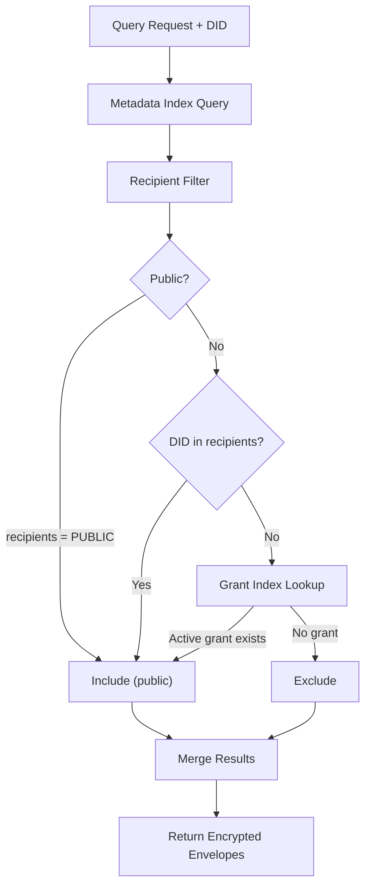

# 06: Hub and Peer Filtering

> Automatic authorization filtering on the hub and selective replication between peers — using recipient lists from encrypted envelopes, with X25519 key registry support.

**Duration:** 5 days
**Dependencies:** [05-grants-delegation-and-offline-policy.md](./05-grants-delegation-and-offline-policy.md)
**Packages:** `packages/hub`, `packages/network`, `packages/core`
**Review issues addressed:** C1 (API mismatches)

## Why This Step Exists

The hub and peer sync layer must automatically filter data so that:

1. **Hub queries** only return envelopes the requesting DID can decrypt.
2. **Peer sync** only streams changes the receiving peer is authorized to see.
3. **Developers never manually filter** — authorization is transparent.
4. **Public nodes** are served to any authenticated user (via `PUBLIC` sentinel).

The hub is a "dumb filter" — it checks recipient lists in public metadata, never evaluates complex authorization rules, and never decrypts content.

## Implementation

### 1. Hub Metadata Index

```sql
CREATE TABLE node_metadata (
  id TEXT PRIMARY KEY,
  schema TEXT NOT NULL,
  created_by TEXT NOT NULL,
  created_at INTEGER NOT NULL,
  updated_at INTEGER NOT NULL,
  lamport INTEGER NOT NULL,
  recipients TEXT NOT NULL,  -- JSON array of DIDs or ['PUBLIC']
  public_props TEXT
);

CREATE INDEX idx_schema ON node_metadata(schema);
CREATE INDEX idx_created_by ON node_metadata(created_by);
CREATE INDEX idx_updated_at ON node_metadata(updated_at);
CREATE INDEX idx_recipients ON node_metadata(recipients);
```

### 2. Hub Query Authorization Filter

```typescript
export async function executeAuthorizedQuery(
  did: DID,
  query: HubQuery,
  db: Database
): Promise<AuthorizedQueryResult> {
  let sql = `SELECT * FROM node_metadata WHERE 1=1`
  const params: unknown[] = []

  // Schema filter
  if (query.schema) {
    sql += ` AND schema = ?`
    params.push(query.schema)
  }

  // Creator filter
  if (query.createdBy) {
    sql += ` AND created_by = ?`
    params.push(query.createdBy)
  }

  // Authorization filter: recipient match OR public OR creator
  sql += ` AND (
    recipients LIKE ? OR
    recipients = '["PUBLIC"]' OR
    created_by = ?
  )`
  params.push(`%"${did}"%`, did)

  const candidates = await db.all(sql, params)

  // Also check active grants
  const grantedNodeIds = await getGrantedNodeIds(did, db)
  if (grantedNodeIds.length > 0) {
    const placeholders = grantedNodeIds.map(() => '?').join(',')
    const additionalNodes = await db.all(
      `SELECT * FROM node_metadata WHERE id IN (${placeholders})
       AND id NOT IN (${candidates.map(() => '?').join(',') || "''"})`,
      [...grantedNodeIds, ...candidates.map((c) => c.id)]
    )
    candidates.push(...additionalNodes)
  }

  // Return encrypted envelopes
  const envelopes = await Promise.all(
    candidates.map((meta) => db.get(`SELECT envelope FROM node_envelopes WHERE id = ?`, meta.id))
  )

  return {
    results: envelopes.filter(Boolean),
    meta: {
      totalMatched: candidates.length,
      authorizedCount: candidates.length
    }
  }
}
```

### 3. Hub Grant Index

```sql
CREATE TABLE grant_index (
  grant_id TEXT PRIMARY KEY,
  grantee TEXT NOT NULL,
  resource TEXT NOT NULL,
  actions TEXT NOT NULL,
  expires_at INTEGER NOT NULL,
  revoked_at INTEGER DEFAULT 0,
  created_at INTEGER NOT NULL
);

CREATE INDEX idx_grant_grantee ON grant_index(grantee);
CREATE INDEX idx_grant_resource ON grant_index(resource);
CREATE INDEX idx_grant_active ON grant_index(grantee, revoked_at, expires_at);
```

```typescript
async function getGrantedNodeIds(did: DID, db: Database): Promise<string[]> {
  const now = Date.now()
  const grants = await db.all(
    `SELECT DISTINCT resource FROM grant_index
     WHERE grantee = ?
     AND revoked_at = 0
     AND (expires_at = 0 OR expires_at > ?)`,
    [did, now]
  )
  return grants.map((g) => g.resource)
}
```

### 4. Hub X25519 Key Registry

The hub also serves as the fallback key registry for non-Ed25519 DIDs (see [Step 01](./01-types-encryption-and-key-resolution.md)):

```typescript
// Hub key registry routes
// POST /keys/register — Publish X25519 public key
// GET  /keys/:did/x25519 — Fetch X25519 public key
// POST /keys/batch — Batch fetch

// Storage
CREATE TABLE key_registry (
  did TEXT PRIMARY KEY,
  x25519_public_key BLOB NOT NULL,
  proof BLOB NOT NULL,  -- Ed25519 signature proving DID owns this key
  registered_at INTEGER NOT NULL,
  updated_at INTEGER NOT NULL
);
```

### 5. Hub Action Bridge

```typescript
export const HUB_ACTION_MAP: Record<string, AuthAction> = {
  'hub/query': 'read',
  'hub/subscribe': 'read',
  'hub/relay': 'write',
  'hub/admin': 'admin',
  'hub/connect': 'read'
}

export function verifyHubCapability(ucanPayload: UCANPayload, hubAction: string): boolean {
  const canonicalAction = HUB_ACTION_MAP[hubAction]
  if (!canonicalAction) return false

  return ucanPayload.att.some(
    (cap) =>
      cap.can === `xnet/${canonicalAction}` ||
      cap.can === 'xnet/*' ||
      cap.can === `xnet/${hubAction}`
  )
}
```

### 6. Peer Selective Sync

```typescript
export class AuthorizedSyncProvider {
  filterChangesForPeer(changes: SignedChange[], peerDid: DID): SignedChange[] {
    return changes.filter((change) => {
      const envelope = this.getEnvelope(change.payload.nodeId)
      if (!envelope) return false
      // Include if peer is a recipient or node is public
      return envelope.recipients.includes(peerDid) || envelope.recipients.includes(PUBLIC_RECIPIENT)
    })
  }

  subscribeForPeer(peerDid: DID, callback: (change: SignedChange) => void): () => void {
    // Uses store.subscribe(listener) — global listener, filter in callback
    return this.store.subscribe((event) => {
      const envelope = this.getEnvelope(event.change.payload?.nodeId)
      if (
        envelope?.recipients.includes(peerDid) ||
        envelope?.recipients.includes(PUBLIC_RECIPIENT)
      ) {
        callback(event.change)
      }
    })
  }
}
```

### 7. Structured Denial Responses

```typescript
export interface HubAuthError {
  code: 'UNAUTHORIZED' | 'FORBIDDEN' | 'TOKEN_EXPIRED' | 'TOKEN_REVOKED'
  message: string
  action: string
  resource?: string
  debug?: {
    reason: AuthDenyReason
    trace?: AuthTraceStep[]
  }
}
```

### 8. Drift Detection Tests

```typescript
import { AUTH_ACTIONS } from '@xnet/core'
import { HUB_ACTION_MAP } from '@xnet/hub'

describe('Hub/Store Action Drift', () => {
  it('every hub action maps to a valid canonical action', () => {
    for (const [, canonical] of Object.entries(HUB_ACTION_MAP)) {
      expect(AUTH_ACTIONS).toContain(canonical)
    }
  })

  it('every canonical action has at least one hub mapping', () => {
    const mappedActions = new Set(Object.values(HUB_ACTION_MAP))
    for (const action of ['read', 'write', 'admin']) {
      expect(mappedActions).toContain(action)
    }
  })
})
```

## Hub Query Flow



## Tests

- Hub query: returns only nodes where DID is in recipients.
- Hub query: includes nodes from active grants.
- Hub query: includes **public nodes** (recipients = `[PUBLIC]`).
- Hub query: excludes nodes with revoked grants.
- Hub query: excludes nodes with expired grants.
- Hub query: schema filter + auth filter combined correctly.
- Hub action bridge: all hub actions map to valid canonical actions.
- Key registry: POST /keys/register stores key with valid proof.
- Key registry: GET /keys/:did/x25519 returns stored key.
- Key registry: rejects registration without valid Ed25519 proof.
- Peer sync: authorized changes are streamed.
- Peer sync: unauthorized changes are filtered out.
- Peer sync: public nodes are streamed to all peers.
- Drift detection: hub/store action constants are in sync.
- Structured errors: unauthorized requests get proper error codes.

## Checklist

- [x] Hub metadata index schema created with recipient index.
- [x] Hub query authorization filter with `PUBLIC` sentinel support.
- [x] Hub grant index for fast active-grant lookup.
- [x] Hub X25519 key registry endpoints (register, lookup, batch).
- [x] Hub action bridge mapping finalized.
- [x] UCAN capability verification for hub actions.
- [x] Peer selective sync filtering by recipients (uses `store.subscribe()` global listener).
- [x] Structured hub auth error responses.
- [x] Drift detection contract tests.
- [x] All tests passing.

---

[Back to README](./README.md) | [Previous: Grants & Delegation](./05-grants-delegation-and-offline-policy.md) | [Next: DX, DevTools & Validation ->](./07-dx-devtools-and-validation.md)
