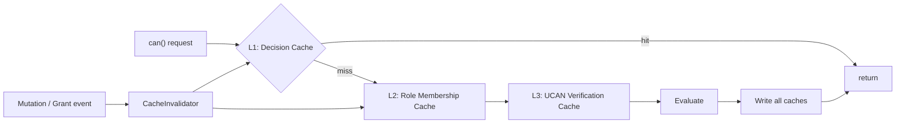
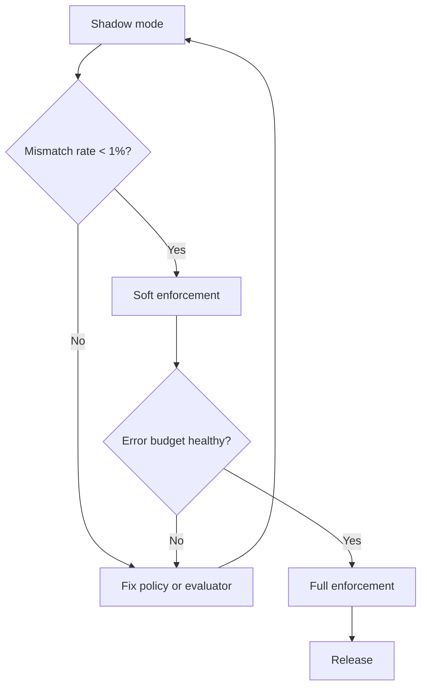

# 08: Performance, Security & Migration

> Meet latency targets with layered caches, harden against adversarial inputs, migrate existing unencrypted nodes, run staged rollout, and define release gates.

**Duration:** 5 days
**Dependencies:** [07-dx-devtools-and-validation.md](./07-dx-devtools-and-validation.md)
**Packages:** cross-cutting (`data`, `identity`, `hub`, `react`, `devtools`)
**Review issues addressed:** B6 (data migration), D1 (key resolution latency), D2 (recipient recompute), D3 (cache thundering herd), E3 (error message clarity), B10 (audit logging)

## Why This Step Exists

Authorization checks are in the critical path of every read and write. This step ensures they're fast enough for real-time UX, secure against adversarial inputs, and rolled out safely — with a concrete migration path for existing unencrypted data.

## Performance Targets

| Operation                          | Target P50 | Target P99 | Notes                                |
| ---------------------------------- | ---------- | ---------- | ------------------------------------ |
| `can()` warm (cached)              | < 1ms      | < 5ms      |                                      |
| `can()` cold (uncached)            | < 10ms     | < 50ms     |                                      |
| `computeRecipients()`              | < 50ms     | < 200ms    | **NEW:** Separate target (review D1) |
| `grant()`                          | < 20ms     | < 100ms    | Excludes key resolution latency      |
| `revoke()` with key rotation       | < 100ms    | < 500ms    |                                      |
| Hub query auth filter (100 nodes)  | < 50ms     | < 200ms    |                                      |
| Hub query auth filter (1000 nodes) | < 200ms    | < 1000ms   |                                      |
| Envelope encryption                | < 5ms      | < 20ms     |                                      |
| Envelope decryption                | < 2ms      | < 10ms     |                                      |
| Ed25519 -> X25519 conversion       | < 0.1ms    | < 0.5ms    | Birational map (no network)          |

**Note (addresses D1):** `computeRecipients()` is benchmarked separately from `grant()` because it involves relation traversal which can be expensive for complex graphs. The `grant() < 20ms` target assumes key resolution is cached.

## Implementation

### 1. Layered Cache Architecture



| Cache                 | Key                     | TTL                                      | Max Size | Invalidation                               |
| --------------------- | ----------------------- | ---------------------------------------- | -------- | ------------------------------------------ |
| L1: Decision          | `subject:action:nodeId` | 30s (configurable via OfflineAuthPolicy) | 10,000   | Node mutation, grant/revoke, schema change |
| L2: Role Membership   | `subject:nodeId`        | 60s                                      | 5,000    | Node property mutation, relation change    |
| L3: Content Key       | `nodeId`                | Until revocation                         | 50,000   | Key rotation event                         |
| L4: UCAN Verification | `tokenHash`             | Until expiration                         | 10,000   | Revocation                                 |
| L5: X25519 Key        | `did`                   | Permanent (derivation is deterministic)  | 10,000   | Never (birational conversion is pure)      |

### 2. Event-Driven Invalidation

```typescript
class CacheInvalidator {
  constructor(
    private decisionCache: DecisionCache,
    private roleCache: RoleMembershipCache,
    private keyCache: ContentKeyCache
  ) {}

  onNodeMutation(nodeId: string, changedProps: string[]): void {
    this.decisionCache.invalidateNode(nodeId)
    if (this.isAuthRelevantProps(changedProps)) {
      this.roleCache.invalidateNode(nodeId)
    }
  }

  onGrantChange(grantee: DID, resource: string): void {
    this.decisionCache.invalidateSubject(grantee)
    this.decisionCache.invalidateNode(resource)
  }

  onKeyRotation(nodeId: string): void {
    this.keyCache.invalidate(nodeId)
  }

  /**
   * Check if changed properties could affect authorization decisions.
   * Only properties referenced by role resolvers are auth-relevant.
   */
  private isAuthRelevantProps(changedProps: string[]): boolean {
    // Delegate to the schema's auth-relevant props set
    // (computed once at schema registration time)
    return changedProps.some((p) => this.authRelevantProps.has(p))
  }
}
```

### 3. Data Migration for Existing Unencrypted Nodes

**New in V2 (addresses B6):** When a developer adds an `authorization` block to an existing schema, all existing nodes need to be encrypted.

```typescript
/**
 * Batch migration utility for encrypting existing unencrypted nodes.
 *
 * Usage:
 *   const migrator = new AuthMigrator(store, publicKeyResolver)
 *   const result = await migrator.migrateSchema('xnet://myapp/Task@2.0.0', {
 *     batchSize: 100,
 *     onProgress: (done, total) => console.log(`${done}/${total}`)
 *   })
 */
export class AuthMigrator {
  constructor(
    private store: NodeStore,
    private schemaRegistry: SchemaRegistry,
    private publicKeyResolver: PublicKeyResolver,
    private grantIndex: GrantIndex,
    private encryptionLayer: EncryptionLayer
  ) {}

  async migrateSchema(
    schemaIri: SchemaIRI,
    options: MigrationOptions = {}
  ): Promise<MigrationResult> {
    const { batchSize = 100, onProgress } = options

    // FIXED (V2 review B): schemaRegistry.get() is async
    const schema = await this.schemaRegistry.get(schemaIri)
    if (!schema?.schema?.authorization) {
      throw new Error(`Schema ${schemaIri} has no authorization block`)
    }

    // 1. Find all unencrypted nodes of this schema
    // Uses store.list() — the actual NodeStore API
    const nodes = await this.store.list({ schema: schemaIri })
    const total = nodes.length
    let migrated = 0
    let failed = 0
    const errors: MigrationError[] = []

    // 2. Process in batches
    for (let i = 0; i < nodes.length; i += batchSize) {
      const batch = nodes.slice(i, i + batchSize)

      for (const node of batch) {
        try {
          // a. Compute recipients for this node
          // FIXED (V2 review B): Uses grantIndex parameter
          const recipients = await computeRecipients(
            schema.schema,
            node,
            this.store,
            this.grantIndex
          )

          // b. Resolve X25519 public keys
          const publicKeys = await this.publicKeyResolver.resolveBatch(recipients)

          // c. Generate content key and encrypt
          // FIXED (V2 review B): NodeStore doesn't have serializeNodeContent(),
          // storeEnvelope(), extractMetadata(), or public signingKey.
          // Encryption is handled by a separate EncryptionLayer that wraps
          // these operations using the actual NodeStore + crypto APIs.
          await this.encryptionLayer.encryptAndStoreNode(node, publicKeys)
          migrated++
        } catch (err) {
          failed++
          errors.push({
            nodeId: node.id,
            error: err instanceof Error ? err.message : String(err)
          })
        }
      }

      onProgress?.(migrated + failed, total)
    }

    return { total, migrated, failed, errors }
  }
}

/**
 * EncryptionLayer wraps the actual encryption operations.
 *
 * NodeStore doesn't expose serializeNodeContent(), extractMetadata(),
 * storeEnvelope(), or signingKey directly. This layer provides those
 * operations using the actual NodeStore + @xnet/crypto APIs.
 *
 * Injected into AuthMigrator and NodeStore's auth-enhanced paths.
 */
export interface EncryptionLayer {
  /** Encrypt a node's content and store the resulting envelope */
  encryptAndStoreNode(node: NodeState, recipientKeys: Map<DID, Uint8Array>): Promise<void>

  /** Get or generate a content key for a node */
  getContentKey(nodeId: string): Promise<Uint8Array>

  /** Wrap a content key for a new recipient */
  wrapKeyForRecipient(contentKey: Uint8Array, recipientPublicKey: Uint8Array): WrappedKey

  /** Update envelope recipients and wrapped keys */
  updateEnvelopeRecipients(
    nodeId: string,
    recipients: DID[],
    wrappedKeys: Record<string, WrappedKey>
  ): Promise<void>
}

interface MigrationOptions {
  batchSize?: number
  onProgress?: (done: number, total: number) => void
}

interface MigrationResult {
  total: number
  migrated: number
  failed: number
  errors: MigrationError[]
}

interface MigrationError {
  nodeId: string
  error: string
}
```

### 4. Security Hardening

#### Conformance Test Matrix

- [ ] Deny beats allow in all combinations.
- [x] Delegation attenuation cannot escalate.
- [x] Revocation invalidates descendant delegations (cascade).
- [x] Relation traversal cycles terminate safely (visited-set + max-depth).
- [ ] Remote unauthorized change rejection is deterministic.
- [ ] Hub query filtering excludes unauthorized nodes.
- [x] Expired grants are not honored.
- [ ] Key rotation prevents revoked user from decrypting new content.
- [ ] Envelope signature verification catches tampering.
- [x] Self-grant is rejected.
- [x] Last-admin protection prevents unrecoverable loss.
- [x] Expression depth > 50 rejected at schema validation time.
- [x] UCAN proof chain depth > 4 rejected.

#### Adversarial Tests

```typescript
describe('Adversarial Tests', () => {
  it('rejects deeply nested expression trees', () => {
    let expr: AuthExpression = allow('owner')
    for (let i = 0; i < 1000; i++) {
      expr = and(expr, allow('owner'))
    }
    expect(() => validateAuthorization({ actions: { read: expr }, roles: {} }, {})).toThrow(
      'AUTH_SCHEMA_EXPR_LIMIT_EXCEEDED'
    )
  })

  it('rejects relation traversal storms (circular)', async () => {
    // A -> B -> C -> A
    const decision = await evaluator.can({
      subject: userDid,
      action: 'read',
      nodeId: nodeA
    })
    expect(decision.allowed).toBe(false)
    // Should complete (not hang)
  })

  it('prevents privilege escalation via grant', async () => {
    // Bob has 'read' access, tries to grant 'write'
    await expect(
      storeAuth.grant({ to: carolDid, actions: ['write'], resource: nodeId })
    ).rejects.toThrow('PermissionError')
  })

  it('prevents grant flooding', async () => {
    // Try to create 100 grants in rapid succession
    const promises = Array.from({ length: 100 }, (_, i) =>
      storeAuth.grant({ to: `did:key:peer${i}`, actions: ['read'], resource: nodeId })
    )
    const results = await Promise.allSettled(promises)
    const rejected = results.filter((r) => r.status === 'rejected')
    expect(rejected.length).toBeGreaterThan(0) // Rate limit kicks in
  })
})
```

#### Abuse Limits

| Limit                         | Default         | Error Code                        |
| ----------------------------- | --------------- | --------------------------------- |
| Expression node count         | 50              | `AUTH_SCHEMA_EXPR_LIMIT_EXCEEDED` |
| Relation traversal depth      | 3               | `DENY_DEPTH_EXCEEDED`             |
| Relation traversal max nodes  | 100             | `DENY_DEPTH_EXCEEDED`             |
| UCAN proof chain depth        | 4               | `DENY_UCAN_INVALID`               |
| Grant constraint payload size | 4 KB            | `AUTH_SCHEMA_INVALID_FIELD_REF`   |
| Grant rate limit              | 10/min per peer | Rate limit error                  |

### 5. Audit Logging

**Addresses review B10:** Emit `AuthDecisionEvent` to the existing telemetry system for persistent logging.

```typescript
/**
 * Optional audit logging for authorization decisions.
 * Integrates with @xnet/telemetry for persistent logging.
 *
 * Low priority — grant nodes already provide an audit trail
 * (they're regular nodes with change history). This adds
 * ephemeral can() decision logging for compliance.
 */
export interface AuthDecisionEvent {
  type: 'auth:decision'
  timestamp: number
  subject: DID
  action: AuthAction
  resource: string
  allowed: boolean
  cached: boolean
  roles: string[]
  reasons: AuthDenyReason[]
  duration: number
}

// Emit via existing telemetry system
telemetry.emit({
  type: 'auth:decision',
  ...decision
})
```

### 6. Rollout Strategy



1. **Shadow mode**: Run evaluator alongside existing behavior, log mismatches.
2. **Soft enforcement**: Enforce on non-destructive paths (share), warn on others.
3. **Full enforcement**: Enable on all mutation paths + hub relay/query.

#### Feature Flags

```typescript
export const AUTH_FEATURE_FLAGS = {
  enforceLocal: false,
  enforceRemote: false,
  enforceHub: false,
  enforceEncryption: false,
  logDecisions: true
}
```

### 7. Memory Overhead

| Component               | Memory per 10K nodes | Notes                         |
| ----------------------- | -------------------- | ----------------------------- |
| Decision cache          | ~500 KB              | 50 cached results/node        |
| Role membership cache   | ~200 KB              | 20 role checks/node           |
| Content key cache       | ~320 KB              | 32 bytes/key                  |
| UCAN verification cache | ~1 MB                | ~100 bytes/token              |
| X25519 key cache        | ~320 KB              | 32 bytes/key                  |
| **Total**               | **~2.3 MB**          | Acceptable for desktop/mobile |

## Tests

- All conformance tests pass.
- All adversarial/fuzz tests pass.
- Performance targets met in CI benchmarks.
- `AuthMigrator.migrateSchema` encrypts all nodes of a schema.
- `AuthMigrator` handles errors gracefully (reports failed nodes, continues).
- `AuthMigrator` respects batch size and reports progress.
- Feature flags enable staged rollout.
- Audit events emitted to telemetry.

## Checklist

- [ ] L1-L5 layered caches implemented.
- [ ] Event-driven cache invalidation wired to store events.
- [x] `AuthMigrator` batch migration utility implemented.
- [ ] Conformance test matrix complete (13 scenarios).
- [ ] Adversarial and fuzz tests passing.
- [ ] Abuse limits enforced with deterministic error codes.
- [x] Grant rate limiting (10/min per peer).
- [ ] Audit logging via telemetry (optional).
- [x] Feature flags for staged rollout.
- [ ] Benchmark fixtures and suite committed.
- [ ] Performance targets met in CI.
- [ ] Rollback procedure documented.
- [ ] All tests passing.

---

[Back to README](./README.md) | [Previous: DX, DevTools & Validation](./07-dx-devtools-and-validation.md) | [Next: Yjs Document Authorization ->](./09-yjs-document-authorization.md)
