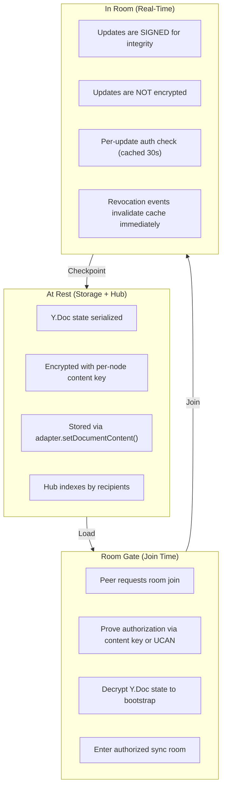
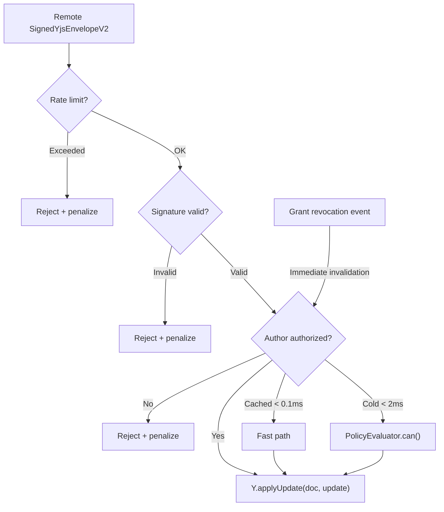

# 09: Yjs Document Authorization

> Extend the encryption-first authorization model to Yjs collaborative documents — encrypted at rest, room-gated in transit, with revocation event wiring and zero per-keystroke overhead.

**Duration:** 5 days
**Dependencies:** [04-nodestore-enforcement.md](./04-nodestore-enforcement.md), [06-hub-and-peer-filtering.md](./06-hub-and-peer-filtering.md)
**Packages:** `packages/sync`, `packages/data`, `packages/crypto`, `packages/react`, `packages/network`
**Review issues addressed:** A2 (Yjs room-gated trust window), C1 (API: `setDocumentContent` not `saveYjsState`)
**Prerequisites:** Extend `YjsViolationType` with `'unauthorized_update'` and add penalty value (20) to `DEFAULT_YJS_SCORING_CONFIG`

## Why This Step Exists

Steps 01-08 build authorization for **structured node data**. But xNet has a **second data path** for Yjs collaborative documents (Pages, Tasks, Databases, Canvas) that currently flows unencrypted and unauthorized between peers.

**New in V2:** Explicit wiring of `store.subscribe()` to `authGate.invalidatePeer()` for revocation events, fixing the trust window gap identified in the review. Also corrects API to use `adapter.setDocumentContent()`.

## Core Design: Room-Gated Authorization



## Implementation

### 1. Encrypted Yjs State

```typescript
export interface EncryptedYjsState {
  nodeId: string
  version: 1
  encryptedState: Uint8Array
  nonce: Uint8Array
  stateVector: Uint8Array // Unencrypted — for sync protocol
  stateHash: Uint8Array // BLAKE3 hash for integrity
  checkpointedAt: number
  updatesSinceCheckpoint: number
}

export function encryptYjsState(
  doc: Y.Doc,
  nodeId: string,
  contentKey: Uint8Array
): EncryptedYjsState {
  const state = Y.encodeStateAsUpdate(doc)
  const stateVector = Y.encodeStateVector(doc)
  const stateHash = hash(state, 'blake3')
  const { ciphertext, nonce } = encryptWithNonce(state, contentKey)

  return {
    nodeId,
    version: 1,
    encryptedState: ciphertext,
    nonce,
    stateVector,
    stateHash,
    checkpointedAt: Date.now(),
    updatesSinceCheckpoint: 0
  }
}

export function decryptYjsState(encrypted: EncryptedYjsState, contentKey: Uint8Array): Uint8Array {
  const state = decryptWithNonce(encrypted.encryptedState, encrypted.nonce, contentKey)
  const computedHash = hash(state, 'blake3')
  if (!constantTimeEqual(computedHash, encrypted.stateHash)) {
    throw new IntegrityError('Y.Doc state hash mismatch')
  }
  return state
}
```

### 2. Room Authorization Gate

```typescript
export class AuthorizedSyncManager {
  private authorizedRooms = new Map<string, AuthorizedRoom>()

  async acquire(nodeId: string, mode: 'read' | 'write' = 'write'): Promise<AuthorizedDoc> {
    // 1. Authorization check
    const decision = await this.evaluator.can({
      subject: this.authorDID,
      action: mode === 'write' ? 'write' : 'read',
      nodeId
    })
    if (!decision.allowed) throw new PermissionError(decision)

    // 2. Get content key
    const contentKey = await this.keyCache.getOrUnwrap(nodeId, this.encryptionPrivateKey)

    // 3. Load and decrypt Y.Doc state
    // CORRECTED: uses adapter.getDocumentContent(), not getYjsState()
    const encryptedBytes = await this.adapter.getDocumentContent(nodeId)
    const doc = new Y.Doc({ guid: nodeId, gc: false })

    if (encryptedBytes) {
      const encrypted = deserializeEncryptedYjsState(encryptedBytes)
      const state = decryptYjsState(encrypted, contentKey)
      Y.applyUpdate(doc, state)
    }

    // 4. Join sync room (if write mode)
    let room: AuthorizedRoom | undefined
    if (mode === 'write') {
      room = await this.joinRoom(nodeId, doc, contentKey)
    }

    return { doc, nodeId, mode, contentKey, room, release: () => this.release(nodeId) }
  }

  private async joinRoom(
    nodeId: string,
    doc: Y.Doc,
    contentKey: Uint8Array
  ): Promise<AuthorizedRoom> {
    const room: AuthorizedRoom = {
      nodeId,
      doc,
      contentKey,
      authorizedPeers: new Set([this.authorDID]),
      authGate: new YjsAuthGate(this.evaluator, nodeId),
      createdAt: Date.now()
    }

    // Wire revocation events to auth gate invalidation (NEW in V2 — addresses A2)
    this.wireRevocationEvents(room)

    this.authorizedRooms.set(nodeId, room)
    return room
  }
}
```

### 3. Revocation Event Wiring (NEW in V2)

**This is the critical fix for review issue A2.** The 30-second auth cache TTL creates a trust window where a just-revoked peer could continue sending updates. The fix: wire `store.subscribe()` to listen for Grant node changes and immediately invalidate the auth gate cache.

```typescript
class AuthorizedSyncManager {
  /**
   * Wire store subscription to auth gate invalidation.
   *
   * When a Grant node is updated (revokedAt changes from 0 to non-zero),
   * immediately invalidate the corresponding peer's auth cache in ALL
   * active rooms for that resource.
   *
   * This ensures revocation takes effect within ONE update cycle,
   * not after the 30-second cache TTL expires.
   */
  private wireRevocationEvents(room: AuthorizedRoom): void {
    // store.subscribe() is a global listener — filter in callback
    const unsub = this.store.subscribe((event) => {
      // Only care about Grant node changes
      if (event.node?.schemaId !== 'xnet://xnet.fyi/Grant') return

      const grantNode = event.node
      const resource = grantNode.properties?.resource as string
      const revokedAt = grantNode.properties?.revokedAt as number
      const grantee = grantNode.properties?.grantee as DID

      // Only care about grants for this room's resource
      if (resource !== room.nodeId) return

      // If grant was just revoked (revokedAt changed to > 0)
      if (revokedAt && revokedAt > 0 && grantee) {
        // Immediately invalidate the revoked peer's auth cache
        room.authGate.invalidatePeer(grantee)

        // If this peer is in the room, kick them
        if (room.authorizedPeers.has(grantee)) {
          this.handlePeerRevocation(room, grantee)
        }
      }
    })

    // Store unsubscribe for cleanup
    room._unsubscribe = unsub
  }

  private async handlePeerRevocation(room: AuthorizedRoom, revokedDID: DID): Promise<void> {
    // 1. Remove from authorized set
    room.authorizedPeers.delete(revokedDID)

    // 2. Disconnect peer
    room.doc.emit('peer:kicked', [revokedDID])

    // 3. Rotate content key
    const newContentKey = generateContentKey()
    const newEncryptedState = encryptYjsState(room.doc, room.nodeId, newContentKey)

    // CORRECTED: uses adapter.setDocumentContent(), not saveYjsState()
    await this.adapter.setDocumentContent(
      room.nodeId,
      serializeEncryptedYjsState(newEncryptedState)
    )

    // 4. Wrap new key for remaining recipients
    const remainingDIDs = [...room.authorizedPeers]
    const publicKeys = await this.publicKeyResolver.resolveBatch(remainingDIDs)
    const newWrappedKeys: Record<string, WrappedKey> = {}
    for (const [did, pubKey] of publicKeys) {
      newWrappedKeys[did] = wrapKeyForRecipient(newContentKey, pubKey)
    }

    // 5. Update envelope
    await this.store.updateEnvelopeKeys(room.nodeId, newWrappedKeys, remainingDIDs)

    // 6. Update room
    room.contentKey = newContentKey
    room.doc.emit('key:rotated', [room.nodeId])
  }
}
```

### 4. Yjs Auth Gate

```typescript
export class YjsAuthGate {
  private peerAuthCache = new Map<DID, { allowed: boolean; expiresAt: number }>()
  private static CACHE_TTL = 30_000

  constructor(
    private evaluator: PolicyEvaluator,
    private nodeId: string
  ) {}

  async canApplyUpdate(envelope: SignedYjsEnvelopeV2): Promise<YjsAuthDecision> {
    const authorDID = envelope.meta.authorDID

    // Fast path: cached decision
    const cached = this.peerAuthCache.get(authorDID)
    if (cached && cached.expiresAt > Date.now()) {
      return { allowed: cached.allowed, authorDID, cached: true }
    }

    // Slow path: full evaluation
    const decision = await this.evaluator.can({
      subject: authorDID,
      action: 'write',
      nodeId: this.nodeId
    })

    this.peerAuthCache.set(authorDID, {
      allowed: decision.allowed,
      expiresAt: Date.now() + YjsAuthGate.CACHE_TTL
    })

    return { allowed: decision.allowed, authorDID, cached: false }
  }

  invalidatePeer(did: DID): void {
    this.peerAuthCache.delete(did)
  }

  invalidateAll(): void {
    this.peerAuthCache.clear()
  }
}
```

### 5. Integration into Sync Pipeline

```typescript
export class AuthorizedYjsSyncProvider {
  async handleRemoteUpdate(envelope: SignedYjsEnvelopeV2): Promise<void> {
    const peerId = envelope.meta.authorDID

    // 1. Rate limit (existing)
    if (!this.rateLimiter.allow(peerId)) {
      this.peerScorer.recordViolation(peerId, 'rate_exceeded')
      return
    }

    // 2. Signature verification (existing)
    const sigResult = await verifyYjsEnvelopeV2(envelope)
    if (!sigResult.valid) {
      this.peerScorer.recordViolation(peerId, 'invalid_signature')
      return
    }

    // 3. Authorization check (NEW)
    // NOTE (V2 review A5): 'unauthorized_update' must be added to YjsViolationType
    // in packages/sync/src/yjs-peer-scoring.ts. Add it to the type union:
    //   type YjsViolationType = ... | 'unauthorized_update'
    // And add a penalty value to DEFAULT_YJS_SCORING_CONFIG.penalties:
    //   unauthorized_update: 20
    const authResult = await this.room.authGate.canApplyUpdate(envelope)
    if (!authResult.allowed) {
      this.peerScorer.recordViolation(peerId, 'unauthorized_update')
      this.emit('update:rejected', { peerId, reason: 'unauthorized', nodeId: this.room.nodeId })
      return
    }

    // 4. Apply update (existing)
    Y.applyUpdate(this.room.doc, envelope.update, 'remote')
    this.peerScorer.recordValid(peerId)
  }
}
```



### 6. Performance Targets

| Operation                  | Target P50 | Target P99 |
| -------------------------- | ---------- | ---------- |
| Room join (auth + decrypt) | < 50ms     | < 150ms    |
| Y.Doc state decrypt (1MB)  | < 5ms      | < 10ms     |
| Per-update auth (cached)   | < 0.1ms    | < 0.5ms    |
| Per-update auth (cold)     | < 2ms      | < 5ms      |
| Revocation + re-encrypt    | < 200ms    | < 500ms    |

### 7. Periodic Checkpoint

```typescript
export class YjsCheckpointer {
  private static MAX_UPDATES = 100
  private static MAX_AGE_MS = 60 * 60 * 1000

  shouldCheckpoint(state: EncryptedYjsState): boolean {
    return (
      state.updatesSinceCheckpoint >= YjsCheckpointer.MAX_UPDATES ||
      Date.now() - state.checkpointedAt >= YjsCheckpointer.MAX_AGE_MS
    )
  }

  async checkpoint(doc: Y.Doc, nodeId: string, contentKey: Uint8Array): Promise<EncryptedYjsState> {
    return encryptYjsState(doc, nodeId, contentKey)
  }
}
```

### 8. `useCanEdit` Hook

```typescript
export function useCanEdit(nodeId: string): UseCanEditResult {
  const { store } = useNodeStoreInternal()
  const [state, setState] = useState<UseCanEditResult>({
    canEdit: false,
    canView: false,
    loading: true,
    error: null,
    roles: []
  })

  useEffect(() => {
    if (!store) return
    let cancelled = false

    async function check() {
      const [read, write] = await Promise.all([
        store.auth.can({ action: 'read', nodeId }),
        store.auth.can({ action: 'write', nodeId })
      ])

      if (!cancelled) {
        setState({
          canEdit: write.allowed,
          canView: read.allowed && !write.allowed,
          loading: false,
          error: null,
          roles: [...new Set([...read.roles, ...write.roles])]
        })
      }
    }

    check()
    const unsub = store.subscribe((event) => {
      if (event.change?.payload?.nodeId === nodeId) check()
    })
    return () => {
      cancelled = true
      unsub()
    }
  }, [store, nodeId])

  return state
}
```

## Tests

### Unit Tests

- `encryptYjsState` round-trip: encrypt -> decrypt -> states match.
- `encryptYjsState` integrity: tampered ciphertext throws `IntegrityError`.
- `YjsAuthGate.canApplyUpdate`: authorized peer allowed.
- `YjsAuthGate.canApplyUpdate`: unauthorized peer denied.
- `YjsAuthGate.canApplyUpdate`: cached decision returned within TTL.
- `YjsAuthGate.invalidatePeer`: evicts cached decision.
- **Revocation wiring: Grant node revokedAt change -> immediate invalidatePeer().**
- **Revocation wiring: works even when revoker is on different device (via store.subscribe).**
- `revokeYjsAccess`: new content key generated, state re-encrypted.
- `revokeYjsAccess`: remaining peers can still edit.

### Integration Tests

- E2E: create page -> edit -> share -> recipient edits -> revoke -> recipient cannot edit.
- Hub round-trip: encrypt Y.Doc state -> store via `setDocumentContent` -> retrieve -> decrypt.
- Peer sync: unauthorized peer's updates rejected by auth gate.
- Key rotation: old key cannot decrypt new state.

## Checklist

- [ ] `EncryptedYjsState` type defined.
- [ ] `encryptYjsState()` and `decryptYjsState()` with BLAKE3 integrity.
- [ ] `AuthorizedSyncManager.acquire()` gates Y.Doc access.
- [ ] `YjsAuthGate` with per-peer cached auth decisions.
- [ ] **Revocation event wiring**: `store.subscribe()` -> `authGate.invalidatePeer()`.
- [ ] `AuthorizedYjsSyncProvider.handleRemoteUpdate()` wired into pipeline.
- [ ] Uses `adapter.setDocumentContent()` (correct API, not `saveYjsState`).
- [ ] Uses `adapter.getDocumentContent()` (correct API).
- [ ] Key rotation on revocation: generate new key, re-encrypt, kick peer.
- [ ] Hub stores encrypted Y.Doc state alongside envelopes.
- [ ] `YjsCheckpointer` compacts every 100 updates or 1 hour.
- [ ] `useCanEdit()` hook with read/write distinction.
- [ ] Performance targets met.
- [ ] All tests passing.

---

[Back to README](./README.md) | [Previous: Performance & Security](./08-performance-security-and-migration.md) | [Next: Key Recovery & Multi-Device ->](./10-key-recovery-and-multi-device.md)
