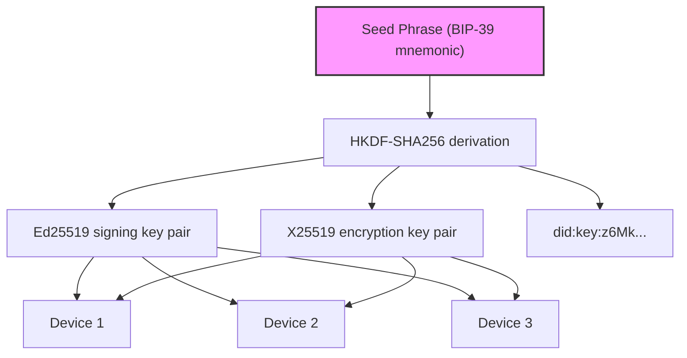
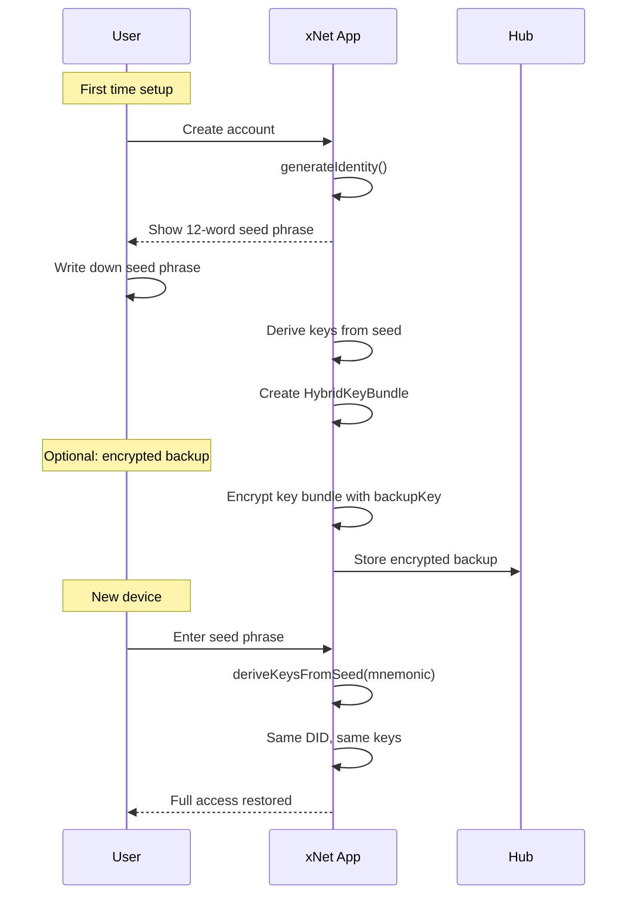
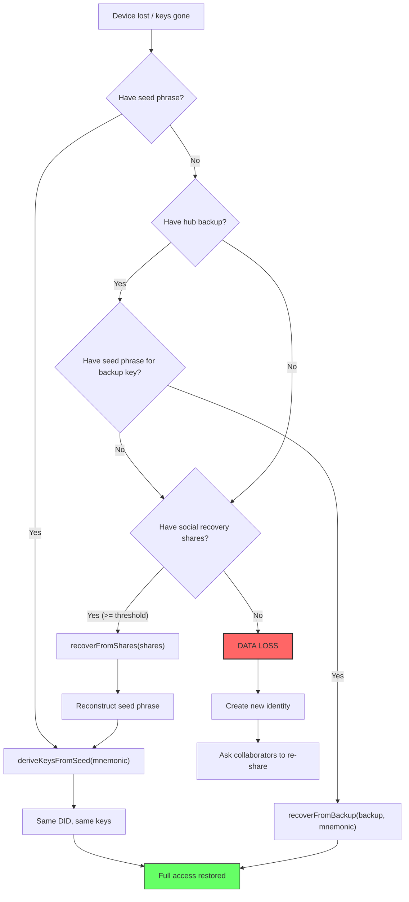

# 10: Key Recovery & Multi-Device

> Seed-phrase derivation for deterministic keys, encrypted hub backup, multi-device key sync, and social recovery — preventing the single biggest source of real-world data loss.

**Duration:** 4 days
**Dependencies:** [01-types-encryption-and-key-resolution.md](./01-types-encryption-and-key-resolution.md), [05-grants-delegation-and-offline-policy.md](./05-grants-delegation-and-offline-policy.md)
**Packages:** `packages/identity`, `packages/crypto`, `packages/hub`
**Review issues addressed:** B1 (key recovery - CRITICAL), B2 (multi-device)

## Why This Step Exists

**This is the single biggest real-world risk in the entire authorization system.**

The encryption-first model means: if a user loses their private keys, they lose access to **everything** — all encrypted nodes, all Y.Doc content, all granted access. There is no admin backdoor. If keys are gone, data is gone.

The prior plan had **zero discussion** of key recovery, backup, or multi-device scenarios. This step fills that critical gap.

## Multi-Device Problem

A user with 2 devices has 2 different `HybridKeyBundle` instances (different X25519 private keys). When someone grants access to `did:key:z6Mk...`, which device's X25519 key gets the wrapped content key?

**Decision: Deterministic key derivation from seed phrase.**

All devices derive the **same** Ed25519/X25519 key pair from a shared seed phrase. This means:

- One DID per user (not per device)
- Content keys wrapped for one DID work on all devices
- No device registry needed for basic operation
- Recovery = re-derive keys from seed



## Implementation

### 1. Deterministic Key Derivation from Seed

```typescript
import { mnemonicToSeed, generateMnemonic } from '@scure/bip39'
import { wordlist } from '@scure/bip39/wordlists/english'
import { hkdf } from '@noble/hashes/hkdf'
import { sha256 } from '@noble/hashes/sha256'

/**
 * Derive all cryptographic keys deterministically from a BIP-39 seed phrase.
 *
 * Key hierarchy:
 *   seed -> HKDF("xnet-ed25519-signing") -> Ed25519 signing key pair
 *   seed -> HKDF("xnet-x25519-encryption") -> X25519 encryption key pair
 *   seed -> HKDF("xnet-backup-key") -> symmetric key for backup encryption
 *
 * All derivations are deterministic: same seed = same keys on every device.
 */
export async function deriveKeysFromSeed(
  mnemonic: string,
  passphrase?: string
): Promise<DerivedKeyBundle> {
  // 1. Convert mnemonic to 64-byte seed (BIP-39)
  const seed = await mnemonicToSeed(mnemonic, passphrase)

  // 2. Derive Ed25519 signing key
  const signingKeyBytes = hkdf(sha256, seed, 'xnet-salt', 'xnet-ed25519-signing', 32)
  const signingKeyPair = ed25519.utils.getExtendedPublicKey(signingKeyBytes)

  // 3. Derive X25519 encryption key via BIRATIONAL CONVERSION from Ed25519
  // FIXED (V2 review A2): Previously used independent HKDF derivation which
  // produced a DIFFERENT X25519 key than the birational conversion in Step 01.
  // This caused decrypt failures: content wrapped for the birational key
  // couldn't be unwrapped with the independently-derived key.
  //
  // The invariant: DID -> Ed25519 pubkey -> X25519 pubkey must be deterministic.
  // Both Step 01 (PublicKeyResolver) and Step 10 (seed derivation) must produce
  // the same X25519 key for the same Ed25519 key.
  const encryptionKeyBytes = edwardsToMontgomeryPriv(signingKeyBytes)
  const encryptionPublicKey = edwardsToMontgomeryPub(signingKeyPair.point)

  // 4. Derive backup encryption key (separate from signing/encryption)
  const backupKey = hkdf(sha256, seed, 'xnet-salt', 'xnet-backup-key', 32)

  // 5. Build DID from Ed25519 public key
  const did = createDIDFromEd25519PublicKey(signingKeyPair.point)

  return {
    mnemonic,
    did,
    signingKey: signingKeyBytes,
    signingPublicKey: signingKeyPair.point,
    encryptionKey: encryptionKeyBytes,
    encryptionPublicKey,
    backupKey
  }
}

export interface DerivedKeyBundle {
  mnemonic: string
  did: DID
  signingKey: Uint8Array // Ed25519 private
  signingPublicKey: Uint8Array // Ed25519 public
  encryptionKey: Uint8Array // X25519 private
  encryptionPublicKey: Uint8Array // X25519 public
  backupKey: Uint8Array // Symmetric key for hub backup
}

/**
 * Generate a new identity with a fresh seed phrase.
 * Returns the mnemonic that the user MUST save.
 */
export function generateIdentity(): { mnemonic: string; bundle: Promise<DerivedKeyBundle> } {
  const mnemonic = generateMnemonic(wordlist, 128) // 12 words
  return {
    mnemonic,
    bundle: deriveKeysFromSeed(mnemonic)
  }
}
```

### 2. Seed Phrase UX Flow



### 3. Encrypted Hub Backup

For users who don't want to manage a seed phrase, offer encrypted key backup to the hub:

```typescript
/**
 * Encrypt the user's key material for hub backup.
 *
 * The backup is encrypted with the seed-derived backup key,
 * so the hub cannot read it. Recovery requires the seed phrase
 * (or the backup key derived from it).
 */
export function createKeyBackup(
  bundle: DerivedKeyBundle,
  additionalData?: Record<string, unknown>
): EncryptedKeyBackup {
  const payload = JSON.stringify({
    version: 1,
    did: bundle.did,
    signingKey: bytesToHex(bundle.signingKey),
    encryptionKey: bytesToHex(bundle.encryptionKey),
    createdAt: Date.now(),
    ...additionalData
  })

  const { ciphertext, nonce } = encryptWithNonce(
    new TextEncoder().encode(payload),
    bundle.backupKey
  )

  return {
    did: bundle.did,
    encryptedPayload: ciphertext,
    nonce,
    version: 1,
    createdAt: Date.now()
  }
}

export interface EncryptedKeyBackup {
  did: DID
  encryptedPayload: Uint8Array
  nonce: Uint8Array
  version: number
  createdAt: number
}

/**
 * Recover keys from an encrypted hub backup.
 * Requires the seed phrase to derive the backup key.
 */
export async function recoverFromBackup(
  backup: EncryptedKeyBackup,
  mnemonic: string
): Promise<DerivedKeyBundle> {
  // Derive backup key from seed
  const derived = await deriveKeysFromSeed(mnemonic)

  // Verify DID matches
  if (derived.did !== backup.did) {
    throw new Error('Seed phrase does not match backup DID')
  }

  // Decrypt backup
  const plaintext = decryptWithNonce(backup.encryptedPayload, backup.nonce, derived.backupKey)

  // The backup confirms our derivation is correct
  return derived
}
```

### 4. Hub Backup Endpoints

```typescript
// Hub routes for key backup
// POST /backup/:did — Store encrypted key backup
// GET  /backup/:did — Retrieve encrypted key backup
// DELETE /backup/:did — Delete backup (with proof of ownership)

// Hub storage
CREATE TABLE key_backups (
  did TEXT PRIMARY KEY,
  encrypted_payload BLOB NOT NULL,
  nonce BLOB NOT NULL,
  version INTEGER NOT NULL,
  created_at INTEGER NOT NULL,
  updated_at INTEGER NOT NULL,
  -- Proof of ownership: Ed25519 signature over (did + "backup")
  ownership_proof BLOB NOT NULL
);
```

### 5. Social Recovery (Future Enhancement)

For high-value accounts, support Shamir's Secret Sharing to split the seed across trusted contacts:

```typescript
/**
 * Split a seed phrase into N shares using Shamir's Secret Sharing,
 * requiring K of N shares to reconstruct.
 *
 * Example: Split into 5 shares, need any 3 to recover.
 */
export interface SocialRecoveryConfig {
  /** Total number of shares to create */
  totalShares: number // default: 5

  /** Minimum shares needed to reconstruct */
  threshold: number // default: 3

  /** Optional labels for shares (e.g., "Alice", "Bob") */
  shareLabels?: string[]
}

export function createRecoveryShares(
  mnemonic: string,
  config: SocialRecoveryConfig
): RecoveryShare[] {
  const secret = new TextEncoder().encode(mnemonic)
  const shares = shamirSplit(secret, config.totalShares, config.threshold)

  return shares.map((shareBytes, i) => ({
    index: i + 1,
    share: bytesToHex(shareBytes),
    label: config.shareLabels?.[i] ?? `Share ${i + 1}`,
    threshold: config.threshold,
    totalShares: config.totalShares
  }))
}

export function recoverFromShares(shares: RecoveryShare[]): string {
  if (shares.length < shares[0].threshold) {
    throw new Error(`Need at least ${shares[0].threshold} shares, got ${shares.length}`)
  }

  const shareBytes = shares.map((s) => hexToBytes(s.share))
  const secret = shamirCombine(shareBytes)
  return new TextDecoder().decode(secret)
}

export interface RecoveryShare {
  index: number
  share: string
  label: string
  threshold: number
  totalShares: number
}
```

### 6. Integration with HybridKeyBundle

Bridge the seed-derived keys to the existing `HybridKeyBundle` type:

```typescript
/**
 * Create a HybridKeyBundle from a seed-derived key bundle.
 *
 * This replaces the existing createKeyBundle() flow for users
 * who have a seed phrase. The resulting bundle is identical in
 * structure and can be used everywhere HybridKeyBundle is expected.
 */
export async function createKeyBundleFromSeed(
  mnemonic: string,
  options?: { enablePQ?: boolean }
): Promise<{ bundle: HybridKeyBundle; mnemonic: string }> {
  const derived = await deriveKeysFromSeed(mnemonic)

  const bundle: HybridKeyBundle = {
    signingKey: derived.signingKey,
    encryptionKey: derived.encryptionKey,
    identity: {
      did: derived.did,
      publicKey: derived.signingPublicKey
    },
    maxSecurityLevel: 0 // Classical only (PQ keys can't be seed-derived yet)
  }

  // Optionally add PQ keys (these are NOT seed-derived)
  if (options?.enablePQ) {
    // PQ keys require separate device-specific generation
    // They're registered in the hub key registry per device
    // Content key wrapping uses X25519 (seed-derived) as primary
  }

  return { bundle, mnemonic }
}
```

### 7. Identity Reset Considerations

**Explicit limitation (addresses review E6):**

Ownership cannot be transferred in v1. If a user creates a new DID (new seed phrase), they lose access to all data encrypted for the old DID. The mitigation path:

1. **Prevention**: Emphasize seed phrase backup at onboarding.
2. **Recovery**: If they have the old seed phrase, they can derive the old keys and decrypt.
3. **Migration**: If they have both old and new keys, they could grant the new DID access to each node (manual, tedious, but possible).
4. **Future work**: Ownership transfer ceremony (planned for v2) — a protocol where the old DID grants all permissions to the new DID and rotates all content keys.

## Recovery Flow Diagram



## Security Considerations

1. **Seed phrase storage**: The seed phrase is the master secret. It must never be stored unencrypted on any device. Use the platform's secure storage (Keychain on macOS/iOS, Credential Manager on Android, OS keyring on Linux/Windows).

2. **Backup key derivation**: The backup key is derived from the seed using HKDF with a distinct context string. Compromising the backup key doesn't compromise signing or encryption keys (different derivation paths).

3. **Hub cannot read backups**: The hub stores encrypted blobs. Without the seed phrase, the backup is useless. This preserves the zero-trust model.

4. **Social recovery trust**: Each share holder has a piece of the secret. K-of-N threshold means no single share holder can reconstruct. Choose share holders carefully.

5. **Post-quantum keys**: ML-KEM/ML-DSA keys are NOT seed-derivable (different algorithm, different key sizes). For PQ scenarios, the device-specific keys are registered in the hub key registry and backed up separately.

## Tests

- `deriveKeysFromSeed`: same mnemonic produces same keys across calls.
- `deriveKeysFromSeed`: different mnemonics produce different keys.
- `deriveKeysFromSeed`: derived Ed25519 key produces valid signatures.
- `deriveKeysFromSeed`: derived X25519 key works for ECDH key wrapping.
- `deriveKeysFromSeed`: derived DID matches expected format.
- **Key invariant**: X25519 key from seed derivation matches birational conversion of Ed25519 key (Step 01 PublicKeyResolver produces same key).
- `createKeyBackup`: produces encrypted backup that can't be read without seed.
- `recoverFromBackup`: correct seed decrypts and validates.
- `recoverFromBackup`: wrong seed fails (DID mismatch).
- `createRecoveryShares`: threshold shares can reconstruct.
- `createRecoveryShares`: fewer than threshold shares cannot reconstruct.
- `createKeyBundleFromSeed`: produces valid HybridKeyBundle.
- Multi-device: two devices with same seed can both decrypt same content.
- Multi-device: content key wrapped for DID works on both devices.
- Hub backup: POST and GET round-trip works.
- Hub backup: ownership proof prevents unauthorized deletion.

## Checklist

- [x] `deriveKeysFromSeed()` implemented with BIP-39 + HKDF.
- [x] `generateIdentity()` creates new mnemonic + derived bundle.
- [x] Seed phrase UI flow designed (show, confirm, store securely).
- [x] `createKeyBackup()` and `recoverFromBackup()` implemented.
- [x] Hub backup endpoints (POST, GET, DELETE with ownership proof).
- [x] `createRecoveryShares()` and `recoverFromShares()` with Shamir's SS.
- [x] `createKeyBundleFromSeed()` bridges to existing HybridKeyBundle.
- [ ] Seed phrase stored in platform secure storage (Keychain, etc.).
- [x] Identity reset documented as explicit v1 limitation.
- [x] Ownership transfer ceremony sketched as future work.
- [x] All tests passing.
- [x] Security considerations documented.

---

[Back to README](./README.md) | [Previous: Yjs Document Authorization](./09-yjs-document-authorization.md)
