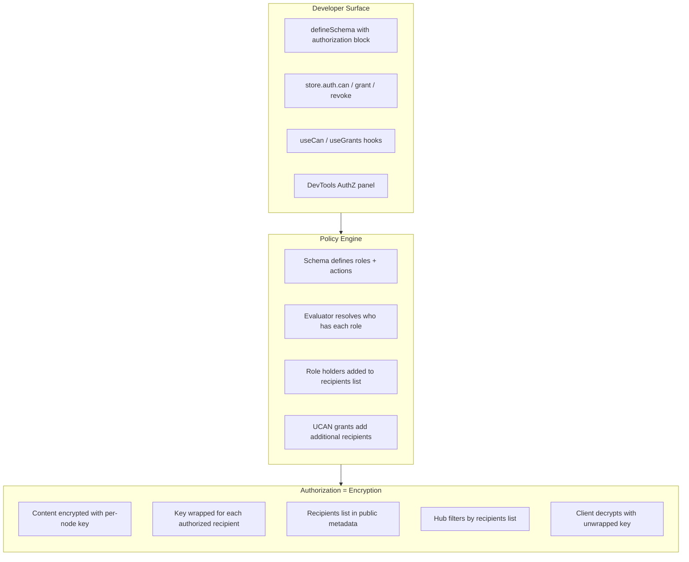
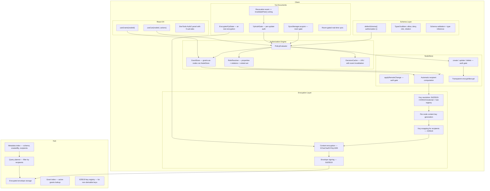

# xNet Implementation Plan - Step 03.981: Authorization Revised V2

> Encryption-first authorization for decentralized P2P data — addressing key discovery, offline policy, key recovery, and multi-device concerns while keeping the developer API clean and intuitive.

**Version:** 1.0 | **Last Updated:** February 2026 | **Predecessor:** [plan03_9_8AuthorizationRevised](../plan03_9_8AuthorizationRevised/)

---

## Why V2?

The [prior plan](../plan03_9_8AuthorizationRevised/) established excellent foundations: encryption-first design, grants-as-nodes, room-gated Yjs, and typed builders. An [architectural review](../plan03_9_8AuthorizationRevised/REVIEW.md) identified three critical gaps and numerous medium-priority issues:

| Severity | Issue                             | V1 Status       | V2 Resolution                                                                                                              |
| -------- | --------------------------------- | --------------- | -------------------------------------------------------------------------------------------------------------------------- |
| P0       | X25519 key discovery from DID     | Under-designed  | Ed25519->X25519 birational conversion + hub registry fallback ([Step 01](./01-types-encryption-and-key-resolution.md))     |
| P0       | Key backup & recovery             | Missing         | Seed-phrase derivation, encrypted hub backup, social recovery ([Step 10](./10-key-recovery-and-multi-device.md))           |
| P0       | Offline authorization policy      | Under-specified | Explicit cache TTL, revalidation strategy, staleness thresholds ([Step 05](./05-grants-delegation-and-offline-policy.md))  |
| P1       | Delegation chain limits & cascade | Missing         | maxProofDepth=4, parent revocation cascade ([Step 05](./05-grants-delegation-and-offline-policy.md))                       |
| P1       | Multi-device key distribution     | Missing         | Deterministic derivation from seed + device registry fallback ([Step 10](./10-key-recovery-and-multi-device.md))           |
| P1       | Grant conflict semantics          | Implicit        | Explicit field-level LWW docs, revokedAt-dominates rule ([Step 05](./05-grants-delegation-and-offline-policy.md))          |
| P1       | API mismatches (6 items)          | Incorrect       | Corrected throughout all steps                                                                                             |
| P1       | Existing code reconciliation      | Missing         | Explicit supersession map ([below](#relationship-to-existing-code))                                                        |
| P1       | Public nodes                      | Under-specified | Concrete well-known key + PUBLIC sentinel ([Step 02](./02-schema-authorization-model.md))                                  |
| P1       | Sync integration not explicit     | Implicit        | Explicit inherited-properties table + grant-specific rate limits ([Step 05](./05-grants-delegation-and-offline-policy.md)) |
| P2       | Last admin protection             | Missing         | validateRevocation() guard ([Step 05](./05-grants-delegation-and-offline-policy.md))                                       |
| P2       | Data migration for existing nodes | Missing         | Batch migration utility ([Step 08](./08-performance-security-and-migration.md))                                            |
| P2       | Grant expiration cleanup          | Missing         | Background pruning task ([Step 05](./05-grants-delegation-and-offline-policy.md))                                          |
| P2       | DevTools observability gaps       | Under-specified | Grant timeline, delegation tree, permission trace ([Step 07](./07-dx-devtools-and-validation.md))                          |
| P2       | Yjs revocation event wiring       | Gap             | store.subscribe() wired to authGate.invalidatePeer() ([Step 09](./09-yjs-document-authorization.md))                       |

This plan preserves every locked decision from V1 and adds the missing pieces.

## Core Insight: Encryption IS Authorization

Unchanged from V1. In a decentralized system, the only meaningful access control is **the ability to decrypt**:

```
Can you decrypt it?  --> You can read it.
In the recipients list? --> The hub will serve it to you.
Schema says you can write? --> The client will let you create a signed change.
```

Everything else — roles, relations, UCAN delegation — is machinery for determining **who gets added to the recipients list** and **who gets the content key**.



## Trust Model

> Explicitly documenting the security tradeoffs of a client-side-only authorization system.

**Read authorization** is cryptographically enforced — if you don't have the content key, you cannot read the data. This is the strongest guarantee.

**Write authorization** is enforced client-side only. A malicious client could:

1. Skip the `can()` check
2. Sign a valid `Change<T>` with their own Ed25519 key
3. Broadcast it — the hub and honest peers accept it because the signature is valid

The hub intentionally avoids complex policy evaluation ("dumb filter" design). Honest peers run `applyRemoteChange` auth gates, but a determined attacker could bypass those.

**This is an acceptable tradeoff** for the stated design philosophy:

- **Detection**: All changes are signed and part of the tamper-evident hash chain. Unauthorized writes are attributable and detectable after the fact.
- **Mitigation**: Peer scoring penalizes unauthorized write attempts. Repeated violations lead to automatic peer blocking.
- **Key rotation**: On revocation, content keys are rotated so revoked users lose future read access regardless of write-side enforcement.

## Failure Modes

| Context                                        | Auth Failure Behavior                                         | Rationale                              |
| ---------------------------------------------- | ------------------------------------------------------------- | -------------------------------------- |
| Local mutations (`store.create/update/delete`) | `throw PermissionError` (loud)                                | Developer should see and handle errors |
| Remote changes (`applyRemoteChange`)           | Silently reject + emit `change:rejected` event + peer penalty | Don't crash on bad remote data         |
| Yjs updates (`handleRemoteUpdate`)             | Silently reject + emit `update:rejected` event + peer penalty | Don't interrupt editing flow           |
| Hub queries                                    | Return only authorized results (no error)                     | Transparent filtering                  |

## Architecture Overview



## Canonical Action Matrix

| Domain | Operation           | Canonical Action | Notes                              |
| ------ | ------------------- | ---------------- | ---------------------------------- |
| Store  | `create`            | `write`          | Schema-level create check          |
| Store  | `update`            | `write`          | + optional field-level constraints |
| Store  | `delete`            | `delete`         | Soft or hard delete                |
| Store  | `restore`           | `write`          | Defaults to write action           |
| Store  | `get`, `query`      | `read`           | Gated by decryption capability     |
| Store  | `grant`, `revoke`   | `share`          | Delegation management              |
| Store  | transaction batch   | per-op           | All-or-nothing semantics           |
| Sync   | `applyRemoteChange` | derived          | Inferred from change type          |
| Yjs    | `acquire(write)`    | `write`          | Room join gate                     |
| Yjs    | `acquire(read)`     | `read`           | Decrypt Y.Doc state only           |
| Yjs    | `remoteYjsUpdate`   | `write`          | Per-update auth gate (cached)      |
| Hub    | `hub/query`         | `read`           | Filtered by recipients list        |
| Hub    | `hub/relay`         | `write`          | Relay encrypted envelopes          |
| Hub    | `hub/admin`         | `admin`          | Hub operational controls           |

## Developer API Surface

### Schema Definition

```typescript
import { defineSchema, text, person, relation } from '@xnet/data'
import { allow, deny, role, relation as rel } from '@xnet/data/auth'

const TaskSchema = defineSchema({
  name: 'Task',
  namespace: 'xnet://myapp/',
  properties: {
    title: text({ required: true }),
    assignee: person(),
    project: relation({ target: 'xnet://myapp/Project' as const }),
    editors: person({ multiple: true })
  },
  authorization: {
    roles: {
      owner: role.creator(),
      assignee: role.property('assignee'),
      editor: role.property('editors'),
      admin: role.relation('project', 'admin'),
      viewer: role.relation('project', 'viewer')
    },
    actions: {
      read: allow('viewer', 'editor', 'admin', 'owner', 'assignee'),
      write: allow('editor', 'admin', 'owner'),
      delete: allow('admin', 'owner'),
      share: allow('admin', 'owner')
    },
    publicProps: ['title']
  }
})
```

### Store API

```typescript
// Check permission
const decision = await store.auth.can({ action: 'write', nodeId })

// Explain a decision (for debugging / AI agents)
const trace = await store.auth.explain({ action: 'write', nodeId })

// Grant access
await store.auth.grant({
  to: bobDid,
  actions: ['write'],
  resource: taskId,
  expiresIn: '7d'
})

// Revoke access (with last-admin protection)
await store.auth.revoke({ grantId })

// List grants
const grants = await store.auth.listGrants({ nodeId: taskId })
```

### React Hooks

```tsx
function TaskCard({ taskId }: { taskId: string }) {
  const { canWrite, canDelete, canShare, loading } = useCan(taskId)
  const { grants, grant, revoke } = useGrants(taskId)

  return (
    <div>
      {canWrite && <EditButton />}
      {canDelete && <DeleteButton />}
      {canShare && <ShareDialog grants={grants} onGrant={grant} onRevoke={revoke} />}
    </div>
  )
}
```

## Relationship to Existing Code

This plan explicitly supersedes or extends existing authorization code:

| Existing Code                                                                          | Disposition                         | Notes                                                                                                                                   |
| -------------------------------------------------------------------------------------- | ----------------------------------- | --------------------------------------------------------------------------------------------------------------------------------------- |
| `@xnet/core/permissions.ts` (`PermissionEvaluator`, `Role`, `Capability`, `Group`)     | **Superseded** by `PolicyEvaluator` | Old interface was never implemented; new evaluator replaces it. Old types deprecated with re-exports pointing to new types.             |
| `@xnet/identity/sharing/` (`createShareToken`, `RevocationStore`, etc.)                | **Coexists** as convenience layer   | Share links continue to work as a UX convenience on top of the grant system. `createShareToken` internally creates a Grant node + UCAN. |
| `@xnet/core` `Capability` type (`'read' \| 'write' \| 'delete' \| 'share' \| 'admin'`) | **Aligned** with `AuthAction`       | Same values. `AuthAction` is the new canonical type; `Capability` re-exports it.                                                        |
| `@xnet/identity/ucan.ts`                                                               | **Extended**                        | UCAN creation/verification retained. Add `maxProofDepth` enforcement and cascade revocation.                                            |
| `@xnet/sync` Yjs security layer (`SignedYjsEnvelopeV2`, peer scoring, rate limiting)   | **Extended**                        | Add `YjsAuthGate` into the existing pipeline between signature verification and `Y.applyUpdate()`.                                      |

## Implementation Order

| #   | Document                                                                            | Description                                                                                                                               | Est. Time | Status |
| --- | ----------------------------------------------------------------------------------- | ----------------------------------------------------------------------------------------------------------------------------------------- | --------- | ------ |
| 01  | [Types, Encryption & Key Resolution](./01-types-encryption-and-key-resolution.md)   | Core types, encrypted envelope, Ed25519->X25519 birational conversion, PublicKeyResolver                                                  | 5 days    |        |
| 02  | [Schema Authorization Model](./02-schema-authorization-model.md)                    | `defineSchema()` authorization block, recipient pipeline, public nodes, presets, schema version migration                                 | 3 days    |        |
| 03  | [Authorization Engine](./03-authorization-engine.md)                                | PolicyEvaluator, role resolution with visited-set cycle detection, expression evaluation, decision cache                                  | 5 days    |        |
| 04  | [NodeStore Enforcement](./04-nodestore-enforcement.md)                              | Auth gates on all mutation paths, transparent encryption, correct API names                                                               | 3 days    |        |
| 05  | [Grants, Delegation & Offline Policy](./05-grants-delegation-and-offline-policy.md) | Grants-as-nodes, UCAN bridge, offline auth policy, delegation limits, grant conflict semantics, last-admin protection, expiration cleanup | 6 days    |        |
| 06  | [Hub and Peer Filtering](./06-hub-and-peer-filtering.md)                            | Hub metadata index, query auth filter, grant index, peer selective sync                                                                   | 5 days    |        |
| 07  | [DX, DevTools & Validation](./07-dx-devtools-and-validation.md)                     | React hooks, AuthZ panel (5 sub-tabs), AI/agent validation, recipes                                                                       | 5 days    |        |
| 08  | [Performance, Security & Migration](./08-performance-security-and-migration.md)     | Layered caches, benchmarks, conformance tests, data migration utility, staged rollout                                                     | 5 days    |        |
| 09  | [Yjs Document Authorization](./09-yjs-document-authorization.md)                    | Encrypted Y.Doc at rest, room-gated sync, revocation event wiring, per-update auth                                                        | 5 days    |        |
| 10  | [Key Recovery & Multi-Device](./10-key-recovery-and-multi-device.md)                | Seed-phrase derivation, encrypted hub backup, multi-device key sync, social recovery                                                      | 4 days    |        |

**Total estimated:** ~46 days

## Phases

| Phase | Focus                                                              | Steps  | Duration |
| ----- | ------------------------------------------------------------------ | ------ | -------- |
| 1     | **Foundation** — Types, encryption, key resolution, schema model   | 01, 02 | 8 days   |
| 2     | **Engine** — Evaluator, role resolution, NodeStore enforcement     | 03, 04 | 8 days   |
| 3     | **Delegation** — Grants, UCAN bridge, offline policy, key recovery | 05, 10 | 10 days  |
| 4     | **Federation** — Hub filtering, peer selective sync                | 06     | 5 days   |
| 5     | **DX** — React hooks, DevTools, recipes, AI validation             | 07     | 5 days   |
| 6     | **Hardening** — Performance, security, migration, rollout          | 08     | 5 days   |
| 7     | **Yjs** — Y.Doc encryption, room-gated sync, per-update auth       | 09     | 5 days   |

## Decision Baseline (Locked)

These decisions from prior explorations are **final**:

- **One evaluator** combining schema policy, relation-derived roles, and UCAN delegation.
- **Groups as nodes** — no `group()` primitive; use `relation()` traversal.
- **Schema policy is default authority** — node policy can constrain/deny, not silently override.
- **Typed builders** for auth expressions — string DSL only for single-role literals.
- **Explicit deny precedence** over all allows.
- **Grants as nodes** — sync, sign, audit via existing NodeStore infrastructure.
- **Per-node content keys** — with optional schema-level key sharing for performance.
- **Eager key rotation on revocation** — with lazy batching as optimization.
- **Eventual consistency** for revocation by default — strict mode opt-in.
- **Room-gated Yjs model** — encrypt at rest, authorize at room join, signed (not encrypted) updates in room.
- **Ed25519->X25519 birational conversion** as primary key resolution strategy (NEW in V2).
- **Deterministic key derivation from seed** as primary multi-device strategy (NEW in V2).
- **revokedAt > 0 dominates** in grant conflict resolution — security via key rotation (NEW in V2).

## Global Validation Gates

- [ ] All mutating paths enforce authorization deterministically.
- [ ] Every node is encrypted with per-node content key before leaving client.
- [x] Y.Doc state is encrypted at rest with per-node content key (`EncryptedYjsState`).
- [x] Y.Doc sync rooms are gated by authorization — unauthorized peers cannot join.
- [x] Remote Yjs updates are checked against `PolicyEvaluator` before applying.
- [x] Revocation events are wired to `YjsAuthGate.invalidatePeer()` across all active rooms.
- [ ] Hub filters query results by recipient lists without decrypting.
- [x] Delegation chains enforce attenuation, expiration, and depth limits (max 4).
- [x] Offline authorization uses explicit cache TTL (5 min default) with configurable revalidation.
- [x] Key recovery via seed phrase allows full access restoration on new device.
- [x] Decision traces are structured and explainable.
- [ ] Benchmarks hit target budgets (warm `can()` < 1ms p50, cold < 10ms p50).
- [ ] Conformance tests cover deny precedence, traversal limits, conflict edges.
- [ ] DevTools AuthZ panel shows live authorization state with grant timeline.
- [x] Type-level tests validate schema auth typing guarantees.
- [x] AI agents can validate authorization rules via `explain()` API.
- [x] Last-admin protection prevents unrecoverable permission loss.
- [x] Public nodes use well-known content key with `PUBLIC` sentinel in recipients.
- [x] Legacy schemas without authorization block emit console warning in compat mode.
- [x] Data migration utility can batch-encrypt existing unencrypted nodes.

## Risks and Mitigations

| Risk                                    | Impact                                | Mitigation                                                                                            |
| --------------------------------------- | ------------------------------------- | ----------------------------------------------------------------------------------------------------- |
| Key rotation on revocation is expensive | High latency for large recipient sets | Batch revocations, lazy rotation for low-risk schemas                                                 |
| Relation traversal cycles               | Non-termination                       | Visited-set + max-depth (3) + max-nodes (100)                                                         |
| Metadata leaks social graph             | Privacy concern                       | Minimize publicProps, document tradeoffs                                                              |
| Revocation lag offline                  | Temporary over-permission             | Explicit cache TTL (5 min), max staleness (1 hour), revalidation on reconnect                         |
| Hub recipient index grows large         | Query performance                     | Bloom filter optimization, periodic compaction                                                        |
| Yjs room-gated trust boundary           | Updates visible to room members       | Room join requires auth; per-update gate rejects unauthorized signers; revocation kicks + rotates key |
| Seed phrase loss = permanent data loss  | Unrecoverable                         | Social recovery (Shamir's), encrypted hub backup, multi-device redundancy                             |
| Write-side auth is client-only          | Malicious clients can bypass          | Signed changes are attributable; peer scoring detects; key rotation limits blast radius               |
| Clock skew affects grant expiry         | Inconsistent behavior                 | Document 60-second tolerance; use Lamport timestamps for grant ordering                               |

## Success Criteria

- One typed API surface for authorization across schema, store, hub, and React.
- Enforcement parity between local and replicated changes.
- No authorization bypass in fuzz and adversarial tests.
- Hub query filtering is transparent — developers write normal queries, unauthorized data is automatically excluded.
- Migration guide enables adoption without custom forks.
- AI agents can introspect and validate authorization rules programmatically.
- Key recovery path exists for every user — no permanent data loss from device loss.
- Offline experience is well-defined with explicit staleness thresholds.

---

[Back to Plans](../) | [Start with Step 01 ->](./01-types-encryption-and-key-resolution.md) | [Key Recovery ->](./10-key-recovery-and-multi-device.md)
