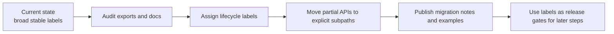

# 01: Lifecycle Matrix and Export Tiering

> Publish an honest API contract before changing the runtime underneath it.

**Duration:** 3-5 days  
**Dependencies:** none  
**Primary packages:** `@xnetjs/react`, `@xnetjs/data`, `@xnetjs/identity`, `@xnetjs/data-bridge`

## Objective

Define which xNet APIs are actually stable today, move partial surfaces behind explicit subpaths, and update package docs so external users can understand the contract without reading the source.

## Scope and Dependencies

This step intentionally comes first because every later runtime and data-model change will otherwise create avoidable ambiguity at the npm boundary.

This step depends on repository evidence that already exists:

- [`packages/README.md`](../../../packages/README.md) currently labels nearly the entire package set as `Stable`.
- [`docs/ROADMAP.md`](../../ROADMAP.md) still lists package lifecycle clarity as unfinished.
- Top-level entrypoints such as [`packages/react/src/index.ts`](../../../packages/react/src/index.ts) and [`packages/data/src/index.ts`](../../../packages/data/src/index.ts) aggregate a very broad surface area.

## Relevant Codebase Touchpoints

- [`packages/README.md`](../../../packages/README.md)
- [`docs/ROADMAP.md`](../../ROADMAP.md)
- [`packages/react/src/index.ts`](../../../packages/react/src/index.ts)
- [`packages/react/package.json`](../../../packages/react/package.json)
- [`packages/data/src/index.ts`](../../../packages/data/src/index.ts)
- [`packages/data/package.json`](../../../packages/data/package.json)
- [`packages/identity/src/index.ts`](../../../packages/identity/src/index.ts)
- [`packages/identity/package.json`](../../../packages/identity/package.json)
- [`packages/data-bridge/package.json`](../../../packages/data-bridge/package.json)

## Proposed Design

### Lifecycle vocabulary

Adopt four explicit labels and use them consistently across package docs, changelogs, and export maps:

| Label | Meaning | Commitments |
| --- | --- | --- |
| `stable` | default recommended API | semver-respecting changes, strong tests, docs/examples must stay current |
| `experimental` | shipped but still converging | may change in minor releases, must be opt-in by name or subpath |
| `deprecated` | supported transition surface | must document migration path and removal target |
| `internal` | not public contract | no semver guarantee, not re-exported from main docs |

### Initial package recommendations

| Package | Current issue | Proposed outcome |
| --- | --- | --- |
| `@xnetjs/react` | one large entrypoint mixes core hooks, database hooks, onboarding, plugin, and sync-adjacent surfaces | keep `useQuery`, `useMutate`, `useNode`, provider, and identity hooks at the stable root; move database, onboarding, and experimental runtime helpers behind named subpaths if they are not yet ready for stable labeling |
| `@xnetjs/data` | schema, store, updates, awareness, comments, migration lenses, and built-in schema helpers all export from one barrel | keep schema/store primitives stable at the root; move niche or still-evolving surfaces into focused subpaths such as `@xnetjs/data/updates`, `@xnetjs/data/awareness`, `@xnetjs/data/comments`, `@xnetjs/data/lenses` |
| `@xnetjs/identity` | older and newer passkey/key-bundle surfaces coexist in one entrypoint | separate stable identity bootstrap from advanced key-bundle or test-only helpers |
| `@xnetjs/data-bridge` | package is documented as stable while the worker-first path is not yet the default production path | mark root bridge contract as experimental until Step 08 release gates pass |

## Architecture Sketch



## Concrete Implementation Notes

### 1. Build the export inventory

Create a small script or typed report that records:

- package name,
- exported symbol,
- source file,
- current docs status,
- proposed lifecycle label,
- migration note if changing.

The output can live under `docs/reference/api-lifecycle-matrix.md` or a generated JSON file checked into the repo for review.

### 2. Split root versus subpath exports

Prefer explicit entrypoints over broad root barrels.

Example target for `@xnetjs/react`:

```typescript
// packages/react/src/index.ts
export { XNetProvider, useQuery, useMutate, useNode } from './stable'

// packages/react/src/database.ts
export { useDatabase, useDatabaseDoc, useDatabaseRow, useCell } from './database'
```

And in `package.json`:

```json
{
  "exports": {
    ".": "./dist/index.js",
    "./database": "./dist/database.js",
    "./experimental": "./dist/experimental.js"
  }
}
```

### 3. Add docs-from-code discipline

For any package listed as `stable`, require all of the following before the label is applied:

- current README examples compile or are covered by type tests,
- at least one test file exercises the contract,
- changelog or plan references point to the current API,
- no known replacement is already preferred internally.

### 4. Publish migration tables

Every moved or deprecated export should have:

- old import path,
- new import path,
- lifecycle status,
- removal target or review date.

## Testing and Validation Approach

- Run `pnpm typecheck` after any export-map change.
- Add focused type tests for the root and subpath imports.
- Smoke-test docs snippets in package READMEs or a dedicated examples package.
- Verify that apps continue importing from the intended stable entrypoints after the split.

## Risks, Edge Cases, and Migration Concerns

- Subpath export changes can break consumers even when code behavior is unchanged.
- Documentation drift will return quickly unless the lifecycle matrix becomes part of release review.
- Some internal-only exports may currently be used by app code; those usages need to be identified before tightening contracts.

## Step Checklist

- [ ] Inventory current exports for the target packages.
- [ ] Assign lifecycle labels per export group.
- [ ] Update `packages/README.md` to reflect the real package maturity.
- [ ] Add or tighten `package.json` export maps for explicit stable and experimental subpaths.
- [ ] Write migration notes for any moved or deprecated imports.
- [ ] Add type-level or example-level coverage for stable entrypoints.
- [ ] Remove any remaining documentation that implies broader stability than the code currently supports.
