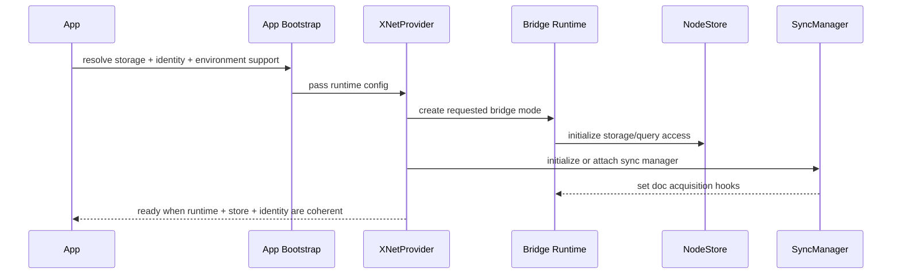

# 02: Provider Runtime and Bridge Defaults

> Make runtime mode an explicit product decision instead of an incidental implementation detail.

**Duration:** 4-6 days  
**Dependencies:** [01-lifecycle-matrix-and-export-tiering.md](./01-lifecycle-matrix-and-export-tiering.md)  
**Primary packages:** `@xnetjs/react`, `@xnetjs/data-bridge`, `apps/web`, `apps/electron`

## Objective

Converge `XNetProvider` and app bootstrap around explicit runtime modes so that web, Electron, and future IPC-backed environments all share the same conceptual model.

## Scope and Dependencies

The current runtime boundary is directionally correct but still transitional:

- [`packages/react/src/context.ts`](../../../packages/react/src/context.ts) creates `MainThreadBridge` by default.
- [`packages/data-bridge/src/worker-bridge.ts`](../../../packages/data-bridge/src/worker-bridge.ts) already implements a worker-based bridge with query deltas and mirrored Y.Docs.
- [`apps/web/src/App.tsx`](../../../apps/web/src/App.tsx) initializes SQLite and the provider directly but does not yet make the bridge mode a first-class decision.

This step establishes the bootstrap contract that later query, sync, and web work will depend on.

## Relevant Codebase Touchpoints

- [`packages/react/src/context.ts`](../../../packages/react/src/context.ts)
- [`packages/react/src/hooks/useNode.ts`](../../../packages/react/src/hooks/useNode.ts)
- [`packages/data-bridge/src/main-thread-bridge.ts`](../../../packages/data-bridge/src/main-thread-bridge.ts)
- [`packages/data-bridge/src/worker-bridge.ts`](../../../packages/data-bridge/src/worker-bridge.ts)
- [`packages/data-bridge/src/worker`](../../../packages/data-bridge/src/worker)
- [`apps/web/src/App.tsx`](../../../apps/web/src/App.tsx)
- [`apps/electron/src/renderer/lib/ipc-sync-manager.ts`](../../../apps/electron/src/renderer/lib/ipc-sync-manager.ts)

## Proposed Runtime Model

Introduce an explicit runtime descriptor:

```typescript
export type XNetRuntimeMode = 'main-thread' | 'worker' | 'ipc'

export type XNetRuntimeConfig = {
  mode: XNetRuntimeMode
  fallback?: 'main-thread' | 'error'
  diagnostics?: boolean
}
```

And expose it in provider setup:

```typescript
<XNetProvider
  config={{
    runtime: { mode: 'worker', fallback: 'main-thread' },
    nodeStorage,
    identity,
    keyBundle
  }}
>
  <App />
</XNetProvider>
```

### Runtime policy by platform

| Platform | Default mode | Fallback | Notes |
| --- | --- | --- | --- |
| Web | `worker` | `main-thread` only when explicitly supported and observable | UI responsiveness is the primary concern |
| Electron renderer | `ipc` or `worker`, depending on finalized architecture | no hidden main-thread fallback | long-running tasks should live outside the renderer where possible |
| Tests | explicit per suite | none by default | test failures should reveal accidental fallbacks |

## Boot Sequence



## Concrete Implementation Notes

### 1. Separate bootstrap from provider state management

Refactor `XNetProvider` so it receives either:

- an explicit runtime descriptor, or
- a prebuilt bridge/runtime object from app bootstrap.

That avoids duplicating environment decisions across app code and provider internals.

### 2. Make fallback visible

If the requested runtime falls back, expose it through:

- a provider field such as `runtimeStatus`,
- telemetry events,
- and optional devtools surfacing.

Silent fallback is acceptable only during local development, not in release evaluation.

### 3. Keep Y.Doc acquisition aligned with runtime mode

`useNode()` and any document-editing APIs should not care whether a document came from:

- a main-thread bridge,
- a worker mirror,
- or an IPC-backed bridge.

That means the acquire/release contract needs one canonical shape across all runtimes.

### 4. Avoid another "phase 0 forever" trap

Do not leave comments that imply worker/IPC is "future" once this step lands. Update docs and naming so the intended production path is obvious in code.

## Testing and Validation Approach

- Add provider/bootstrap tests that assert which runtime mode is active.
- Add worker bootstrap tests that cover initialization, error fallback, and ready-state timing.
- Add a negative test for accidental silent fallback in production-like config.
- Smoke-test web bootstrap and Electron bootstrap independently.

## Risks, Edge Cases, and Migration Concerns

- Worker initialization failures can turn app boot into a dead zone unless timeout and fallback behavior are deterministic.
- IPC mode will likely differ from web worker mode in implementation, but not in public contract; that separation must stay disciplined.
- Any bridge refactor risks subtle issues around subscription identity and Y.Doc lifetime management.

## Step Checklist

- [ ] Define the runtime mode types and public provider contract.
- [ ] Refactor provider initialization to consume explicit runtime config.
- [ ] Make worker mode the default intended web path.
- [ ] Define Electron's explicit runtime mode instead of leaving renderer behavior implicit.
- [ ] Surface fallback and runtime diagnostics through provider state and telemetry.
- [ ] Align document acquire/release semantics across bridge implementations.
- [ ] Add bootstrap tests that fail on unexpected runtime drift.
