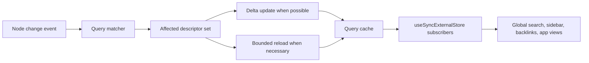

# 03: Live Query Runtime and Invalidation

> Turn `useQuery()` from a thin subscription wrapper into a real live-query layer.

**Duration:** 6-8 days  
**Dependencies:** [02-provider-runtime-and-bridge-defaults.md](./02-provider-runtime-and-bridge-defaults.md)  
**Primary packages:** `@xnetjs/react`, `@xnetjs/data-bridge`, `@xnetjs/query`

## Objective

Replace coarse schema-wide query reloads with targeted live-query invalidation, canonical query descriptors, and delta-aware subscriptions that scale to search, navigation, and background updates.

## Progress Update

As of **March 6, 2026**, the core runtime work for this step has landed:

- `@xnetjs/data-bridge` now has a shared `QueryDescriptor` normalization and serialization layer.
- `MainThreadBridge`, `NativeBridge`, and `WorkerBridge` all expose a real `reloadQuery()` path.
- schema-wide invalidation has been replaced with descriptor matching plus bounded reload fallback for paginated windows.
- `useQuery()` now keys subscriptions off the canonical descriptor and delegates reloads to the active bridge.

The remaining open work in this step is the proving-surface follow-through:

- migrate search and backlinks onto the converged runtime,
- add higher-level integration coverage beyond hook/bridge unit tests,
- and record query fanout benchmarks.

## Scope and Dependencies

The relevant current state is visible in three places:

- [`packages/react/src/hooks/useQuery.ts`](../../../packages/react/src/hooks/useQuery.ts) still stringifies inputs for dependency stability and its `reload()` function does not currently force a resubscribe.
- [`packages/data-bridge/src/main-thread-bridge.ts`](../../../packages/data-bridge/src/main-thread-bridge.ts) reloads every cached query for a schema on every matching node change.
- [`packages/query/src/local/engine.ts`](../../../packages/query/src/local/engine.ts) full-scans documents and computes counts by rerunning the full query.

This step provides the reactive materialization layer that the UI and sync surfaces need.

## Relevant Codebase Touchpoints

- [`packages/react/src/hooks/useQuery.ts`](../../../packages/react/src/hooks/useQuery.ts)
- [`packages/data-bridge/src/main-thread-bridge.ts`](../../../packages/data-bridge/src/main-thread-bridge.ts)
- [`packages/data-bridge/src/query-cache.ts`](../../../packages/data-bridge/src/query-cache.ts)
- [`packages/data-bridge/src/worker-bridge.ts`](../../../packages/data-bridge/src/worker-bridge.ts)
- [`packages/query/src/local/engine.ts`](../../../packages/query/src/local/engine.ts)
- [`apps/web/src/components/GlobalSearch.tsx`](../../../apps/web/src/components/GlobalSearch.tsx)
- [`apps/web/src/components/Sidebar.tsx`](../../../apps/web/src/components/Sidebar.tsx)
- [`apps/web/src/components/BacklinksPanel.tsx`](../../../apps/web/src/components/BacklinksPanel.tsx)

## Proposed Design

### Canonical query descriptor

Replace ad hoc object-stringification with a first-class descriptor:

```typescript
export type QueryDescriptor = {
  schemaId: string
  nodeId?: string
  where?: Record<string, unknown>
  includeDeleted?: boolean
  orderBy?: Record<string, 'asc' | 'desc'>
  limit?: number
  offset?: number
}
```

And a shared serializer:

```typescript
const queryKey = serializeQueryDescriptor(descriptor)
```

### Query invalidation rule

Every node change should answer:

1. Which descriptors reference this schema?
2. Which of those descriptors could include this node before or after the change?
3. Can the result be updated by delta, or does it require a bounded reload?

### Delta-first updates

Whenever possible, use:

- `add`,
- `remove`,
- `update`,

instead of full result reloads.

The worker bridge already moves in that direction; the main-thread and query-engine paths need to converge onto the same semantics.

## Data Flow



## Concrete Implementation Notes

### 1. Fix `reload()` as a real bridge operation

`reload()` should call into the bridge or query cache directly, not mutate an unused ref.

Possible shape:

```typescript
const reload = useCallback(() => {
  bridge?.reload(queryKey)
}, [bridge, queryKey])
```

### 2. Share one descriptor implementation across bridge modes

Do not let `useQuery()`, `MainThreadBridge`, `WorkerBridge`, and the local query engine each invent their own option-normalization rules.

Introduce one shared normalization pipeline:

- normalize user filter input,
- sort keys deterministically,
- create a descriptor,
- derive the key from the descriptor.

### 3. Add a query matcher

Create a helper that can answer whether a changed node affects a descriptor:

- schema match,
- node-id match,
- filter match,
- includeDeleted behavior,
- ordering and pagination implications.

Pagination-sensitive queries may still require targeted reload, but only for the affected descriptor, not the entire schema.

### 4. Converge search and backlinks on the live query layer

Search, sidebar navigation, and backlinks should stop doing bespoke local filtering over fixed lists once the live-query runtime exists.

`GlobalSearch` is the immediate proving case because it currently:

- fetches a limited page list,
- scores only titles,
- and lives outside the stronger query/search runtime.

## Testing and Validation Approach

- Add unit tests for descriptor normalization and key stability.
- Add query-matcher tests that cover create, update, delete, restore, and filter transitions.
- Add `useQuery()` tests for `reload()` semantics and subscription churn.
- Add integration tests covering search and backlinks under ongoing edits.
- Record query fanout metrics before and after the change.

## Risks, Edge Cases, and Migration Concerns

- Pagination and sorted windows are the trickiest cases for delta updates.
- Filter support must stay aligned with the query engine and bridge cache or false positives will cause correctness bugs.
- A more sophisticated live-query system can become opaque without devtools support, so Step 07 is a hard dependency for long-term maintainability.

## Step Checklist

- [x] Introduce a canonical query descriptor and serializer.
- [x] Make `useQuery().reload()` trigger an actual reload path.
- [x] Replace schema-wide invalidation with descriptor matching.
- [x] Implement delta updates where ordering and pagination allow it.
- [x] Keep bounded reload as the fallback for complex cases.
- [ ] Route search, backlinks, and navigation onto the converged query/runtime path.
- [ ] Add unit and integration coverage for live-query correctness and fanout.
