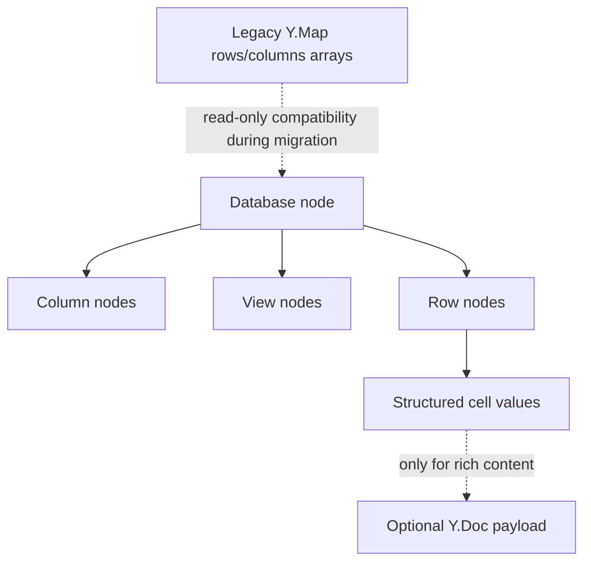

# 04: Database Model Convergence

> Pick one database model and make every surface use it.

**Duration:** 7-10 days  
**Dependencies:** [03-live-query-runtime-and-invalidation.md](./03-live-query-runtime-and-invalidation.md)  
**Primary packages:** `@xnetjs/data`, `@xnetjs/react`, `@xnetjs/views`, `apps/web`, `apps/electron`

## Objective

Converge xNet databases around one canonical structured-data model so that hooks, views, undo/redo, sync, and app behavior all reason about the same representation.

## Scope and Dependencies

This step intentionally builds on the earlier database plan instead of replacing it:

- [`plan03_9_3DatabaseDataModel`](../plan03_9_3DatabaseDataModel/README.md) already outlines a node-native direction.
- [`apps/electron/src/renderer/components/DatabaseView.tsx`](../../../apps/electron/src/renderer/components/DatabaseView.tsx) now composes over [`useDatabaseDoc()`](../../../packages/react/src/hooks/useDatabaseDoc.ts) and [`useDatabase()`](../../../packages/react/src/hooks/useDatabase.ts), but it still retains Y.Doc-backed schema metadata and undo wiring that need a deliberate final convergence story.
- [`apps/web/src/components/DatabaseView.tsx`](../../../apps/web/src/components/DatabaseView.tsx) now composes over [`useDatabaseDoc()`](../../../packages/react/src/hooks/useDatabaseDoc.ts) and [`useDatabase()`](../../../packages/react/src/hooks/useDatabase.ts), but it still depends on a temporary legacy compatibility path for older documents.
- [`packages/react/src/index.ts`](../../../packages/react/src/index.ts) already exports `useDatabase`, `useDatabaseDoc`, `useDatabaseRow`, and `useCell`, which implies a more granular model than the active app views actually use.

That split needs to end before database UX, large tables, or canvas-to-ERP evolution can be trusted.

## Relevant Codebase Touchpoints

- [`packages/react/src/hooks/useDatabase.ts`](../../../packages/react/src/hooks/useDatabase.ts)
- [`packages/react/src/hooks/useDatabaseDoc.ts`](../../../packages/react/src/hooks/useDatabaseDoc.ts)
- [`packages/react/src/hooks/useDatabaseRow.ts`](../../../packages/react/src/hooks/useDatabaseRow.ts)
- [`packages/data/src/database/legacy-model.ts`](../../../packages/data/src/database/legacy-model.ts)
- [`packages/views`](../../../packages/views)
- [`apps/web/src/components/DatabaseView.tsx`](../../../apps/web/src/components/DatabaseView.tsx)
- [`apps/electron/src/renderer/components/DatabaseView.tsx`](../../../apps/electron/src/renderer/components/DatabaseView.tsx)
- [`docs/explorations/0099_[_]_DATABASE_EDITING_UX_AND_UNDO_REDO_REMEDIATION_PLAN.md`](../../explorations/0099_[_]_DATABASE_EDITING_UX_AND_UNDO_REDO_REMEDIATION_PLAN.md)

## Current Progress

### Landed in this slice

- legacy database reads and writes now funnel through one compatibility layer in [`packages/data/src/database/legacy-model.ts`](../../../packages/data/src/database/legacy-model.ts) instead of being re-implemented ad hoc in app code.
- [`useDatabaseDoc()`](../../../packages/react/src/hooks/useDatabaseDoc.ts) and [`useDatabase()`](../../../packages/react/src/hooks/useDatabase.ts) now own the legacy-vs-canonical branching for columns, views, and row mutations.
- the web database surface now uses those hooks in [`apps/web/src/components/DatabaseView.tsx`](../../../apps/web/src/components/DatabaseView.tsx) instead of mutating the database `data` Y.Map directly.
- regression coverage now exists for the persisted legacy shape in [`packages/data/src/database/legacy-model.test.ts`](../../../packages/data/src/database/legacy-model.test.ts).
- explicit legacy materialization now lives in [`packages/data/src/database/legacy-migration.ts`](../../../packages/data/src/database/legacy-migration.ts), with status recording surfaced through [`useDatabaseDoc()`](../../../packages/react/src/hooks/useDatabaseDoc.ts) and migration coverage in [`packages/data/src/database/legacy-migration.test.ts`](../../../packages/data/src/database/legacy-migration.test.ts).
- the Electron database surface now uses the same hook layer in [`apps/electron/src/renderer/components/DatabaseView.tsx`](../../../apps/electron/src/renderer/components/DatabaseView.tsx) for rows, columns, views, and board reordering instead of writing whole `rows`/`columns` arrays into the document `data` map.
- canonical row reordering now resolves row ids inside [`useDatabase()`](../../../packages/react/src/hooks/useDatabase.ts) and is backed by corrected fractional-index positioning in [`packages/data/src/database/row-operations.ts`](../../../packages/data/src/database/row-operations.ts), with focused coverage in [`packages/react/src/hooks/useDatabase.test.tsx`](../../../packages/react/src/hooks/useDatabase.test.tsx) and [`packages/data/src/database/row-operations.test.ts`](../../../packages/data/src/database/row-operations.test.ts).
- legacy-model detection no longer treats schema metadata alone as proof of legacy storage state in [`packages/data/src/database/legacy-model.ts`](../../../packages/data/src/database/legacy-model.ts), which keeps canonical docs from being stuck in `mixed` purely because Electron still records schema metadata/history in `data`.

### Still open before this step is complete

- structured undo and rich-text undo are still coupled in the Electron implementation.
- sync correctness and cross-device migration tests for databases are still missing.

## Proposed Design

### Canonical representation

Use NodeStore-backed entities for:

- database metadata,
- columns,
- views,
- rows,
- row ordering metadata.

Use Yjs only where it is genuinely the best fit:

- rich text cell content,
- collaborative freeform embedded content,
- ephemeral presence/awareness.

### Transition rule

No app surface should directly treat the entire database as a single mutable Y.Map blob once this step is complete.

## Model Diagram



## Concrete Implementation Notes

### 1. Define the migration boundary

Support a temporary adapter that can:

- read legacy Y.Map-backed database docs,
- materialize them into canonical row and column nodes,
- and record migration status so the app does not repeat conversion silently.

Migration must be:

- explicit,
- idempotent,
- and observable.

### 2. Make hooks the source of truth

`packages/views` and app components should consume the hook layer, not re-implement database persistence.

That means `DatabaseView` in web and Electron should become thin composition over:

- `useDatabaseDoc()` for columns and views,
- `useDatabase()` for row windows,
- `useDatabaseRow()` or `useCell()` for edits.

### 3. Separate structured undo from document undo

Structured row and metadata mutations should use NodeStore/history semantics.

Yjs undo should remain scoped to rich-text or embedded-document editing. That avoids the current confusion where whole-array Y.Map rewrites flatten too much into one undo domain.

### 4. Preserve ERP and canvas evolution

A node-native database model is also the cleaner foundation for:

- formulas and rollups,
- permissions,
- relation traversal,
- large-table pagination,
- and future canvas-to-database integration.

## Suggested API Direction

```typescript
const { database, columns, rows, total, loadMore, createRow, updateRow } = useDatabase(databaseId)
```

The view layer should not know whether data came from local NodeStore materialization, a worker runtime, or background sync replay.

## Testing and Validation Approach

- Add migration tests from legacy Y.Map-backed database docs.
- Add correctness tests for row create, update, delete, reorder, and view changes.
- Add undo/redo tests that separate structured edits from rich-text cell edits.
- Add multi-device sync tests for database row updates and ordering.
- Validate rendering and interaction in both web and Electron after migration.

## Risks, Edge Cases, and Migration Concerns

- Legacy databases may already contain edge-case shapes that do not map cleanly to the canonical model.
- Reorder semantics need careful handling to avoid introducing subtle sort instability.
- Partial migration can create a worse state than either model alone, so the cutover must be crisp.

## Step Checklist

- [ ] Reaffirm the canonical node-native database model from the earlier plan.
- [x] Design an explicit migration path from legacy Y.Map-backed database documents.
- [x] Move web and Electron database views onto the hook-driven model.
- [ ] Separate structured undo semantics from rich-text Yjs undo semantics.
- [ ] Add sync and migration tests for database correctness.
- [x] Remove direct whole-array database persistence from app components once migration is complete.
