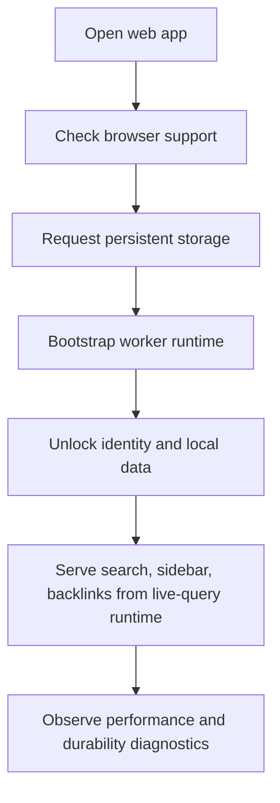

# 06: Web Durability and Performance Proving Ground

> Use the web app to prove the converged platform under the hardest public constraints.

**Duration:** 5-7 days  
**Dependencies:** [05-background-sync-and-security-hardening.md](./05-background-sync-and-security-hardening.md)  
**Primary packages:** `apps/web`, `@xnetjs/react`, `@xnetjs/sqlite`

## Objective

Make the web app the first trustworthy expression of the converged platform by tightening storage durability, search/navigation behavior, and worker-first responsiveness.

## Scope and Dependencies

The current web app is close enough to matter:

- [`apps/web/src/App.tsx`](../../../apps/web/src/App.tsx) already boots SQLite with OPFS and authenticates the user.
- [`packages/sqlite/src/browser-support.ts`](../../../packages/sqlite/src/browser-support.ts) already detects OPFS support and warning conditions.
- [`apps/web/src/components/StorageWarningBanner.tsx`](../../../apps/web/src/components/StorageWarningBanner.tsx) already exposes some warning UI.
- [`apps/web/src/components/GlobalSearch.tsx`](../../../apps/web/src/components/GlobalSearch.tsx), [`Sidebar.tsx`](../../../apps/web/src/components/Sidebar.tsx), and [`BacklinksPanel.tsx`](../../../apps/web/src/components/BacklinksPanel.tsx) still reveal query/runtime limitations directly.

This step is where the runtime work becomes visibly credible to users.

## Relevant Codebase Touchpoints

- [`apps/web/src/App.tsx`](../../../apps/web/src/App.tsx)
- [`apps/web/src/components/StorageWarningBanner.tsx`](../../../apps/web/src/components/StorageWarningBanner.tsx)
- [`apps/web/src/components/GlobalSearch.tsx`](../../../apps/web/src/components/GlobalSearch.tsx)
- [`apps/web/src/components/Sidebar.tsx`](../../../apps/web/src/components/Sidebar.tsx)
- [`apps/web/src/components/BacklinksPanel.tsx`](../../../apps/web/src/components/BacklinksPanel.tsx)
- [`packages/sqlite/src/browser-support.ts`](../../../packages/sqlite/src/browser-support.ts)

## Proposed Design

### Web durability contract

On supported browsers, the app should explicitly:

1. request persistent storage,
2. record the result,
3. show the user what it means,
4. and keep functioning gracefully if persistence is unavailable.

### Worker-first boot

The web app should use the runtime contract from Step 02 to prefer worker mode by default and surface any fallback clearly.

### Query-backed navigation

After Step 03 lands, the web app should stop relying on:

- fixed-size list fetches,
- title-only search,
- TODO backlinks.

Search, navigation, and backlinks should all ride the same converged live-query runtime.

## Flow Diagram



## Concrete Implementation Notes

### 1. Request persistent storage explicitly

Use the persistent storage API where available and reflect the result in app state.

Suggested shape:

```typescript
const persisted = await navigator.storage?.persist?.()
```

Record:

- whether the API exists,
- whether persistence was granted,
- and what warning to show if it was not.

### 2. Tie storage warnings to actionable states

The current warning path should become more explicit:

- unsupported browser,
- supported but non-persistent,
- supported with persistence,
- fallback-to-limited-storage mode.

### 3. Upgrade search and backlinks as runtime proof points

`GlobalSearch` should move away from a title-only loop over a fixed page set.

The acceptance bar for this step is not "fancy search." It is:

- body-aware results,
- snippets,
- reactive updates,
- and no hard-coded list cap as the primary search strategy.

### 4. Tighten large-workspace navigation

The sidebar and related navigation surfaces should rely on:

- pagination or virtualization,
- live query updates,
- and stable performance at higher node counts.

## Testing and Validation Approach

- Add browser-level validation for persistent-storage request outcomes.
- Run focused web flows with test-auth bypass enabled before assertions.
- Manually validate search, navigation, and backlink updates under active edits.
- Capture boot timing and route-open timing under the intended worker runtime.

## Risks, Edge Cases, and Migration Concerns

- Browser persistence prompts behave differently across engines, so the app must explain outcomes rather than promise identical behavior everywhere.
- Worker-first boot can regress first-load UX if initialization errors are not surfaced quickly.
- Search improvements must be tied to the live-query runtime or they will become another parallel data path.

## Step Checklist

- [ ] Request persistent storage explicitly in supported browsers.
- [ ] Surface persistence state and fallback implications in the app UI.
- [ ] Use the intended worker runtime as the default web path.
- [ ] Route search, sidebar, and backlinks through the converged live-query layer.
- [ ] Validate large-workspace navigation behavior with pagination or virtualization.
- [ ] Record web durability and responsiveness baselines for Step 08 release gates.
