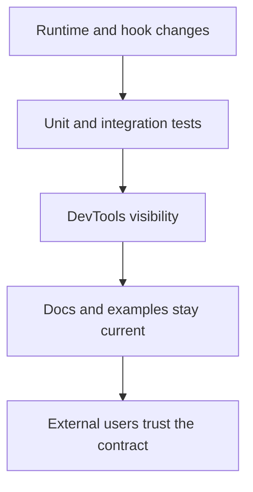

# 07: Tests, DevTools, and Documentation Alignment

> Make the public story match the actual platform behavior.

**Duration:** 4-6 days  
**Dependencies:** [06-web-durability-and-performance-proving-ground.md](./06-web-durability-and-performance-proving-ground.md)  
**Primary packages:** `tests`, `@xnetjs/devtools`, `@xnetjs/react`, docs

## Objective

Close the confidence gap at the hook/runtime boundary by updating stale tests, exposing the new runtime in devtools, and making public documentation describe the current API instead of historical intermediate states.

## Scope and Dependencies

This step addresses visible drift that already exists:

- [`tests/integration/src/crud.test.tsx`](../../../tests/integration/src/crud.test.tsx) and [`tests/integration/src/document-sync.test.tsx`](../../../tests/integration/src/document-sync.test.tsx) still reference `useDocument` and `IndexedDBNodeStorageAdapter`.
- Historical explorations and plans can remain historical artifacts, but public package docs and examples need to reflect the current API.
- The new live-query and runtime model from Steps 02-06 will be hard to trust without inspection tooling.

## Relevant Codebase Touchpoints

- [`tests/integration/src/crud.test.tsx`](../../../tests/integration/src/crud.test.tsx)
- [`tests/integration/src/document-sync.test.tsx`](../../../tests/integration/src/document-sync.test.tsx)
- [`tests/README.md`](../../../tests/README.md)
- [`packages/react`](../../../packages/react)
- [`packages/devtools`](../../../packages/devtools)
- [`packages/README.md`](../../../packages/README.md)
- [`docs/ROADMAP.md`](../../ROADMAP.md)

## Proposed Design

### Coverage pyramid for the converged platform

| Layer | Main concern | Examples |
| --- | --- | --- |
| Unit | descriptor normalization, bridge matching, sync state transitions | `useQuery`, query matcher, sync state machine |
| Integration | provider bootstrap, live query updates, sync replay, database migrations | worker boot, multi-device data convergence |
| App proof | real user flows in web and Electron | search, edit, reconnect, recover |

### Devtools additions

Add or extend panels for:

- active runtime mode,
- bridge fallback state,
- active live-query descriptors,
- sync lifecycle state,
- last verification failure,
- persistent-storage status in web.

### Documentation policy

Going forward:

- public docs must describe current APIs,
- migration notes must cover deprecated APIs,
- historical plans stay historical but should not be mistaken for current guidance.

## Diagram

## Concrete Implementation Notes

### 1. Rewrite stale integration tests

Move the integration suites to:

- current provider/bootstrap flows,
- current storage adapters,
- current hook names.

Where browser automation is used, follow the repo rule for test-auth bypass before making auth-sensitive assertions.

### 2. Add contract tests for stable entrypoints

For any API labeled `stable` in Step 01:

- add a direct test or example,
- keep the import path under coverage,
- and verify behavior under the intended runtime mode.

### 3. Add runtime and query visibility

The live-query runtime from Step 03 should expose enough metadata for a query/debug panel:

- descriptor key,
- subscriber count,
- last delta type,
- last reload reason,
- last update latency.

### 4. Mark historical docs clearly where needed

Do not rewrite every old exploration or plan. Instead:

- update public entry docs,
- add migration notes,
- and mark older artifacts as historical context when they mention superseded APIs.

## Testing and Validation Approach

- Run targeted integration suites for CRUD, sync, and database flows.
- Validate devtools output manually while exercising worker boot, query updates, and reconnect behavior.
- Ensure README and package docs examples compile or are covered by type tests.

## Risks, Edge Cases, and Migration Concerns

- Docs cleanup can sprawl unless the boundary between public docs and historical artifacts is explicit.
- Devtools can become stale unless runtime metadata is owned by the platform layers instead of inferred ad hoc in the UI.
- Integration suites that only mock behavior will not catch runtime drift; at least a subset must remain realistic.

## Step Checklist

- [ ] Rewrite stale integration tests to current hooks and storage paths.
- [ ] Add stable-entrypoint contract tests and/or doc-backed examples.
- [ ] Extend devtools for runtime mode, query descriptors, sync status, and storage durability.
- [ ] Update public package docs and top-level roadmap references to the current API surface.
- [ ] Mark or segregate historical docs so they are not mistaken for current guidance.
