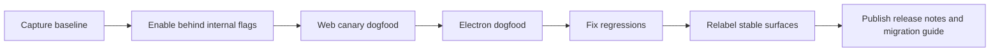
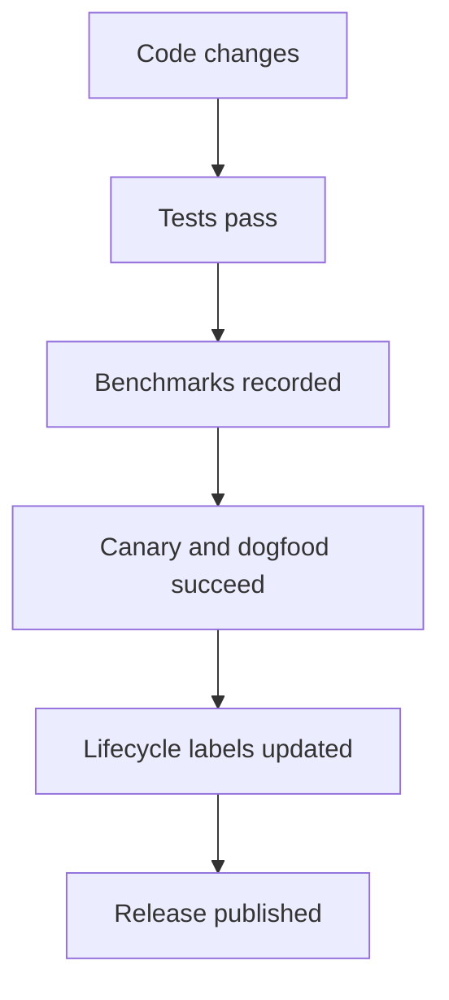

# 08: Rollout, Benchmarks, and Release Gates

> Do not call the platform converged until it clears measurable gates.

**Duration:** 3-4 days for setup, then ongoing through release  
**Dependencies:** [07-tests-devtools-and-documentation-alignment.md](./07-tests-devtools-and-documentation-alignment.md)  
**Primary packages:** whole monorepo

## Objective

Define how xNet proves that the convergence work is real: benchmark baselines, staged rollout, and clear criteria for when package surfaces can honestly be labeled stable.

## Scope and Dependencies

This step is the release discipline that prevents the repo from drifting back into aspirational labels.

Everything from Steps 01-07 should feed into this step:

- lifecycle labels from Step 01,
- runtime diagnostics from Steps 02 and 05,
- live-query metrics from Step 03,
- database migration status from Step 04,
- web durability data from Step 06,
- and test/devtools evidence from Step 07.

## Proposed Rollout Sequence

## Benchmark Categories

| Category | Initial gate | Notes |
| --- | --- | --- |
| Runtime bootstrap | worker or runtime-ready `p95` recorded and improving relative to baseline | final threshold should be fixed after baseline capture |
| Query fanout | single-node updates should touch only relevant query descriptors | correctness first, then latency |
| Search responsiveness | warm local search should stay comfortably interactive on realistic workspaces | body search and snippets included |
| Database editing | row create/update/reorder flows stay interactive and sync-correct | validate both web and Electron |
| Sync recovery | reconnect and replay timings recorded under offline/online transitions | include multi-device scenarios |
| Security enforcement | zero accepted unsigned updates in production config during validation runs | compatibility mode must be opt-in and visible |
| Web durability | persistent-storage result surfaced on first-run and tracked in diagnostics | not all browsers will grant it, but the app must know and explain it |

## Release-Gate Rules

### A package surface cannot be labeled `stable` unless:

- docs point to the current import path,
- examples compile or are covered by type tests,
- realistic tests cover the contract,
- runtime diagnostics exist for the critical behavior,
- and the surface passes the relevant benchmark category.

### A runtime path cannot become the default unless:

- fallback behavior is explicit,
- failure states are visible,
- and the intended path has cleared the canary/dogfood cycle.

## Concrete Implementation Notes

### 1. Record baselines before claiming wins

Capture current measurements before large changes land:

- boot-to-ready timing,
- query update timing,
- search timing,
- reconnect timing,
- and memory usage on representative datasets.

The point is not to freeze exact numbers forever. The point is to avoid vague "feels faster" conclusions.

### 2. Use the web app and Electron app differently

Use the web app to validate:

- worker runtime readiness,
- storage durability handling,
- and public-first UX constraints.

Use Electron to validate:

- longer-running sync sessions,
- multiple-instance recovery,
- and heavier background behavior.

### 3. Publish a release note that explains the contract shift

When the convergence release ships, document:

- new stable and experimental entrypoints,
- removed or deprecated imports,
- runtime defaults,
- and migration expectations.

## Validation Diagram

## Testing and Validation Approach

- Run `pnpm typecheck`.
- Run focused package tests for `@xnetjs/react`, `@xnetjs/data`, `@xnetjs/sync`, and any touched app packages.
- Record benchmark outputs in a committed artifact or release note draft.
- Perform at least one full canary loop on web and one dogfood loop on Electron before relabeling APIs.

## Risks, Edge Cases, and Migration Concerns

- Benchmarks can be gamed accidentally if datasets are too small or unrealistic.
- Internal dogfood can hide issues that affect fresh users; include clean-start validation in the rollout.
- Release-gate fatigue is real, but removing gates is what created lifecycle ambiguity in the first place.

## Step Checklist

- [ ] Capture pre-change baseline metrics.
- [ ] Define benchmark scripts or repeatable manual procedures for each category.
- [ ] Run web canary validation on the intended worker-first runtime.
- [ ] Run Electron dogfood validation on longer-lived sync sessions.
- [ ] Fix regressions before relabeling package surfaces.
- [ ] Update lifecycle labels only after the gates are actually met.
- [ ] Publish release notes and migration guidance for the convergence cycle.
