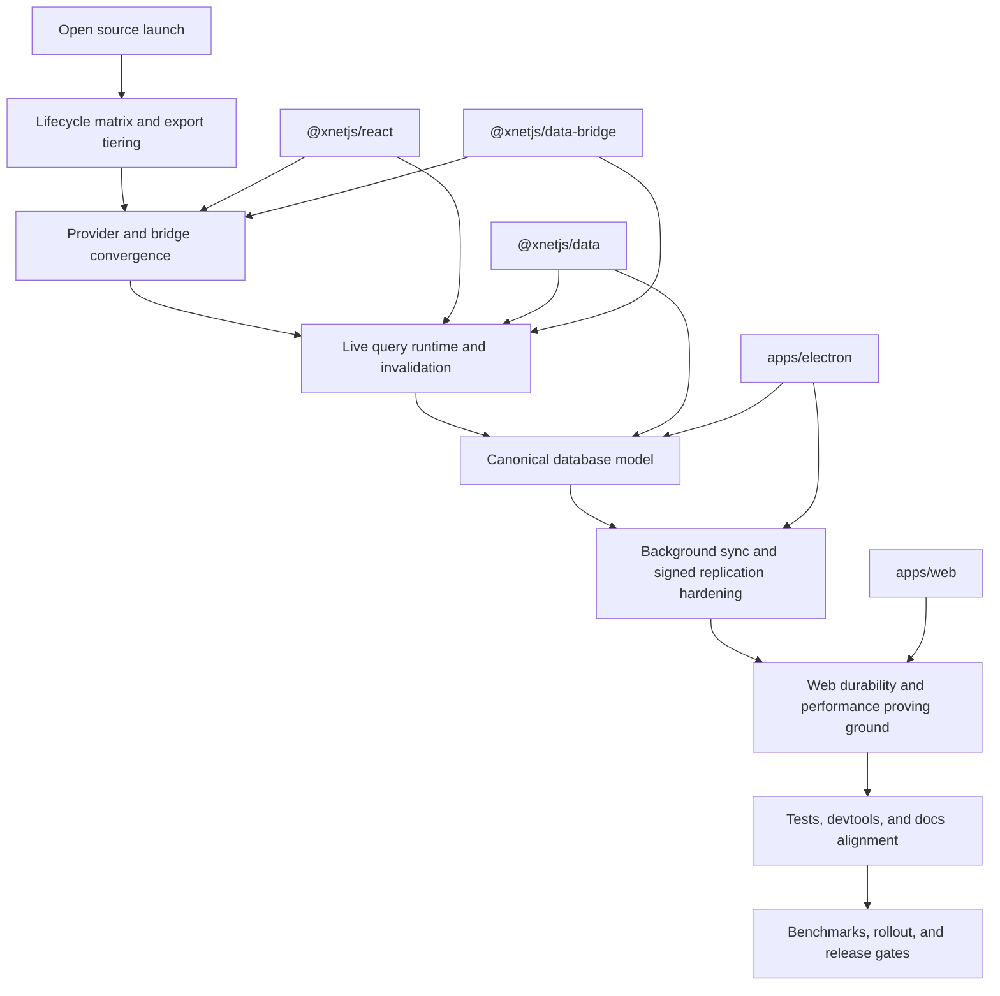

# xNet Implementation Plan - Step 03.982: Core Platform Convergence

> Converge xNet's public API, live query runtime, database model, and background sync into one stable local-first platform before expanding product surface area.

## Title and Short Summary

This plan turns [exploration 0105](../../explorations/0105_[_]_WHAT_TO_WORK_ON_NEXT_AFTER_OPEN_SOURCE_LAUNCH.md) into an execution sequence for the next major cycle after the open source launch.

The central thesis is straightforward:

> make `@xnetjs/react`, `@xnetjs/data`, the query/runtime boundary, and background sync behave like one coherent platform before investing heavily in new feature families.

That means:

- shrinking and tiering the public API surface,
- making worker-capable data access the default production path,
- replacing coarse query invalidation with live query materialization,
- converging the database model around one canonical representation,
- hardening background sync and signed replication,
- and using the web app as the proving ground for durability and performance.

## Problem Statement

xNet is no longer in the "prototype architecture" phase.

As of **March 6, 2026**:

- the monorepo is public,
- npm packages are published,
- the web app is a real demo surface,
- the Electron app is usable,
- the hub exists,
- and external developers can now encounter the package contracts directly.

That changes the priority order.

The highest-leverage risk is no longer "missing capability." It is **platform divergence**:

- package docs claim stability more broadly than the current contracts justify,
- the default React path still centers on `MainThreadBridge`,
- `useQuery()` and the bridge cache do not yet provide a truly incremental live-query runtime,
- database editing still has competing structured-data and Y.Doc-array models,
- the web app exposes query, storage, and navigation limitations directly,
- and the sync boundary still carries legacy compatibility behavior that should become explicit.

If xNet expands product scope before those seams are tightened, every new surface will inherit the same ambiguity.

## Current State in the Repository

### What is already strong

- `NodeStore.applyRemoteChange()` verifies remote changes before applying them in [`packages/data/src/store/store.ts`](../../../packages/data/src/store/store.ts).
- The sync stack has meaningful signed-envelope support in [`packages/network/src/protocols/sync.ts`](../../../packages/network/src/protocols/sync.ts).
- A worker-capable data path already exists in [`packages/data-bridge/src/worker-bridge.ts`](../../../packages/data-bridge/src/worker-bridge.ts).
- The web app, Electron app, hub, canvas package, and background sync machinery are all real and actively used.

### Where the current platform is still split

| Area                      | Observed repository state                                                                                                                                                                                                                                                                                                                                                                                                                                                                                                                                                                                                                                                                                                 | Why it matters                                                                                                                                                                 |
| ------------------------- | ------------------------------------------------------------------------------------------------------------------------------------------------------------------------------------------------------------------------------------------------------------------------------------------------------------------------------------------------------------------------------------------------------------------------------------------------------------------------------------------------------------------------------------------------------------------------------------------------------------------------------------------------------------------------------------------------------------------------- | ------------------------------------------------------------------------------------------------------------------------------------------------------------------------------ |
| Public lifecycle labels   | [`packages/README.md`](../../../packages/README.md) marks nearly the whole portfolio `Stable` while [`docs/ROADMAP.md`](../../ROADMAP.md) still calls lifecycle clarity unfinished work                                                                                                                                                                                                                                                                                                                                                                                                                                                                                                                                   | external users cannot distinguish dependable contracts from active construction                                                                                                |
| React runtime default     | [`packages/react/src/context.ts`](../../../packages/react/src/context.ts) still creates `MainThreadBridge` by default and documents worker/IPC bridges as future paths                                                                                                                                                                                                                                                                                                                                                                                                                                                                                                                                                    | the default app path does not yet match the intended performance architecture                                                                                                  |
| Query invalidation        | [`packages/data-bridge/src/main-thread-bridge.ts`](../../../packages/data-bridge/src/main-thread-bridge.ts) reloads every cached query for a schema; [`packages/react/src/hooks/useQuery.ts`](../../../packages/react/src/hooks/useQuery.ts) still stringifies filter inputs and its `reload()` ref does not currently trigger a re-subscribe                                                                                                                                                                                                                                                                                                                                                                             | query fanout and cache churn will become the main bottleneck for larger workspaces                                                                                             |
| Local query engine        | [`packages/query/src/local/engine.ts`](../../../packages/query/src/local/engine.ts) full-scans documents for query and count                                                                                                                                                                                                                                                                                                                                                                                                                                                                                                                                                                                              | search, backlinks, and derived navigation will not scale well without materialization                                                                                          |
| Database editing model    | [`packages/react/src/index.ts`](../../../packages/react/src/index.ts) exports a node-centric database hook family; [`apps/web/src/components/DatabaseView.tsx`](../../../apps/web/src/components/DatabaseView.tsx) and [`apps/electron/src/renderer/components/DatabaseView.tsx`](../../../apps/electron/src/renderer/components/DatabaseView.tsx) now both consume that hook layer; [`packages/data/src/database/legacy-migration.ts`](../../../packages/data/src/database/legacy-migration.ts) provides explicit one-way materialization with status recording; package-level sync, migration, history, and hook coverage now proves row ordering, row counts, scoped undo, and idempotent cross-device materialization | API clarity and structured-edit correctness are substantially better now; the remaining work is final canonical metadata-model reaffirmation plus broader web/Electron proving |
| Background sync lifecycle | [`packages/sync/src/sync-runtime.ts`](../../../packages/sync/src/sync-runtime.ts), [`packages/react/src/sync/sync-manager.ts`](../../../packages/react/src/sync/sync-manager.ts), and [`apps/electron/src/renderer/lib/ipc-sync-manager.ts`](../../../apps/electron/src/renderer/lib/ipc-sync-manager.ts) now share explicit lifecycle phases, signed-by-default replication, replay diagnostics, browser reconnect proof, and renderer-level Electron recovery coverage                                                                                                                                                                                                                                                  | background sync is now deterministic enough for release-gate use; future work should focus on product behavior rather than core lifecycle ambiguity                            |
| Web durability            | [`apps/web/src/App.tsx`](../../../apps/web/src/App.tsx) now requests durable storage, [`apps/web/src/components/GlobalSearch.tsx`](../../../apps/web/src/components/GlobalSearch.tsx) uses the converged body/snippet index, and [`tests/e2e/src/pages-crud.spec.ts`](../../../tests/e2e/src/pages-crud.spec.ts) provides a real worker-first web canary                                                                                                                                                                                                                                                                                                                                                                  | the web app is now a credible proving ground for the converged platform, with remaining work shifting to product UX rather than missing platform fundamentals                  |
| Test and docs drift       | integration tests and docs still reference `useDocument` and `IndexedDBNodeStorageAdapter` in multiple places under [`tests/integration`](../../../tests/integration) and [`tests/README.md`](../../../tests/README.md)                                                                                                                                                                                                                                                                                                                                                                                                                                                                                                   | public confidence depends on docs, examples, and tests matching the current API                                                                                                |

### Relationship to earlier plans

This plan does not replace the earlier work. It sequences and consolidates it.

- [`plan03_9_3DatabaseDataModel`](../plan03_9_3DatabaseDataModel/README.md) remains the main design source for node-native databases.
- [`plan03_9_5IndexedDBToSQLite`](../plan03_9_5IndexedDBToSQLite/README.md) established the storage migration that now needs runtime convergence.
- [`plan03_3_1BgSync`](../plan03_3_1BgSync/README.md) contains the background sync concepts that now need production hardening.
- [`plan03_9_81AuthorizationRevisedV2`](../plan03_9_81AuthorizationRevisedV2/README.md) remains the medium-term authz/encryption direction, but this plan focuses first on the runtime and API substrate that authz must ride on.

## Goals and Non-Goals

### Goals

- Establish an explicit lifecycle matrix for the public package surface.
- Converge `XNetProvider` and the bridge/bootstrap story around explicit runtime modes.
- Replace schema-wide query reloads with targeted live-query invalidation and delta updates.
- Choose one canonical database data model and migrate active app surfaces to it.
- Harden signed sync, background tasks, reconnect behavior, and cross-device consistency.
- Make the web app a durable proving ground for the converged platform.
- Align tests, docs, devtools, and release gates with the actual current APIs.

### Non-Goals

- Do not start major new product families such as farming ERP, voice, or social networking in this cycle.
- Do not optimize for mobile parity yet.
- Do not broaden AI integration beyond the platform hooks needed to support secure future integrations.
- Do not attempt full multi-hub federation rollout in the same cycle.
- Do not redesign the visual system as a primary objective; only make UX changes that prove the platform work.

## Architecture and Phase Overview

### Phase logic

1. **Clarify the contract** before changing runtime behavior.
2. **Converge the runtime** before benchmarking the UI.
3. **Converge the data model** before scaling databases and canvases.
4. **Harden sync and durability** before promising bulletproof cross-device behavior.
5. **Use the web app as the proving ground** because it is the first public surface and the most constrained environment.

## Step Index

| Step | File                                                                                                         | Outcome                                                                           |
| ---- | ------------------------------------------------------------------------------------------------------------ | --------------------------------------------------------------------------------- |
| 1    | [01-lifecycle-matrix-and-export-tiering.md](./01-lifecycle-matrix-and-export-tiering.md)                     | explicit stable, experimental, deprecated, and internal API tiers                 |
| 2    | [02-provider-runtime-and-bridge-defaults.md](./02-provider-runtime-and-bridge-defaults.md)                   | one clear bootstrap/runtime story across main-thread, worker, and IPC modes       |
| 3    | [03-live-query-runtime-and-invalidation.md](./03-live-query-runtime-and-invalidation.md)                     | incremental live queries with targeted invalidation and a real `reload()` path    |
| 4    | [04-database-model-convergence.md](./04-database-model-convergence.md)                                       | one canonical database representation for web, Electron, hooks, and sync          |
| 5    | [05-background-sync-and-security-hardening.md](./05-background-sync-and-security-hardening.md)               | durable background sync, reconnect semantics, and signed-by-default replication   |
| 6    | [06-web-durability-and-performance-proving-ground.md](./06-web-durability-and-performance-proving-ground.md) | worker-first web runtime, persistent storage handling, and app-level proof points |
| 7    | [07-tests-devtools-and-documentation-alignment.md](./07-tests-devtools-and-documentation-alignment.md)       | hook/runtime coverage, docs cleanup, and observability for the new platform       |
| 8    | [08-rollout-benchmarks-and-release-gates.md](./08-rollout-benchmarks-and-release-gates.md)                   | staged rollout criteria and measurable release gates                              |

## Risks and Open Questions

- **Migration churn:** export tiering and database-model convergence will create some migration burden for early users unless compatibility layers are explicit.
- **Worker boot complexity:** a worker-first runtime improves responsiveness, but it can also make app initialization more fragile unless fallback rules are simple and observable.
- **Database compatibility:** legacy Y.Map-backed database docs need a clear migration or adapter story to avoid orphaning existing user data.
- **Security tightening:** requiring signed envelopes by default is the right end state, but the compatibility cutover needs a deliberate deprecation path.
- **Benchmark realism:** performance budgets must be based on recorded baselines, not aspirational numbers detached from current hardware and data sizes.
- **Scope discipline:** this plan only succeeds if it stays focused on convergence and does not absorb unrelated feature work mid-stream.

## Implementation Checklist

- [x] Complete the lifecycle audit and publish an explicit API matrix for `@xnetjs/react`, `@xnetjs/data`, `@xnetjs/identity`, and `@xnetjs/data-bridge`.
- [x] Introduce an explicit runtime mode model for `XNetProvider` and app bootstrapping.
- [x] Implement targeted live-query invalidation and remove the current schema-wide reload behavior.
- [x] Adopt one canonical database model and migrate active app database views onto it.
- [x] Make background sync state, signed replication, and reconnect behavior deterministic and observable.
- [x] Request and surface persistent storage state in the web app.
- [x] Rewrite stale integration tests and public docs to the current hook/storage stack.
- [x] Run the benchmark and release-gate sequence before relabeling any package surface as fully stable.

## Validation Checklist

- [x] A new developer can identify stable entrypoints within 5 minutes from package docs alone.
- [x] The default web runtime uses the intended bridge mode and exposes any fallback explicitly.
- [x] `useQuery()` updates only the queries affected by a change and `reload()` demonstrably refreshes data.
- [x] Search, backlinks, and navigation use the same converged query/runtime boundary.
- [x] Database edits preserve correctness and undo semantics across web and Electron.
- [x] Multi-device reconnect and background sync behave predictably under offline and recovery scenarios.
- [x] Unsigned replication is no longer accepted by default in production paths.
- [x] The web app requests durable storage where supported and explains the result to the user.
- [x] Public tests and docs no longer depend on removed or legacy APIs such as `useDocument` as the current recommendation.
- [x] Release decisions are backed by recorded latency, correctness, and durability baselines.

## References

### Local references

- [Exploration 0105: What To Work On Next After Open Source Launch](../../explorations/0105_[_]_WHAT_TO_WORK_ON_NEXT_AFTER_OPEN_SOURCE_LAUNCH.md)
- [plan03_9_3DatabaseDataModel](../plan03_9_3DatabaseDataModel/README.md)
- [plan03_9_5IndexedDBToSQLite](../plan03_9_5IndexedDBToSQLite/README.md)
- [plan03_3_1BgSync](../plan03_3_1BgSync/README.md)
- [plan03_9_81AuthorizationRevisedV2](../plan03_9_81AuthorizationRevisedV2/README.md)

### External references

- [React `useSyncExternalStore`](https://react.dev/reference/react/useSyncExternalStore)
- [React `useEffectEvent`](https://react.dev/reference/react/useEffectEvent)
- [Yjs document updates](https://docs.yjs.dev/api/document-updates)
- [Yjs awareness](https://docs.yjs.dev/getting-started/adding-awareness)
- [web.dev persistent storage](https://web.dev/persistent-storage/)
- [ElectricSQL: writing your own client](https://electric-sql.com/docs/guides/writing-your-own-client)
- [MDN Web Authentication API](https://developer.mozilla.org/en-US/docs/Web/API/Web_Authentication_API)
- [Ink and Switch: Local-first software](https://www.inkandswitch.com/local-first/)
