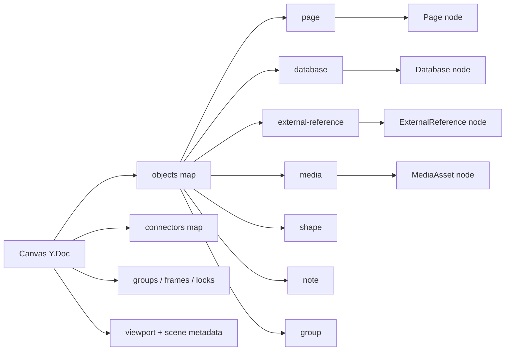

# 01: Scene Graph and Node Primitives

> Replace the generic canvas object model with an explicit, node-backed scene graph and lock in the no-backward-compatibility cutover.

**Objective:** establish the canonical Canvas V2 data model before touching the renderer.

**Dependencies:** none

## Scope and Dependencies

This step defines the core contracts that every later step depends on:

- the scene object union,
- connector/binding records,
- source-node references,
- canvas-local view metadata,
- the new media schema,
- cutover rules for old canvas docs.

This step must complete before the hybrid renderer, drop pipeline, and inline object rendering work can proceed safely.

## Relevant Codebase Touchpoints

- [`packages/canvas/src/types.ts`](../../../packages/canvas/src/types.ts)
- [`packages/canvas/src/store.ts`](../../../packages/canvas/src/store.ts)
- [`packages/canvas/src/index.ts`](../../../packages/canvas/src/index.ts)
- [`packages/data/src/schema/schemas/canvas.ts`](../../../packages/data/src/schema/schemas/canvas.ts)
- [`packages/data/src/schema/schemas/page.ts`](../../../packages/data/src/schema/schemas/page.ts)
- [`packages/data/src/schema/schemas/database.ts`](../../../packages/data/src/schema/schemas/database.ts)
- [`packages/data/src/schema/schemas/external-reference.ts`](../../../packages/data/src/schema/schemas/external-reference.ts)

## Design Overview



## Proposed Design and API Changes

### 1. Replace `CanvasNodeType` with Canvas V2 scene records

The current `CanvasNodeType` contract should be removed from the active product path.

Introduce a new scene-level model with:

- `CanvasObjectKind`
- `CanvasSceneObject`
- `CanvasConnector`
- `CanvasGroupRecord`
- `CanvasDisplayState`

Key design rule:

- **every rich content object points at a source node**
- **the canvas doc owns only spatial/layout/view state**

### 2. Canonical object kinds

Use the following first-class kinds:

- `page`
- `database`
- `external-reference`
- `media`
- `shape`
- `note`
- `group`

Implementation note:

- keep `note` as a scene kind for UX clarity,
- but back it with a `Page` node by default so xNet reuses Yjs-rich content rather than introducing another editing primitive.

### 3. Add a reusable media schema

Create a `MediaAsset`-style schema under `packages/data/src/schema/schemas/` with stable fields such as:

- `title`
- `mimeType`
- `blobId` or equivalent blob reference
- `width`
- `height`
- `sizeBytes`
- `previewUrl` or preview metadata if needed

This allows media to be:

- rendered on canvas,
- referenced in pages,
- queried later,
- shared and permissioned like any other node.

### 4. Formalize source-node references

Each source-backed scene object should carry:

- `sourceNodeId`
- `sourceSchemaId`
- `alias` (optional display alias)
- `display` metadata such as style variant, preview density, and collapsed state

### 5. Formalize connectors as bindings

Connectors should become first-class records that reference object IDs and anchors rather than purely visual lines.

They should support:

- object-to-object binding,
- stable anchors under resize/move,
- future block-level anchors,
- labels and style metadata,
- comment references if needed later.

### 6. Clean cutover rule

Backward compatibility is intentionally out of scope.

That means:

- do not attempt to preserve old `card/embed/image` semantics,
- do not write migration adapters into the new runtime,
- do not keep dual renderers alive.

Recommended cutover:

- treat Canvas V2 as the canonical runtime,
- if legacy dev data exists, recreate or reset canvases during development rather than preserving the old doc contract.

## Suggested Type Shape

```ts
type CanvasObjectKind =
  | 'page'
  | 'database'
  | 'external-reference'
  | 'media'
  | 'shape'
  | 'note'
  | 'group'

type CanvasSceneObject = {
  id: string
  kind: CanvasObjectKind
  rect: { x: number; y: number; width: number; height: number; rotation?: number; zIndex?: number }
  sourceNodeId?: string
  sourceSchemaId?: string
  alias?: string
  locked?: boolean
  display?: {
    variant?: string
    collapsed?: boolean
    previewDensity?: 'far' | 'mid' | 'near'
  }
  props: Record<string, unknown>
}

type CanvasConnector = {
  id: string
  from: { objectId: string; anchor: string }
  to: { objectId: string; anchor: string }
  label?: string
  style?: Record<string, unknown>
}
```

## Implementation Notes

- Keep the Yjs canvas doc storage simple:
  - `objects`
  - `connectors`
  - `groups`
  - `metadata`
- Avoid embedding full source-node content into scene object payloads.
- Export the new types from `@xnetjs/canvas` and move any old generic types behind internal-only compatibility if they must temporarily survive compilation.
- Keep `CanvasSchema` itself as the node schema for the overall canvas document; change the **document contract**, not the schema identity.

## Testing and Validation Approach

- Add focused type/store tests in `packages/canvas`.
- Add schema tests in `packages/data` for the new media schema.
- Verify source-backed object creation and connector persistence with unit tests before renderer work begins.

Suggested commands:

```bash
pnpm --filter @xnetjs/canvas test
pnpm --filter @xnetjs/data test
```

## Risks and Edge Cases

- A page-backed `note` needs a clear “lightweight note” display preset so it does not feel like a second-class page.
- Connector anchor identity must be stable enough to support later block/comment anchors.
- Resetting dev canvases is acceptable; silently interpreting old docs incorrectly is not.

## Step Checklist

- [ ] Replace the current public canvas object union with Canvas V2 scene types.
- [ ] Introduce a `MediaAsset`-style schema in `@xnetjs/data`.
- [ ] Add stable `sourceNodeId` and `sourceSchemaId` references for source-backed objects.
- [ ] Add connector/binding record types and storage.
- [ ] Define the canvas Y.Doc layout for objects, connectors, groups, and metadata.
- [ ] Remove Canvas V2 dependencies on the old generic `card/embed/image` semantics.
