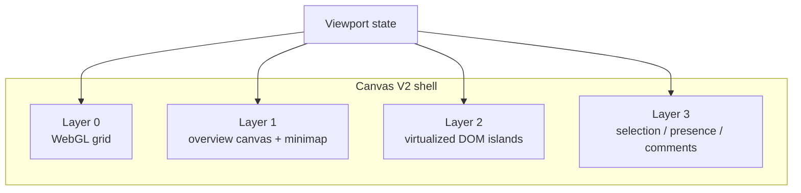

# 02: Hybrid Shell and Renderer Runtime

> Promote the existing grid/minimap/layering work into the default Canvas V2 shell so the renderer stops behaving like a DOM-first placeholder surface.

**Objective:** establish the primary runtime shell and layer ownership model.

**Dependencies:** [01-scene-graph-and-node-primitives.md](./01-scene-graph-and-node-primitives.md)

## Scope and Dependencies

This step replaces the current shell assumptions in the app and canvas renderer:

- new canvas runtime host,
- explicit layer responsibilities,
- minimal-chrome shell structure,
- renderer scheduling and redraw rules.

## Relevant Codebase Touchpoints

- [`apps/electron/src/renderer/components/CanvasView.tsx`](../../../apps/electron/src/renderer/components/CanvasView.tsx)
- [`apps/electron/src/renderer/App.tsx`](../../../apps/electron/src/renderer/App.tsx)
- [`packages/canvas/src/renderer/Canvas.tsx`](../../../packages/canvas/src/renderer/Canvas.tsx)
- [`packages/canvas/src/layers/index.ts`](../../../packages/canvas/src/layers/index.ts)
- [`packages/canvas/src/layers/webgl-grid.ts`](../../../packages/canvas/src/layers/webgl-grid.ts)
- [`packages/canvas/src/components/Minimap.tsx`](../../../packages/canvas/src/components/Minimap.tsx)
- [`packages/canvas/src/index.ts`](../../../packages/canvas/src/index.ts)

## Runtime Shape



## Proposed Design and API Changes

### 1. Introduce a `CanvasRuntime` host

Create a runtime-focused host component inside `@xnetjs/canvas` or the Electron renderer that owns:

- viewport state,
- layer mounting,
- display-list inputs,
- pointer/keyboard interaction mode,
- selection/editing state,
- redraw scheduling.

`CanvasView` should become a thin app-shell wrapper around that runtime, not a custom card renderer.

### 2. Layer responsibilities

Use the following explicit split:

- **Layer 0: WebGL background**
  - infinite grid
  - later rulers/guides
- **Layer 1: overview canvas**
  - minimap
  - far-field placeholders
  - aggregated scene previews
- **Layer 2: DOM interactive islands**
  - page cards
  - database cards
  - media/link shells with focus semantics
- **Layer 3: overlay**
  - selection
  - handles
  - presence
  - contextual HUD
  - comments

### 3. Minimal shell chrome

The shell should keep always-visible UI small:

- canvas title chip or breadcrumb
- collapsible minimap/navigation cluster
- optional selection HUD only when something is selected
- command palette trigger via shortcut rather than a large toolbar

Do not add a permanent inspector-first layout in the initial cut.

### 4. Render scheduler

The runtime should use one clear animation scheduler:

- frame-synced viewport redraws,
- no unnecessary redraws when viewport and display lists are unchanged,
- background and overview layers redraw on viewport/display-list changes,
- DOM layer rerenders only for visible object changes.

### 5. Keep WebGL/canvas as the default for wide-coverage visuals

This step should formally adopt the existing grid/minimap direction:

- the grid is not optional DOM decoration,
- the minimap is not a future enhancement,
- the renderer is hybrid by design.

## Suggested Runtime Skeleton

```ts
function CanvasRuntime(props: CanvasRuntimeProps): React.ReactElement {
  return (
    <div className="canvas-runtime">
      <WebGLBackgroundLayer viewport={props.viewport} />
      <OverviewCanvasLayer displayList={props.overviewDisplayList} viewport={props.viewport} />
      <InteractiveDomLayer visibleObjects={props.visibleObjects} viewport={props.viewport} />
      <OverlayLayer selection={props.selection} presence={props.presence} />
    </div>
  )
}
```

## Implementation Notes

- Reuse `createGridLayer()` and current minimap components where possible.
- Replace ad hoc object-card rendering in the Electron shell with a runtime-fed object renderer.
- Keep the minimap collapsible, but make it part of the default shell.
- Avoid dual renderer ownership between app code and package code; define one runtime boundary.
- Preserve `CanvasHandle`-style imperative helpers where they still help app routing (`fitToRect`, `setViewportSnapshot`, `focusObject`).

## Testing and Validation Approach

- Add renderer-layer tests where feasible in `packages/canvas`.
- Add Electron CDP tests for:
  - shell boot
  - minimap visibility/toggle
  - dock + command-palette creation flows
  - hybrid-layer smoke assertions (`canvas` overview layers + DOM object cards)
- Verify that minimap, grid, DOM objects, and overlays continue to stack correctly.
- Manually verify viewport updates and overlay alignment in Electron.

Suggested commands:

```bash
pnpm --filter @xnetjs/canvas test
pnpm dev:stories
```

## Risks and Edge Cases

- Layer ownership confusion will create duplicate redraw logic if not settled early.
- DOM/object transforms and overlay transforms must share one coordinate conversion contract.
- The shell can easily drift back toward heavy chrome if selection tools or inspectors become permanent.

## Step Checklist

- [ ] Introduce the Canvas V2 runtime host and make it the primary render entry.
- [x] Move the grid and minimap into the default shell path.
- [ ] Define explicit responsibilities for background, overview, DOM, and overlay layers.
- [x] Replace the current custom linked-card shell rendering with runtime-fed object rendering.
- [ ] Keep persistent shell chrome minimal and contextual.
- [ ] Centralize frame scheduling and redraw ownership.
