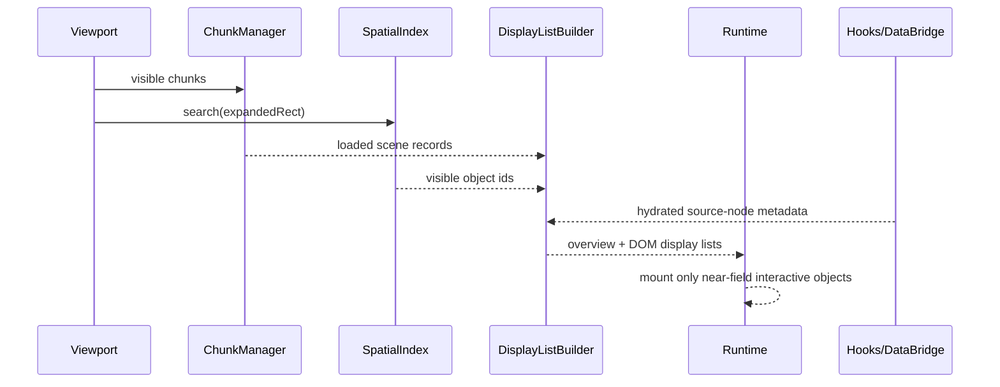

# 03: Spatial Runtime and Query Evolution

> Activate chunking, culling, display lists, and hook-driven viewport loading so Canvas V2 can scale without inventing a parallel data-access system.

**Objective:** make the performance architecture real in the primary runtime.

**Dependencies:** [01-scene-graph-and-node-primitives.md](./01-scene-graph-and-node-primitives.md), [02-hybrid-shell-and-renderer-runtime.md](./02-hybrid-shell-and-renderer-runtime.md)

## Scope and Dependencies

This step owns the scaling path:

- chunk manager activation,
- viewport-driven display lists,
- R-tree search in the main path,
- DOM mount gating,
- query descriptor evolution for future spatial windows.

## Relevant Codebase Touchpoints

- [`packages/canvas/src/spatial/index.ts`](../../../packages/canvas/src/spatial/index.ts)
- [`packages/canvas/src/chunks/chunk-manager.ts`](../../../packages/canvas/src/chunks/chunk-manager.ts)
- [`packages/canvas/src/chunks/chunked-canvas-store.ts`](../../../packages/canvas/src/chunks/chunked-canvas-store.ts)
- [`packages/canvas/src/store.ts`](../../../packages/canvas/src/store.ts)
- [`packages/react/src/hooks/useQuery.ts`](../../../packages/react/src/hooks/useQuery.ts)
- [`packages/data-bridge/src/types.ts`](../../../packages/data-bridge/src/types.ts)
- [`packages/devtools/src/panels/QueryDebugger/QueryDebugger.tsx`](../../../packages/devtools/src/panels/QueryDebugger/QueryDebugger.tsx)

## Data and Render Flow



## Proposed Design and API Changes

### 1. Activate chunking in the primary path

Chunking should stop being “future infrastructure” and become part of the main runtime contract.

Use it for:

- load/evict boundaries,
- memory locality,
- large-scene initialization,
- overview/minimap display-list generation.

### 2. Keep `rbush` as the default index

Do **not** switch to quadtree by default.

Canvas V2 should keep the existing R-tree for:

- arbitrary rectangle culling,
- hit testing,
- directional navigation,
- object visibility queries.

Only revisit this after profiling proves an index bottleneck.

### 3. Two-stage display-list building

Build separate outputs from one visibility pass:

- **overview display list**
  - simplified objects
  - aggregated shapes
  - minimap rectangles
- **interactive DOM display list**
  - near-field objects only
  - rich editors/previews only when allowed by zoom and selection state

### 4. Query evolution through `useQuery`, not around it

Canvas V2 should drive the next query/runtime improvements without bypassing hooks.

The likely future descriptor shape should support:

- `withinRect`
- `intersectsRect`
- `nearPoint`
- `orderByDistance`

Longer-term location support can become a hook/query concern too, but only after the basic viewport window semantics are stable.

### 5. Telemetry and frame budgets

Use existing devtools and telemetry surfaces to measure:

- active queries,
- query churn,
- display-list rebuild timing,
- DOM object count,
- frame timing and dropped-frame scenarios.

## Suggested Descriptor Extension

```ts
type SpatialQueryDescriptor = QueryDescriptor & {
  withinRect?: { x: number; y: number; width: number; height: number }
  intersectsRect?: { x: number; y: number; width: number; height: number }
  nearPoint?: { x: number; y: number; radius: number }
  orderByDistance?: { x: number; y: number }
}
```

## Implementation Notes

- Prefer one display-list builder over multiple ad hoc visibility filters.
- Let chunk membership decide what data must be loaded; let the spatial index decide what is visible now.
- Keep database/page object hydration hook-driven so the same objects can be reused in side panels, pickers, and future search surfaces.
- Treat geosearch as a future extension of the query planner, not a prerequisite for Canvas V2.

## Testing and Validation Approach

- Add unit coverage for visible-object queries and chunk/display-list behavior.
- Add benchmark fixtures for:
  - 1,000 objects
  - 5,000 objects
  - 10,000 objects
- Verify that DOM object count stays bounded while panning.

Suggested commands:

```bash
pnpm --filter @xnetjs/canvas test
pnpm --filter @xnetjs/react test
```

## Risks and Edge Cases

- Query descriptor changes can spread widely if introduced too early without tight scope.
- Chunk and index invalidation need one authoritative update path to avoid stale display lists.
- Overview display lists should not accidentally require full rich-object hydration.

## Step Checklist

- [ ] Promote chunk loading/eviction into the primary Canvas V2 runtime.
- [ ] Route visible-object selection through the existing R-tree search path.
- [ ] Build overview and interactive display lists from a shared visibility pipeline.
- [ ] Gate DOM mounts behind visibility, zoom, and interaction state.
- [ ] Extend `useQuery`/`QueryDescriptor` only where Canvas V2 genuinely benefits.
- [ ] Add telemetry and benchmark coverage for display-list and query behavior.
