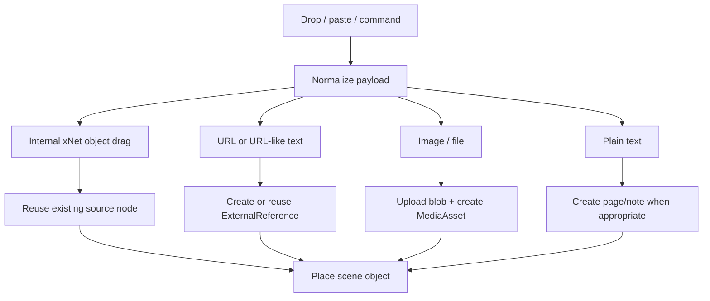

# 04: Drop Ingestion and Source Object Creation

> Make the canvas a universal spatial drop target by normalizing internal drags, URLs, files, and plain text into one creation pipeline.

**Objective:** unify creation flows so the canvas can accept “almost anything” without bespoke handlers scattered across the app.

**Dependencies:** [01-scene-graph-and-node-primitives.md](./01-scene-graph-and-node-primitives.md), [02-hybrid-shell-and-renderer-runtime.md](./02-hybrid-shell-and-renderer-runtime.md), [03-spatial-runtime-and-query-evolution.md](./03-spatial-runtime-and-query-evolution.md)

## Scope and Dependencies

This step covers:

- internal app drags,
- URL/text drops,
- file/image drops,
- command-driven object creation at pointer/viewport center,
- source-node creation and placement.

## Relevant Codebase Touchpoints

- [`apps/electron/src/renderer/components/CanvasView.tsx`](../../../apps/electron/src/renderer/components/CanvasView.tsx)
- [`apps/electron/src/renderer/App.tsx`](../../../apps/electron/src/renderer/App.tsx)
- [`packages/data/src/blob/blob-service.ts`](../../../packages/data/src/blob/blob-service.ts)
- [`packages/data/src/schema/schemas/external-reference.ts`](../../../packages/data/src/schema/schemas/external-reference.ts)
- [`packages/editor/src/hooks/useImageUpload.ts`](../../../packages/editor/src/hooks/useImageUpload.ts)
- [`packages/editor/src/hooks/useFileUpload.ts`](../../../packages/editor/src/hooks/useFileUpload.ts)

## Creation Pipeline



## Proposed Design and API Changes

### 1. Introduce a unified ingestion boundary

Create a single canvas ingestion service that accepts:

- drag payloads from sidebar/search/recent lists,
- OS file drops,
- pasted URLs,
- dropped text,
- command-palette and shortcut-driven “create object” actions.

### 2. Internal drags should preserve identity

Dragging a page or database from another app surface should:

- reuse the existing source node,
- not duplicate content,
- create only a new scene object reference.

### 3. URLs should reuse `ExternalReferenceSchema`

For dropped URLs:

- normalize the URL,
- derive provider/kind when possible,
- create or reuse an `ExternalReference` node,
- resolve preview metadata via:
  - `oEmbed`
  - Open Graph
  - generic fallback card

### 4. Files and images should create `MediaAsset` nodes

Use:

- `BlobService` for persistence,
- upload hooks where useful,
- source-node creation before scene placement.

### 5. Text drops should be intentional

For plain text:

- if it parses as a URL, treat it as URL drop,
- otherwise create a page-backed note only when the user explicitly chooses or the command context makes that obvious.

## Suggested Ingestion Contract

```ts
type CanvasIngressPayload =
  | { kind: 'internal-node'; nodeId: string; schemaId: string }
  | { kind: 'url'; url: string }
  | { kind: 'file'; file: File }
  | { kind: 'text'; text: string }
  | { kind: 'create'; objectKind: 'page' | 'database' | 'shape' }

async function ingestCanvasPayload(
  payload: CanvasIngressPayload,
  at: { x: number; y: number }
): Promise<{ objectId: string; sourceNodeId?: string }> {
  // normalize -> create/reuse source -> create scene object
}
```

## Implementation Notes

- Keep placement logic reusable so command creation and drag/drop use the same path.
- Normalize internal drag payloads early so app surfaces don’t each invent their own drop contract.
- Make URL/media placement optimistic: place an object shell quickly, then resolve preview metadata asynchronously.
- Size media objects from natural dimensions when known; use conservative defaults while loading.

## Testing and Validation Approach

- Unit test normalization and dispatch logic.
- Validate file/media persistence and URL preview fallback ordering.
- Manually verify drag/drop from sidebar and other document lists inside Electron.

Suggested commands:

```bash
pnpm --filter @xnetjs/data test
pnpm --filter @xnetjs/react test
```

## Risks and Edge Cases

- Provider preview lookup must degrade cleanly when metadata is unavailable.
- Large file drops need upload-progress and failure handling without blocking the scene.
- Dedupe rules for reused URLs/media should be explicit; otherwise repeated drops may create noisy duplicates.

## Step Checklist

- [ ] Build a unified canvas ingestion boundary for drags, drops, paste, and create commands.
- [ ] Reuse source-node identity for internal page/database drags.
- [ ] Create or reuse `ExternalReference` nodes for URL drops.
- [ ] Upload files/images through `BlobService` and create `MediaAsset` nodes.
- [ ] Share one placement pipeline between command creation and drop-based creation.
- [ ] Add optimistic placement with async preview/media resolution.
