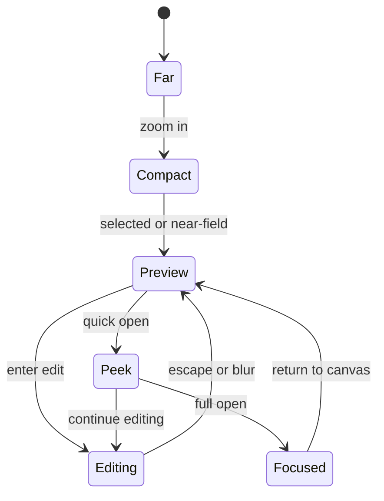

# 05: Page Cards, Inline Editing, and Peek

> Make pages the first truly native canvas object by letting users create, edit, peek, and reopen the same page identity without leaving the canvas unnecessarily.

**Objective:** ship the highest-leverage Canvas V2 object flow first.

**Dependencies:** [01-scene-graph-and-node-primitives.md](./01-scene-graph-and-node-primitives.md), [02-hybrid-shell-and-renderer-runtime.md](./02-hybrid-shell-and-renderer-runtime.md), [03-spatial-runtime-and-query-evolution.md](./03-spatial-runtime-and-query-evolution.md), [04-drop-ingestion-and-source-object-creation.md](./04-drop-ingestion-and-source-object-creation.md)

## Scope and Dependencies

This step covers:

- page creation on canvas,
- page-backed note creation,
- zoom-aware page rendering,
- inline editing,
- center-peek behavior,
- transition to full focused page view when needed.

## Relevant Codebase Touchpoints

- [`apps/electron/src/renderer/components/PageView.tsx`](../../../apps/electron/src/renderer/components/PageView.tsx)
- [`apps/electron/src/renderer/components/CanvasView.tsx`](../../../apps/electron/src/renderer/components/CanvasView.tsx)
- [`packages/editor/src/components/RichTextEditor.tsx`](../../../packages/editor/src/components/RichTextEditor.tsx)
- [`packages/react/src/hooks/useNode.ts`](../../../packages/react/src/hooks/useNode.ts)
- [`packages/data/src/schema/schemas/page.ts`](../../../packages/data/src/schema/schemas/page.ts)

## Page Object Lifecycle



## Proposed Design and API Changes

### 1. Page object render modes

Pages should have explicit render modes:

- **far**
  - lightweight placeholder/card
- **compact**
  - title + light metadata
- **preview**
  - richer excerpt / first content lines
- **editing**
  - mounted `RichTextEditor`
- **peek**
  - enlarged in-context editing/read surface without full route transition

### 2. Inline editing rules

Inline editing should mount only when:

- the object is visible,
- zoom is high enough,
- the user explicitly entered edit mode or the object is selected and the intent is clear.

Do not auto-mount editors on broad visibility alone.

### 3. Center-peek behavior

Canvas V2 should adopt AFFiNE’s strongest “stay in context” idea:

- peek a page in-place first,
- allow the user to continue editing there,
- escalate to full focus/open only when they want the dedicated surface.

### 4. Page-backed notes

`note` objects should be page-backed presets:

- smaller default size,
- different display variant,
- same source-node/Yjs model,
- same editing capabilities.

That keeps xNet’s primitive set smaller and stronger.

## Suggested Render Policy

```ts
function resolvePageRenderMode(input: {
  zoom: number
  selected: boolean
  nearField: boolean
  editing: boolean
  peeking: boolean
}): 'far' | 'compact' | 'preview' | 'editing' | 'peek' {
  if (input.editing) return 'editing'
  if (input.peeking) return 'peek'
  if (input.zoom < 0.2) return 'far'
  if (input.zoom < 0.55) return 'compact'
  return input.selected || input.nearField ? 'preview' : 'compact'
}
```

## Implementation Notes

- Reuse `PageSchema` and the existing editor stack; do not create a second canvas text engine for page content.
- Keep peek transitions subtle and fast; they should feel like spatial expansion, not a modal detour.
- Preserve the ability to open the existing focused `PageView` for full-page workflows.
- Ensure page cards can render meaningfully even before their rich editor is hydrated.

## Testing and Validation Approach

- Unit test render-mode decisions.
- Verify editor mount/unmount thresholds manually in Electron.
- Validate that creating a page on the canvas immediately creates a real source node.

Suggested commands:

```bash
pnpm --filter @xnetjs/editor test
pnpm --filter @xnetjs/react test
```

## Risks and Edge Cases

- Editor selection/focus can easily fight with canvas drag/select behavior if intent handoff is unclear.
- Peek state and full focus/open state must not create duplicate editing sessions.
- Large pasted content should not lock the canvas runtime while the editor hydrates.

## Step Checklist

- [x] Add page creation directly on the canvas using real `Page` nodes.
- [x] Implement page-backed note objects as a display preset, not a separate editor primitive.
- [x] Define page render modes and mount gates for preview/editing.
- [x] Add center-peek behavior before full route transitions.
- [x] Preserve full `PageView` open/focus behavior for deep work.
- [x] Validate smooth transitions between preview, peek, editing, and full focus.
