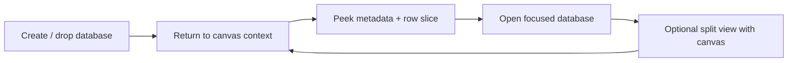

# 06: Database Cards, Preview, Focus, and Split

> Keep databases first-class on the canvas without trying to cram the full database application into every scene object.

**Objective:** make databases useful on canvas while respecting their higher interaction and DOM cost.

**Dependencies:** [01-scene-graph-and-node-primitives.md](./01-scene-graph-and-node-primitives.md), [02-hybrid-shell-and-renderer-runtime.md](./02-hybrid-shell-and-renderer-runtime.md), [03-spatial-runtime-and-query-evolution.md](./03-spatial-runtime-and-query-evolution.md), [04-drop-ingestion-and-source-object-creation.md](./04-drop-ingestion-and-source-object-creation.md), [05-page-cards-inline-editing-and-peek.md](./05-page-cards-inline-editing-and-peek.md)

## Scope and Dependencies

This step covers:

- database object creation,
- live preview cards,
- bounded preview virtualization,
- focus/open workflows,
- split-view workflows for canvas + focused database work.

## Relevant Codebase Touchpoints

- [`apps/electron/src/renderer/components/DatabaseView.tsx`](../../../apps/electron/src/renderer/components/DatabaseView.tsx)
- [`packages/react/src/hooks/useDatabase.ts`](../../../packages/react/src/hooks/useDatabase.ts)
- [`packages/react/src/hooks/useDatabaseDoc.ts`](../../../packages/react/src/hooks/useDatabaseDoc.ts)
- [`packages/views/src/table/VirtualizedTableView.tsx`](../../../packages/views/src/table/VirtualizedTableView.tsx)
- [`packages/data/src/schema/schemas/database.ts`](../../../packages/data/src/schema/schemas/database.ts)

## Interaction Flow



## Proposed Design and API Changes

### 1. Live preview by default

Database objects should render a lightweight, live preview containing:

- title,
- view metadata,
- a bounded row slice,
- key schema hints,
- an affordance to open or split.

### 2. Use existing database hooks, not ad hoc store reads

Canvas V2 should reuse:

- `useDatabaseDoc()` for columns/views,
- `useDatabase()` for rows and pagination,
- any existing table virtualization primitives where they fit.

### 3. Bounded preview policy

Database preview cards should be intentionally constrained:

- preview a small row count,
- avoid full-board/full-table control density,
- virtualize preview rows when the card can grow,
- do not attempt full inline database editing in the first Canvas V2 cut.

### 4. Focus and split workflows

Users should be able to:

- open the full database surface,
- return to the canvas with preserved viewport,
- optionally keep the canvas visible in a split layout for cross-reference work.

### 5. Aliases and backlinks

Once the base preview flow is stable, database cards should support:

- display aliasing without identity changes,
- visible backlinks from the database to canvases that reference it.

## Suggested Preview Model

```ts
const preview = useDatabase(databaseId, {
  pageSize: 20
})

const rows = preview.rows.slice(0, 8)
```

## Implementation Notes

- Keep preview density consistent with the content-first goal; avoid miniature full apps inside cards.
- Preview updates should react to row/schema changes without forcing full card rerenders when not visible.
- Split view should be a shell concern, not a database card concern.

## Testing and Validation Approach

- Validate preview freshness after row edits, sort/view changes, and schema changes.
- Validate that preview DOM stays bounded.
- Verify focused and split workflows manually in Electron.

Suggested commands:

```bash
pnpm --filter @xnetjs/react test
pnpm --filter @xnetjs/views test
```

## Risks and Edge Cases

- Preview cards can become too heavy if they try to support in-place dense editing too early.
- Split view can easily add too much persistent chrome if it becomes the default instead of an opt-in mode.
- Querying too many rows for previews will erase most of the benefit of a bounded card model.

## Step Checklist

- [ ] Add database object creation and placement using real `Database` nodes.
- [ ] Render bounded live preview cards backed by `useDatabase` and `useDatabaseDoc`.
- [ ] Limit preview density and virtualize heavy preview surfaces when needed.
- [ ] Preserve focused full-database workflows.
- [ ] Add optional split canvas + database workflows after focus/open is stable.
- [ ] Add alias/backlink support once preview/focus behavior is solid.
