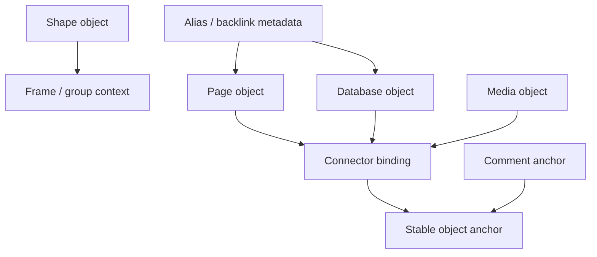

# 07: Connectors, Shapes, Groups, and Polish

> Turn Canvas V2 from a loose collection of cards into a real whiteboard by adding durable bindings, framing/grouping tools, and dense-board management affordances.

**Objective:** ship the native whiteboard primitives that support content, rather than overshadowing it.

**Dependencies:** [01-scene-graph-and-node-primitives.md](./01-scene-graph-and-node-primitives.md), [02-hybrid-shell-and-renderer-runtime.md](./02-hybrid-shell-and-renderer-runtime.md), [03-spatial-runtime-and-query-evolution.md](./03-spatial-runtime-and-query-evolution.md), [05-page-cards-inline-editing-and-peek.md](./05-page-cards-inline-editing-and-peek.md), [06-database-cards-preview-focus-and-split.md](./06-database-cards-preview-focus-and-split.md)

## Scope and Dependencies

This step covers:

- connector bindings,
- shape objects,
- frame/group behavior,
- lock/select behavior,
- tidy-up, align, and distribute operations,
- alias/backlink polish,
- future-ready block/deep-link anchors.

## Relevant Codebase Touchpoints

- [`packages/canvas/src/store.ts`](../../../packages/canvas/src/store.ts)
- [`packages/canvas/src/edges/CanvasEdgeComponent.tsx`](../../../packages/canvas/src/edges/CanvasEdgeComponent.tsx)
- [`packages/canvas/src/nodes/shape-node`](../../../packages/canvas/src/nodes/shape-node)
- [`packages/canvas/src/presence/selection-lock.ts`](../../../packages/canvas/src/presence/selection-lock.ts)
- [`packages/canvas/src/comments/CommentPin.tsx`](../../../packages/canvas/src/comments/CommentPin.tsx)

## Object Relationship Model



## Proposed Design and API Changes

### 1. Connectors as bindings, not just lines

Connector records should:

- bind to object IDs,
- remember anchor metadata,
- survive move/resize,
- support object/object endpoints consistently,
- leave room for future block-level anchors.

### 2. Shapes and frames remain canvas-native

Shapes should stay canvas-native primitives:

- rectangle
- ellipse
- diamond
- line/arrow
- frame

They should not require backing source nodes.

### 3. Groups and frames should help organize content

Frames/groups should support:

- drag-in feedback,
- group move/resize,
- selection scoping,
- optional title labels,
- future template/layout behavior if needed.

### 4. Locking, alignment, and tidy-up

Borrow the best AFFiNE-style board-management affordances:

- lock/unlock,
- align left/right/top/bottom,
- distribute horizontally/vertically,
- tidy-up for large selections,
- send forward/backward.

### 5. Alias, backlink, and deep-link groundwork

This step should formalize:

- object aliases,
- backlink recording from source node to referencing canvas,
- stable anchor IDs that comments and future block links can reuse.

## Suggested Connector Shape

```ts
type CanvasAnchorRef = {
  objectId: string
  anchor: 'top' | 'right' | 'bottom' | 'left' | 'center' | string
  blockAnchorId?: string
}

type CanvasConnector = {
  id: string
  from: CanvasAnchorRef
  to: CanvasAnchorRef
  label?: string
  style?: { curved?: boolean; stroke?: string; width?: number }
}
```

## Implementation Notes

- Keep group/frame UI lightweight and contextual.
- Use locks to protect both content objects and shapes.
- Alignment/tidy-up should work on scene selections without requiring the user to open a side inspector.
- Backlink metadata can start simple and become richer later.

## Testing and Validation Approach

- Unit test anchor persistence on move/resize.
- Validate alignment/tidy-up determinism on selected sets.
- Verify lock behavior and selection visuals manually in Electron.

Suggested commands:

```bash
pnpm --filter @xnetjs/canvas test
```

## Risks and Edge Cases

- Object-anchor stability can break silently if resize/rotation math is not centralized.
- Tidy-up can feel destructive if it ignores user grouping or manual layout intent.
- Backlinks must not create noisy write churn for every trivial canvas move.

## Step Checklist

- [ ] Convert connectors to durable binding records with stable anchors.
- [ ] Promote shape/frame/group tools into the Canvas V2 object model.
- [x] Add lock/unlock behavior for dense-board safety.
- [x] Add align/distribute/tidy-up operations for multi-object selections.
- [ ] Add alias and backlink support for source-backed objects.
- [ ] Reserve stable anchor IDs for comments and future block/deep-link support.
