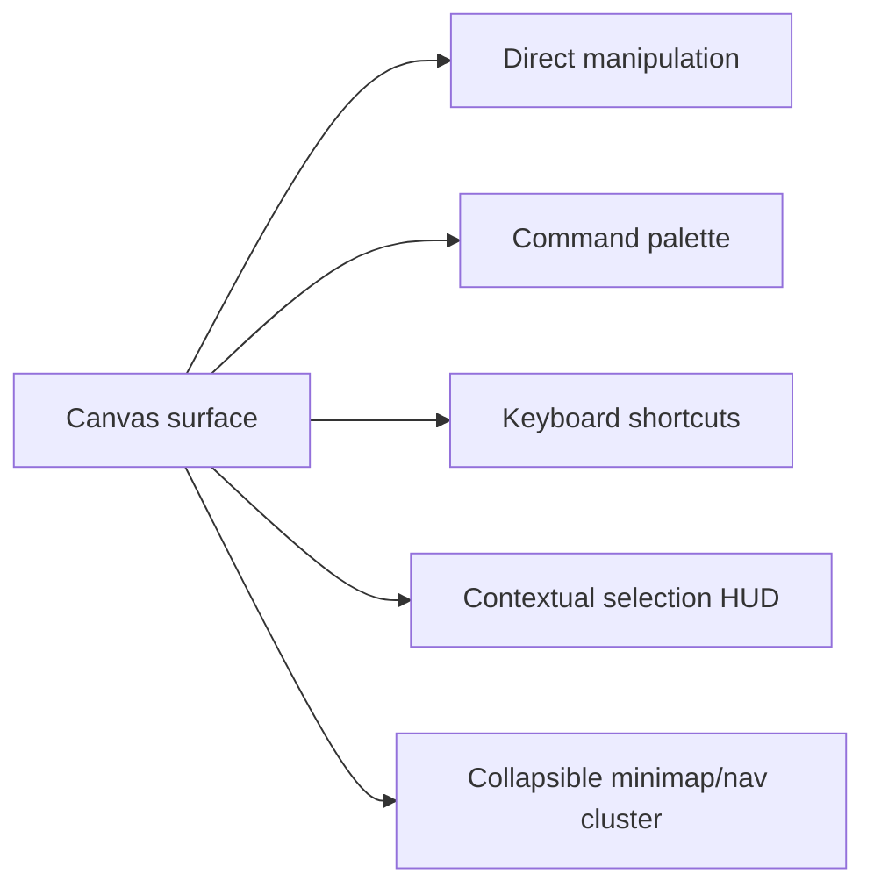

# 08: Navigation, Shortcuts, and Minimal UX

> Keep the interface visually quiet while making the canvas fast to drive through direct manipulation, command search, and a disciplined shortcut system.

**Objective:** make Canvas V2 feel powerful without adding heavy persistent chrome.

**Dependencies:** [02-hybrid-shell-and-renderer-runtime.md](./02-hybrid-shell-and-renderer-runtime.md), [05-page-cards-inline-editing-and-peek.md](./05-page-cards-inline-editing-and-peek.md), [06-database-cards-preview-focus-and-split.md](./06-database-cards-preview-focus-and-split.md), [07-connectors-shapes-groups-and-polish.md](./07-connectors-shapes-groups-and-polish.md)

## Scope and Dependencies

This step defines:

- the minimal shell UX,
- navigation affordances,
- command palette integration,
- hotkeys and shortcuts,
- discoverability and shortcut help,
- selection HUD behavior.

## Relevant Codebase Touchpoints

- [`packages/canvas/src/hooks/useCanvasKeyboard.ts`](../../../packages/canvas/src/hooks/useCanvasKeyboard.ts)
- [`packages/canvas/src/accessibility/keyboard-navigation.ts`](../../../packages/canvas/src/accessibility/keyboard-navigation.ts)
- [`packages/ui/src/composed/CommandPalette.tsx`](../../../packages/ui/src/composed/CommandPalette.tsx)
- [`apps/electron/src/renderer/App.tsx`](../../../apps/electron/src/renderer/App.tsx)
- [`packages/canvas/src/components/Minimap.tsx`](../../../packages/canvas/src/components/Minimap.tsx)

## UX Model



## Proposed Design and API Changes

### 1. Minimal persistent chrome

By default show only:

- title/breadcrumb,
- minimap/navigation cluster,
- contextual selection HUD when relevant,
- transient insertion affordances.

Do not add a permanent left tool rail and permanent right inspector as the default Canvas V2 posture.

### 2. Command-first object creation

Integrate the existing command palette into the canvas shell so users can:

- create page
- create database
- insert shape
- open search/recent objects
- lock/group/align/tidy
- open focused view

without hunting through visible UI.

### 3. Hotkey set

Recommended default hotkeys:

| Action | Shortcut |
| --- | --- |
| Open command palette | `Cmd/Ctrl+Shift+P` |
| Shortcut help | `?` |
| Zoom in | `Cmd/Ctrl+=` |
| Zoom out | `Cmd/Ctrl+-` |
| Reset view | `Cmd/Ctrl+0` |
| Fit content | `Cmd/Ctrl+1` |
| Pan with keyboard | Arrow keys |
| Pan temporarily | `Space` + drag |
| Create page | `P` |
| Create database | `D` |
| Rectangle | `R` |
| Ellipse | `O` |
| Connector tool | `L` |
| Frame/group tool | `F` |
| Enter peek/edit | `Enter` |
| Open focused surface | `Cmd/Ctrl+Enter` |
| Exit edit/peek | `Escape` |
| Group | `G` |
| Ungroup | `Shift+G` |
| Lock/unlock | `Cmd/Ctrl+Shift+L` |
| Nudge | Arrow keys with selection |
| Large nudge | `Shift` + arrow keys |
| Bring forward/back | `]` / `[` |

Implementation note:

- single-key shortcuts should be active only when the user is not typing in an editor/input.

### 4. Selection HUD

When a selection exists, show a compact contextual HUD with only the actions that matter:

- edit / peek / open,
- group / ungroup,
- lock,
- align / distribute / tidy,
- duplicate / delete,
- comment.

### 5. Discoverability

Use:

- shortcut hints in menus/HUD,
- a shortcut help overlay,
- command palette search keywords,
- lightweight onboarding in Storybook/workbenches instead of permanent tutorial chrome.

## Suggested Command Registry Shape

```ts
type CanvasCommand = {
  id: string
  name: string
  shortcut?: string
  when?: () => boolean
  execute: () => void | Promise<void>
}
```

## Implementation Notes

- Extend `useCanvasKeyboard` rather than replacing it.
- Reuse the current `CommandPalette` component and feed it a canvas-scoped command registry.
- Maintain one “are we typing?” guard for single-key shortcuts so canvas shortcuts never steal editor input.
- Keep minimap controls and zoom controls compact and collapsible.

## Testing and Validation Approach

- Add unit coverage for shortcut dispatch and “typing guard” behavior.
- Verify that shortcuts remain discoverable via palette/HUD/help overlay.
- Manually verify keyboard-first flows in Electron.

Suggested commands:

```bash
pnpm --filter @xnetjs/canvas test
pnpm --filter @xnetjs/ui test
```

## Risks and Edge Cases

- Single-key shortcuts are valuable but dangerous; typing guards must be reliable.
- Too many shortcuts can undermine the “minimal UX” goal if they are not grouped coherently.
- A contextual HUD can become a floating toolbar monster if it accumulates too many actions.

## Step Checklist

- [ ] Keep persistent canvas chrome minimal and contextual.
- [ ] Integrate a canvas-scoped command registry into the existing command palette.
- [ ] Expand `useCanvasKeyboard` into a full Canvas V2 shortcut layer.
- [ ] Add a discoverable shortcut help overlay.
- [ ] Implement the selection HUD with only context-relevant actions.
- [ ] Ensure keyboard-first creation/edit/navigation flows work without interfering with editor typing.
