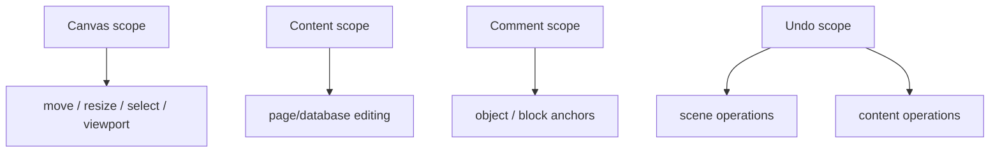

# 09: Collaboration, Undo, Accessibility, and Comments

> Make Canvas V2 collaborative and keyboard-accessible without collapsing canvas actions and content editing into one noisy coordination model.

**Objective:** harden the interaction model so real collaborative work remains stable and understandable.

**Dependencies:** all prior steps

## Scope and Dependencies

This step covers:

- presence scopes,
- selection/move/edit coordination,
- undo boundaries,
- comment anchoring,
- keyboard accessibility,
- screen-reader and focus behavior.

## Relevant Codebase Touchpoints

- [`packages/canvas/src/presence/canvas-presence.ts`](../../../packages/canvas/src/presence/canvas-presence.ts)
- [`packages/canvas/src/presence/selection-lock.ts`](../../../packages/canvas/src/presence/selection-lock.ts)
- [`packages/canvas/src/accessibility/keyboard-navigation.ts`](../../../packages/canvas/src/accessibility/keyboard-navigation.ts)
- [`packages/react/src/hooks/useUndo.ts`](../../../packages/react/src/hooks/useUndo.ts)
- [`packages/react/src/hooks/useUndoScope.ts`](../../../packages/react/src/hooks/useUndoScope.ts)
- [`packages/canvas/src/comments/CommentPin.tsx`](../../../packages/canvas/src/comments/CommentPin.tsx)
- [`packages/editor/src/components/EditorComments.tsx`](../../../packages/editor/src/components/EditorComments.tsx)

## Collaboration Scopes



## Proposed Design and API Changes

### 1. Separate canvas awareness from content awareness

Canvas presence should describe:

- viewport,
- cursor,
- selection,
- drag/move state.

Content presence should continue to live with the page/database doc editors themselves.

### 2. Explicit intent transitions

The runtime should make it clear when a user is:

- moving an object,
- resizing an object,
- editing object content,
- commenting on an object,
- peeking at an object.

This is especially important for collaboration and lock behavior.

### 3. Use scoped undo boundaries

Reuse:

- `useUndo()` for single-node domains when appropriate,
- `useUndoScope()` for composite domains such as:
  - canvas object placement + canvas connector changes,
  - database preview object + associated scene metadata,
  - object transform operations over multi-selection.

### 4. Comment anchors

Comment anchoring should support:

- object-level anchors for every scene object,
- future block-level anchors for page/database content,
- graceful orphan handling when anchors disappear.

### 5. Keyboard accessibility

Canvas V2 should extend current keyboard navigation support to cover:

- focus traversal across visible objects,
- activate/edit/open actions,
- selection state announcements,
- locked-object and grouped-object semantics,
- visible focus indicators.

## Suggested Undo Model

```ts
const sceneUndo = useUndoScope([canvasId], {
  localDID: did ?? null
})

const contentUndo = useUndo(pageNodeId, {
  localDID: did!,
  options: { mergeInterval: 750 }
})
```

## Implementation Notes

- Keep selection locks lightweight; they should prevent accidental collision, not create hard multi-user deadlocks.
- Use comments as anchors over scene objects rather than trying to make the canvas itself a text-threading engine.
- Ensure assistive announcements respect the minimal-chrome philosophy; information should be available without adding visible clutter.

## Testing and Validation Approach

- Add unit coverage for keyboard navigation and anchor orphaning.
- Validate undo boundaries manually across scene moves and inline edits.
- Verify multi-user behavior with two Electron instances.

Suggested commands:

```bash
pnpm --filter @xnetjs/canvas test
pnpm --filter @xnetjs/react test
cd apps/electron && pnpm dev:both
```

## Risks and Edge Cases

- Ambiguous transitions between editing and moving are the fastest path to collaborative frustration.
- Undo can become confusing if scene and content operations merge into one stack unintentionally.
- Comment anchors must fail visibly and recoverably when underlying source anchors disappear.

## Step Checklist

- [ ] Separate canvas presence state from source-content presence state.
- [ ] Define explicit transitions between move/resize/peek/edit/comment intents.
- [ ] Use `useUndo` and `useUndoScope` to enforce clear undo boundaries.
- [x] Add object-level comment anchors and graceful orphan handling.
- [ ] Extend keyboard accessibility to the full Canvas V2 object model.
- [ ] Validate collaborative behavior with multi-user Electron testing.
