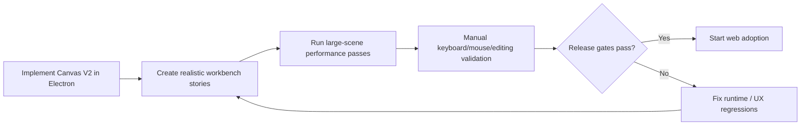

# 10: Electron Rollout, Workbenches, and Release Gates

> Prove Canvas V2 in Electron first with realistic workbench scenes, measurable budgets, and a clean release gate before any parity work expands the surface area.

**Objective:** convert the implementation sequence into a disciplined shipping process.

**Dependencies:** all prior steps

## Scope and Dependencies

This step covers:

- Electron-first rollout,
- Storybook/dev workbench coverage,
- benchmark scenes,
- validation commands,
- web follow-up only after core gates pass.

## Relevant Codebase Touchpoints

- [`apps/electron/src/renderer/App.tsx`](../../../apps/electron/src/renderer/App.tsx)
- [`apps/electron/src/renderer/components/CanvasView.tsx`](../../../apps/electron/src/renderer/components/CanvasView.tsx)
- [`.storybook/main.ts`](../../../.storybook/main.ts)
- [`packages/devtools/src/panels/QueryDebugger/QueryDebugger.tsx`](../../../packages/devtools/src/panels/QueryDebugger/QueryDebugger.tsx)
- [`packages/canvas/src/performance/frame-monitor.ts`](../../../packages/canvas/src/performance/frame-monitor.ts)
- [`packages/canvas/src/performance/memory-profile.ts`](../../../packages/canvas/src/performance/memory-profile.ts)

## Rollout Sequence



## Proposed Release Strategy

### 1. Electron first

Canvas V2 should replace the active Electron canvas path first.

Why:

- it is already the primary product shell,
- it provides the richest local testing surface,
- it avoids diluting effort across two UI platforms while the runtime is still settling.

### 2. Storybook/dev workbench coverage

Build dedicated Canvas V2 stories that cover:

- empty canvas,
- page-heavy canvas,
- database-preview canvas,
- mixed URL/media canvas,
- shape/connector dense canvas,
- very large synthetic scene for performance testing.

### 3. Performance harnesses

Create repeatable scenes for:

- 1,000 objects,
- 5,000 objects,
- 10,000 objects,
- mixed object densities,
- high connector counts,
- heavy preview cards.

Track:

- frame timing,
- DOM count,
- minimap responsiveness,
- query counts/churn,
- memory profile.

### 4. Manual validation gates

Because this is a rich interactive surface, manual Electron validation is required for:

- drag/drop,
- pointer + keyboard interplay,
- inline editing,
- peek/focus transitions,
- multi-user presence,
- comment anchoring,
- split workflows.

### 5. Web parity later

Only after Electron passes the gates should the team adapt the new shell/runtime to the web app.

## Suggested Validation Matrix

| Area | Gate |
| --- | --- |
| Scene model | only Canvas V2 object kinds are used in the active path |
| Performance | large-scene pan/zoom stays smooth and DOM remains bounded |
| Content | page editing and database preview/open flows are stable |
| UX | hotkeys, command palette, minimap, and selection HUD are coherent |
| Collaboration | presence and undo boundaries behave predictably |
| Accessibility | keyboard traversal and focus treatment are complete |

## Implementation Notes

- Update Storybook workbenches as the scene model changes; do not leave stories wired to the old generic object contract.
- Use frame and query devtools during manual validation rather than relying on subjective feel alone.
- Record benchmark scenes and release gates in the plan/PR notes so performance claims remain traceable.

## Testing and Validation Approach

Suggested commands:

```bash
pnpm --filter @xnetjs/canvas test
pnpm --filter @xnetjs/react test
pnpm --filter @xnetjs/data test
pnpm dev:stories
cd apps/electron && pnpm dev
cd apps/electron && pnpm dev:both
```

Manual validation should include:

- create page/database from shortcut and command palette,
- drop URL/image/file/internal object,
- pan and zoom across dense scenes,
- edit page inline and in focused mode,
- preview/open database and return,
- use minimap and fit/reset shortcuts,
- test lock/group/align/tidy on dense selections,
- verify collaboration and undo boundaries.

## Risks and Edge Cases

- Storybook scenes can drift from the real app if the runtime shell is forked across package and app code.
- Performance gates will be misleading if the synthetic scenes are too simple.
- Web parity should not begin until the Electron shell stops changing at the architecture level.

## Step Checklist

- [ ] Replace the active Electron canvas path with Canvas V2.
- [ ] Build realistic Storybook/workbench scenes for every major object family and density class.
- [ ] Add repeatable performance scenes and capture frame/DOM/query metrics.
- [ ] Run manual Electron validation for editing, navigation, collaboration, and shortcuts.
- [ ] Document and enforce release gates before web rollout.
- [ ] Start web adaptation only after Electron passes the full gate set.
