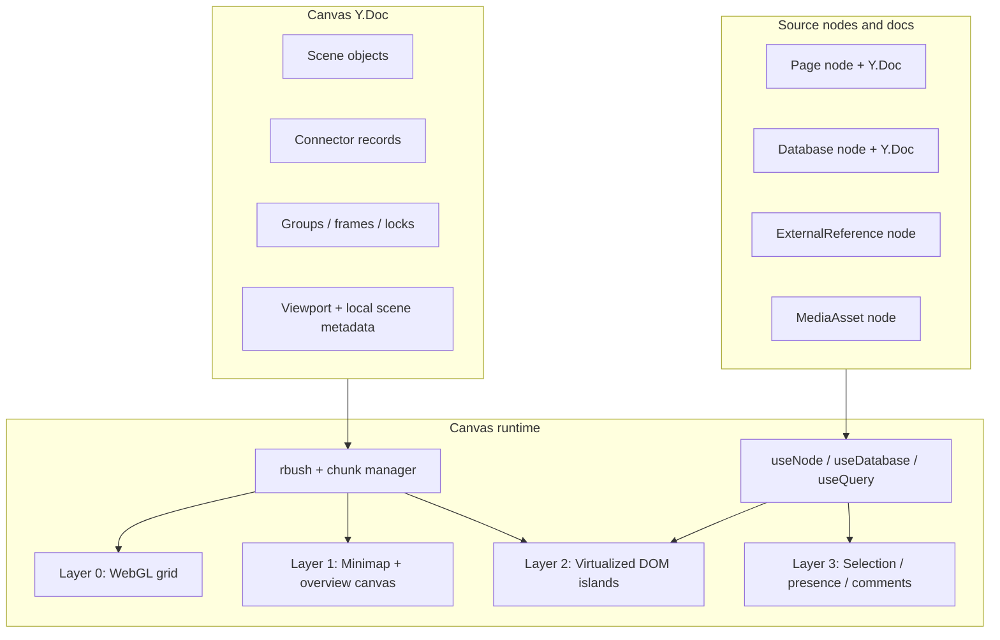
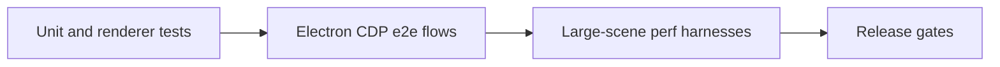

# xNet Implementation Plan - Step 03.983: Canvas V2

> Replace the current placeholder canvas with a content-first, node-backed infinite workspace that reuses xNet nodes, Yjs, React hooks, and the existing canvas runtime primitives while keeping the UI minimal and the frame budget stable.

## Title and Short Summary

This plan turns [exploration 0108](../../explorations/0108_[_]_CANVAS_V1_PAGES_DATABASES_AND_INFINITE_CANVAS_DEEP_DIVE.md) into an execution sequence for a **clean Canvas V2 cutover**.

The plan assumes these constraints from the outset:

- **No backward compatibility requirement** for the current generic canvas object model.
- **Electron-first** implementation and validation, with web adoption only after the runtime is stable.
- **Reuse internal primitives aggressively**:
  - xNet nodes remain the identity layer
  - Yjs remains the document/collaboration layer
  - `@xnetjs/react` hooks remain the primary read/write surface
  - `@xnetjs/canvas` spatial, chunking, minimap, grid, and accessibility work remain the runtime foundation

The product target is a **content-first infinite workspace**:

- pages can be created and edited directly on the canvas,
- databases can be created and previewed directly on the canvas,
- URLs and media can be dropped onto the canvas as first-class objects,
- shapes/connectors/groups remain native whiteboard primitives,
- the renderer keeps DOM count bounded and maintains smooth pan/zoom/edit behavior at scale.

## Problem Statement

The current canvas already has serious infrastructure, but the active UX is still one layer too generic.

As of **March 9, 2026**:

- the active Electron shell boots into a home canvas and already treats the canvas as the primary landing surface,
- the `@xnetjs/canvas` package already contains a WebGL grid, minimap, chunking, spatial indexing, accessibility helpers, and navigation hooks,
- pages and databases already exist as node-backed Yjs documents,
- `useQuery`, `useNode`, and `useDatabase` already provide the right abstraction boundaries for data access,
- but the actual canvas objects are still mostly placeholder cards and generic embeds.

That gap matters because it produces the worst of both worlds:

- the canvas has the complexity of a whiteboard surface,
- but not the utility of a real workspace.

Canvas V2 should fix that by making the canvas useful for real work immediately while preserving strict performance and UX discipline:

- **content-first** rather than chrome-first,
- **minimal** rather than inspector-heavy,
- **bounded DOM** rather than “render everything,”
- **typed scene objects** rather than generic card props,
- **xNet-native primitives** rather than a parallel canvas-specific data stack.

## Current State in the Repository

### What is already strong

- [`packages/canvas/src/store.ts`](../../../packages/canvas/src/store.ts) already stores canvas state in a Yjs document with node/edge maps and an `rbush`-backed spatial index.
- [`packages/canvas/src/spatial/index.ts`](../../../packages/canvas/src/spatial/index.ts) already provides viewport math, spatial search, and hit-testing against arbitrary rectangles.
- [`packages/canvas/src/chunks/chunked-canvas-store.ts`](../../../packages/canvas/src/chunks/chunked-canvas-store.ts) and [`packages/canvas/src/chunks/chunk-manager.ts`](../../../packages/canvas/src/chunks/chunk-manager.ts) already provide chunk-oriented infinite-canvas machinery.
- [`packages/canvas/src/layers/webgl-grid.ts`](../../../packages/canvas/src/layers/webgl-grid.ts) already provides a procedural WebGL grid.
- [`packages/canvas/src/components/Minimap.tsx`](../../../packages/canvas/src/components/Minimap.tsx) already provides a canvas-rendered minimap.
- [`packages/canvas/src/accessibility/keyboard-navigation.ts`](../../../packages/canvas/src/accessibility/keyboard-navigation.ts) and [`packages/canvas/src/hooks/useCanvasKeyboard.ts`](../../../packages/canvas/src/hooks/useCanvasKeyboard.ts) already provide meaningful keyboard/navigation primitives.
- [`packages/react/src/hooks/useQuery.ts`](../../../packages/react/src/hooks/useQuery.ts) already runs through the DataBridge and gives the plan a stable place to evolve viewport-aware query descriptors later.
- [`packages/react/src/hooks/useDatabase.ts`](../../../packages/react/src/hooks/useDatabase.ts) and [`packages/react/src/hooks/useDatabaseDoc.ts`](../../../packages/react/src/hooks/useDatabaseDoc.ts) already provide the right database preview/focus primitives.
- [`apps/electron/src/renderer/App.tsx`](../../../apps/electron/src/renderer/App.tsx) already uses `CommandPalette` and a canvas-first shell state.

### Where the current product is still split

| Area              | Observed repository state                                                                                                                                                                  | Why Canvas V2 must change it                                          |
| ----------------- | ------------------------------------------------------------------------------------------------------------------------------------------------------------------------------------------ | --------------------------------------------------------------------- |
| Scene model       | [`packages/canvas/src/types.ts`](../../../packages/canvas/src/types.ts) still defines `card`, `frame`, `shape`, `image`, `embed`, `group`                                                  | too generic for content-first rendering and object-specific policies  |
| App shell         | [`apps/electron/src/renderer/components/CanvasView.tsx`](../../../apps/electron/src/renderer/components/CanvasView.tsx) still renders linked cards rather than live page/database surfaces | the canvas still feels like a launcher, not a workspace               |
| Drop model        | URLs/files/internal drags are not unified into one ingestion pipeline                                                                                                                      | the canvas cannot yet behave like a universal spatial drop target     |
| Renderer contract | the package exposes layer/chunk/LOD primitives, but the active app path does not fully route through them                                                                                  | performance work exists but is not yet the primary runtime            |
| Data access       | the app already has `useNode`, `useDatabase`, and `useQuery`, but the canvas does not yet drive their next evolution                                                                       | the canvas should strengthen the hook/runtime platform, not bypass it |

### Product-quality observations to carry forward

- Keep the current **R-tree (`rbush`)** as the primary spatial index for v2. Do not switch to quadtree by default.
- Keep the current **node/Yjs split**: canvas docs own spatial placement; source nodes own rich content.
- Keep the current **WebGL grid + canvas minimap** direction and promote it into the default runtime path.
- Reuse the current **command palette, keyboard hooks, undo hooks, and comments infrastructure** instead of inventing parallel stacks.

## Goals and Non-Goals

### Goals

- Replace the generic canvas object contract with a typed scene graph centered on:
  - `page`
  - `database`
  - `external-reference`
  - `media`
  - `shape`
  - `note`
  - `group`
- Make **page cards** the first fully editable inline canvas object.
- Make **database cards** live preview objects with focus/open and split-view workflows.
- Make **URL and media drops** first-class creation paths.
- Promote the **hybrid renderer** into the default runtime:
  - WebGL/canvas for coverage-heavy layers
  - DOM for interaction-heavy objects
- Keep the UX **minimal and content-first**:
  - very little persistent chrome
  - contextual controls
  - strong keyboard/command affordances
- Reuse xNet’s main primitives:
  - nodes
  - Yjs
  - DataBridge-backed hooks
  - existing canvas runtime utilities
- Define measurable frame, memory, DOM-count, and interaction budgets for 60Hz and 120Hz targets.

### Non-Goals

- Do not preserve the old `CanvasNodeType` semantics for compatibility.
- Do not maintain the current placeholder-card model in parallel with Canvas V2.
- Do not ship AFFiNE-style mind map, presentation, or AI workspace features in the first Canvas V2 cut.
- Do not embed full database editing into the base canvas object in the initial release.
- Do not optimize for mobile parity in the first pass.
- Do not create a canvas-only data-access stack that bypasses `useNode`, `useDatabase`, or `useQuery`.

## Product Principles

### 1. Content first

Persistent chrome should be minimal. The default view should emphasize the canvas content, not sidebars, inspectors, or toolbars.

### 2. Reuse internal primitives

Canvas V2 should strengthen xNet’s platform rather than fragment it:

- object identity stays node-backed,
- rich content stays Yjs-backed,
- list/search/picker loading stays hook-driven,
- comments/undo/presence build on current infrastructure.

### 3. Cheap layers, expensive objects only when needed

- Infinite background visuals belong on WebGL/canvas.
- The minimap belongs on canvas.
- Far-field object representations should be batched and simplified.
- Rich DOM editors should mount only when visible and warranted by zoom/selection/edit state.

### 4. Minimal UX, strong keyboard

The canvas should not require a large fixed toolbar to be usable. Most actions should be reachable through:

- direct manipulation,
- a compact contextual selection HUD,
- command palette,
- a discoverable shortcut set.

### 5. Performance is part of the product

Canvas V2 is not complete unless panning, zooming, selecting, editing, dropping, and opening content all feel smooth under realistic workloads.

## Architecture and Phase Overview

### Phase logic

1. **Cut over the scene model** so the runtime has correct semantics.
2. **Promote the hybrid renderer** so the shell uses the right layers by default.
3. **Activate chunking, culling, and query-aware display lists** before adding more content types.
4. **Ship universal object creation flows** for drops and commands.
5. **Make pages and databases feel native on the canvas.**
6. **Add the whiteboard-management primitives** that keep dense boards usable.
7. **Harden shortcuts, accessibility, collaboration, undo, and validation** before broad rollout.

### Performance targets

| Area                       | Target                                                                      |
| -------------------------- | --------------------------------------------------------------------------- |
| Pan/zoom on 60Hz displays  | stay comfortably within `16.67ms` frame budget                              |
| Pan/zoom on 120Hz displays | aim for `8.33ms` effective frame budget                                     |
| Interactive DOM count      | keep near-field DOM objects bounded and measurable                          |
| Far-field rendering        | no inline editor mounts outside the near-field window                       |
| Large-scene navigation     | chunk load/evict and display-list recompute must not cause visible hitching |
| Database preview           | bounded preview rows/cells with virtualization for heavy previews           |

## Test Strategy

- Use **package-level unit and renderer tests** for scene-model contracts, minimap/grid behavior, shortcut dispatch, and store/query math.
- Use **Electron CDP Playwright tests** for real shell behavior:
  - canvas boot
  - dock + command-palette creation flows
  - minimap visibility/toggle
  - focus/return transitions
  - drag/drop smoke flows
  - shortcut and typing-guard behavior
- Use **large-scene performance harnesses** for:
  - bounded DOM count
  - no unexpected editor/table mounts on the home canvas
  - frame/query telemetry capture
  - chunk load/evict timing and minimap responsiveness
- Keep performance gates tied to reproducible synthetic scenes and explicit thresholds recorded in PR notes.

## Step Index

| Step | File                                                                                                           | Outcome                                                                              |
| ---- | -------------------------------------------------------------------------------------------------------------- | ------------------------------------------------------------------------------------ |
| 1    | [01-scene-graph-and-node-primitives.md](./01-scene-graph-and-node-primitives.md)                               | typed Canvas V2 scene model, source-node contracts, and clean cutover rules          |
| 2    | [02-hybrid-shell-and-renderer-runtime.md](./02-hybrid-shell-and-renderer-runtime.md)                           | primary hybrid runtime shell with explicit layer responsibilities                    |
| 3    | [03-spatial-runtime-and-query-evolution.md](./03-spatial-runtime-and-query-evolution.md)                       | chunked/cullable display lists plus hook/query evolution for viewport-driven loading |
| 4    | [04-drop-ingestion-and-source-object-creation.md](./04-drop-ingestion-and-source-object-creation.md)           | universal drop pipeline and node-backed URL/media creation flows                     |
| 5    | [05-page-cards-inline-editing-and-peek.md](./05-page-cards-inline-editing-and-peek.md)                         | live page cards with inline editing, LOD, and center-peek flows                      |
| 6    | [06-database-cards-preview-focus-and-split.md](./06-database-cards-preview-focus-and-split.md)                 | database preview cards with focus/open/split workflows                               |
| 7    | [07-connectors-shapes-groups-and-polish.md](./07-connectors-shapes-groups-and-polish.md)                       | bindings, shapes, groups, locks, tidy-up, aliases, and backlink polish               |
| 8    | [08-navigation-shortcuts-and-minimal-ux.md](./08-navigation-shortcuts-and-minimal-ux.md)                       | minimal chrome, hotkeys, command palette integration, and navigation UX              |
| 9    | [09-collaboration-undo-accessibility-and-comments.md](./09-collaboration-undo-accessibility-and-comments.md)   | collaboration scopes, undo boundaries, accessibility, and comment anchoring          |
| 10   | [10-electron-rollout-workbenches-and-release-gates.md](./10-electron-rollout-workbenches-and-release-gates.md) | Electron-first rollout, Storybook workbenches, benchmarks, and release gates         |

## Risks and Open Questions

- **Scene model reset:** because backward compatibility is out of scope, existing canvas docs may need explicit invalidation or one-time replacement behavior during development.
- **Editor mount churn:** inline rich editors can still become the main performance risk if zoom/selection gates are too permissive.
- **Database preview scope:** a preview card that tries to do too much will recreate the current “heavy embed” problem.
- **Query evolution timing:** extending `QueryDescriptor` for viewport/spatial predicates is valuable, but it should not block the initial Canvas V2 runtime if a local display-list cache is enough for the first cut.
- **Split-view complexity:** split canvas + focused surface workflows are useful, but they must not add permanent chrome or route complexity too early.
- **Comment/block anchors:** page-level comments are already real; block-level canvas anchors need a precise ownership model before they are productized.
- **Web parity:** the web app should follow only after the Electron shell proves the runtime and UX choices.

## Implementation Checklist

- [ ] Replace the current generic canvas object contract with a typed scene graph.
- [x] Add a reusable `MediaAsset`-style node schema for dropped images/files.
- [x] Replace the current linked-card shell with a hybrid renderer shell.
- [x] Route the main runtime through chunking, culling, and explicit layer display lists.
- [x] Add universal drop ingestion for internal drags, URLs, text, images, and files.
- [x] Ship live page cards with inline editing and peek behavior.
- [x] Ship database preview cards with focus/open and split workflows.
- [x] Add connector bindings, shapes, groups, and aliases/backlinks.
- [x] Add lock/unlock plus align/distribute/tidy operations for dense-board management.
- [ ] Define and implement the full shortcut/command surface for Canvas V2.
- [ ] Integrate collaboration, undo, comments, and accessibility into the new scene/runtime model.
- [ ] Build Storybook and manual validation scenes that reflect the real Canvas V2 object model.
- [x] Add Electron CDP e2e coverage for canvas creation, minimap, command palette, drag/drop, and focused-surface transitions.
- [x] Add large-scene performance harnesses with DOM-count, query-churn, and frame-budget assertions.
- [ ] Validate Electron-first performance and interaction budgets before web rollout.

## Validation Checklist

- [x] Creating a page on the canvas immediately creates a real `Page` node and supports inline editing.
- [x] Creating a database on the canvas immediately creates a real `Database` node and shows a bounded live preview.
- [x] Dropping a URL creates or reuses an `ExternalReference` node and renders the correct fallback chain.
- [x] Dropping an image or file creates a reusable media node and preserves it after reload.
- [x] Web Playwright smoke coverage verifies URL and image drops create source-backed canvas objects.
- [x] Pan/zoom remains smooth on large scenes with chunk load/evict active.
- [x] The background grid and minimap remain outside the main DOM path.
- [x] Far-field objects do not mount rich editors or oversized DOM subtrees.
- [x] Electron CDP tests cover dock creation, command-palette creation, minimap toggling, and focused-surface transitions.
- [x] Large-scene performance runs capture bounded DOM count, frame timing, minimap responsiveness, and query churn.
- [ ] Shortcut-driven flows let a keyboard user create, select, group, lock, align, peek, edit, and open objects without excessive pointer travel.
- [ ] Undo/redo behaves correctly across canvas-object moves and inline content edits.
- [ ] Collaboration keeps canvas movement/selection awareness separate from page/database editing awareness.
- [x] Comment anchors survive object moves/resizes and degrade cleanly when underlying anchors disappear.
- [ ] The Electron shell is stable before any parity work starts in the web app.

## References

### Local references

- [Exploration 0108](../../explorations/0108_[_]_CANVAS_V1_PAGES_DATABASES_AND_INFINITE_CANVAS_DEEP_DIVE.md)
- [Canvas optimization exploration 0068](../../explorations/0068_[-]_CANVAS_OPTIMIZATION.md)
- [Canvas optimizations plan 03.9.4](../plan03_9_4CanvasOptimizations/README.md)
- [`apps/electron/src/renderer/App.tsx`](../../../apps/electron/src/renderer/App.tsx)
- [`apps/electron/src/renderer/components/CanvasView.tsx`](../../../apps/electron/src/renderer/components/CanvasView.tsx)
- [`packages/canvas/src/types.ts`](../../../packages/canvas/src/types.ts)
- [`packages/canvas/src/store.ts`](../../../packages/canvas/src/store.ts)
- [`packages/canvas/src/spatial/index.ts`](../../../packages/canvas/src/spatial/index.ts)
- [`packages/canvas/src/chunks/chunk-manager.ts`](../../../packages/canvas/src/chunks/chunk-manager.ts)
- [`packages/canvas/src/chunks/chunked-canvas-store.ts`](../../../packages/canvas/src/chunks/chunked-canvas-store.ts)
- [`packages/canvas/src/layers/index.ts`](../../../packages/canvas/src/layers/index.ts)
- [`packages/canvas/src/layers/webgl-grid.ts`](../../../packages/canvas/src/layers/webgl-grid.ts)
- [`packages/canvas/src/components/Minimap.tsx`](../../../packages/canvas/src/components/Minimap.tsx)
- [`packages/canvas/src/accessibility/keyboard-navigation.ts`](../../../packages/canvas/src/accessibility/keyboard-navigation.ts)
- [`packages/canvas/src/hooks/useCanvasKeyboard.ts`](../../../packages/canvas/src/hooks/useCanvasKeyboard.ts)
- [`packages/data/src/schema/schemas/canvas.ts`](../../../packages/data/src/schema/schemas/canvas.ts)
- [`packages/data/src/schema/schemas/page.ts`](../../../packages/data/src/schema/schemas/page.ts)
- [`packages/data/src/schema/schemas/database.ts`](../../../packages/data/src/schema/schemas/database.ts)
- [`packages/data/src/schema/schemas/external-reference.ts`](../../../packages/data/src/schema/schemas/external-reference.ts)
- [`packages/data/src/blob/blob-service.ts`](../../../packages/data/src/blob/blob-service.ts)
- [`packages/react/src/hooks/useQuery.ts`](../../../packages/react/src/hooks/useQuery.ts)
- [`packages/react/src/hooks/useDatabase.ts`](../../../packages/react/src/hooks/useDatabase.ts)
- [`packages/react/src/hooks/useUndo.ts`](../../../packages/react/src/hooks/useUndo.ts)
- [`packages/react/src/hooks/useUndoScope.ts`](../../../packages/react/src/hooks/useUndoScope.ts)
- [`packages/ui/src/composed/CommandPalette.tsx`](../../../packages/ui/src/composed/CommandPalette.tsx)

### External references

- [AFFiNE July 2024 Update](https://affine.pro/blog/whats-new-affine-2024-07)
- [AFFiNE September 2024 Update](https://affine.pro/blog/whats-new-affine-sep)
- [AFFiNE November 2024 Update](https://affine.pro/blog/whats-new-affine-nov-update)
- [AFFiNE December 2024 Update](https://affine.pro/blog/whats-new-affine-dec-update)
- [AFFiNE February 2025 Update](https://affine.pro/blog/whats-new-feb-update)
- [AFFiNE April 2025 Update](https://affine.pro/blog/whats-new-april-update)
- [AFFiNE June 2025 Update](https://affine.pro/blog/whats-new-june-update)
- [tldraw external content handling](https://tldraw.dev/sdk-features/external-content)
- [tldraw bindings](https://tldraw.dev/sdk-features/bindings)
- [TanStack Virtualizer API](https://tanstack.com/virtual/latest/docs/api/virtualizer)
- [Yjs subdocuments](https://docs.yjs.dev/api/subdocuments)
- [MDN: Optimizing canvas](https://developer.mozilla.org/en-US/docs/Web/API/Canvas_API/Tutorial/Optimizing_canvas)
- [MDN: OffscreenCanvas](https://developer.mozilla.org/en-US/docs/Web/API/OffscreenCanvas)
- [MDN: Pointer events](https://developer.mozilla.org/en-US/docs/Web/API/Pointer_events)
- [oEmbed](https://oembed.com/)
- [The Open Graph protocol](https://ogp.me/)
