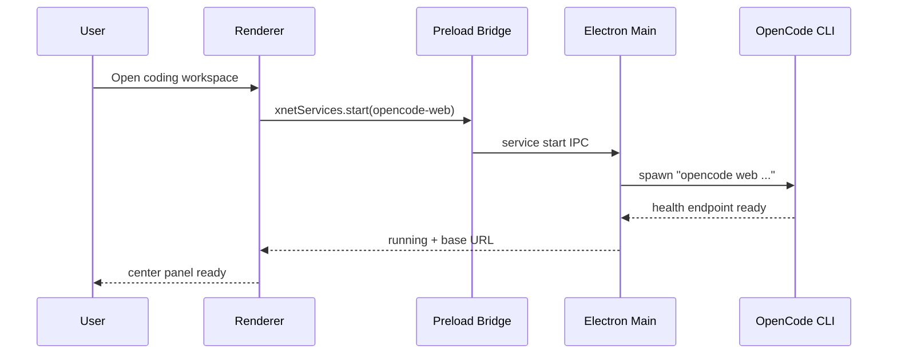

# 01: Service Boundary and OpenCode Host

> Fix the Electron service bridge, make OpenCode a managed local dependency, and prepare the renderer to host the OpenCode web UI safely.

**Dependencies:** None

## Objective

Create a reliable OpenCode host layer that the rest of the MVP can assume exists.

This step should leave the repo with:

- a corrected Electron service boundary
- a managed `OpenCodeService`
- fixed localhost CSP rules for OpenCode and preview surfaces
- a clear missing-binary / bad-config fallback path

## Scope and Dependencies

In scope:

- Electron main process service lifecycle
- preload allowlist alignment
- renderer CSP updates
- OpenCode binary detection and startup
- health checks and error states

Out of scope:

- session schemas
- shell layout
- worktree creation
- right-click context

## Relevant Codebase Touchpoints

- `apps/electron/src/main/service-ipc.ts`
- `apps/electron/src/preload/index.ts`
- `packages/plugins/src/services/client.ts`
- `apps/electron/src/main/index.ts`
- `apps/electron/src/main/secure-seed.ts`
- `apps/electron/src/renderer/index.html`
- `apps/electron/electron.vite.config.ts`
- `apps/electron/package.json`

## Proposed Design

### 1. Align the service contract

The preload layer currently blocks service channels that the renderer client expects.

Required contract alignment:

- allow `restart`
- allow `list-all`
- allow `call`
- allow subscriptions for `status-update` and `output`

This should be done by making the preload allowlist reference the shared channel constants rather than duplicating string literals.

### 2. Add `OpenCodeService`

Create a small main-process module, for example:

- `apps/electron/src/main/opencode-service.ts`

Responsibilities:

- detect whether `opencode` is available on `PATH`
- start `opencode web` on a fixed or configurable localhost port
- provide renderer-readable status
- expose last error and recovery instructions
- stop cleanly on app shutdown

For the MVP, prefer **system CLI dependency + clear UX** over bundling.

### 3. Renderer embedding mode

Target MVP mode:

- render OpenCode Web in an `iframe` or similar browser surface in the center panel

Fallback mode:

- if iframe/CSP integration is problematic, open a dedicated BrowserWindow for OpenCode while preserving the same session model

Do **not** base the MVP on `<webview>`.

### 4. CSP updates

The renderer currently only frames a fixed allowlist of public embed origins.

Add controlled support for:

- `http://127.0.0.1:*`
- `http://localhost:*`
- any preview port range used by the MVP

Also ensure `connect-src` allows the required localhost HTTP/SSE/WebSocket flows.

## Service Startup Flow



## Proposed API Shape

```ts
export type OpenCodeHostStatus =
  | { state: 'missing-binary'; error: string }
  | { state: 'starting'; port: number }
  | { state: 'ready'; port: number; baseUrl: string }
  | { state: 'error'; error: string }

export type OpenCodeHostController = {
  ensure(): Promise<OpenCodeHostStatus>
  stop(): Promise<void>
  status(): Promise<OpenCodeHostStatus>
}
```

## Concrete Implementation Notes

### Suggested file additions

- `apps/electron/src/main/opencode-service.ts`
- `apps/electron/src/main/git-utils.ts` only if shared subprocess helpers are needed here

### Suggested settings / env model

For MVP:

- `XNET_OPENCODE_PORT` optional
- `XNET_OPENCODE_PASSWORD` optional
- allow explicit binary path later, but do not make it step 1 if `PATH` detection is sufficient

### Secure storage

Reuse the same secure-storage pattern seen in `secure-seed.ts` only if the shell itself stores OpenCode-specific secrets.

If provider auth stays inside OpenCode’s own flows, keep the shell ignorant of provider credentials.

### Example service definition sketch

```ts
const openCodeService = {
  id: 'opencode-web',
  name: 'OpenCode Web',
  process: {
    command: 'opencode',
    args: ['web', '--port', String(port)],
    env: {
      OPENCODE_SERVER_PASSWORD: password
    }
  },
  lifecycle: {
    restart: 'on-failure',
    startTimeoutMs: 15_000,
    healthCheck: {
      type: 'http',
      url: `http://127.0.0.1:${port}`
    }
  },
  communication: {
    protocol: 'http',
    port
  }
}
```

## Testing and Validation Approach

- Add a targeted test for the preload allowlist contract if practical.
- Manual validation:
  - start Electron
  - open the coding workspace
  - verify OpenCode starts once
  - verify reloads do not spawn duplicates
  - verify service output/status is visible from the renderer
- Failure validation:
  - rename/remove `opencode` from `PATH`
  - confirm the shell shows actionable recovery text instead of failing silently

## Risks, Edge Cases, and Migration Concerns

- OpenCode CLI version drift may break startup flags or health behavior.
- Overly broad localhost CSP can reduce renderer isolation; keep it narrow.
- If OpenCode Web requires auth flows that do not frame cleanly, fallback to BrowserWindow mode.

## Step Checklist

- [ ] Replace hard-coded preload allowlist strings with shared service channel constants
- [ ] Expose the full service client contract to the renderer
- [ ] Add OpenCode CLI detection and friendly failure UX
- [ ] Add `OpenCodeService` lifecycle wrapper in Electron main
- [ ] Add CSP allowances for localhost OpenCode and preview surfaces
- [ ] Validate clean startup/shutdown and duplicate-start protection
