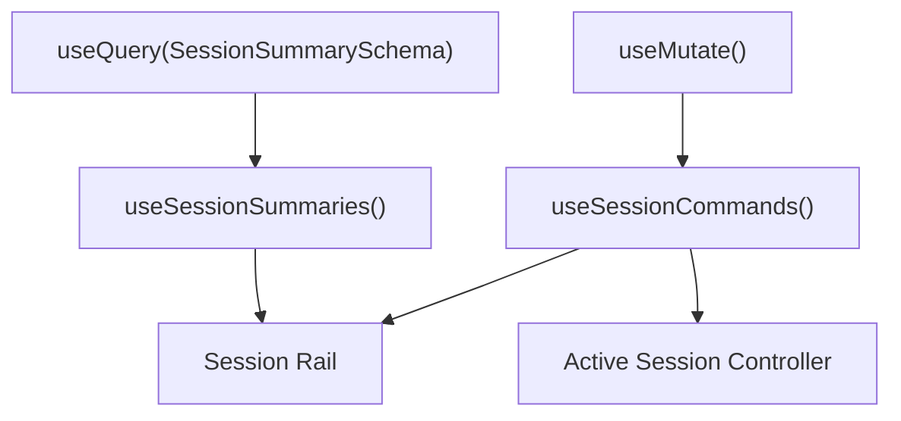

# 02: Session Summary and Fast Shell State

> Use xNet primitives to back the session rail, shell status, and instant-switch behavior before wiring full git and preview orchestration.

**Dependencies:** Step 01

## Objective

Create a local-first shell state model using xNet data primitives, not a bespoke store.

This step should leave the repo with:

- one or more app-local schemas for coding sessions
- local React hooks for the session rail and active-session state
- denormalized summary data optimized for instant switching
- a clear rule for what belongs in xNet and what stays ephemeral

## Scope and Dependencies

In scope:

- app-local schema definitions
- hooks built on `useQuery` / `useMutate`
- session-summary denormalization
- active-session selection state
- cached summary restoration

Out of scope:

- real worktree creation
- OpenCode panel embedding
- full preview management

## Relevant Codebase Touchpoints

- `packages/react/src/hooks/useQuery.ts`
- `packages/react/src/hooks/useMutate.ts`
- `packages/react/src/hooks/useNode.ts`
- `packages/react/src/context.ts`
- `packages/data-bridge/src/main-thread-bridge.ts`
- `packages/data-bridge/src/query-cache.ts`
- `apps/electron/src/renderer/main.tsx`
- `apps/electron/src/renderer/App.tsx`

## Proposed Design

### 1. Add app-local session schemas

Start app-local because this feature is Electron-only in the MVP.

Suggested location:

- `apps/electron/src/renderer/workspace/schemas.ts`

Suggested schemas:

- `SessionSummarySchema`
- `SessionArtifactSchema` (optional in this step if needed for screenshots/diff summaries)

### 2. Denormalize aggressively

Do not store raw chat transcripts or large diff payloads as the source of truth for the left rail.

Store rail-friendly fields directly:

- title
- branch
- worktree path
- preview URL
- changed files count
- last message preview
- last screenshot path
- current state
- updatedAt

This makes `useQuery(SessionSummarySchema)` cheap and stable.

### 3. Keep raw streaming out of the hot path

The user explicitly wants the speed gains to come from xNet primitives where possible.

For MVP, that should mean:

- use xNet for durable local shell state
- use xNet for summary projections and artifacts
- do **not** persist every token before the UI can display it

### 4. Avoid growing `@xnetjs/react` too early

Use existing hooks first.

Only promote new shared hook APIs if a pattern is clearly reusable after the MVP is proven. Candidate later extractions:

- `prefetchQuery(...)`
- query-warming helpers
- summary-projection helpers

Those should remain follow-on work unless blocked.

## Data Model Sketch

```ts
const SessionSummarySchema = defineSchema({
  name: 'SessionSummary',
  namespace: 'xnet://xnet.dev/coding-ui/',
  properties: {
    title: text({ required: true }),
    branch: text({ required: true }),
    worktreePath: text({ required: true }),
    openCodeUrl: text({ required: true }),
    previewUrl: text(),
    lastMessagePreview: text(),
    lastScreenshotPath: text(),
    changedFilesCount: integer(),
    state: select({
      options: [
        { id: 'idle', name: 'Idle' },
        { id: 'running', name: 'Running' },
        { id: 'previewing', name: 'Previewing' },
        { id: 'error', name: 'Error' }
      ] as const
    }),
    updatedAt: integer({ required: true })
  }
})
```

## Proposed Hook Layer



Suggested hooks:

- `useSessionSummaries()`
- `useActiveSessionId()`
- `useSessionCommands()`

Keep these app-local in `apps/electron/src/renderer/workspace/hooks/`.

## Concrete Implementation Notes

### Suggested directory layout

```text
apps/electron/src/renderer/workspace/
  schemas.ts
  hooks/
    useSessionSummaries.ts
    useSessionCommands.ts
    useActiveSession.ts
  state/
    active-session.ts
```

### What belongs in xNet

- session summaries
- artifact metadata
- recent checkpoints
- file-change counts
- last screenshot path

### What stays ephemeral or external

- active token stream
- in-flight OpenCode panel DOM state
- transient right-click popover state
- preview boot promises

### Example local command wrapper

```ts
export function useSessionCommands() {
  const { create, update } = useMutate()

  return {
    async createSummary(input: SessionSummaryInput) {
      return create(SessionSummarySchema, input)
    },
    async markRunning(id: string) {
      return update(SessionSummarySchema, id, {
        state: 'running',
        updatedAt: Date.now()
      })
    }
  }
}
```

## Testing and Validation Approach

- Add hook-level tests around summary creation and update if practical.
- Manual validation:
  - launch app
  - seed a few session summaries
  - verify the rail renders them from local state
  - switch active session offline and confirm the shell still renders correctly

## Risks, Edge Cases, and Migration Concerns

- Summary drift is possible if preview or git state updates fail silently.
- App-local schemas may need promotion later if the feature grows beyond Electron.
- Over-modeling the session state too early can slow down future iterations.

## Step Checklist

- [ ] Add app-local session summary schema(s)
- [ ] Add app-local hooks for session summaries and commands
- [ ] Use denormalized summary records for rail and shell state
- [ ] Keep token streaming out of xNet’s hot path
- [ ] Validate instant local restoration of session summaries
