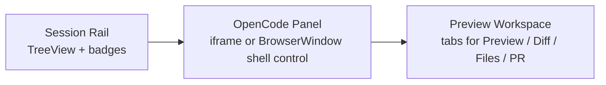

# 03: Shell Layout and OpenCode Panel

> Add the three-panel coding workspace mode in the Electron renderer and host OpenCode Web as the center panel without building a custom chat UI.

**Dependencies:** Steps 01-02

## Objective

Introduce a developer-workspace shell mode that coexists with the existing canvas-first app while proving the final interaction model:

- left rail for sessions
- center panel for OpenCode
- right panel for preview and supporting artifacts

## Scope and Dependencies

In scope:

- shell-mode entry point in the renderer
- panel composition and resizing
- session rail rendering
- center-panel OpenCode surface
- right-panel tab shell

Out of scope:

- real worktree creation
- real preview runtime management
- diff/PR data sources

## Relevant Codebase Touchpoints

- `apps/electron/src/renderer/App.tsx`
- `apps/electron/src/renderer/main.tsx`
- `packages/ui/src/primitives/ResizablePanel.tsx`
- `packages/ui/src/composed/TreeView.tsx`
- `packages/ui/src/components/MarkdownContent.tsx`
- `apps/electron/src/renderer/index.html`

## Proposed Design

### 1. Add a dedicated workspace shell mode

Because the Electron renderer is not currently route-based, add a new top-level mode to `App.tsx` rather than introducing a full routing migration here.

Recommended shape:

- keep current canvas shell as default or sibling mode
- add a `coding-workspace` shell state
- allow entry from `SystemMenu` or a temporary developer toggle

### 2. Use existing UI primitives

Build the layout from `ResizablePanelGroup`, `ResizablePanel`, and `ResizableHandle`.

Use `TreeView` for the left rail to avoid inventing a rail component.

Use simple tabs on the right for:

- Preview
- Diff
- Files
- Markdown
- PR

### 3. Center panel strategy

For MVP:

- host OpenCode Web directly

Preferred order:

1. `iframe` to the local OpenCode web origin
2. fallback BrowserWindow if iframe integration is insufficient

### 4. Right panel is native, not delegated

Do not delegate the whole app shell to OpenCode.

The right panel should remain native xNet UI because it will later own:

- preview controls
- diff summaries
- markdown preview
- PR generation state
- checkpoint metadata

## Shell Layout Diagram



## Concrete Implementation Notes

### Suggested component structure

```text
apps/electron/src/renderer/workspace/
  DevWorkspaceShell.tsx
  SessionRail.tsx
  OpenCodePanel.tsx
  PreviewWorkspace.tsx
  PreviewTabs.tsx
```

### Example shell composition

```tsx
export function DevWorkspaceShell(): JSX.Element {
  return (
    <ResizablePanelGroup direction="horizontal" className="h-screen">
      <ResizablePanel defaultSize={18} minSize={14}>
        <SessionRail />
      </ResizablePanel>

      <ResizableHandle withHandle />

      <ResizablePanel defaultSize={30} minSize={24}>
        <OpenCodePanel />
      </ResizablePanel>

      <ResizableHandle withHandle />

      <ResizablePanel defaultSize={52} minSize={32}>
        <PreviewWorkspace />
      </ResizablePanel>
    </ResizablePanelGroup>
  )
}
```

### Session rail behavior

- selected session highlighted
- compact status badges (`idle`, `running`, `error`)
- changed file count and last screenshot indicators where available
- no expensive derived work during render

### Right panel initial behavior

In this step, allow stub or placeholder tabs if the underlying data is not wired yet. The goal is to land the shell shape early.

## Testing and Validation Approach

- Manual validation:
  - open shell mode
  - resize all three panels
  - switch left-rail selection
  - confirm the center panel remains mounted and does not thrash unnecessarily
  - confirm placeholder right tabs render without blocking shell interaction

## Risks, Edge Cases, and Migration Concerns

- `iframe` integration may expose focus or keyboard shortcut conflicts with the surrounding shell.
- `App.tsx` could become too large if the new mode is not extracted quickly into separate workspace components.
- Over-eager remounting of the OpenCode panel will make the shell feel slower than necessary.

## Step Checklist

- [x] Add a dedicated coding-workspace shell mode in the renderer
- [x] Extract shell UI into workspace-specific components
- [x] Build the left rail from app-local session hooks
- [x] Add the OpenCode center panel host
- [x] Add right-panel tabs for preview, diff, files, markdown, and PR
- [ ] Validate low-churn panel switching and resize behavior
