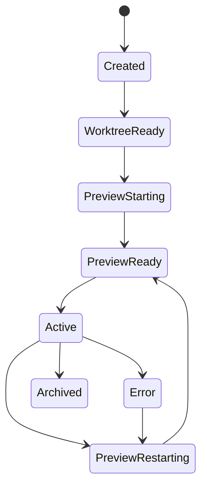

# 04: Worktree and Preview Orchestration

> Replace placeholder sessions with real git worktrees, preview runtimes, and lifecycle management that keep switching fast without overcomplicating the stack.

**Dependencies:** Steps 01-03

## Objective

Give each coding session real backing resources:

- a git branch
- a git worktree
- a preview runtime
- status and cleanup rules

This is the step where the shell becomes a real development tool instead of a static shell prototype.

## Scope and Dependencies

In scope:

- system git wrappers
- worktree create/list/remove flows
- branch naming conventions
- preview startup/restart/cleanup
- warm-preview behavior
- last-screenshot fallback

Out of scope:

- right-click context injection
- PR creation UI

## Relevant Codebase Touchpoints

- `apps/electron/src/main/index.ts`
- `apps/electron/src/main/service-ipc.ts`
- `apps/electron/electron.vite.config.ts`
- `apps/electron/src/main/secure-seed.ts`
- `apps/electron/src/renderer/App.tsx`
- `packages/plugins/src/services/process-manager.ts`

## Proposed Design

### 1. `GitService` should stay thin

Use the system CLI and keep the wrapper very small.

Needed commands:

- `git worktree add`
- `git worktree list --porcelain`
- `git worktree remove`
- `git status --porcelain`
- `git diff --stat`
- `git rev-parse --show-toplevel`
- `git branch --show-current`
- `git commit`
- `gh pr create`

### 2. Branch naming

Default generated branch prefix:

- `codex/`

Examples:

- `codex/layout-tighten-header`
- `codex/fix-table-density`

### 3. Preview strategy

For MVP, use a browser-based preview first.

The preview manager should:

- allocate per-session ports
- start one preview runtime per active session
- keep the active and most recent session warm
- store `lastScreenshotPath`
- expose health and restart controls to the shell

### 4. Cleanup rules

At minimum:

- stale preview processes must stop when a session is deleted
- worktrees should not be removed automatically if dirty
- shell should surface explicit cleanup actions

## Session Lifecycle Diagram



## Proposed API Shapes

```ts
export type GitSessionInput = {
  repoRoot: string
  baseRef: string
  branchSlug: string
}

export type PreviewStatus =
  | { state: 'starting'; port: number }
  | { state: 'ready'; port: number; url: string }
  | { state: 'error'; error: string }

export interface GitService {
  createWorktree(input: GitSessionInput): Promise<{
    branch: string
    worktreePath: string
  }>
  listWorktrees(repoRoot: string): Promise<WorktreeInfo[]>
  removeWorktree(worktreePath: string): Promise<void>
  getStatus(cwd: string): Promise<GitStatusSummary>
}
```

## Concrete Implementation Notes

### Suggested file additions

```text
apps/electron/src/main/
  git-service.ts
  preview-manager.ts
  workspace-session-ipc.ts
```

### Preview command strategy

Keep this configurable enough to evolve, but start with one canonical preview mode.

For MVP:

- choose one preview command per repo
- start it from the session worktree directory
- capture the resulting port/URL

If Electron parity is needed for a given bug or workflow:

- add a pop-out parity window as a fallback mode later

### Last-screenshot fallback

Store screenshot metadata in the session summary so switching sessions can display something immediately while the preview reconnects.

Recommended artifact path:

- `tmp/playwright/<session-id>.png`

## Testing and Validation Approach

- Unit or parser tests for status/diff parsing if the wrapper grows.
- Manual validation:
  - create two sessions against the same repo
  - confirm distinct worktrees are created
  - confirm two preview URLs are distinct
  - switch active sessions and verify warm preview behavior
  - delete a clean session and confirm worktree/process cleanup

## Risks, Edge Cases, and Migration Concerns

- Missing `git` or `gh` binaries must produce actionable errors.
- Dirty worktrees are the biggest cleanup hazard; do not auto-delete them.
- Some repos may require different preview commands or bootstrap delays.

## Step Checklist

- [ ] Add `GitService` wrappers around worktree, status, diff, commit, and PR commands
- [ ] Use `codex/` as the default generated branch prefix
- [ ] Add `PreviewManager` with per-session port allocation
- [ ] Keep active and recent preview sessions warm
- [ ] Persist `previewUrl`, `changedFilesCount`, and `lastScreenshotPath` back into session summaries
- [ ] Add safe cleanup flows for stopped previews and removable worktrees
