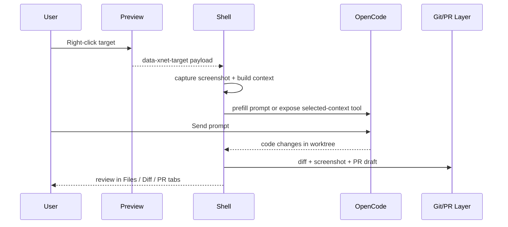

# 05: Context Bridge, Diff, and PR Surface

> Make the MVP useful: send right-click UI context into OpenCode, expose files/diffs/markdown in the shell, and generate PRs with screenshots.

**Dependencies:** Steps 01-04

## Objective

Connect the live preview to the coding agent with minimal custom glue while giving the user enough visibility to trust and review changes.

This step should leave the MVP able to:

- right-click part of the UI and send structured context to OpenCode
- inspect changed files and markdown previews in the shell
- capture a screenshot
- draft a PR from the active worktree

## Scope and Dependencies

In scope:

- target metadata conventions
- right-click capture flow
- OpenCode prompt prefill
- optional custom-tool follow-up
- file/diff/markdown views
- screenshot and PR draft flow

Out of scope:

- deep component-tree introspection
- fully polished diff visualizations

## Relevant Codebase Touchpoints

- `apps/electron/src/renderer/components/DatabaseView.tsx`
- `packages/views/src/table/TableView.tsx`
- `packages/views/src/board/BoardView.tsx`
- `packages/ui/src/components/MarkdownContent.tsx`
- `packages/ui/src/composed/CodeBlock.tsx`
- `apps/electron/src/main/index.ts`
- `apps/electron/src/main/service-ipc.ts`

## Proposed Design

### 1. Minimal target metadata convention

Add small, explicit target hints instead of trying to derive meaning from raw DOM shape.

Recommended attributes:

- `data-xnet-target-id`
- `data-xnet-target-label`
- `data-xnet-file-hint`
- `data-xnet-route-id`

This should be added only to targetable shell/preview surfaces where the metadata is genuinely helpful.

### 2. Two-stage OpenCode context bridge

#### Stage A: prompt prefill

Cheapest path:

- right-click builds structured context text
- shell appends it to the active OpenCode prompt
- user can review before sending

#### Stage B: custom tool

Cleaner follow-up:

- add a project-level OpenCode custom tool for selected context
- tool reads from a known file or local endpoint written by the shell

MVP should ship Stage A first, and Stage B only if the prefill flow is too noisy.

### 3. Right panel content strategy

Keep the initial right-panel surface simple and reliable:

- `Files`: changed file list with path + status
- `Diff`: textual diff summary or raw patch view
- `Markdown`: render docs/PR bodies with `MarkdownContent`
- `PR`: title/body draft and screenshot summary

Do not block MVP on a rich visual diff library.

### 4. PR flow

The shell should:

- capture screenshot
- assemble markdown body file
- stage and commit changes if requested
- call `gh pr create --title ... --body-file ...`

If `gh` is missing:

- show the generated PR title/body in the UI and fall back to manual copy flow

## Right-Click Context Flow



## Concrete Implementation Notes

### Suggested selected-context payload

```ts
export type SelectedContext = {
  sessionId: string
  routeId: string | null
  targetId: string | null
  targetLabel: string | null
  fileHint: string | null
  documentId: string | null
  bounds: { x: number; y: number; width: number; height: number } | null
  nearbyText: string | null
  screenshotPath: string | null
  capturedAt: number
}
```

### Suggested file additions

```text
apps/electron/src/renderer/workspace/
  context/
    selected-context.ts
    target-attributes.ts
  panels/
    ChangedFilesPanel.tsx
    DiffPanel.tsx
    MarkdownPreviewPanel.tsx
    PrDraftPanel.tsx
```

### Example prompt prefill shape

```text
Selected UI context:
- route: database-view
- target: row-density-toggle
- fileHint: apps/electron/src/renderer/components/DatabaseView.tsx
- screenshot: tmp/playwright/session-123.png

Please improve this UI while keeping the current interaction model.
```

## Testing and Validation Approach

- Manual validation:
  - right-click a tagged surface
  - confirm context appears in the OpenCode prompt or is readable by the custom tool
  - apply a change
  - verify changed files populate in the shell
  - verify markdown preview and PR draft render correctly
  - create screenshot and dry-run or complete PR creation

## Risks, Edge Cases, and Migration Concerns

- Cross-origin restrictions may limit direct automation of an embedded OpenCode panel, depending on host mode.
- Right-clicking untagged UI should degrade gracefully instead of producing low-quality garbage context.
- PR creation must not assume the current branch is already pushed.

## Step Checklist

- [x] Add `data-xnet-target-*` conventions to targetable surfaces
- [x] Add selected-context capture and screenshot support
- [x] Implement prompt prefill into the active OpenCode session
- [x] Add a follow-up custom-tool path for selected context
- [x] Build Files / Diff / Markdown / PR tabs with existing xNet UI primitives
- [x] Add screenshot-backed PR draft generation and `gh pr create` flow
