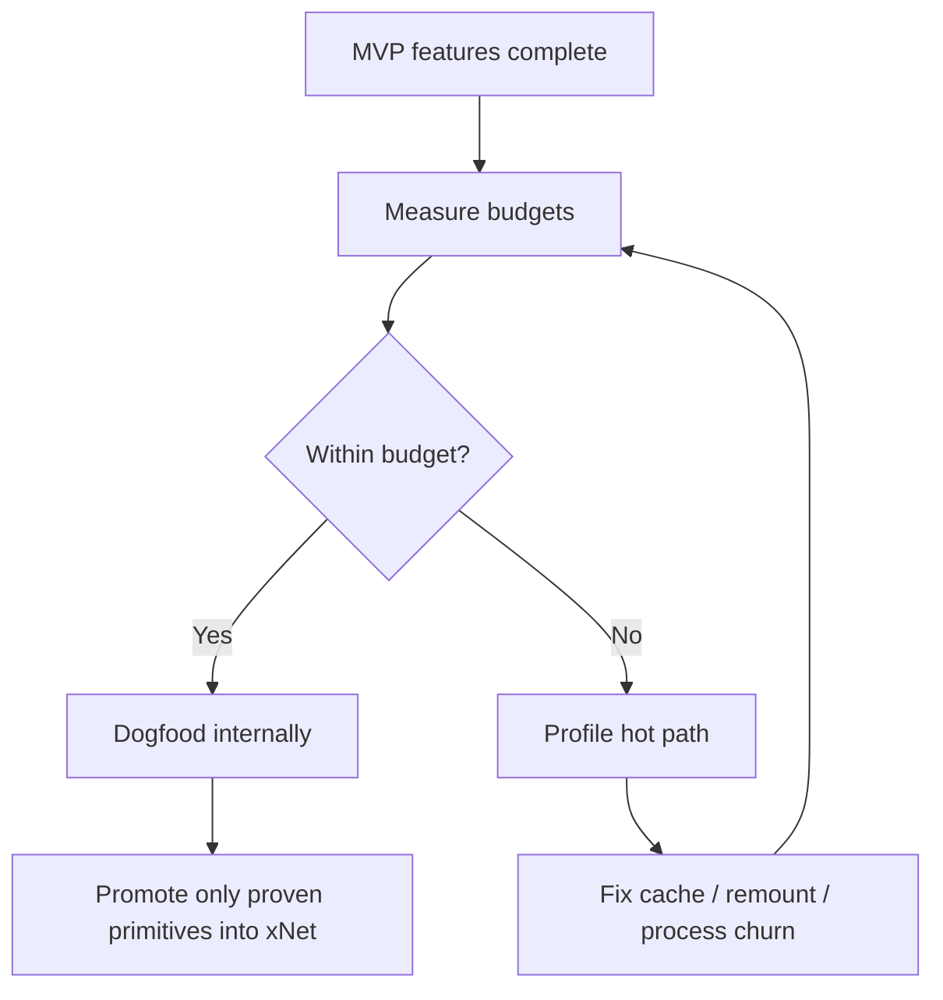

# 06: Hardening and Performance Validation

> Turn the MVP into something stable enough to dogfood: add budgets, instrumentation, cleanup, and criteria for what should or should not be promoted into shared xNet APIs.

**Dependencies:** Steps 01-05

## Objective

Finish the MVP by making sure it is:

- fast enough to feel good
- resilient enough to survive normal failure modes
- narrow enough to avoid premature abstraction

## Scope and Dependencies

In scope:

- performance budgets
- instrumentation and telemetry
- failure handling and cleanup
- validation matrix
- decisions about shared xNet extraction

Out of scope:

- fully generalized cross-platform productization
- OpenCode replacement

## Relevant Codebase Touchpoints

- `packages/react/src/instrumentation.ts`
- `packages/views/src/__tests__/virtualized-table.test.tsx`
- `packages/data-bridge/src/query-cache.ts`
- `apps/electron/src/main/index.ts`
- `apps/electron/src/renderer/main.tsx`
- `apps/electron/README.md`

## Proposed Design

### 1. Set explicit budgets

Target budgets for the MVP:

| Interaction | Budget |
| --- | --- |
| Switch active session rail state | < 50 ms visible update |
| Show cached preview snapshot | < 100 ms |
| Reconnect warm preview | < 250 ms |
| Open Files / Diff / Markdown tab from cached state | < 100 ms |
| Show OpenCode “ready / streaming” feedback after prompt submit | < 50 ms |

### 2. Measure the right things

At minimum instrument:

- session switch start/end
- OpenCode panel ready time
- preview ready time
- screenshot capture time
- diff generation time
- PR draft generation time

Do not start by adding a complex telemetry backend just for this feature; reuse existing instrumentation hooks or local logging where appropriate.

### 3. Cleanup and failure modes

Must-have failure handling:

- missing `opencode`
- missing `git`
- missing `gh`
- crashed preview process
- dirty worktree during delete
- broken code in preview worktree

The host shell must survive all of those.

### 4. Shared xNet API extraction rule

The user explicitly wants performance leverage to live in xNet primitives where possible.

Recommendation:

- use existing xNet primitives in the MVP first
- only extract new shared hook or bridge APIs after the MVP proves the pattern

Examples of potential later promotions:

- query prefetch / warming helpers
- session-summary projection helpers
- shell-performance instrumentation helpers

Examples that should **not** be promoted prematurely:

- OpenCode-specific session hooks
- worktree-specific shell logic
- PR-generation helpers tied to GitHub CLI

## Rollout / Stabilization Diagram

## Concrete Implementation Notes

### Suggested validation matrix

- clean repo
- dirty repo
- missing OpenCode
- missing gh
- one session
- two sessions
- preview crash
- offline or disconnected network

### Suggested documentation updates

- `apps/electron/README.md` for workspace shell usage and local dependencies
- a short “OpenCode required” setup note if system installation remains the MVP requirement

### Suggested test split

- keep most UI verification manual in Electron
- add targeted unit tests for session reducers, command parsing, and branch/worktree naming

## Testing and Validation Approach

- Manual end-to-end path:
  - launch Electron
  - create session
  - right-click target
  - send coding prompt
  - inspect diff
  - reload preview
  - capture screenshot
  - create PR
- Performance pass:
  - measure session switching and preview resume with instrumentation enabled
  - verify no obvious renderer jank while OpenCode is streaming

## Risks, Edge Cases, and Migration Concerns

- The temptation to add new shared APIs too early is the biggest architectural risk.
- OpenCode upgrades may change web behavior or CLI flows; keep the integration boundary narrow.
- If performance misses budget, fix lifecycle churn and local state shape before considering a language/runtime rewrite.

## Step Checklist

- [ ] Add instrumentation for session switching, preview restore, and panel readiness
- [ ] Verify the shell survives missing binaries and crashed child processes
- [ ] Add dirty-worktree protection and explicit cleanup UX
- [ ] Document local dependencies and recovery flows
- [ ] Run a manual Electron MVP validation matrix
- [ ] Decide which performance helpers, if any, deserve promotion into shared xNet packages
