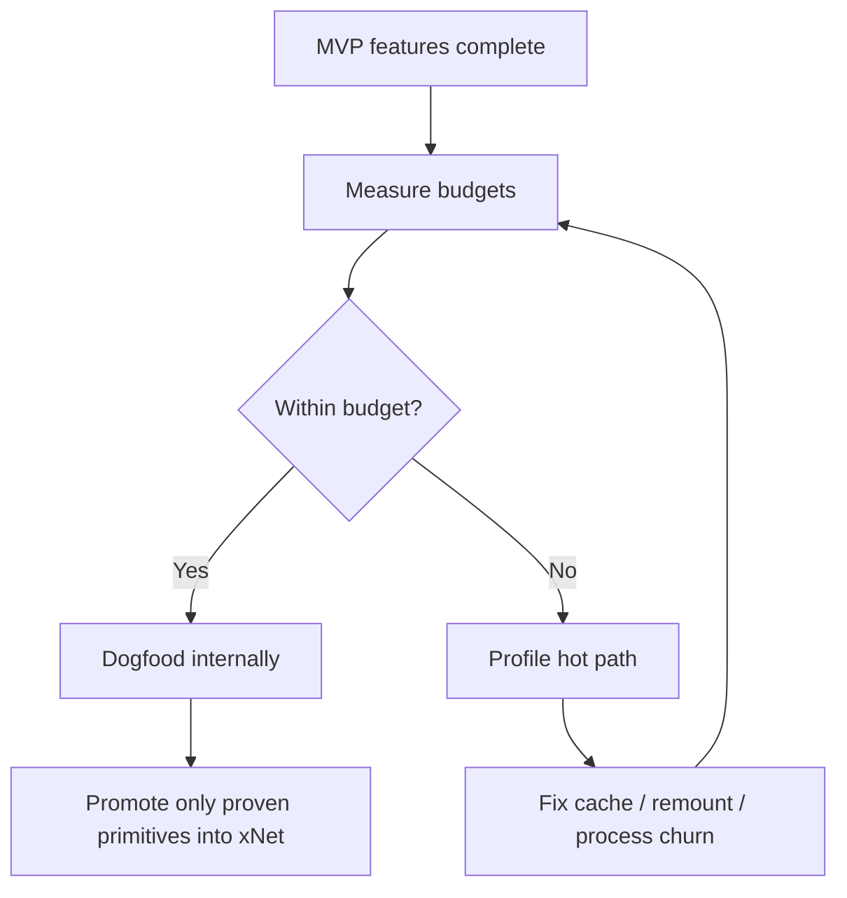

# 06: Hardening and Performance Validation

> Turn the MVP into something stable enough to dogfood: add budgets, instrumentation, cleanup, and criteria for what should or should not be promoted into shared xNet APIs.

**Dependencies:** Steps 01-05

## Objective

Finish the MVP by making sure it is:

- fast enough to feel good
- resilient enough to survive normal failure modes
- narrow enough to avoid premature abstraction

## Scope and Dependencies

In scope:

- performance budgets
- instrumentation and telemetry
- failure handling and cleanup
- validation matrix
- decisions about shared xNet extraction

Out of scope:

- fully generalized cross-platform productization
- OpenCode replacement

## Relevant Codebase Touchpoints

- `packages/react/src/instrumentation.ts`
- `packages/views/src/__tests__/virtualized-table.test.tsx`
- `packages/data-bridge/src/query-cache.ts`
- `apps/electron/src/main/index.ts`
- `apps/electron/src/renderer/main.tsx`
- `apps/electron/README.md`

## Proposed Design

### 1. Set explicit budgets

Target budgets for the MVP:

| Interaction                                                    | Budget                 |
| -------------------------------------------------------------- | ---------------------- |
| Switch active session rail state                               | < 50 ms visible update |
| Show cached preview snapshot                                   | < 100 ms               |
| Reconnect warm preview                                         | < 250 ms               |
| Open Files / Diff / Markdown tab from cached state             | < 100 ms               |
| Show OpenCode “ready / streaming” feedback after prompt submit | < 50 ms                |

### 2. Measure the right things

At minimum instrument:

- session switch start/end
- OpenCode panel ready time
- preview ready time
- screenshot capture time
- diff generation time
- PR draft generation time

Do not start by adding a complex telemetry backend just for this feature; reuse existing instrumentation hooks or local logging where appropriate.

### 3. Cleanup and failure modes

Must-have failure handling:

- missing `opencode`
- missing `git`
- missing `gh`
- crashed preview process
- dirty worktree during delete
- broken code in preview worktree

The host shell must survive all of those.

### 4. Shared xNet API extraction rule

The user explicitly wants performance leverage to live in xNet primitives where possible.

Recommendation:

- use existing xNet primitives in the MVP first
- only extract new shared hook or bridge APIs after the MVP proves the pattern

Examples of potential later promotions:

- query prefetch / warming helpers
- session-summary projection helpers
- shell-performance instrumentation helpers

Examples that should **not** be promoted prematurely:

- OpenCode-specific session hooks
- worktree-specific shell logic
- PR-generation helpers tied to GitHub CLI

## Rollout / Stabilization Diagram

## Concrete Implementation Notes

### Suggested validation matrix

- clean repo
- dirty repo
- missing OpenCode
- missing gh
- one session
- two sessions
- preview crash
- offline or disconnected network

### Suggested documentation updates

- `apps/electron/README.md` for workspace shell usage and local dependencies
- a short “OpenCode required” setup note if system installation remains the MVP requirement

### Suggested test split

- keep most UI verification manual in Electron
- add targeted unit tests for session reducers, command parsing, and branch/worktree naming

## Testing and Validation Approach

- Manual end-to-end path:
  - launch Electron
  - create session
  - right-click target
  - send coding prompt
  - inspect diff
  - reload preview
  - capture screenshot
  - create PR
- Performance pass:
  - measure session switching and preview resume with instrumentation enabled
  - verify no obvious renderer jank while OpenCode is streaming

## Risks, Edge Cases, and Migration Concerns

- The temptation to add new shared APIs too early is the biggest architectural risk.
- OpenCode upgrades may change web behavior or CLI flows; keep the integration boundary narrow.
- If performance misses budget, fix lifecycle churn and local state shape before considering a language/runtime rewrite.

## Implementation Status

Completed in this step:

- renderer telemetry around session selection, preview restore, OpenCode readiness, review generation, screenshot capture, and PR creation
- main-process recovery messaging for missing `git`, `gh`, and `pnpm`
- persisted dirty/error session state in the xNet-backed session summary model
- shell-level cleanup feedback instead of `alert()`-only failure paths
- Electron README updates for local dependencies, recovery flows, and the direct native-rebuild workaround

Not promoted into shared xNet packages yet:

- workspace timing marks remain app-local in `apps/electron/src/renderer/workspace/performance.ts`
- command recovery helpers remain app-local in `apps/electron/src/main/command-errors.ts`

Reasoning:

- the patterns are proven for this shell, but they still encode Electron/OpenCode/worktree assumptions
- promotion should wait for a second shell or host runtime that needs the same abstractions

## Manual Validation Notes

Validation run on March 7, 2026:

| Scenario                              | Result                 | Notes                                                                                                                                                                                                              |
| ------------------------------------- | ---------------------- | ------------------------------------------------------------------------------------------------------------------------------------------------------------------------------------------------------------------ |
| Focused Electron workspace unit tests | Pass                   | Added coverage for timing marks, command recovery formatting, dirty badge rendering, and session-state patch clearing                                                                                              |
| `apps/electron` production build      | Pass                   | Renderer, preload, and main bundles built successfully                                                                                                                                                             |
| Electron live startup                 | Pass with caveats      | App booted, renderer dev server came up, Local API server started, and Electron exposed CDP on `ws://127.0.0.1:9223/...`                                                                                           |
| OpenCode binary availability          | Pass                   | `opencode` resolved from `/Users/crs/.opencode/bin/opencode`                                                                                                                                                       |
| Git / gh / pnpm availability          | Pass                   | All three binaries resolved from `/opt/homebrew/bin/*`                                                                                                                                                             |
| Hub dev script                        | Blocked by environment | `pnpm run dev:hub` executed under Node `20.4.0` and hit an `esbuild` architecture mismatch unrelated to the coding-workspace shell code                                                                            |
| Electron native module rebuild path   | Pass with workaround   | `pnpm run deps:electron` still fails because `pnpm dlx @electron/rebuild` picks a Node runtime without `util.styleText`; direct rebuild via local `@electron/rebuild` plus `npm rebuild better-sqlite3 ...` worked |

What was not fully exercised in this environment:

- end-to-end right-click context flow into a live OpenCode chat
- multi-session switching with two concurrent live worktrees
- live `gh pr create` against an authenticated repo remote
- deliberate preview crash / deleted-worktree recovery via UI interaction

## Step Checklist

- [x] Add instrumentation for session switching, preview restore, and panel readiness
- [x] Verify the shell survives missing binaries and crashed child processes
- [x] Add dirty-worktree protection and explicit cleanup UX
- [x] Document local dependencies and recovery flows
- [x] Run a manual Electron MVP validation matrix
- [x] Decide which performance helpers, if any, deserve promotion into shared xNet packages
