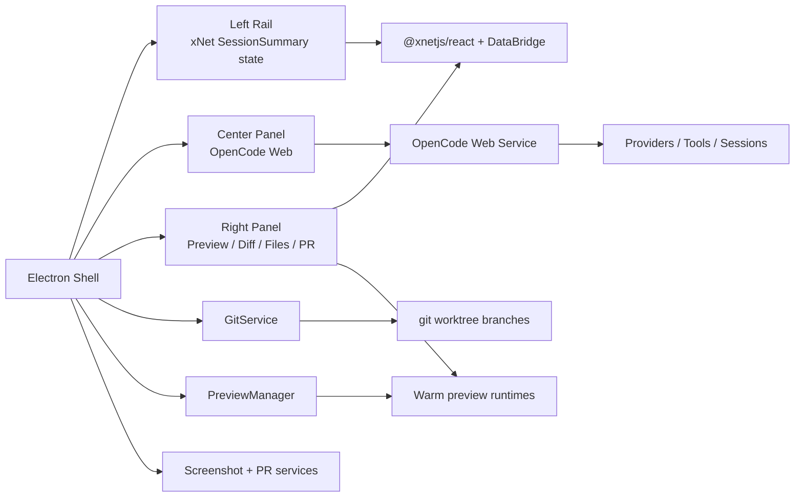

# Plan 03.9.83: LLM Coding UI

> Electron-first MVP for a fast self-editing xNet workspace that reuses OpenCode for the coding agent and chat UI, uses xNet primitives for fast local shell state, and keeps git/worktree/preview orchestration thin.

**Plan folder name:** `plan03_9_83LLMCodingUI` (supplied by the user)

## 1. Title and Short Summary

This plan turns the MVP exploration in [0109*[*]\_ELECTRON_MVP_SELF_EDITING_WORKSPACE_CHEAP_PERFORMANCE_WINS_OPENCODE_WORKTREES_RIGHT_CLICK_CONTEXT.md](../../explorations/0109_[_]_ELECTRON_MVP_SELF_EDITING_WORKSPACE_CHEAP_PERFORMANCE_WINS_OPENCODE_WORKTREES_RIGHT_CLICK_CONTEXT.md) into an execution sequence for the repository.

The target product is an Electron-native coding workspace with:

- a fast xNet-backed left rail for sessions, worktrees, and status
- an OpenCode-powered center panel for coding chat
- a native preview/diff/files/PR panel on the right
- right-click UI context capture for “edit this part of the app”
- git worktree isolation, preview restart, screenshot capture, and PR creation

The plan stays deliberately narrow:

- reuse OpenCode wherever possible
- avoid a custom provider layer
- avoid a custom chat UI in the MVP
- avoid Rust unless profiling proves it is necessary
- keep performance wins primarily in xNet-backed local state and warm process reuse

## 2. Problem Statement / Motivation

The repo already has strong local-first data, sync, and UI primitives, but it does not yet have a developer-facing coding workspace shell. The desired outcome is a tool that feels closer to Codex in workflow while being faster and more interactive for xNet-specific development.

The product problem is not “how do we talk to LLMs?” The product problem is:

- how do we make session switching feel instant?
- how do we tie coding sessions to git worktrees cleanly?
- how do we let users click or right-click on the live UI and push that context into the coding agent?
- how do we do this without rebuilding provider integrations and a full chat experience from scratch?

The plan therefore treats **OpenCode as the coding substrate** and **xNet as the local performance substrate**.

## 3. Current State in the Repository

Observed facts from the codebase:

- The current Electron renderer shell is canvas-first, not developer-workspace-first. `apps/electron/src/renderer/App.tsx:432-498`
- `@xnetjs/react` already provides local-first hooks on top of DataBridge and `useSyncExternalStore`. `packages/react/src/hooks/useQuery.ts:11-13`, `packages/react/src/hooks/useQuery.ts:195-219`
- `useMutate` already assumes immediate local updates for subscribers. `packages/react/src/hooks/useMutate.ts:12-17`, `packages/react/src/hooks/useMutate.ts:246-247`
- `QueryCache` already supports query deduplication, in-memory sync access, subscriber notification, and LRU eviction. `packages/data-bridge/src/query-cache.ts:1-10`
- `MainThreadBridge` already performs incremental cache updates from store changes. `packages/data-bridge/src/main-thread-bridge.ts:89-173`
- UI primitives for a three-panel shell already exist in `@xnetjs/ui`. `packages/ui/src/primitives/ResizablePanel.tsx:12-47`, `packages/ui/src/composed/TreeView.tsx:22-99`, `packages/ui/src/components/MarkdownContent.tsx:109-122`
- The Electron main process already has process management and service IPC, but the preload allowlist is narrower than the service client contract. `apps/electron/src/main/service-ipc.ts:49-129`, `apps/electron/src/preload/index.ts:240-267`, `packages/plugins/src/services/client.ts:78-117`
- The renderer CSP currently does **not** allow framing localhost OpenCode or preview origins. `apps/electron/src/renderer/index.html:6-8`
- The repo already uses metadata-based target detection for editable surfaces in database views. `apps/electron/src/renderer/components/DatabaseView.tsx:513-516`, `packages/views/src/table/TableView.tsx:121-125`, `packages/views/src/board/BoardView.tsx:316-320`

Observed gaps:

- no git/worktree shell integration
- no OpenCode integration
- no preview-runtime manager
- no coding-workspace shell mode
- no PR drafting flow
- no first-class right-click context bridge

## 4. Goals and Non-Goals

### Goals

- Build an Electron-only MVP that is usable and fast enough to dogfood.
- Reuse OpenCode for the coding agent, provider integrations, and primary chat UI.
- Use xNet React/data primitives for fast local shell state, cached summaries, and timeline metadata.
- Tie each coding session to a git worktree and preview runtime.
- Support right-click UI context capture with minimal instrumentation.
- Support one-click screenshot capture and PR creation.

### Non-Goals

- Building a custom provider router or model marketplace.
- Replacing OpenCode with a custom chat UI in the MVP.
- Supporting web, mobile, or Expo as first-class local editing hosts.
- Deep React-fiber inspection for component targeting.
- Introducing Rust sidecars before profiling shows a concrete need.
- Building a polished embedded `WebContentsView` parity preview in the MVP.

## 5. Architecture / Phase Overview

### Phase Sequence

1. Foundation: fix service boundary and start OpenCode reliably.
2. Local shell state: model sessions in xNet and make switching fast.
3. Native shell UI: add the three-panel coding workspace mode.
4. Real session plumbing: create worktrees, previews, and lifecycle management.
5. Context bridge and PR surface: right-click context, diffs, markdown, screenshots, PRs.
6. Hardening: performance budgets, cleanup, failure handling, and extraction decisions.

## 6. Step Index

- [01-service-boundary-and-opencode-host.md](./01-service-boundary-and-opencode-host.md)
- [02-session-summary-and-fast-shell-state.md](./02-session-summary-and-fast-shell-state.md)
- [03-shell-layout-and-opencode-panel.md](./03-shell-layout-and-opencode-panel.md)
- [04-worktree-and-preview-orchestration.md](./04-worktree-and-preview-orchestration.md)
- [05-context-bridge-diff-pr-surface.md](./05-context-bridge-diff-pr-surface.md)
- [06-hardening-and-performance-validation.md](./06-hardening-and-performance-validation.md)

## 7. Risks and Open Questions

### Risks

- OpenCode Web session switching may require a small amount of server/API glue even if the UI is reused wholesale.
- Embedding OpenCode Web and local preview surfaces requires CSP updates and careful localhost origin handling.
- Worktree lifecycle management gets messy quickly if dirty trees, crashed previews, or missing binaries are not handled early.
- It is easy to overreach and start rewriting OpenCode instead of integrating it.

### Open Questions

- What is the cleanest way to tell OpenCode Web to focus or open a specific session from the outer shell?
- Should the MVP keep OpenCode as a single long-lived service or allow per-repo service instances if session routing proves awkward?
- Is storing `SelectedContext` best done in xNet, in memory, or in a small per-worktree file consumed by OpenCode custom tools?
- Which exact preview command should be canonical for a session: browser-only preview, Electron preview, or a mixed mode?

### Decision Guardrails

- Prefer app-local wrappers over new shared package APIs until at least two real call sites validate the abstraction.
- Prefer system `git` and `gh` CLIs over JavaScript re-implementations.
- Prefer browser/iframe or BrowserWindow embedding over `<webview>`.

## 8. Implementation Checklist

- [x] Fix the Electron service IPC / preload mismatch.
- [x] Add OpenCode service lifecycle management in Electron main.
- [x] Add xNet-backed `SessionSummary` storage and hooks.
- [x] Add a coding-workspace shell mode to the renderer.
- [x] Embed or host OpenCode Web in the center panel.
- [x] Add `GitService` worktree lifecycle commands.
- [x] Add `PreviewManager` with warm-session behavior.
- [x] Add right-click target metadata conventions and capture flow.
- [x] Add diff/file/markdown/PR tabs on the right panel.
- [x] Add screenshot capture and PR drafting.
- [ ] Add cleanup, failure handling, and performance instrumentation.

## 9. Validation Checklist

- [x] Session switching restores from local xNet-backed state without a network round trip.
- [ ] OpenCode stays usable without building a custom chat UI.
- [ ] Two sessions can target separate worktrees without clobbering each other.
- [ ] Preview switching shows an immediate cached state before the live runtime is ready.
- [ ] Right-click UI context reaches the active OpenCode session with clear structured metadata.
- [ ] Diff and markdown preview stay responsive under moderate repo churn.
- [ ] `gh pr create` can build a PR body from the generated artifacts and screenshot.
- [ ] The host shell survives broken preview code, crashed services, and deleted worktrees.

## 10. References

### Existing Repo Docs

- [0108 Electron-First Self-Editing Workspace Shell Exploration](../../explorations/0108_[_]_ELECTRON_FIRST_SELF_EDITING_WORKSPACE_SHELL_CODEX_LIKE_CHATS_WORKTREES_BRANCHES_PREVIEW_DIFF_PRS_OPENCODE_INTEGRATION.md)
- [0109 Electron MVP Self-Editing Workspace Exploration](../../explorations/0109_[_]_ELECTRON_MVP_SELF_EDITING_WORKSPACE_CHEAP_PERFORMANCE_WINS_OPENCODE_WORKTREES_RIGHT_CLICK_CONTEXT.md)
- [plan03_7History README](../plan03_7History/README.md)
- [plan03_5Plugins 09 Services (Electron)](../plan03_5Plugins/09-services-electron.md)

### Web References

- [OpenCode Install Docs](https://opencode.ai/docs/install)
- [OpenCode Web Docs](https://opencode.ai/docs/web)
- [OpenCode Server Docs](https://opencode.ai/docs/server)
- [OpenCode SDK Docs](https://opencode.ai/docs/sdk/)
- [OpenCode IDE Docs](https://opencode.ai/docs/ide/)
- [OpenCode Plugins Docs](https://opencode.ai/docs/plugins/)
- [OpenCode Custom Tools Docs](https://opencode.ai/docs/custom-tools/)
- [OpenCode Config Docs](https://opencode.ai/docs/config)
- [OpenCode Providers Docs](https://opencode.ai/docs/providers/)
- [OpenCode ACP Docs](https://opencode.ai/docs/acp/)
- [OpenCode Homepage](https://dev.opencode.ai/)
- [T3 Code](https://t3.codes/)
- [pingdotgg/t3code](https://github.com/pingdotgg/t3code)
- [T3 Chat Cloneathon](https://cloneathon.t3.chat/)
- [Vercel Coding Agent Template](https://github.com/vercel-labs/coding-agent-template)
- [git worktree Docs](https://git-scm.com/docs/git-worktree)
- [GitHub CLI `gh pr create`](https://cli.github.com/manual/gh_pr_create)
- [Electron WebContentsView Docs](https://www.electronjs.org/docs/latest/api/web-contents-view)
- [Electron webview Tag Docs](https://www.electronjs.org/docs/latest/api/webview-tag)
