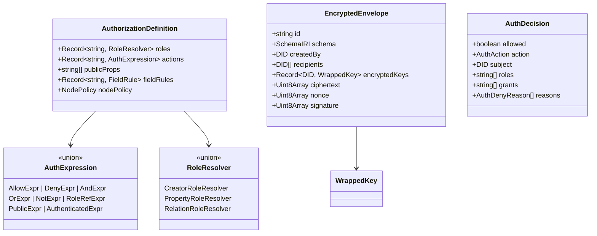

# 01: Types and Encryption Foundation

> Define all authorization types, the encrypted envelope format, and the content key management primitives that everything else builds on.

**Duration:** 5 days  
**Dependencies:** None (foundational)  
**Packages:** `packages/core`, `packages/crypto`, `packages/data`

## Why This Step Exists

Authorization without encryption is theater. Before building evaluators, hooks, or hub filters, we need the cryptographic foundation: encrypted envelopes, content key management, and the type contracts that every other step depends on.

This step also defines all shared TypeScript types upfront so that subsequent steps can be developed in parallel without type drift.

## Implementation

### 1. Core Authorization Types (`packages/core`)

Add canonical types that all packages import:

```typescript
// ─── Actions ──────────────────────────────────────────────
export const AUTH_ACTIONS = ['read', 'write', 'delete', 'share', 'admin'] as const
export type AuthAction = (typeof AUTH_ACTIONS)[number]

// ─── Decision ─────────────────────────────────────────────
export interface AuthDecision {
  allowed: boolean
  action: AuthAction
  subject: DID
  resource: string
  roles: string[]
  grants: string[] // Grant IDs that contributed
  reasons: AuthDenyReason[]
  cached: boolean
  evaluatedAt: number
  duration: number // ms
}

export type AuthDenyReason =
  | 'DENY_NODE_POLICY'
  | 'DENY_NO_ROLE_MATCH'
  | 'DENY_NO_GRANT'
  | 'DENY_UCAN_INVALID'
  | 'DENY_UCAN_REVOKED'
  | 'DENY_UCAN_EXPIRED'
  | 'DENY_DEPTH_EXCEEDED'
  | 'DENY_NOT_AUTHENTICATED'
  | 'DENY_FIELD_RESTRICTED'

// ─── Trace (for explain API) ──────────────────────────────
export interface AuthTrace extends AuthDecision {
  steps: AuthTraceStep[]
}

export interface AuthTraceStep {
  phase: 'node-deny' | 'role-resolve' | 'schema-eval' | 'grant-check' | 'public-check'
  input: Record<string, unknown>
  output: Record<string, unknown>
  duration: number
}

// ─── Schema Authorization Definition ──────────────────────
export interface AuthorizationDefinition<
  TActions extends Record<string, AuthExpression> = Record<string, AuthExpression>,
  TRoles extends Record<string, RoleResolver> = Record<string, RoleResolver>
> {
  roles: TRoles
  actions: TActions
  publicProps?: string[]
  fieldRules?: Record<string, { allow: AuthExpression; deny?: AuthExpression }>
  nodePolicy?: { mode: 'extend'; allow: ('deny' | 'fieldRules' | 'conditions')[] }
}

// ─── Type Utilities ───────────────────────────────────────
export type ActionKey<TAuth extends AuthorizationDefinition> = keyof TAuth['actions'] & string
export type RoleKey<TAuth extends AuthorizationDefinition> = keyof TAuth['roles'] & string
export type SchemaAction<S extends { authorization: AuthorizationDefinition }> = ActionKey<
  S['authorization']
>
```

### 2. Auth Expression AST Types

Instead of a string parser, use a discriminated union AST that builders produce directly:

```typescript
// ─── Expression AST ───────────────────────────────────────
export type AuthExpression =
  | AllowExpr
  | DenyExpr
  | AndExpr
  | OrExpr
  | NotExpr
  | RoleRefExpr
  | PublicExpr
  | AuthenticatedExpr

export interface AllowExpr {
  readonly _tag: 'allow'
  readonly roles: readonly string[]
}

export interface DenyExpr {
  readonly _tag: 'deny'
  readonly roles: readonly string[]
}

export interface AndExpr {
  readonly _tag: 'and'
  readonly exprs: readonly AuthExpression[]
}

export interface OrExpr {
  readonly _tag: 'or'
  readonly exprs: readonly AuthExpression[]
}

export interface NotExpr {
  readonly _tag: 'not'
  readonly expr: AuthExpression
}

export interface RoleRefExpr {
  readonly _tag: 'roleRef'
  readonly role: string
}

export interface PublicExpr {
  readonly _tag: 'public'
}

export interface AuthenticatedExpr {
  readonly _tag: 'authenticated'
}

// ─── Role Resolvers ───────────────────────────────────────
export type RoleResolver = CreatorRoleResolver | PropertyRoleResolver | RelationRoleResolver

export interface CreatorRoleResolver {
  readonly _tag: 'creator'
}

export interface PropertyRoleResolver {
  readonly _tag: 'property'
  readonly propertyName: string
}

export interface RelationRoleResolver {
  readonly _tag: 'relation'
  readonly relationName: string
  readonly targetRole: string
}
```

### 3. Typed Builder Functions (`packages/data/src/auth/builders.ts`)

```typescript
// ─── Expression Builders ──────────────────────────────────
export function allow(...roles: string[]): AllowExpr {
  return { _tag: 'allow', roles }
}

export function deny(...roles: string[]): DenyExpr {
  return { _tag: 'deny', roles }
}

export function and(...exprs: AuthExpression[]): AndExpr {
  return { _tag: 'and', exprs }
}

export function or(...exprs: AuthExpression[]): OrExpr {
  return { _tag: 'or', exprs }
}

export function not(expr: AuthExpression): NotExpr {
  return { _tag: 'not', expr }
}

export const PUBLIC: PublicExpr = { _tag: 'public' }
export const AUTHENTICATED: AuthenticatedExpr = { _tag: 'authenticated' }

// ─── Role Builders ────────────────────────────────────────
export const role = {
  creator(): CreatorRoleResolver {
    return { _tag: 'creator' }
  },
  property(name: string): PropertyRoleResolver {
    return { _tag: 'property', propertyName: name }
  },
  relation(relationName: string, targetRole: string): RelationRoleResolver {
    return { _tag: 'relation', relationName, targetRole }
  }
}
```

### 4. Schema Validation (`packages/data/src/auth/validate.ts`)

Validate authorization blocks at schema registration time:

```typescript
export interface AuthValidationResult {
  valid: boolean
  errors: AuthValidationError[]
}

export interface AuthValidationError {
  code: AuthSchemaErrorCode
  message: string
  path: string
}

export type AuthSchemaErrorCode =
  | 'AUTH_SCHEMA_INVALID_ROLE_REF'
  | 'AUTH_SCHEMA_INVALID_ACTION_REF'
  | 'AUTH_SCHEMA_INVALID_RELATION_PATH'
  | 'AUTH_SCHEMA_ROLE_CYCLE'
  | 'AUTH_SCHEMA_EXPR_LIMIT_EXCEEDED'
  | 'AUTH_SCHEMA_UNSAFE_PUBLIC_MUTATION'
  | 'AUTH_SCHEMA_INVALID_FIELD_REF'
  | 'AUTH_SCHEMA_INVALID_PUBLIC_PROP'

export function validateAuthorization(
  auth: AuthorizationDefinition,
  properties: Record<string, PropertyDefinition>
): AuthValidationResult {
  const errors: AuthValidationError[] = []

  // 1. Validate all role references in action expressions exist in roles
  for (const [actionName, expr] of Object.entries(auth.actions)) {
    const referencedRoles = extractRoleRefs(expr)
    for (const ref of referencedRoles) {
      if (!(ref in auth.roles) && !BUILTIN_ROLES.includes(ref)) {
        errors.push({
          code: 'AUTH_SCHEMA_INVALID_ROLE_REF',
          message: `Action '${actionName}' references unknown role '${ref}'`,
          path: `authorization.actions.${actionName}`
        })
      }
    }
  }

  // 2. Validate property-based roles reference existing person properties
  for (const [roleName, resolver] of Object.entries(auth.roles)) {
    if (resolver._tag === 'property') {
      if (!(resolver.propertyName in properties)) {
        errors.push({
          code: 'AUTH_SCHEMA_INVALID_RELATION_PATH',
          message: `Role '${roleName}' references non-existent property '${resolver.propertyName}'`,
          path: `authorization.roles.${roleName}`
        })
      }
    }
  }

  // 3. Validate publicProps reference existing properties
  if (auth.publicProps) {
    for (const prop of auth.publicProps) {
      if (!(prop in properties)) {
        errors.push({
          code: 'AUTH_SCHEMA_INVALID_PUBLIC_PROP',
          message: `publicProps references non-existent property '${prop}'`,
          path: `authorization.publicProps`
        })
      }
    }
  }

  // 4. Detect role cycles
  // 5. Validate expression depth limits
  // 6. Warn on public mutating actions

  return { valid: errors.length === 0, errors }
}
```

### 5. Encrypted Envelope Types (`packages/crypto`)

```typescript
// ─── Encrypted Envelope ───────────────────────────────────
export interface EncryptedEnvelope {
  /** Format version */
  version: 1

  // Public metadata (unencrypted, signed)
  id: string
  schema: SchemaIRI
  createdBy: DID
  createdAt: number
  updatedAt: number
  lamport: number
  recipients: DID[]
  publicProps?: Record<string, unknown>

  // Encrypted content
  encryptedKeys: Record<string, WrappedKey> // DID → wrapped content key
  ciphertext: Uint8Array
  nonce: Uint8Array

  // Integrity
  signature: Uint8Array
}

export interface WrappedKey {
  algorithm: 'X25519-XChaCha20'
  ephemeralPublicKey: Uint8Array // Ephemeral X25519 public key
  wrappedKey: Uint8Array // Encrypted content key
  nonce: Uint8Array // Nonce for key wrapping
}
```

### 6. Content Key Management (`packages/crypto/src/envelope.ts`)

```typescript
import { generateKey, encryptWithNonce, decryptWithNonce } from './symmetric'
import { generateKeyPair, deriveSharedSecret } from './asymmetric'

/** Generate a random 256-bit content key for a node */
export function generateContentKey(): Uint8Array {
  return generateKey()
}

/** Wrap a content key for a specific recipient using X25519 ECDH */
export function wrapKeyForRecipient(
  contentKey: Uint8Array,
  recipientPublicKey: Uint8Array
): WrappedKey {
  const ephemeral = generateKeyPair()
  const shared = deriveSharedSecret(ephemeral.privateKey, recipientPublicKey)
  const { ciphertext, nonce } = encryptWithNonce(contentKey, shared)

  return {
    algorithm: 'X25519-XChaCha20',
    ephemeralPublicKey: ephemeral.publicKey,
    wrappedKey: ciphertext,
    nonce
  }
}

/** Unwrap a content key using the recipient's private key */
export function unwrapKey(wrapped: WrappedKey, recipientPrivateKey: Uint8Array): Uint8Array {
  const shared = deriveSharedSecret(recipientPrivateKey, wrapped.ephemeralPublicKey)
  return decryptWithNonce(wrapped.wrappedKey, wrapped.nonce, shared)
}

/** Encrypt node content and produce an envelope */
export function createEncryptedEnvelope(
  content: Uint8Array,
  metadata: EnvelopeMetadata,
  recipientPublicKeys: Map<DID, Uint8Array>,
  signingKey: Uint8Array
): EncryptedEnvelope {
  // 1. Generate content key
  const contentKey = generateContentKey()

  // 2. Encrypt content
  const { ciphertext, nonce } = encryptWithNonce(content, contentKey)

  // 3. Wrap key for each recipient
  const encryptedKeys: Record<string, WrappedKey> = {}
  for (const [did, pubKey] of recipientPublicKeys) {
    encryptedKeys[did] = wrapKeyForRecipient(contentKey, pubKey)
  }

  // 4. Build envelope
  const envelope: EncryptedEnvelope = {
    version: 1,
    ...metadata,
    recipients: [...recipientPublicKeys.keys()],
    encryptedKeys,
    ciphertext,
    nonce,
    signature: new Uint8Array(0) // Placeholder
  }

  // 5. Sign entire envelope
  envelope.signature = signEnvelope(envelope, signingKey)

  return envelope
}
```

### 7. Public Key Resolution

Add a `PublicKeyResolver` interface for looking up X25519 public keys from DIDs:

```typescript
export interface PublicKeyResolver {
  /** Resolve a DID to its X25519 public key for key wrapping */
  resolve(did: DID): Promise<Uint8Array | null>

  /** Resolve multiple DIDs in batch */
  resolveBatch(dids: DID[]): Promise<Map<DID, Uint8Array>>
}
```

## Data Model



## Tests

- Type-level tests (`expectTypeOf`) for `ActionKey`, `RoleKey`, `SchemaAction` inference.
- Unit tests for all builder functions producing correct AST nodes.
- Schema validation tests: valid configs pass, invalid role refs / property refs / cycles rejected.
- Encrypted envelope round-trip: encrypt → wrap keys → unwrap → decrypt.
- Key wrapping: wrap for N recipients, each can unwrap independently.
- Envelope signing and verification.
- `AuthSchemaErrorCode` coverage for every validation path.

## Checklist

- [ ] `AuthAction`, `AuthDecision`, `AuthDenyReason`, `AuthTrace` types defined in `@xnetjs/core`.
- [ ] `AuthExpression` AST union type and all node types defined.
- [ ] `RoleResolver` union type defined.
- [ ] `AuthorizationDefinition` generic type with `ActionKey`/`RoleKey` utilities.
- [ ] Builder functions (`allow`, `deny`, `and`, `or`, `not`, `role.*`) implemented.
- [ ] Schema validation function with deterministic error codes.
- [ ] `EncryptedEnvelope` and `WrappedKey` types defined.
- [ ] `generateContentKey`, `wrapKeyForRecipient`, `unwrapKey` implemented.
- [ ] `createEncryptedEnvelope` implemented with signing.
- [ ] `PublicKeyResolver` interface defined.
- [ ] Type-level tests passing in CI.
- [ ] Round-trip encryption tests passing.

---

[Back to README](./README.md) | [Next: Schema Authorization Model →](./02-schema-authorization-model.md)
