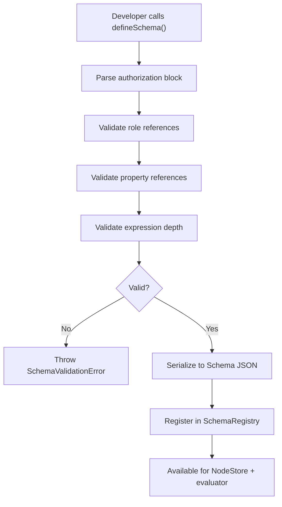

# 02: Schema Authorization Model

> Extend `defineSchema()` with a typed authorization block, integrate with schema validation, and define the recipient computation pipeline.

**Duration:** 3 days  
**Dependencies:** [01-types-and-encryption.md](./01-types-and-encryption.md)  
**Packages:** `packages/data/src/schema`

## Why This Step Exists

The schema is the single source of truth for authorization policy. This step wires the types from Step 01 into `defineSchema()` so that developers get compile-time validation, IDE autocomplete, and runtime schema-time checks for their authorization rules.

## Current Baseline

- `DefineSchemaOptions` supports `name`, `namespace`, `version`, `properties`, `extends`, `document`.
- `Schema` type has no authorization section.
- No mechanism to mark properties as public for hub indexing.

## Implementation

### 1. Extend `DefineSchemaOptions`

```typescript
export interface DefineSchemaOptions<
  P extends Record<string, PropertyBuilder>,
  A extends AuthorizationDefinition = AuthorizationDefinition
> {
  name: string
  namespace: `xnet://${string}/`
  version?: string
  migrateFrom?: SchemaIRI
  properties: P
  extends?: DefinedSchema
  document?: DocumentType

  /** Authorization policy for this schema */
  authorization?: A
}
```

### 2. Extend Serialized `Schema` Type

```typescript
export interface Schema {
  '@id': SchemaIRI
  '@type': 'xnet://xnet.fyi/Schema'
  name: string
  namespace: string
  version: string
  properties: PropertyDefinition[]
  extends?: SchemaIRI
  document?: DocumentType

  /** Serialized authorization definition */
  authorization?: SerializedAuthorization
}

/** JSON-serializable form of AuthorizationDefinition */
export interface SerializedAuthorization {
  roles: Record<string, SerializedRoleResolver>
  actions: Record<string, SerializedAuthExpression>
  publicProps?: string[]
  fieldRules?: Record<string, { allow: SerializedAuthExpression; deny?: SerializedAuthExpression }>
  nodePolicy?: { mode: 'extend'; allow: string[] }
}
```

### 3. Update `defineSchema()` Implementation

In `packages/data/src/schema/define.ts`:

```typescript
export function defineSchema<P extends Record<string, PropertyBuilder>>(
  options: DefineSchemaOptions<P>
): DefinedSchema<P> {
  // ... existing property processing ...

  // Validate authorization if present
  if (options.authorization) {
    const authResult = validateAuthorization(options.authorization, propertyMap)
    if (!authResult.valid) {
      throw new SchemaValidationError(
        `Invalid authorization in schema '${options.name}': ${authResult.errors.map((e) => e.message).join(', ')}`,
        authResult.errors
      )
    }
  }

  const schema: Schema = {
    '@id': schemaId,
    '@type': 'xnet://xnet.fyi/Schema',
    name: options.name,
    namespace: options.namespace,
    version: options.version ?? DEFAULT_SCHEMA_VERSION,
    properties: propertyDefs,
    extends: options.extends?.schema['@id'],
    document: options.document,
    authorization: options.authorization ? serializeAuthorization(options.authorization) : undefined
  }

  // ... rest of defineSchema ...
}
```

### 4. Recipient Computation Pipeline

The critical function that bridges authorization policy to encryption:

```typescript
/**
 * Compute the set of DIDs that should be able to decrypt a node.
 * This is called on create, update, grant, and revoke.
 */
export async function computeRecipients(
  schema: Schema,
  node: Node,
  store: NodeStoreReader
): Promise<DID[]> {
  const recipients = new Set<DID>()

  // 1. Owner always has access
  recipients.add(node.createdBy)

  if (!schema.authorization) {
    // Legacy schema: only owner
    return [...recipients]
  }

  const auth = deserializeAuthorization(schema.authorization)

  // 2. For each role that has 'read' access, resolve members
  const readExpr = auth.actions['read']
  if (readExpr) {
    const readRoles = extractRoleRefs(readExpr)
    for (const roleName of readRoles) {
      const resolver = auth.roles[roleName]
      if (!resolver) continue

      const members = await resolveRoleMembers(resolver, node, store)
      for (const did of members) {
        recipients.add(did)
      }
    }
  }

  // 3. Add grantees from active grants
  const grants = await store.listActiveGrants(node.id)
  for (const grant of grants) {
    if (grant.actions.includes('read') || grant.actions.includes('write')) {
      recipients.add(grant.grantee)
    }
  }

  // 4. If 'public' is in the read expression, mark as public
  //    (special handling: don't encrypt, or use a well-known key)
  if (hasPublicAccess(readExpr)) {
    // Public nodes use a well-known "public" marker
    // Hub serves them to anyone
  }

  return [...recipients]
}
```

### 5. Authorization Mode for Legacy Schemas

```typescript
export type AuthMode = 'legacy' | 'compat' | 'enforce'

/**
 * Determine the authorization mode for a schema.
 * - legacy: no authorization block, owner-only access
 * - compat: authorization block present, warn on would-deny
 * - enforce: authorization block required, deny by default
 */
export function getAuthMode(schema: Schema): AuthMode {
  if (!schema.authorization) return 'legacy'
  // Future: check global feature flag for compat vs enforce
  return 'enforce'
}
```

### 6. Permission Presets

Common authorization patterns as reusable factories:

```typescript
import { allow, role, PUBLIC, AUTHENTICATED } from './builders'

export const presets = {
  /** Only the creator can access */
  private: () => ({
    roles: { owner: role.creator() },
    actions: {
      read: allow('owner'),
      write: allow('owner'),
      delete: allow('owner'),
      share: allow('owner')
    }
  }),

  /** Anyone can read, only creator can write */
  publicRead: () => ({
    roles: { owner: role.creator() },
    actions: {
      read: PUBLIC,
      write: allow('owner'),
      delete: allow('owner'),
      share: allow('owner')
    }
  }),

  /** Collaborative with relation-based inheritance */
  collaborative: (parentRelation: string) => ({
    roles: {
      owner: role.creator(),
      admin: role.relation(parentRelation, 'admin'),
      editor: role.relation(parentRelation, 'editor'),
      viewer: role.relation(parentRelation, 'viewer')
    },
    actions: {
      read: allow('viewer', 'editor', 'admin', 'owner'),
      write: allow('editor', 'admin', 'owner'),
      delete: allow('admin', 'owner'),
      share: allow('admin', 'owner')
    }
  }),

  /** Anyone authenticated can read/write */
  open: () => ({
    roles: { owner: role.creator() },
    actions: {
      read: AUTHENTICATED,
      write: AUTHENTICATED,
      delete: allow('owner'),
      share: allow('owner')
    }
  })
}
```

## Schema Authorization Flow



## Tests

- `defineSchema` with valid authorization block produces correct serialized output.
- `defineSchema` with invalid role reference throws `SchemaValidationError`.
- `defineSchema` with invalid property reference in role throws error.
- `defineSchema` with circular role definitions throws error.
- `defineSchema` without authorization block works (legacy mode).
- `computeRecipients` returns owner for legacy schemas.
- `computeRecipients` returns all role members for schemas with authorization.
- `computeRecipients` includes grantees from active grants.
- Preset factories produce valid authorization blocks.
- Serialization round-trip: `serialize → deserialize` produces equivalent AST.

## Checklist

- [ ] `DefineSchemaOptions` extended with `authorization` field.
- [ ] `Schema` type extended with serialized authorization.
- [ ] `defineSchema()` validates authorization at schema creation time.
- [ ] `serializeAuthorization` / `deserializeAuthorization` implemented.
- [ ] `computeRecipients` pipeline implemented.
- [ ] `getAuthMode` for legacy/compat/enforce behavior.
- [ ] Permission presets (`private`, `publicRead`, `collaborative`, `open`) implemented.
- [ ] Schema validation produces deterministic error codes.
- [ ] Tests cover valid, invalid, and legacy schema paths.

---

[Back to README](./README.md) | [Previous: Types and Encryption](./01-types-and-encryption.md) | [Next: Authorization Engine →](./03-authorization-engine.md)
